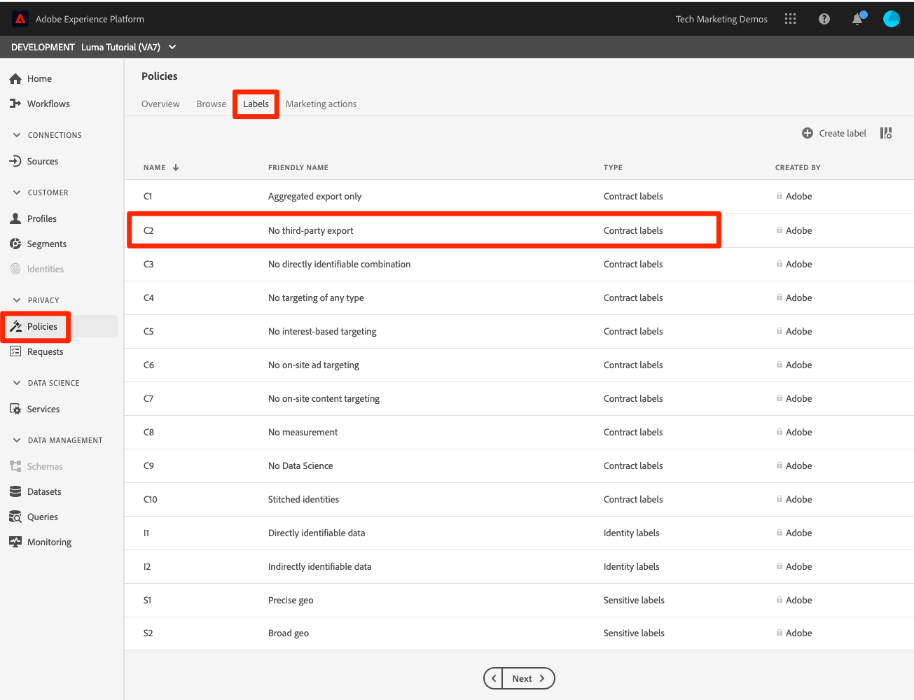

# Aplicar a estrutura de governança de dados

<!--15min-->

Nesta lição, você aplicará a estrutura de governança de dados aos dados que assimilou em sua sandbox.

A Governança de dados do Adobe Experience Platform permite gerenciar os dados do cliente e garantir a conformidade com regulamentos, restrições e políticas aplicáveis ao uso de dados. Ele desempenha uma função essencial no Experience Platform em vários níveis, incluindo o controle do uso de dados.

Antes de começar os exercícios, assista a estes pequenos vídeos sobre governança de dados:
>[!VIDEO](https://video.tv.adobe.com/v/36653?quality=12&learn=on)

>[!VIDEO](https://video.tv.adobe.com/v/29708?quality=12&learn=on)

<!--
## Permissions required

In the [Configure Permissions](configure-permissions.md) lesson, you set up all the access controls required to complete this lesson, specifically:

* Permission items **[!UICONTROL Data Governance]** > **[!UICONTROL Manage Usage Labels]**, **[!UICONTROL Manage Data Usage Policies]** and **[!UICONTROL View Data Usage Policies]**
* Permission items **[!UICONTROL Data Management]** > **[!UICONTROL View Datasets]** and **[!UICONTROL Manage Datasets]**
* Permission item **[!UICONTROL Sandboxes]** > `Luma Tutorial`
* User-role access to the `Luma Tutorial Platform` Product Profile
-->

## Cenário comercial

O Luma promete aos membros de seu programa de Fidelidade que os dados de Fidelidade não serão compartilhados com terceiros. Implementaremos este cenário no resto da lição.

## Aplicar rótulos de governança de dados

A primeira etapa no processo de governança de dados é aplicar rótulos de governança aos seus dados. Antes de fazer isso, vamos observar rapidamente quais rótulos estão disponíveis:

1. Na interface do usuário da Plataforma, selecione **[!UICONTROL Políticas]** na navegação à esquerda
1. Vá para o **[!UICONTROL Rótulos]** para ver todos os rótulos na conta.

Há muitos rótulos prontos para uso, além de que você pode criar os seus próprios através do [!UICONTROL Criar rótulo] botão. Há três tipos principais: [!UICONTROL Rótulos do contrato], [!UICONTROL Rótulos de identidade]e [!UICONTROL Rótulos sensíveis] que correspondam a motivos comuns, os dados podem ser restritos. Cada rótulo tem um [!UICONTROL Nome amigável] e curto [!UICONTROL Nome] que é apenas uma abreviação do tipo e um número. Por exemplo, a variável [!DNL C1] é para &quot;Nenhuma exportação de terceiros&quot;, o que é necessário para nossa política de Fidelidade.

Agora é hora de rotular os dados cujo uso queremos restringir:

1. Na interface do usuário da Plataforma, selecione **[!UICONTROL Conjuntos de dados]** na navegação à esquerda
1. Abra o `Luma Loyalty Dataset`
1. Vá para o **[!UICONTROL Governança de dados]** guia
1. Você pode aplicar rótulos a campos individuais ou aplicá-los a todo o conjunto de dados. Nós aplicaremos o rótulo a todo o conjunto de dados. Clique no ícone de lápis. Se você não vir o ícone, tente tornar o navegador mais amplo ou rolar o painel do meio para a direita.
   
1. No modal , expanda a variável **[!UICONTROL Rótulos do contrato]** e verifique o **[!UICONTROL C2]** label
1. Selecione o **[!UICONTROL Salvar alterações]** botão
   
1. Retornar ao principal [!UICONTROL Governança de dados] com a **[!UICONTROL Mostrar rótulos herdados]** para ativar, é possível ver como o rótulo foi aplicado a todos os campos no conjunto de dados.
   

<!--adding extra, unnecessary fields from field groups makes it harder to see which fields really need labels-->
<!--Are there any best practices for applying governance labels-->

## Criar políticas de governança de dados

Agora que nossos dados estão rotulados, podemos criar uma política.

1. Na interface do usuário da Plataforma, selecione **[!UICONTROL Políticas]** na navegação à esquerda
1. Na guia Procurar, já existe uma política pronta para uso chamada &quot;restrição de exportação de terceiros&quot; que associa o rótulo C2 à ação de marketing [!UICONTROL Exportar para Terceiros]—exatamente o que precisamos!
1. Selecione a política e habilite-a por meio da **[!UICONTROL Status da política]** alternar
   

Você pode criar suas próprias políticas selecionando o **[!UICONTROL Criar política]** botão. Isso abre um assistente que permite combinar vários rótulos e restrições de ação de marketing.

## Aplicar políticas de governança

A aplicação das políticas de governação é, obviamente, uma componente fundamental do quadro. A aplicação acontece downstream quando os dados são ativados e enviados da plataforma, especialmente com a Real-time Customer Data Platform, que você pode ou não estar licenciando. De qualquer forma, está fora do escopo deste tutorial. Mas então você não fica pendurado, você pode aprender mais sobre como as políticas são aplicadas neste vídeo, que eu enfileirei até a parte relevante. Também mostrará o que acontece quando uma política é violada.

>[!VIDEO](https://video.tv.adobe.com/v/33631/?t=151&quality=12&learn=on)

## Recursos adicionais

* [Documentação de governança de dados](https://experienceleague.adobe.com/docs/experience-platform/data-governance/home.html?lang=pt-BR)
* [Referência da API do serviço do conjunto de dados](https://www.adobe.io/experience-platform-apis/references/dataset-service/)
* [Referência da API do Serviço de Política de Governança](https://www.adobe.io/experience-platform-apis/references/policy-service/)

Agora vamos avançar para [serviço de query](run-queries.md).
