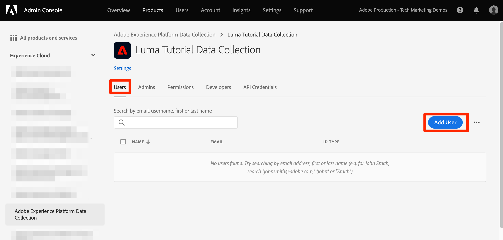

# Configurar permissões

<!--30min-->

Nesta lição, você configurará as permissões do usuário do Adobe Experience Platform usando [!DNL Adobe's Admin Console].

O controle de acesso é um recurso fundamental de privacidade no Experience Platform e recomendamos limitar as permissões ao mínimo necessário para que as pessoas executem suas funções de trabalho. Consulte a [Documentação de Controle de Acesso](https://experienceleague.adobe.com/docs/experience-platform/access-control/home.html?lang=pt-BR) para obter mais informações.

Os arquitetos de dados e os engenheiros de dados são usuários avançados da Adobe Experience Platform e você precisará de muitas permissões para concluir este tutorial e, posteriormente, em seu trabalho diário. Os arquitetos de dados provavelmente estarão envolvidos na administração de *outros usuários da plataforma* em sua empresa, como comerciantes, analistas e cientistas de dados. Ao concluir esta lição, pense em como você pode usar esses recursos para gerenciar outros usuários em sua empresa.

**Arquitetos de dados** O geralmente configura permissões para outros usuários fora deste tutorial.

>[!IMPORTANT]
>
>Um Administrador do sistema de produtos da Adobe Experience Cloud deve concluir algumas etapas desta lição, que é chamada nos cabeçalhos da seção. Se você não for o Administrador do sistema, entre em contato com um da sua empresa e peça que ele conclua essas tarefas.

## Sobre o Admin Console

O [!DNL Admin Console] é a interface usada para administrar o acesso do usuário a todos os produtos da Adobe Experience Cloud. Consulte [Documentação do Adobe Admin Console](https://helpx.adobe.com/br/enterprise/using/admin-console.html) para obter informações mais detalhadas. Aqui estão algumas chaves [!DNL Admin Console] conceitos:

* A **perfil de produto** é uma combinação de permissões, funções e ambientes sandbox vinculados a um produto específico do Adobe. Vários perfis de produto podem ser criados para um único Adobe. Por exemplo, um perfil de &quot;profissional de marketing&quot; pode limitar as permissões ao que um profissional de marketing típico precisaria para concluir as principais tarefas no ambiente da plataforma de produção, enquanto um perfil de &quot;arquiteto de dados&quot; pode ser usado para conceder permissões diferentes em vários ambientes da plataforma. Nesta lição, você criará um perfil de produto &quot;Tutorial do Luma&quot; com todas as permissões que um arquiteto de dados e um engenheiro de dados precisariam para concluir este tutorial em um ambiente de sandbox.
* Um **integração** é uma conexão com um *projeto* no Adobe Developer Console. O Adobe Developer Console é o coração da autenticação e configuração das APIs do Adobe. Você configurará uma integração no Console do desenvolvedor e [!DNL Postman] lição.

Este é um breve resumo das funções que existem para a Platform:

* **Usuários** de um perfil de produto pode concluir tarefas na interface do usuário da Platform de acordo com as permissões atribuídas no perfil do produto.
* **Desenvolvedores** de um perfil de produto pode concluir tarefas usando a API da plataforma de acordo com as permissões no perfil do produto.
* **Administradores do perfil do produto** pode editar *aquele perfil específico* permissões e adicionar usuários, desenvolvedores e administradores de perfil adicionais.
* **Administradores do produto** pode administrar *todos os perfis de produto* para Platform e adicionar novos perfis de produto.
* **Administradores do sistema** O pode adicionar administradores de produtos e administrar, essencialmente, qualquer permissão para todos os produtos da Adobe Experience Cloud.

## Criar um perfil de produto do Experience Platform (requer um administrador de sistema ou administrador de produto)

Neste exercício, você ou um Administrador do sistema da sua empresa criará um perfil de produto para o Adobe Experience Platform e adicionará você como administrador desse perfil de produto.

>[!NOTE]
>
>Se você for um Administrador do sistema que assiste um colega neste tutorial, considere adicionar seu colega como um *Administrador de produto* para Adobe Experience Platform. Como Administrador de produto, eles poderão concluir essas etapas sozinhos e administrar outros usuários do Experience Platform no futuro.

Para criar o perfil de produto:

1. Faça logon no [Adobe Admin Console](https://adminconsole.adobe.com)
1. Selecionar **[!UICONTROL Produtos]** no início da navegação
1. Selecionar **[!UICONTROL Adobe Experience Platform]** na navegação à esquerda (talvez seja necessário expandir o **[!UICONTROL Experience Cloud]** seção)
1. Você já pode ter vários perfis na instância do Experience Platform. Selecione o **[!UICONTROL Novo perfil]** botão para adicionar outro
   
1. Dê um nome ao perfil `Luma Tutorial Platform` (adicione o nome do tutorial participante ao final, se várias pessoas de sua empresa estiverem participando deste tutorial) e selecione o **[!UICONTROL Próximo]** botão
   
1. Dependendo dos detalhes da licença do seu produto, você pode ou não ver este segundo **[!UICONTROL Serviços]** tela. Não usaremos nenhum desses serviços neste tutorial, portanto, desmarque **[!UICONTROL Habilitar todos os serviços]** para *remove* todos os serviços e selecione **[!UICONTROL Salvar]**.
   

Agora, adicione o tutorial participante como administrador do perfil de produto recém-criado. If *you* são o participante do tutorial, pule para [Configurar o perfil de produto do Experience Platform](#configure-experience-platform-product-profile):

1. Selecione o `Luma Tutorial Platform` perfil de produto:

   

1. Selecione o **[!UICONTROL Administradores]** e selecione a **[!UICONTROL Adicionar administrador]** botão:

   

1. Conclua o fluxo de trabalho para adicionar o tutorial participante como administrador.

Após concluir essas etapas, você deve ver que a variável `Luma Tutorial Platform` O perfil do é configurado com um administrador.

## Configurar o perfil de produto do Experience Platform

Agora que você é um administrador do `Luma Tutorial Platform` perfil de produto você pode configurar as permissões e as funções necessárias para concluir o tutorial.

### Adicionar permissões

Agora, você adicionará os itens de permissão individuais ao perfil:

1. Abra o `Luma Tutorial Platform` perfil de produto
1. Selecione a guia **[!UICONTROL Permissões]**
1. Em **[!UICONTROL Sandboxes]**, adicione o **[!UICONTROL Prod]** sandbox para o perfil. É necessário ter acesso ao [!DNL Prod] sandbox para criar sandboxes adicionais. Depois de adicionar a sandbox do tutorial na próxima lição, removeremos o [!DNL Prod] sandbox do perfil do produto.
1. Em [!UICONTROL Assimilação de dados], adicione o [!UICONTROL Gerenciar fontes] e [!UICONTROL Exibir fontes] itens de permissão.
1. Adicione todos os itens de permissão para:
   1. [!UICONTROL Modelagem de dados]
   1. [!UICONTROL Gerenciamento de dados]
   1. [!UICONTROL Gerenciamento de perfil]
   1. [!UICONTROL Gerenciamento de identidade]
   1. [!UICONTROL Administração de sandbox]
   1. [!UICONTROL Serviço de query]
   1. [!UICONTROL Coleta de dados]
   1. [!UICONTROL Governança de dados]
   1. [!UICONTROL Painéis]
   1. [!UICONTROL Alertas]

1. Depois de adicionar todos os itens de permissão, selecione o **[!UICONTROL Salvar]** botão

### Adicionar-se como um usuário

Neste ponto, se `Luma Tutorial Platform` era seu *only* Perfil de produto do Experience Platform, você ainda não conseguiria fazer logon na interface do usuário do Experience Platform. Para fazer isso você precisa ser um *usuário* no perfil do produto. Felizmente, já que você é um *administrador* de um perfil de produto, você pode se adicionar como um *usuário*!

1. Vá para o **[!UICONTROL Usuários]** guia
1. Selecione o **[!UICONTROL Adicionar usuário]** botão
   
1. Conclua o fluxo de trabalho para adicionar você como usuário ao perfil do produto

### Adicione-se como um desenvolvedor

Para usar a API da plataforma, adicione-se como desenvolvedor:

1. Vá para o **[!UICONTROL Desenvolvedores]** guia
1. Selecione o **[!UICONTROL Adicionar desenvolvedor]** botão
   
1. Conclua o fluxo de trabalho para adicionar você como desenvolvedor ao perfil do produto

## Criar um perfil de produto da Coleta de dados (requer um administrador de sistema ou administrador de produto)

Neste exercício, você ou um Administrador do sistema da sua empresa criará um perfil de produto para a Coleta de dados (anteriormente conhecida como Adobe Experience Platform Launch) e adicionará você como administrador de perfil de produto.

>[!NOTE]
>
>Se você for um Administrador do sistema que assiste um colega neste tutorial, considere adicioná-lo como um *Administrador de produto* para Coleta de dados. Como Administrador de produto, eles poderão concluir essas etapas sozinhos e administrar outros usuários da Coleta de dados no futuro.

Para criar o perfil de produto:

1. No [!DNL Adobe Admin Console] acesse o produto Adobe Experience Platform Data Collection
1. Adicionar um novo perfil chamado `Luma Tutorial Data Collection` (adicione o nome do tutorial participante ao final, se várias pessoas de sua empresa estiverem participando deste tutorial)
1. Desligue o **[!UICONTROL Propriedades]** > **[!UICONTROL Incluir automaticamente]** definição
1. Não atribuir nenhuma propriedade ou permissão neste momento
1. Adicionar o participante do tutorial como um administrador deste perfil

Após concluir essas etapas, você deve ver que a variável `Luma Tutorial Data Collection` O perfil do é configurado com um administrador.

## Configurar o perfil de produto da Coleta de dados

Agora que você é um administrador do `Luma Tutorial Data Collection` perfil de produto você pode configurar as permissões e as funções necessárias para concluir o tutorial.

### Adicionar permissões

Agora, você adicionará os itens de permissão individuais ao perfil:

1. No [Adobe Admin Console](https://adminconsole.adobe.com), vá para **[!UICONTROL Produtos]** > **[!UICONTROL Coleta de dados]**
1. Abra o `Luma Tutorial Data Collection` perfil
1. Vá para o **[!UICONTROL Permissões]** guia
1. Abrir **[!UICONTROL Plataformas]**
1. Certifique-se de que todas as plataformas disponíveis estejam selecionadas (você pode ver opções diferentes com base na sua licença)
1. **[!UICONTROL Salve]** quaisquer alterações
   
1. Abrir **[!UICONTROL Propriedades]**
1. Certifique-se de que o **[!UICONTROL Incluir automaticamente]** a opção está Desativada para que você não tenha acesso a nenhuma propriedade (adicionaremos uma mais tarde)
1. **[!UICONTROL Salve]** quaisquer alterações
   
1. Abrir **[!UICONTROL Direitos de propriedade]**
1. Selecionar **[!UICONTROL Adicionar tudo]** para adicionar todas as permissões de propriedade
1. **[!UICONTROL Salvar]**
   
1. Abrir **[!UICONTROL Direitos da empresa]**
1. Adicionar **[!UICONTROL Gerenciar propriedades]**
1. Selecione **[!UICONTROL Salvar]**

   

### Adicionar-se como um usuário

Em seguida, adicione-se como um usuário ao perfil de Coleta de dados:

1. Vá para o **[!UICONTROL Usuários]** guia
1. Selecione o **[!UICONTROL Adicionar usuário]** botão
   
1. Conclua o fluxo de trabalho para adicionar você como usuário ao perfil do produto

Você não precisa se adicionar como um Desenvolvedor para coleta de dados.

Agora você tem quase todas as permissões necessárias para concluir o tutorial! Haverá apenas mais dois ajustes que você fará dentro do [!DNL Adobe Admin Console], incluindo um depois de você [criar uma sandbox](create-a-sandbox.md)!
