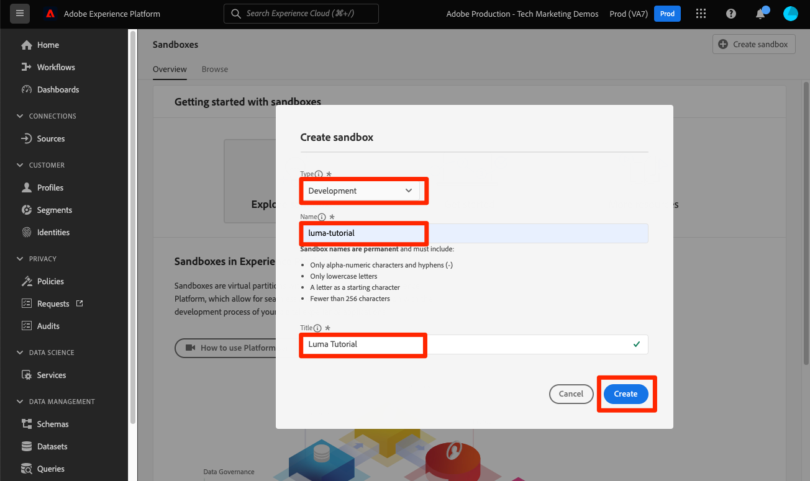

# Criar uma sandbox

<!--25min-->

Nesta lição, você criará uma sandbox de ambiente de desenvolvimento que será usada para o restante do tutorial.

As sandboxes fornecem ambientes isolados onde você pode experimentar a funcionalidade sem misturar recursos e dados com seu ambiente de produção. Para obter mais detalhes, consulte a [documentação das sandboxes](https://experienceleague.adobe.com/docs/experience-platform/sandbox/home.html?lang=pt-BR).

**Arquitetos de dados** e **Engenheiros de dados** O precisará criar sandboxes fora deste tutorial.

Antes de começar os exercícios, assista a este pequeno vídeo para saber mais sobre sandboxes:
>[!VIDEO](https://video.tv.adobe.com/v/29838/?quality=12&learn=on)

## Permissões necessárias

No [Configurar permissões](configure-permissions.md) lição, configure todos os controles de acesso necessários para concluir esta lição.

<!--
* Permission items **[!UICONTROL Sandbox Administration]** > **[!UICONTROL View Sandboxes]** and **[!UICONTROL Manage Sandboxes]**
* Permission item **[!UICONTROL Sandboxes]** > **[!UICONTROL Prod]**
* User-role access to the `Luma Tutorial Platform` product profile
* Admin-level access to the `Luma Tutorial Platform` product profile
-->

## Criar uma sandbox

Vamos criar uma sandbox:

1. Faça logon no [Adobe Experience Platform](https://experience.adobe.com/platform) interface
1. Ir para **[!UICONTROL Sandboxes]** na navegação à esquerda
1. Selecionar **[!UICONTROL Criar sandbox]** no canto superior direito
   

1. Selecionar **[!UICONTROL Desenvolvimento]** como **[!UICONTROL Tipo]**
1. Dê um nome ao seu sandbox `luma-tutorial` (considere adicionar seu nome ao final)
1. Título do tutorial `Luma Tutorial` (considere adicionar seu nome ao final)
1. Selecione o botão **[!UICONTROL Criar]**
   
   >[!NOTE]
   >
   >Embora você possa usar quaisquer valores arbitrários para o nome e o título da sandbox, aderir aos valores sugeridos é recomendado, pois referiremos a esses rótulos em todo o tutorial. Se houver várias pessoas em sua organização concluindo este tutorial, considere adicionar seu nome ao final do título e nome da sandbox, por exemplo, luma-tutorial-ignatiusjreilly.

As sandboxes levam aproximadamente 30 segundos para serem criadas, enquanto que um &quot;[!UICONTROL Criação]&quot; status é exibido. Quando a sandbox é totalmente criada, ela é exibida como &quot;[!UICONTROL Ativo]&quot;:

Aguarde até que sua sandbox seja &quot;[!UICONTROL Ativo]&quot; antes de continuar o exercício seguinte.

## Adicionar a nova sandbox ao perfil do produto

Quando a sandbox estiver ativa, você deve incluí-la no perfil do produto para usá-la. Para adicioná-lo ao perfil de produto:

1. Em uma guia separada do navegador, faça logon no [Admin Console](https://adminconsole.adobe.com)
1. Ir para **[!UICONTROL Produtos > Adobe Experience Platform]**
1. Abra o `Luma Tutorial Platform` perfil

   

1. Vá para o **[!UICONTROL Permissões]** guia

1. No [!UICONTROL Sandboxes] , selecione **[!UICONTROL Editar]**

   

1. _Remover_ o **[!UICONTROL Prod]** sandbox que você atribuiu ao perfil originalmente
1. Selecione o **[!UICONTROL +]** ícone para adicionar o novo `Luma Tutorial` sandbox à coluna à direita
1. Selecionar **[!UICONTROL Salvar]** para salvar as permissões atualizadas

   

1. Volte para a guia do navegador com o Experience Platform
1. Recarregue (ou recarregue com a tecla Shift ) a página e agora você deve estar na `Luma Tutorial` sandbox ou deve aparecer na lista suspensa sandbox
1. Alterne para `Luma Tutorial` sandbox se você ainda não estiver nela

   

Ótimo, você criou sua sandbox e está pronto para [Configurar o Console do desenvolvedor e o Postman](set-up-developer-console-and-postman.md)!
