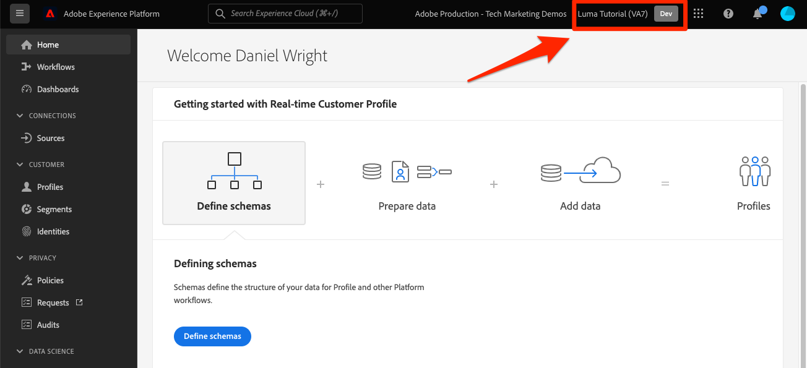

# Criar uma sandbox

<!--25min-->

Nesta lição, você criará uma sandbox de ambiente de desenvolvimento que usará para o restante do tutorial.

As sandboxes fornecem ambientes isolados em que você pode experimentar a funcionalidade sem misturar recursos e dados com seu ambiente de produção. Para obter mais detalhes, consulte [documentação de sandboxes](https://experienceleague.adobe.com/docs/experience-platform/sandbox/home.html?lang=pt-BR).

**Arquitetos de dados** e **Engenheiros de dados** O precisará criar sandboxes fora deste tutorial.

Antes de começar os exercícios, assista a este vídeo curto para saber mais sobre sandboxes:
>[!VIDEO](https://video.tv.adobe.com/v/29838/?learn=on)

## Permissões necessárias

No [Configurar permissões](configure-permissions.md) você configura todos os controles de acesso necessários para concluir esta lição.

<!--
* Permission items **[!UICONTROL Sandbox Administration]** > **[!UICONTROL View Sandboxes]** and **[!UICONTROL Manage Sandboxes]**
* Permission item **[!UICONTROL Sandboxes]** > **[!UICONTROL Prod]**
* User-role access to the `Luma Tutorial Platform` product profile
* Admin-level access to the `Luma Tutorial Platform` product profile
-->

## Criar uma sandbox

Vamos criar uma sandbox:

1. Faça logon na [Adobe Experience Platform](https://experience.adobe.com/platform) interface
1. Ir para **[!UICONTROL Sandboxes]** na navegação à esquerda
1. Selecionar **[!UICONTROL Criar sandbox]** na parte superior direita
   

1. Selecionar **[!UICONTROL Desenvolvimento]** como o **[!UICONTROL Tipo]**
1. Dê um nome à sua sandbox `luma-tutorial` (considere adicionar seu nome ao final)
1. Título do tutorial `Luma Tutorial` (considere adicionar seu nome ao final)
1. Selecione o botão **[!UICONTROL Criar]**
   
   >[!NOTE]
   >
   >Embora você possa usar quaisquer valores arbitrários para o nome e o título da sua sandbox, é recomendável seguir os valores sugeridos, pois nos referiremos a esses rótulos no tutorial. Se houver várias pessoas em sua organização que concluam este tutorial, considere adicionar seu nome ao final do título e do nome da sandbox, por exemplo luma-tutorial-ignatiusjreilly.

As sandboxes levam aproximadamente 30 segundos para serem criadas, período durante o qual um &quot;[!UICONTROL Criação]O status &quot;&quot; é exibido. Quando a sandbox for totalmente criada, ela será exibida como &quot;[!UICONTROL Ativo]&quot;:

Aguarde até que sua sandbox seja &quot;[!UICONTROL Ativo]&quot; antes de continuar com o próximo exercício.

## Adicionar a nova sandbox à função

Quando a sandbox estiver ativa, você deverá incluí-la na sua função para usá-la. Para adicioná-lo à sua função (requer privilégios de Administrador do sistema ou de Administrador de produto):

1. Vá para a [!UICONTROL Permissões] tela
1. Abra o `Luma Tutorial Platform` função
1. Opcionalmente _remover_ o `Prod` sandbox da função
1. Adicione o `Luma Tutorial` sandbox
1. Selecione **[!UICONTROL Salvar]**
1. No [!UICONTROL Sandboxes] linha, selecione **[!UICONTROL Editar]**

   

1. Recarregue (ou Shift-reload) a página e você deverá estar no estado `Luma Tutorial` sandbox ou ele deve aparecer na lista suspensa da sua sandbox
1. Alterne para a `Luma Tutorial` sandbox se você ainda não estiver nela

   

Ótimo, você criou sua sandbox e está pronto para [Configurar o Console do desenvolvedor e o Postman](set-up-developer-console-and-postman.md)!
