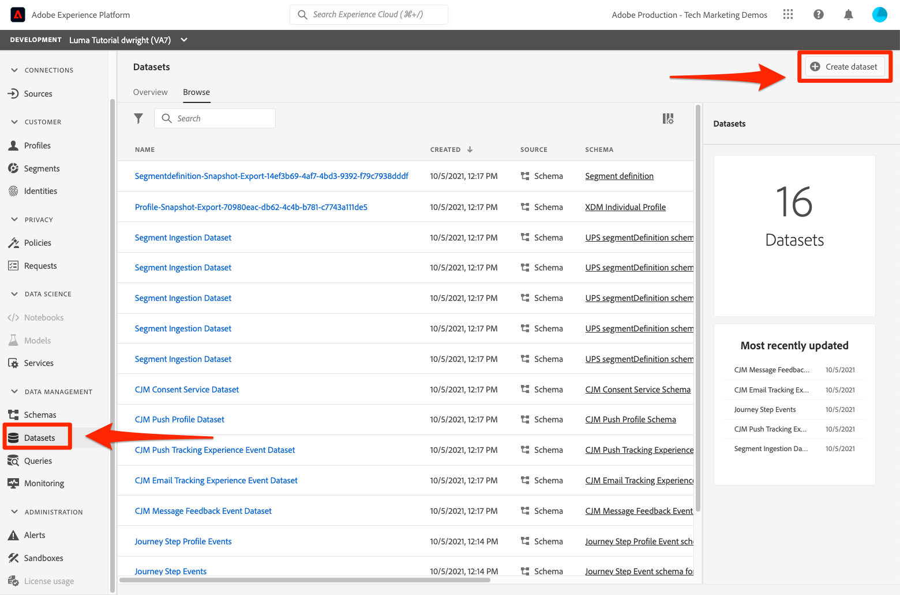

# Criar conjuntos de dados

<!--15min-->

Nesta lição, você criará conjuntos de dados para receber seus dados. Você ficará animado em saber que esta é a lição mais curta do tutorial!

Todos os dados assimilados com êxito no Adobe Experience Platform são mantidos no lago de dados como conjuntos de dados. Um conjunto de dados é uma construção de armazenamento e gerenciamento para uma coleção de dados, normalmente uma tabela, que contém um esquema (colunas) e campos (linhas). Os conjuntos de dados também contêm metadados que descrevem vários aspectos dos dados armazenados.

**Arquitetos de dados** O precisará criar conjuntos de dados fora deste tutorial.

Antes de começar os exercícios, assista a este breve vídeo para saber mais sobre conjuntos de dados:
>[!VIDEO](https://video.tv.adobe.com/v/27269?quality=12&learn=on)

## Permissões necessárias

No [Configurar permissões](configure-permissions.md) lição, configure todos os controles de acesso necessários para concluir esta lição.

<!--
* Permission items **[!UICONTROL Data Management]** > **[!UICONTROL View Datasets]** and **[!UICONTROL Manage Datasets]**
* Permission item **[!UICONTROL Sandboxes]** > `Luma Tutorial`
* User-role access to the `Luma Tutorial Platform` product profile
* Developer-role access to the `Luma Tutorial Platform` product profile (for API)
-->

## Criar conjuntos de dados na interface do usuário

Neste exercício, criaremos conjuntos de dados na interface do usuário do . Vamos começar com os dados de fidelidade:

1. Ir para **[!UICONTROL Conjuntos de dados]** na navegação à esquerda da interface do usuário da plataforma
1. Selecione o **[!UICONTROL Criar conjunto de dados]** botão
   

1. Na próxima tela, selecione **Criar conjunto de dados a partir do esquema**
1. Na próxima tela, selecione o `Luma Loyalty Schema` e selecione o **[!UICONTROL Próximo]** botão
   

1. Nomeie o conjunto de dados `Luma Loyalty Dataset` e selecione o **[!UICONTROL Concluir]** botão
   
1. Quando o conjunto de dados for salvo, você será direcionado para uma tela como a seguinte:
   

Pronto! Eu disse que isso seria rápido. Crie esses outros conjuntos de dados usando as mesmas etapas:

1. `Luma Offline Purchase Events Dataset` para seu `Luma Offline Purchase Events Schema`
1. `Luma Web Events Dataset` para seu `Luma Web Events Schema`
1. `Luma Product Catalog Dataset` para seu `Luma Product Catalog Schema`


## Criar um conjunto de dados usando a API

Agora crie o `Luma CRM Dataset` usando a API .

>[!NOTE]
>
>Se quiser ignorar o exercício da API e criar a variável `Luma CRM Dataset` na interface do usuário, tudo bem. Nomeie-o `Luma CRM Dataset` e use o `Luma CRM Schema`.

### Obter a id do esquema a ser usado no conjunto de dados

Primeiro precisamos obter o `$id` do `Luma CRM Schema`:

1. Abrir [!DNL Postman]
1. Se você não tiver feito uma solicitação nas últimas 24 horas, seus tokens de autorização provavelmente expiraram. Abrir a solicitação **[!DNL Adobe I/O Access Token Generation > Local Signing (Non-production use-only) > IMS: JWT Generate + Auth via User Token]** e selecione **Enviar** para solicitar novos tokens de acesso e JWT, como você fez no [!DNL Postman] lição.
1. Abrir a solicitação **[!DNL Schema Registry API > Schemas > Retrieve a list of schemas within the specified container.]**
1. Selecione o **Enviar** botão
1. Você deve obter uma resposta 200
1. Procure a resposta para a variável `Luma CRM Schema` e copie o `$id` value
   

### Criar o conjunto de dados

Agora é possível criar o conjunto de dados:

1. Baixar [API do Serviço de Catálogo.postman_collection.json](https://raw.githubusercontent.com/adobe/experience-platform-postman-samples/master/apis/experience-platform/Catalog%20Service%20API.postman_collection.json) para `Luma Tutorial Assets` pasta.
1. Importe a coleção para [!DNL Postman]
1. Selecionar a solicitação **[!DNL Catalog Service API > Datasets > Create a new dataset.]**
1. Cole o seguinte como o **Corpo** do pedido, ***substituição do valor da id por seu próprio***:

   ```json
   {
       "name": "Luma CRM Dataset",
   
       "schemaRef": {
           "id": "REPLACE_WITH_YOUR_OWN_ID",
           "contentType": "application/vnd.adobe.xed-full+json;version=1"
       },
       "fileDescription": {
           "persisted": true,
           "containerFormat": "parquet",
           "format": "parquet"
       }
   }
   ```

1. Selecione o **Enviar** botão
1. Você deve obter uma resposta 201 Created contendo a id do novo conjunto de dados!
   

>[!TIP]
>
> Problemas comuns que fazem essa solicitação e possíveis correções:
>
> * `400: There was a problem retrieving xdm schema`. Certifique-se de ter substituído a id na amostra acima pela id da sua `Luma CRM Schema`
> * Nenhum token de autenticação: Execute o **IMS: JWT Generate + Auth via Token de usuário** chamada para gerar novos tokens
> * `401: Not Authorized to PUT/POST/PATCH/DELETE for this path : /global/schemas/`: Atualize o **CONTAINER_ID** variável de ambiente de `global` para `tenant`
> * `403: PALM Access Denied. POST access is denied for this resource from access control`: Verifique as permissões do usuário no Admin Console


Você pode voltar para o **[!UICONTROL Conjuntos de dados]** na interface do usuário da plataforma, você pode verificar a criação bem-sucedida de todos os cinco conjuntos de dados!


## Recursos adicionais

* [Documentação de conjuntos de dados](https://experienceleague.adobe.com/docs/experience-platform/catalog/datasets/overview.html?lang=pt-BR)
* [Referência da API de conjuntos de dados (parte do serviço de catálogo)](https://www.adobe.io/experience-platform-apis/references/catalog/#tag/Datasets)

Agora que todos os nossos esquemas, identidades e conjuntos de dados estão em vigor, podemos [ative-os para o Perfil do cliente em tempo real](enable-profiles.md).
