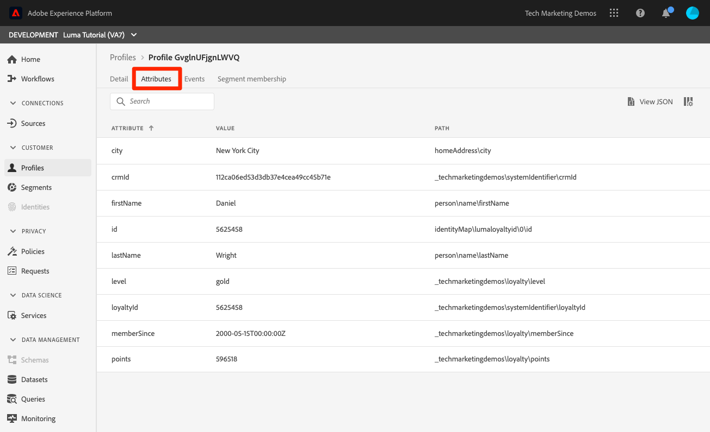
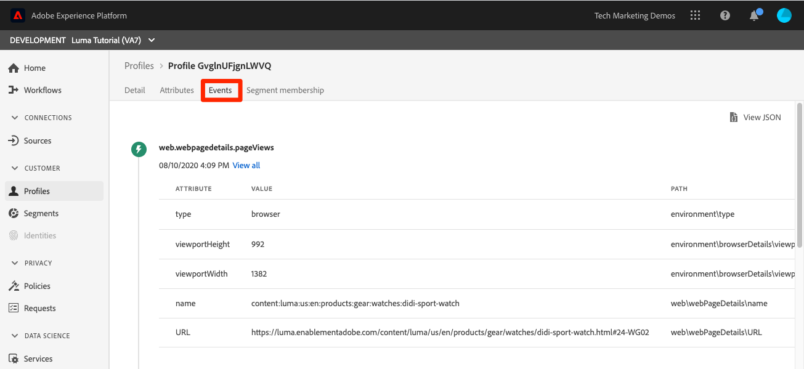

# Criar políticas de mesclagem

<!--20 min-->

Nesta lição, você criará políticas de mesclagem para priorizar como várias fontes de dados se mesclam em perfis.

O Adobe Experience Platform permite reunir dados de várias fontes e combiná-los para obter uma visualização completa de cada cliente individual. Ao reunir esses dados, as políticas de mesclagem determinam como os dados são priorizados e quais dados são combinados para criar essa visualização unificada.

Manteremos a interface do usuário para esta lição, mas também existem opções de API para criar políticas de mesclagem.

**Os Arquitetos de Dados** precisarão criar políticas de mesclagem fora deste tutorial.

Antes de começar os exercícios, assista a este vídeo curto para saber mais sobre políticas de mesclagem:
>[!VIDEO](https://video.tv.adobe.com/v/330433?learn=on&enablevpops)

## Permissões necessárias

Na lição [Configurar Permissões](configure-permissions.md), você configura todos os controles de acesso necessários para concluir esta lição.

<!--* Permission items **[!UICONTROL Profile Management]** > **[!UICONTROL View Merge Policies]** and **[!UICONTROL Manage Merge Policies]**
* Permission item **[!UICONTROL Profile Management]** > **[!UICONTROL View Profiles]** and **[!UICONTROL Manage Profiles]**
* Permission item **[!UICONTROL Sandboxes]** > `Luma Tutorial`
* User-role access to the `Luma Tutorial Platform` product profile
-->

## Sobre políticas de mesclagem e esquema de união

Lembre-se, na lição sobre assimilação em lote, carregamos dois registros com informações um pouco diferentes para o mesmo cliente. Nos dados de [!DNL Loyalty], o nome do cliente era `Daniel` e ele morava em `New York City`, mas nos dados do CRM o nome do cliente era `Danny` e ele morava em `Portland`. Os dados do cliente mudam com o tempo. Talvez ele tenha mudado de `Portland` para `New York City`. Outras coisas também mudam, como números de telefone e endereços de email. As políticas de mesclagem ajudam você a decidir como lidar com esses tipos de conflitos quando duas fontes de dados fornecem informações diferentes para o mesmo usuário.

Então, por que `Danny` ganhou como primeiro nome? Vamos dar uma olhada:

1. Na interface do usuário da Platform, selecione **[!UICONTROL Perfis]** na navegação à esquerda
1. Vá para a guia **[!UICONTROL Políticas de Mesclagem]**
1. A Política de mesclagem padrão é carimbo de data e hora ordenado. Como você carregou os dados do CRM após os dados de Fidelidade, `Danny` ganhou como o nome no perfil:

Quando vários esquemas são habilitados para perfil, um [!UICONTROL Esquema de união] é criado automaticamente para todos os esquemas de registro habilitados para perfil que compartilham uma classe base. Você pode exibir os [!UICONTROL Esquemas de União] acessando a guia **[!UICONTROL Esquema de União]**.

Observe que não há um esquema de união para a classe ExperienceEvent. Embora os dados do ExperienceEvent ainda caiam no perfil, como são baseados em séries de tempo, cada evento inclui um carimbo de data e hora e as colisões não são um problema.

E se você não gostar dessa política de mesclagem padrão? E se a Luma decidir que seu sistema de fidelidade deve ser a fonte da verdade quando há um conflito? Para isso, criaremos uma política de mesclagem.

## Criar uma política de mesclagem na interface

1. Na tela Políticas de mesclagem, selecione o botão **[!UICONTROL Criar política de mesclagem]** no canto superior direito
1. Como o **[!UICONTROL Nome]**, digite `Loyalty Prioritized`
1. Como o **[!UICONTROL Esquema]**, selecione **[!UICONTROL Perfil XDM]** (observe que sua classe personalizada, já que são dados de registro, também está disponível para políticas de mesclagem)
1. Para **[!UICONTROL Compilação de ID]**, selecione **[!UICONTROL Gráfico Privado]**
1. Para **[!UICONTROL Mesclagem de Atributos]**, selecione **[!UICONTROL Prioridade de Conjunto de Dados]**
1. Arraste e solte `Luma Loyalty Dataset` e `Luma CRM Dataset` no painel **[!UICONTROL Conjunto de Dados]**.
1. Certifique-se de que `Luma Loyalty Dataset` esteja na parte superior arrastando-o e soltando-o acima de `Luma CRM Dataset`
1. Selecione o botão **[!UICONTROL Salvar]**
   <!--do i need to explain Private Graph? Is that GA?-->
   

## Validar a política de mesclagem

Vamos ver se a política de mesclagem está fazendo o que esperaríamos:

1. Vá para a guia **[!UICONTROL Procurar]**
1. Altere a **[!UICONTROL política de mesclagem]** para sua nova política `Loyalty Prioritized`
1. Como o **[!UICONTROL Namespace de identidade]**, use seu `Luma CRM Id`
1. Como o **[!UICONTROL Valor de identidade]** usa `f660ab912ec121d1b1e928a0bb4bc61b`
1. Selecione o botão **[!UICONTROL Mostrar perfil]**
1. `Daniel` voltou!

## Criar uma política de mesclagem com conjuntos de dados limitados

Ao criar políticas de mesclagem usando a precedência do conjunto de dados, somente os conjuntos de dados da mesma classe base que você inclui à direita são incluídos no perfil. Vamos configurar outra política de mesclagem

1. Na tela Políticas de mesclagem, selecione o botão **[!UICONTROL Criar política de mesclagem]** no canto superior direito
1. Como o **[!UICONTROL Nome]**, digite `Loyalty Only`
1. Como o **[!UICONTROL Esquema]**, selecione **[!UICONTROL Perfil XDM]**
1. Para **[!UICONTROL Compilação de ID]**, selecione **[!UICONTROL Nenhuma]**
1. Para **[!UICONTROL Mesclagem de Atributos]**, selecione **[!UICONTROL Prioridade de Conjunto de Dados]**
1. Arraste e solte somente o painel `Luma Loyalty Dataset` para **[!UICONTROL Conjunto de Dados Selecionado]**.
1. Selecione o botão **[!UICONTROL Salvar]**

## Validar a política de mesclagem

Agora vamos ver o que essa política de mesclagem faz:

1. Vá para a guia **[!UICONTROL Procurar]**
1. Altere a **[!UICONTROL política de mesclagem]** para sua nova política `Loyalty Only`
1. Como o **[!UICONTROL Namespace de identidade]**, use seu `Luma CRM Id`
1. Como o **[!UICONTROL Valor de identidade]** usa `f660ab912ec121d1b1e928a0bb4bc61b`
1. Selecione o botão **[!UICONTROL Mostrar perfil]**
1. Confirme se nenhum perfil foi encontrado:
   

A ID do CRM é um campo de identidade em `Luma Loyalty Dataset`, mas somente as identidades primárias podem ser usadas para pesquisar perfis. Então, vamos pesquisar o perfil usando a identidade principal, `Luma Loyalty Id`&quot;

1. Alterar o **[!UICONTROL Namespace de identidade]** para `Luma Loyalty Id`
1. Como o **[!UICONTROL Valor de identidade]** usa `5625458`
1. Selecione o botão **[!UICONTROL Mostrar perfil]**
1. Selecione a ID do perfil para abrir o perfil
1. Vá para a guia **[!UICONTROL Atributos]**
1. Observe que outros detalhes do perfil do conjunto de dados do CRM, como o número do celular e o endereço de email, não estão disponíveis porque nossa política de mesclagem do `Loyalty Only` não inclui o conjunto de dados do CRM.
   
1. Vá para a guia **[!UICONTROL Eventos]**
1. Os dados do ExperienceEvent estão disponíveis apesar de não serem explicitamente incluídos nos conjuntos de dados da política de mesclagem:
   

## Mais informações sobre políticas de mesclagem

Na pesquisa de perfil, altere a política de mesclagem usada novamente para `Default Timebased` e selecione o botão **[!UICONTROL Mostrar perfil]**. Danny está de volta!

O que está acontecendo aqui? Bem, a fusão de perfis não é uma coisa única. Os perfis do cliente em tempo real são montados dinamicamente, com base em vários fatores, incluindo a política de mesclagem usada. É possível criar várias políticas de mesclagem para usar em contextos diferentes, dependendo da visualização do cliente que você deseja.

Um caso de uso importante para políticas de mesclagem é o para governança de dados. Por exemplo, digamos que você assimile dados de terceiros na Platform, os quais não podem ser usados para casos de uso de personalização, mas _podem_ ser usados para casos de uso de publicidade. Você pode criar uma política de mesclagem que exclua esse conjunto de dados de terceiros e usar essa política de mesclagem para criar segmentos para seus casos de uso de publicidade.

## Recursos adicionais

* [Documentação de Políticas de Mesclagem](https://experienceleague.adobe.com/docs/experience-platform/profile/merge-policies/overview.html)
* [Referência da API de Políticas de Mesclagem (parte da API de Perfil do Cliente em Tempo Real)](https://www.adobe.io/experience-platform-apis/references/profile/#tag/Merge-policies)

Agora vamos seguir para a [estrutura de governança de dados](apply-data-governance-framework.md).
