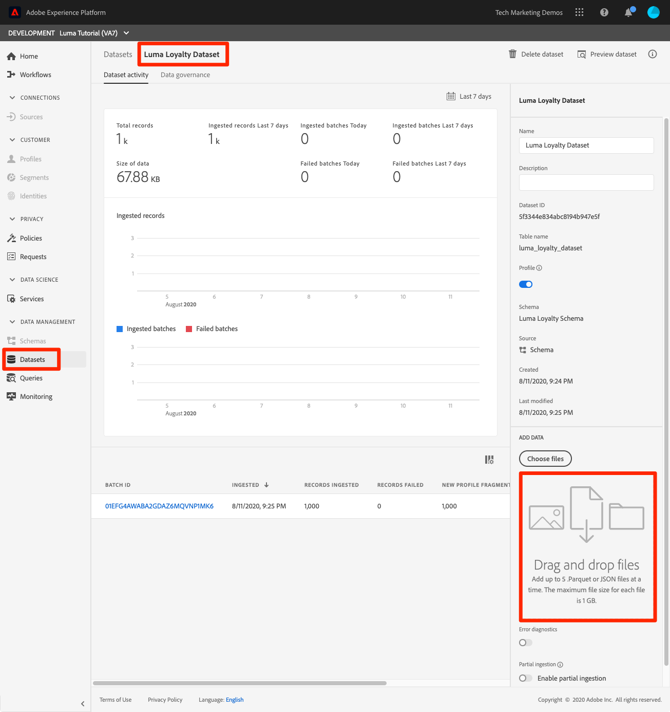

# Assimilar dados em lote

<!-- 1hr-->
Nesta lição, você assimilará dados em lote no Experience Platform usando vários métodos.

A assimilação de dados em lote permite assimilar uma grande quantidade de dados na Adobe Experience Platform de uma só vez. Você pode assimilar dados em lote em um upload único na interface da Platform ou usando a API. Você também pode configurar carregamentos em lote regularmente agendados de serviços de terceiros, como serviços de armazenamento em nuvem usando conectores de origem.

**Engenheiros de dados** O precisará assimilar dados em lote fora deste tutorial.

Antes de começar os exercícios, assista a este vídeo curto para saber mais sobre a assimilação de dados:
>[!VIDEO](https://video.tv.adobe.com/v/27106?quality=12&learn=on)


## Permissões necessárias

No [Configurar permissões](configure-permissions.md) você configura todos os controles de acesso necessários para concluir esta lição.

<!--
* Permission item **[!UICONTROL Data Management]** > **[!UICONTROL View Datasets]**, **[!UICONTROL Manage Datasets]** and **[!UICONTROL Data Monitoring]**
* Permission items **[!UICONTROL Data Ingestion]** > **[!UICONTROL View Sources]** and **[!UICONTROL Manage Sources]**
* Permission item **[!UICONTROL Profile Management]** > **[!UICONTROL View Profiles]**
* Permission item **[!UICONTROL Sandboxes]** > `Luma Tutorial`
* User-role access to the `Luma Tutorial Platform` product profile
* Developer-role access to the `Luma Tutorial Platform` product profile (for API)
-->

Você precisará acessar um servidor (S)FTP ou uma solução de armazenamento na nuvem para o exercício Origens. Há uma solução alternativa se você não tiver uma.

## Assimilar dados em lotes com a interface do usuário da Platform

Os dados podem ser carregados diretamente em um conjunto de dados na tela de conjuntos de dados nos formatos JSON e parquet. Essa é uma ótima maneira de testar a assimilação de alguns de seus dados após criar uma

### Baixar e preparar os dados

Primeiro, obtenha os dados de amostra e personalize-os para seu locatário:

>[!NOTE]
>
>Os dados contidos na [luma-data.zip](assets/luma-data.zip) é fictício e deve ser utilizado apenas para fins de demonstração.

1. Baixar [luma-data.zip](assets/luma-data.zip) ao seu **Ativos tutoriais do Luma** pasta.
1. Descompacte o arquivo, criando uma pasta chamada `luma-data` que contém os quatro arquivos de dados que usaremos nesta lição
1. Abertura `luma-loyalty.json` em um editor de texto e substitua todas as instâncias de `_techmarketingdemos` com sua própria id de locatário com sublinhado, conforme visto em seus próprios esquemas:
   

1. Salve o arquivo atualizado

### Assimilar os dados

1. Na interface do usuário da Platform, selecione **[!UICONTROL Conjuntos de dados]** na navegação à esquerda
1. Abra o `Luma Loyalty Dataset`
1. Role para baixo até ver a **[!UICONTROL Adicionar dados]** seção na coluna direita
1. Faça upload do `luma-loyalty.json` arquivo.
1. Depois que o arquivo for carregado, uma linha do lote será exibida
1. Se você recarregar a página após alguns minutos, verá que o lote foi carregado com êxito com 1000 registros e 1000 fragmentos de perfil.

   
   <!--do i need to explain error diagnostics and partial ingestion-->

>[!NOTE]
>
>Há algumas opções, **[!UICONTROL Diagnóstico de erro]** e **[!UICONTROL Assimilação parcial]**, que você verá em várias telas nesta lição. Essas opções não são abordadas no tutorial. Algumas informações rápidas:
>
>* Habilitar o diagnóstico de erro gera dados sobre a assimilação dos dados, que podem ser revisados usando a API de acesso a dados. Saiba mais sobre isso em [a documentação](https://experienceleague.adobe.com/docs/experience-platform/data-access/home.html).
>* A assimilação parcial permite assimilar dados que contêm erros até um determinado limite que você pode especificar. Saiba mais sobre isso em [a documentação](https://experienceleague.adobe.com/docs/experience-platform/ingestion/batch/partial.html)

### Validar os dados

Há algumas maneiras de confirmar se os dados foram assimilados com êxito.

#### Validar na interface do usuário da Platform

Para confirmar se os dados foram assimilados no conjunto de dados:

1. Na mesma página em que você assimilou os dados, selecione a variável **[!UICONTROL Visualizar conjunto de dados]** botão no canto superior direito
1. Selecione o **Visualizar** e você poderá ver alguns dos dados assimilados.

   


Para confirmar se os dados chegaram ao Perfil (pode levar alguns minutos para que sejam enviados):

1. Ir para **[!UICONTROL Perfis]** na navegação à esquerda
1. Selecione o ícone ao lado da **[!UICONTROL Selecionar namespace de identidade]** campo para abrir o modal
1. Selecione o `Luma Loyalty Id` namespace
1. Em seguida, insira um dos `loyaltyId` valores do seu conjunto de dados,  `5625458`
1. Selecionar **[!UICONTROL Exibir]**
   

#### Validar com eventos de assimilação de dados

Se você se inscreveu em eventos de assimilação de dados na lição anterior, verifique o URL exclusivo do webhook.site. Você deve ver três solicitações exibidas na seguinte ordem, com algum tempo entre elas, com o seguinte `eventCode` valores:

1. `ing_load_success`—o lote como assimilado
1. `ig_load_success`—o lote foi assimilado no gráfico de identidade
1. `ps_load_success`— o lote foi assimilado no serviço de perfil


Consulte a [documentação](https://experienceleague.adobe.com/docs/experience-platform/ingestion/quality/subscribe-events.html#available-status-notification-events) para obter mais detalhes sobre as notificações.

## Assimilar dados em lotes com a API da plataforma

Agora vamos carregar dados usando a API.

>[!NOTE]
>
>Arquitetos de dados, sintam-se à vontade para fazer upload dos dados do CRM pelo método da interface do usuário.

### Baixar e preparar os dados

1. Você já deve ter baixado e descompactado [luma-data.zip](assets/luma-data.zip) no seu `Luma Tutorial Assets` pasta.
2. Abertura `luma-crm.json` em um editor de texto e substitua todas as instâncias de `_techmarketingdemos` com sua própria id de locatário com sublinhado, como visto em seus esquemas
3. Salve o arquivo atualizado

### Obter a ID do conjunto de dados

Primeiro, vamos obter a ID da ID do conjunto de dados no qual queremos assimilar dados:

1. Abrir [!DNL Postman]
1. Se você não tiver um token de acesso, abra a solicitação **[!DNL OAuth: Request Access Token]** e selecione **Enviar** para solicitar um novo token de acesso, como você fez na [!DNL Postman] lição.
1. Abra as variáveis de ambiente e verifique se o valor de **CONTAINER_ID** ainda está `tenant`
1. Abrir a solicitação **[!DNL Catalog Service API > Datasets > Retrieve a list of datasets.]** e selecione **Enviar**
1. Você deve obter um `200 OK` resposta
1. Copie a ID do `Luma CRM Dataset` do corpo de resposta
   

### Criar o lote

Agora podemos criar um lote no conjunto de dados:

1. Baixar [API de assimilação de dados.postman_collection.json](https://raw.githubusercontent.com/adobe/experience-platform-postman-samples/master/apis/experience-platform/Data%20Ingestion%20API.postman_collection.json) ao seu `Luma Tutorial Assets` pasta
1. Importar a coleção para [!DNL Postman]
1. Selecionar a solicitação **[!DNL Data Ingestion API > Batch Ingestion > Create a new batch in Catalog Service.]**
1. Cole o seguinte como o **Corpo** do pedido, ***substituir o valor datasetId pelo seu próprio***:

   ```json
   {
       "datasetId":"REPLACE_WITH_YOUR_OWN_DATASETID",
       "inputFormat": {
           "format": "json"
       }
   }
   ```

1. Selecione o **Enviar** botão
1. Você deve receber uma resposta 201 Criada contendo a ID do novo lote!
1. Copie o `id` do novo lote
   

### Assimilar os dados

Agora podemos fazer upload dos dados no lote:

1. Selecionar a solicitação **[!DNL Data Ingestion API > Batch Ingestion > Upload a file to a dataset in a batch.]**
1. No **Params** , insira a id do conjunto de dados e a id do lote nos respectivos campos
1. No **Params** insira `luma-crm.json` como o **filePath**
1. No **Corpo** , selecione a **binário** opção
1. Selecione o baixado `luma-crm.json` do local `Luma Tutorial Assets` pasta
1. Selecionar **Enviar** e você deverá receber uma resposta 200 OK com &#39;1&#39; no corpo da resposta

   

Nesse ponto, se você observar o lote na interface do usuário da Platform, verá que ele está em um &quot;[!UICONTROL Carregando]Status de &quot;:


Como a API de lote é frequentemente usada para fazer upload de vários arquivos, é necessário informar à Platform quando um lote é concluído, o que faremos na próxima etapa.

### Concluir o lote

Para concluir o lote:

1. Selecionar a solicitação **[!DNL Data Ingestion API > Batch Ingestion > Finish uploading a file to a dataset in a batch.]**
1. No **Params** insira `COMPLETE` como o **ação**
1. No **Params** insira a id do lote. Não se preocupe com a id do conjunto de dados ou filePath, se eles estiverem presentes.
1. Verifique se o URL do POST é `https://platform.adobe.io/data/foundation/import/batches/:batchId?action=COMPLETE` e que não existem referências desnecessárias ao `datasetId` ou `filePath`
1. Selecionar **Enviar** e você deverá receber uma resposta 200 OK com &#39;1&#39; no corpo da resposta

   

### Validar os dados

#### Validar na interface do usuário da Platform

Validar se os dados chegaram à interface do usuário da Platform da mesma forma que você fez para o conjunto de dados de Fidelidade.

Primeiro, confirme se o lote mostra que 1000 registros foram assimilados:


Em seguida, confirme o lote usando Visualizar conjunto de dados:


Por fim, confirme se um dos perfis foi criado procurando um dos perfis pelo `Luma CRM Id` namespace, por exemplo `112ca06ed53d3db37e4cea49cc45b71e`


Há uma coisa interessante que aconteceu e que eu quero destacar. Abra isso `Danny Wright` perfil. O perfil tem um `Lumacrmid` e uma `Lumaloyaltyid`. Lembre-se do `Luma Loyalty Schema` continha dois campos de identidade, ID de fidelidade Luma e ID CRM. Agora que carregamos ambos os conjuntos de dados, eles foram mesclados em um único perfil. Os dados de fidelidade tinham `Daniel` como nome e &quot;New York City&quot; como endereço residencial, enquanto os dados do CRM tinham `Danny` como nome e `Portland` como o endereço residencial do cliente com a mesma ID de fidelidade. Voltaremos para o motivo pelo qual o nome é exibido `Danny` na lição sobre políticas de mesclagem.

Parabéns, você acabou de mesclar perfis!


#### Validar com eventos de assimilação de dados

Se você se inscreveu em eventos de assimilação de dados na lição anterior, verifique o URL exclusivo do webhook.site. Você deve ver três solicitações recebidas, assim como com os dados de fidelidade:


Consulte a [documentação](https://experienceleague.adobe.com/docs/experience-platform/ingestion/quality/subscribe-events.html#available-status-notification-events) para obter mais detalhes sobre as notificações.

## Assimilar dados com Workflows

Vamos ver outra maneira de fazer upload de dados. O recurso de fluxos de trabalho permite assimilar dados CSV que ainda não estão modelados no XDM.

### Baixar e preparar os dados

1. Você já deve ter baixado e descompactado [luma-data.zip](assets/luma-data.zip) no seu `Luma Tutorial Assets` pasta.
1. Confirme se você tem`luma-products.csv`

### Criar um fluxo de trabalho

Agora vamos configurar o fluxo de trabalho:

1. Ir para **[!UICONTROL Fluxos de trabalho]** na navegação à esquerda
1. Selecionar **[!UICONTROL Mapear CSV para esquema XDM]** e selecione o **[!UICONTROL Launch]** botão
   
1. Selecione o `Luma Product Catalog Dataset` e selecione o **[!UICONTROL Próxima]** botão
   
1. Adicione o `luma-products.csv` arquivo que você baixou e selecione o **[!UICONTROL Próxima]** botão
   
1. Agora você está na interface do mapeador, na qual é possível mapear um campo a partir dos dados de origem (um dos nomes de coluna na variável `luma-products.csv` arquivo) para campos XDM no esquema de destino. Em nosso exemplo, os nomes das colunas estão próximos o suficiente dos nomes dos campos de esquema que o mapeador pode detectar automaticamente o mapeamento correto! Se o mapeador não puder detectar automaticamente o campo direito, você selecionaria o ícone à direita do campo de destino para selecionar o campo XDM correto. Além disso, se você não quiser assimilar uma das colunas do CSV, poderá excluir a linha do mapeador. Fique à vontade para brincar e alterar os cabeçalhos da coluna no `luma-products.csv` para se familiarizar com o funcionamento do mapeador.
1. Selecione o **[!UICONTROL Concluir]** botão
   

### Validar os dados

Quando o lote tiver sido carregado, verifique o upload visualizando o conjunto de dados.

Uma vez que a `Luma Product SKU` é um namespace que não envolve pessoas; não veremos nenhum perfil para as SKUs do produto.

Você deve ver as três ocorrências do seu webhook.

## Assimilar dados com Origens

Ok, você fez as coisas do jeito difícil. Agora vamos para a terra prometida de _automatizado_ assimilação em lote! Quando eu disser: &quot;AJUSTE!&quot; você diz: &quot;ESQUEÇA!&quot; &quot;DEFINA!&quot; &quot;ESQUEÇA!&quot; &quot;DEFINA!&quot; &quot;ESQUEÇA!&quot; Brincadeira, você nunca faria uma coisa dessas! Ok, de volta ao trabalho. Você está quase pronto.

Ir para **[!UICONTROL Origens]** na navegação à esquerda para abrir o catálogo Fontes. Aqui você verá várias integrações prontas para uso com os principais provedores de armazenamento e dados do setor.


Ok, vamos assimilar dados usando um conector de origem.

Este exercício será um estilo de escolha-sua-própria-aventura. Vou mostrar o fluxo de trabalho usando o conector de origem FTP. Você pode usar um conector de origem do Cloud Storage diferente que usa em sua empresa ou fazer upload do arquivo json usando a interface do usuário do conjunto de dados, como fizemos com os dados de fidelidade.

Muitas das Fontes têm um fluxo de trabalho de configuração semelhante, no qual você:

1. Insira seus detalhes de autenticação
1. Selecione os dados que deseja assimilar
1. Selecione o conjunto de dados da plataforma no qual você deseja assimilá-lo
1. Mapear os campos para o esquema XDM
1. Escolha a frequência com que deseja assimilar dados desse local

>[!NOTE]
>
>Os dados de compras offline que usaremos neste exercício contêm dados de data e hora. Os dados de data e hora devem estar em [Strings formatadas em ISO 8061](https://www.iso.org/iso-8601-date-and-time-format.html) (&quot;2018-07-10T15:05:59.000-08:00&quot;) ou Horário Unix formatado em milissegundos (1531263959000) e convertido no momento da assimilação para o tipo XDM de destino. Para obter mais informações sobre conversão de dados e outras restrições, consulte [a documentação da API de assimilação em lote](https://experienceleague.adobe.com/docs/experience-platform/ingestion/batch/api-overview.html#types).

### Baixe, prepare e faça upload dos dados para seu fornecedor de armazenamento na nuvem preferido

1. Você já deve ter baixado e descompactado [luma-data.zip](assets/luma-data.zip) no seu `Luma Tutorial Assets` pasta.
1. Abertura `luma-offline-purchases.json` em um editor de texto e substitua todas as instâncias de `_techmarketingdemos` com sua própria id de locatário com sublinhado, como visto em seus esquemas
1. Atualize todos os carimbos de data e hora para que os eventos ocorram no último mês (por exemplo, pesquisar `"timestamp":"2022-06` e substitui ano e mês)
1. Escolha seu provedor de armazenamento em nuvem preferido, certificando-se de que ele esteja disponível no [!UICONTROL Origens] catálogo
1. Carregar `luma-offline-purchases.json` para um local no seu provedor de armazenamento em nuvem preferido

### Assimilar os dados no local de armazenamento na nuvem de sua preferência

1. Na interface do usuário da Platform, filtre a variável [!UICONTROL Origens] catálogo para **[!UICONTROL armazenamento na nuvem]**
1. Observe que há links convenientes para a documentação do `...`
1. Na caixa do fornecedor de armazenamento na nuvem de sua preferência, selecione **[!UICONTROL Configurar]** botão
   
1. **[!UICONTROL Autenticação]** O é o primeiro passo. Insira o nome da sua conta, por exemplo `Luma's FTP Account` e seus detalhes de autenticação. Essa etapa deve ser bastante semelhante para todas as fontes de armazenamento na nuvem, embora os campos possam variar um pouco. Depois de inserir os detalhes de autenticação de uma conta, você pode reutilizá-los para outras conexões de origem que podem estar enviando dados diferentes em agendamentos diferentes de outros arquivos na mesma conta
1. Selecione o **[!UICONTROL Botão Conectar à origem]**
1. Quando a Platform tiver se conectado com êxito à Origem, selecione a **[!UICONTROL Próxima]** botão
   

1. No **[!UICONTROL Selecionar dados]** etapa, a interface usará suas credenciais para abrir a pasta na solução de armazenamento na nuvem
1. Selecione os arquivos que deseja assimilar, por exemplo `luma-offline-purchases.json`
1. Como a variável **[!UICONTROL Formato de dados]**, selecione `XDM JSON`
1. Em seguida, é possível visualizar a estrutura json e os dados de amostra no arquivo
1. Selecione o **[!UICONTROL Próxima]** botão
   

1. No **[!UICONTROL Mapeamento]** selecione o `Luma Offline Purchase Events Dataset` e selecione o **[!UICONTROL Próxima]** botão. Observe na mensagem que, como os dados que estamos assimilando são um arquivo JSON, não há etapa de mapeamento em que mapeamos o campo de origem para o campo de destino. Os dados JSON já devem estar no XDM. Se você estivesse assimilando um CSV, veria a interface do usuário de mapeamento completa nesta etapa:
   
1. No **[!UICONTROL Agendamento]** escolha a frequência com que deseja assimilar dados da Origem. Reserve um momento para ver as opções. Vamos fazer uma assimilação única, então deixe o **[!UICONTROL Frequência]** em **[!UICONTROL Uma vez]** e selecione o **[!UICONTROL Próxima]** botão:
   
1. No **[!UICONTROL Detalhes do fluxo de dados]** etapa, você pode escolher um nome para o fluxo de dados, inserir uma descrição opcional, ativar o diagnóstico de erros e a assimilação parcial. Deixe as configurações como estão e selecione o **[!UICONTROL Próxima]** botão:
   
1. No **[!UICONTROL Revisão]** etapa, é possível revisar todas as configurações em conjunto e editá-las ou selecionar a **[!UICONTROL Concluir]** botão
1. Depois de salvar, você será direcionado para uma tela como esta:
   

### Validar os dados

Quando o lote tiver sido carregado, verifique o upload visualizando o conjunto de dados.

Você deve ver as três ocorrências do seu webhook.

Pesquisar o perfil com valor `5625458` no `loyaltyId` namespace novamente para ver se há eventos de compra em seu perfil. Você deve ver uma compra. Você pode pesquisar os detalhes da compra selecionando **[!UICONTROL Exibir JSON]**:


## Ferramentas de ETL

Adobe faz parceria com vários fornecedores ETL para oferecer suporte à assimilação de dados no Experience Platform. Devido à variedade de fornecedores de terceiros, o ETL não é abordado neste tutorial, embora você seja bem-vindo para analisar alguns destes recursos:

* [Desenvolvimento de integrações ETL para o Adobe Experience Platform](https://experienceleague.adobe.com/docs/experience-platform/etl/home.html)
* [Página do Conector Informatica Adobe Experience Platform no Adobe Exchange](https://exchange.adobe.com/experiencecloud.details.101570.informatica-adobe-experience-cloud-connector.html)
* [Documentação do Informatica do Adobe Experience Platform Connector](https://docs.informatica.com/integration-cloud/cloud-data-integration-connectors/current-version/adobe-experience-platform-connector/preface.html)
* [[!DNL Snaplogic] Adobe Experience Platform Snap Pack](https://www.snaplogic.com/resources/videos/august-2020-aep)

## Recursos adicionais

* [Documentação de assimilação em lote](https://experienceleague.adobe.com/docs/experience-platform/ingestion/batch/overview.html)
* [Referência da API de assimilação em lote](https://www.adobe.io/experience-platform-apis/references/data-ingestion/#tag/Batch-Ingestion)

Agora vamos [transmitir dados usando o SDK da Web](ingest-streaming-data.md)
