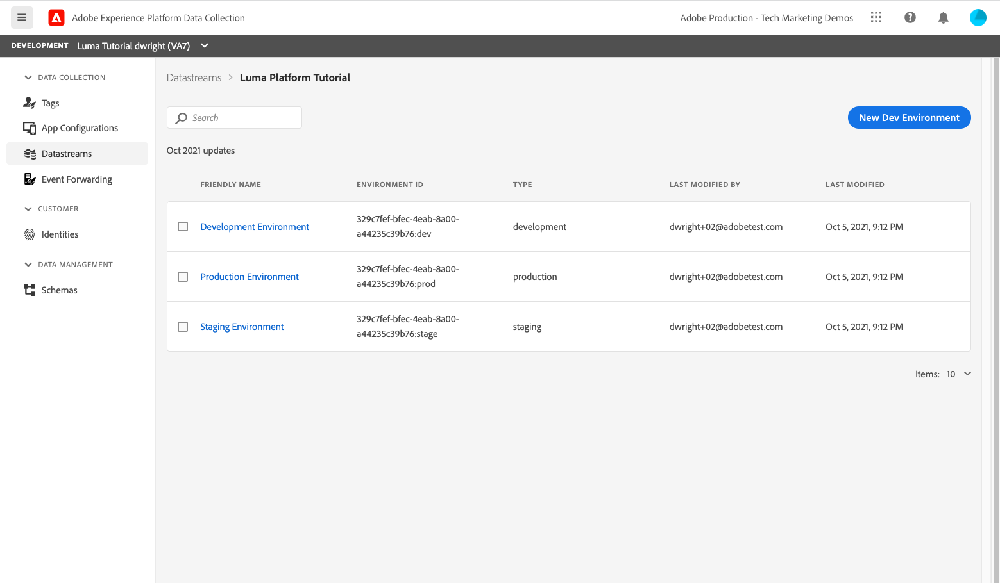

# Assimilar dados de fluxo

<!--1hr-->

Nesta lição, você fará o stream de dados usando o SDK da Web da Adobe Experience Platform.

Há duas tarefas principais que devem ser concluídas na interface da Coleta de dados:

* Precisamos implementar o SDK da Web no site Luma para enviar dados sobre a atividade do visitante do site para a rede do Adobe Edge. Faremos uma implementação simples usando tags (antigo Launch)

* Precisamos configurar um armazenamento de dados, que informa à rede do Edge onde encaminhar os dados. Configuraremos para enviar os dados para nosso `Luma Web Events` conjunto de dados na sandbox da Platform.

**Engenheiros de dados** precisará assimilar dados de transmissão fora deste tutorial. Ao implementar SDKs da Web ou móveis da Adobe Experience Platform, normalmente um desenvolvedor da Web ou móvel está envolvido na criação da camada de dados e na configuração da propriedade de tag.

Antes de começar os exercícios, assista a estes dois pequenos vídeos para saber mais sobre a assimilação de dados de streaming e o SDK da Web:
>[!VIDEO](https://video.tv.adobe.com/v/28425?quality=12&learn=on)

>[!VIDEO](https://video.tv.adobe.com/v/34141?quality=12&learn=on)

>[!NOTE]
>
>Embora este tutorial se centre na assimilação de streaming de sites com SDK da Web, você também pode fazer stream de dados usando a variável [Adobe Mobile SDK](https://aep-sdks.gitbook.io/), [Conexão Apache Kafka](https://github.com/adobe/experience-platform-streaming-connect)e outros mecanismos.

## Permissões necessárias

No [Configurar permissões](configure-permissions.md) lição, configure todos os controles de acesso necessários para concluir esta lição.

<!--
* Permission items **[!UICONTROL Launch]** > **[!UICONTROL Property Rights]** > **[!UICONTROL Approve]**, **[!UICONTROL Develop]**, **[!UICONTROL Manage Environments]**, **[!UICONTROL Manage Extensions]**, and **[!UICONTROL Publish]**
* Permission item **[!UICONTROL Launch]** > **[!UICONTROL Company Rights]** > **[!UICONTROL Manage Properties]**
* User-role access to the `Luma Tutorial Launch` product profile
* Admin-role access to the `Luma Tutorial Launch` product profile
* Permission items **[!UICONTROL Platform]** > **[!UICONTROL Data Ingestion]** > **[!UICONTROL View Sources]** and **[!UICONTROL Manage Sources]**
* Permission items **[!UICONTROL Platform]** > **[!UICONTROL Data Management]** > **[!UICONTROL View Datasets]** and **[!UICONTROL Manage Datasets]**
* Permission items **[!UICONTROL Platform]** > **[!UICONTROL Profiles]** > **[!UICONTROL View Profiles]**, **[!UICONTROL Manage Profiles]** and **[!UICONTROL Export Audience Segment]**
* Permission item **[!UICONTROL Platform]** > **[!UICONTROL Sandbox Administration]** > **[!UICONTROL View Sandboxes]**
* Permission item **[!UICONTROL Platform]** > **[!UICONTROL Sandboxes]** > `Luma Tutorial`
* User-role access to the `Luma Tutorial Platform` product profile
-->

<!--## Create a streaming source

1. Log into the [Experience Platform  user interface](https://experience.adobe.com/platform/)
1. Go to **[!UICONTROL Sources]** in the left navigation
1. Filter the list by selecting **[!UICONTROL Streaming]**
1. In the **[!UICONTROL HTTP API]** section, select the **[!UICONTROL Configure]** button
    
1. On the **[!UICONTROL Authentication]** step, enter `Luma Web Events Source` as the **[!UICONTROL Account name]** and select the **[!UICONTROL Connect to source]** button (we don't need to enable authentication since the data will be originating from website visitors)
    
1. Once connected, select the **[!UICONTROL Next]** button to proceed to the next step in the workflow
1. On the **[!UICONTROL Select data]** step, choose **[!UICONTROL Existing Dataset]**, select your `Luma Web Events Dataset`, and then select the **[!UICONTROL Next]** button
    
1. On the **[!UICONTROL Dataflow detail]** step, select the **[!UICONTROL Next]** button:
    
    <!--What is a good practice for naming the data flow vs the source-->
<!--
1. On the **[!UICONTROL Review]** step, review your source details and select the **[!UICONTROL Finish]** button:
    
-->

## Configurar o fluxo de dados

Primeiro, vamos configurar o armazenamento de dados. Um armazenamento de dados informa à rede da Adobe Edge para onde enviar os dados depois de recebê-los da chamada do SDK da Web. Por exemplo, você deseja enviar os dados para o Experience Platform, Adobe Analytics ou Adobe Target? Os conjuntos de dados são gerenciados na interface do usuário da Coleta de dados (antigo Launch) e são essenciais para a coleta de dados com o SDK da Web.

Para criar [!UICONTROL datastream]:

1. Faça logon no [Interface do usuário da Coleta de dados do Experience Platform](https://experience.adobe.com/launch/)

   <!--when will the edge config go live?-->

1. Selecionar **[!UICONTROL Datastreams]** na navegação à esquerda
1. Selecione o **[!UICONTROL Novo fluxo de dados]** no canto superior direito

   

1. Para o **[!UICONTROL Nome amigável]**, insira `Luma Platform Tutorial` (adicione seu nome ao final, se várias pessoas de sua empresa estiverem recebendo este tutorial)
1. Selecione o botão **[!UICONTROL Salvar]**

   

Na próxima tela, especifique onde deseja enviar dados. Para enviar dados ao Experience Platform:

1. Ativar **[!UICONTROL Adobe Experience Platform]** para expor campos adicionais
1. Para **[!UICONTROL Sandbox]**, selecione `Luma Tutorial`
1. Para **[!UICONTROL Conjunto de dados do evento]**, selecione `Luma Web Events Dataset`
1. Se você usar outros aplicativos Adobe, fique à vontade para explorar as outras seções e ver quais informações são necessárias na Edge Configuration dessas outras soluções. Lembre-se, o SDK da Web foi desenvolvido não apenas para transmitir dados no Experience Platform, mas também para substituir todas as bibliotecas JavaScript anteriores usadas por outros aplicativos do Adobe. A Edge Configuration é usada para especificar os detalhes da conta de cada aplicativo para o qual você deseja enviar os dados.
1. Selecione **[!UICONTROL Salvar]**

   

Depois que a Configuração de borda for salva, a tela resultante mostrará três ambientes foram criados para Desenvolvimento, Armazenamento temporário e Produção. Outros ambientes de desenvolvimento podem ser adicionados:

Todos os três ambientes contêm os detalhes da plataforma que você acabou de inserir. No entanto, esses detalhes podem ser configurados de forma diferente por ambiente. Por exemplo, cada ambiente pode enviar dados para uma sandbox de plataforma diferente. Neste tutorial, não faremos nenhuma personalização adicional em nosso armazenamento de dados.

## Instalar a extensão Web SDK

### Adicionar uma propriedade

Primeiro, devemos criar uma propriedade de tag (anteriormente uma propriedade de tag). Uma propriedade é um contêiner de todos os recursos JavaScript, regras e outros recursos necessários para coletar detalhes de uma página da Web e enviá-los para vários locais.

Para criar uma propriedade:

1. Ir para **[!UICONTROL Propriedades]** na navegação à esquerda
1. Selecione o botão **[!UICONTROL Nova propriedade]**
   
1. Como **[!UICONTROL Nome]**, insira `Luma Platform Tutorial` (adicione seu nome ao final, se várias pessoas de sua empresa estiverem recebendo este tutorial)
1. Como **[!UICONTROL Domínios]**, insira `enablementadobe.com` (explicado mais tarde)
1. Selecione **[!UICONTROL Salvar]**

   

<!--
After saving the property, you might see an error message like the one below. If so, this is because you don't actually have access to the property you just created. To fix this, we need to go to the Admin Console to give yourself access:
    

To give yourself access to the property:

1. In a separate browser tab, log into the [Admin Console](https://adminconsole.adobe.com/)
1. Go to **[!UICONTROL Products]** from the top navigation
1. Select **[!UICONTROL Adobe Experience Platform Launch]** on the left navigation
1. Go to your `Luma Tutorial Launch` product profile
1. Go to the **[!UICONTROL Permissions]** tab
1. On the **[!UICONTROL Properties]** row, select **[!UICONTROL Edit]**
    
1. Select the "+" icon to move your `Luma Platform Tutorial` property to the right-hand side and select the **[!UICONTROL Save]** button to update the permissions
   
    

Now switch back to your browser tab with the Data Collection interface still open. Reload the page and the `Luma Platform Tutorial` property should display in the list. Select to open the property:

-->

## Adicionar a extensão Web SDK

Agora que você tem uma propriedade, pode adicionar o SDK da Web usando uma extensão . Uma extensão é um pacote de código que estende a interface e a funcionalidade da Coleta de dados. Para adicionar a extensão:

1. Abra sua propriedade de tag
1. Ir para **[!UICONTROL Extensões]** na navegação à esquerda
1. Vá para o **[!UICONTROL Catálogo]** guia
1. Há muitas extensões disponíveis para tags. Filtrar o catálogo com o termo `Web SDK`
1. No **[!UICONTROL Adobe Experience Platform Web SDK]** selecione a **[!UICONTROL Instalar]** botão
   
1. Há várias configurações disponíveis para a extensão SDK da Web, mas há apenas duas que vamos configurar para este tutorial. Atualize o **[!UICONTROL Domínio de borda]** para `data.enablementadobe.com`. Essa configuração permite definir cookies próprios com a implementação do SDK da Web, o que é recomendável. Posteriormente nesta lição, você mapeará um site na `enablementadobe.com` à propriedade da tag. O CNAME do `enablementadobe.com` domínio já foi configurado para que `data.enablementadobe.com` O encaminhará para os servidores do Adobe. Ao implementar o SDK da Web em seu próprio site, será necessário criar um CNAME para suas próprias finalidades de coleta de dados, por exemplo, `data.YOUR_DOMAIN.com`
1. No **[!UICONTROL Datastream]** selecione sua `Luma Platform Tutorial` datastream.
1. Fique à vontade para ver as outras opções de configuração (mas não as altere!) e depois selecione **[!UICONTROL Salvar]**
   <!--is edge domain required for first party? when will it break?-->
   <!--any other fields that should be highlighted-->
   

## Criar uma regra para enviar dados

Agora criaremos uma regra para enviar dados para a Platform. Uma regra é uma combinação de eventos, condições e ações que instruem as tags a fazer algo. Para criar uma regra:

1. Ir para **[!UICONTROL Regras]** na navegação à esquerda
1. Selecione o **[!UICONTROL Criar nova regra]** botão
   
1. Atribua um nome à regra `All Pages - Library Loaded`
1. Em **[!UICONTROL Eventos]**, selecione o **[!UICONTROL Adicionar]** botão
   
1. Use o **[!UICONTROL Núcleo]** **[!UICONTROL Extensão]** e selecione **[!UICONTROL Biblioteca carregada (início da página)]** como **[!UICONTROL Tipo de evento]**. Essa configuração significa que nossa regra é acionada sempre que a biblioteca do Launch é carregada em uma página.
1. Selecionar **[!UICONTROL Manter alterações]** para retornar à tela de regra principal
   
1. Sair **[!UICONTROL Condições]** vazio, já que queremos que essa regra seja acionada em todas as páginas, de acordo com o nome que a demos
1. Em **[!UICONTROL Ações]**, selecione o **[!UICONTROL Adicionar]** botão
1. Use o **[!UICONTROL Adobe Experience Platform Web SDK]** **[!UICONTROL Extensão]** e selecione **[!UICONTROL Enviar evento]** como **[!UICONTROL Tipo de ação]**
1. À direita, selecione **[!UICONTROL web.webpagedetails.pageViews]** do **[!UICONTROL Tipo]** lista suspensa. Este é um dos campos XDM em nossa `Luma Web Events Schema`
1. Selecionar **[!UICONTROL Manter alterações]** para retornar à tela de regra principal
   
1. Selecionar **[!UICONTROL Salvar]** para salvar a regra\
   

## Publicar a regra em uma biblioteca

Em seguida, publicaremos a regra no ambiente de desenvolvimento para que possamos verificar se funciona.

<!--
There are a few quick steps we must take in the **[!UICONTROL Publishing]** section of Launch.

### Create a host

Launch libraries can be hosted on Adobe's Content Delivery Network (CDN) or on your own servers. In this tutorial, we will use Adobe's CDN since it is faster to set up:

1. Go to **[!UICONTROL Hosts]** in the left navigation
1. Select the **[!UICONTROL Create New Host]** button
       
1. For the **[!UICONTROL Name]**, enter `Adobe CDN`
1. For the **[!UICONTROL Type]**, select **[!UICONTROL Managed by Adobe]**
1. Select the **[!UICONTROL Save]** button to complete the setup of the host
       

### Create an environment

Environments allow you to have different versions of a library in different publishing environments to accommodate your publishing workflow. For example, the fully tested version of your library can be published to a Production environment, while new changes are being created in a Development environment. You can also use different hosts for each environment. To create an environment:

1. Go to **[!UICONTROL Environments]** in the left navigation
1. Select the **[!UICONTROL Create New Environment]** button
     
1. Under **[!UICONTROL Development]** select **[!UICONTROL Select]**   
     
1. For the **[!UICONTROL Name]**, enter `Development`
1. For the **[!UICONTROL Select Host]** dropdown, select `Adobe CDN`
1. Select the **[!UICONTROL Save]** button to complete the setup of the environment
    
1. You will see a modal with URL and other implementation details of this library. These are critical for a real Launch implementation, but we don't need to worry about them for this tutorial. Select the **[!UICONTROL Close]** button to exit the modal.

### Create and publish the library

Now let's bundle the contents of our property&mdash;currently an extension and a rule&mdash;into a library. 
-->

Para criar uma biblioteca:

1. Ir para **[!UICONTROL Fluxo de publicação]** na navegação à esquerda
1. Selecionar **[!UICONTROL Adicionar biblioteca]**
   
1. Para o **[!UICONTROL Nome]**, insira `Luma Platform Tutorial`
1. Para o **[!UICONTROL Ambiente]**, selecione `Development`
1. Selecione o **[!UICONTROL Adicionar todos os recursos alterados]** botão. (Além do [!UICONTROL Adobe Experience Platform Web SDK] e a `All Pages - Library Loaded` , você também verá a variável [!UICONTROL Núcleo] adição da extensão , que contém o JavaScript base exigido por todas as propriedades da Web do Launch.)
1. Selecione o **[!UICONTROL Salvar e criar para desenvolvimento]** botão
   

A biblioteca pode levar alguns minutos para ser criada e, quando estiver concluída, exibe um ponto verde à esquerda do nome da biblioteca:

Como você pode ver no [!UICONTROL Fluxo de publicação] , há muito mais no processo de publicação, o que está além do escopo deste tutorial. Vamos usar apenas uma biblioteca em nosso ambiente de desenvolvimento.

## Validar os dados na solicitação

### Adicionar o Adobe Experience Platform Debugger

O Experience Platform Debugger é uma extensão disponível para navegadores Chrome e Firefox, que ajuda a visualizar a tecnologia Adobe implementada em suas páginas da Web. Baixe a versão do seu navegador preferido:

* [Extensão do Firefox](https://addons.mozilla.org/pt-BR/firefox/addon/adobe-experience-platform-dbg/)
* [Extensão do Chrome](https://chrome.google.com/webstore/detail/adobe-experience-platform/bfnnokhpnncpkdmbokanobigaccjkpob)

Se você nunca usou o Debugger antes, e este é diferente do Adobe Experience Cloud Debugger mais antigo, talvez você queira assistir a este vídeo de visão geral de cinco minutos:

>[!VIDEO](https://video.tv.adobe.com/v/32156?quality=12&learn=on)

### Abra o site do Luma

Para este tutorial, usamos uma versão hospedada publicamente do site de demonstração Luma. Vamos abri-lo e marcá-lo:

1. Em uma nova guia do navegador, abra o [Site Luma](https://luma.enablementadobe.com/content/luma/us/en.html).
1. Marque a página como favorito para uso no resto do tutorial

Este site hospedado é o motivo pelo qual usamos `enablementadobe.com` no [!UICONTROL Domínios] campo da configuração inicial da propriedade de tag e por que usamos `data.enablementadobe.com` como nosso domínio próprio no [!UICONTROL Adobe Experience Platform Web SDK] extensão. Veja, eu tinha um plano!

### Use o Experience Platform Debugger para mapear para a propriedade da tag

O Experience Platform Debugger tem um recurso interessante que permite substituir uma propriedade de tag existente por outra. Isso é útil para validação e permite ignorar muitas etapas de implementação neste tutorial.

1. Certifique-se de ter o site Luma aberto e selecione o ícone de extensão do Experience Platform Debugger
1. O Debugger abrirá e mostrará alguns detalhes da implementação codificada, que não está relacionada a este tutorial (talvez seja necessário recarregar o site Luma após abrir o Debugger)
1. Confirme se o Debugger é &quot;**[!UICONTROL Conectado ao Luma]**&quot; como mostrado abaixo e selecione o &quot;**[!UICONTROL bloqueio]**&quot; para bloquear o Debugger para o site Luma.
1. Selecione o **[!UICONTROL Fazer logon]** na parte superior direita para autenticar.
1. Agora vá para **[!UICONTROL Launch]** na navegação à esquerda
1. Selecione a guia Configuração
1. À direita de onde ele mostra o **[!UICONTROL Códigos de inserção da página]**, abra o **[!UICONTROL Ações]** e selecione **[!UICONTROL Substituir]**

   
1. Como você é autenticado, o Debugger obterá as propriedades e os ambientes disponíveis do Launch. Selecione seu `Luma Platform Tutorial` propriedade
1. Selecione seu `Development` ambiente
1. Selecione o **[!UICONTROL Aplicar]** botão
   
1. O site Luma agora será recarregado _com sua propriedade de tag_. Ajuda, fui hackeado! Só brincando.
   
1. Ir para **[!UICONTROL Resumo]** na navegação à esquerda, para ver os detalhes do [!UICONTROL Launch] propriedade
   
1. Agora vá para **[!UICONTROL AEP Web SDK]** na navegação à esquerda para ver o **[!UICONTROL Solicitações de rede]**
1. Abra o **[!UICONTROL events]** row

   
1. Observe como podemos ver a variável `web.webpagedetails.pageView` tipo de evento que especificamos em [!UICONTROL Enviar evento] e outras variáveis prontas para uso que seguem o `AEP Web SDK ExperienceEvent Mixin` format
   
1. Esses tipos de detalhes da solicitação também estão visíveis nas ferramentas do desenvolvedor da Web do navegador **Rede** guia . Abra-o e recarregue a página. Filtrar chamadas com `interact` para localizar a chamada, selecione-a e, em seguida, procure no **Cabeçalhos** guia , **Solicitar carga** área.
   
1. Vá para o **Resposta** e observe como o valor ECID é incluído na resposta. Copie esse valor como você o usará para validar as informações do perfil no próximo exercício.
   

## Validar os dados no Experience Platform

Você pode validar se os dados estão chegando no Platform, observando os lotes de dados que chegam no `Luma Web Events Dataset`. (Eu sei, é chamado de assimilação de dados de transmissão, mas agora estou dizendo que chega em lotes! Ele é transmitido em tempo real para o Perfil, para que possa ser usado para a segmentação e ativação em tempo real, mas é enviado em lotes a cada 15 minutos para o lago de dados.)

Para validar os dados:

1. Na interface do usuário da Platform, acesse **[!UICONTROL Conjuntos de dados]** na navegação à esquerda
1. Abra o `Luma Web Events Dataset` e confirmar que um lote chegou. Lembre-se de que eles são enviados a cada 15 minutos; portanto, talvez seja necessário aguardar a exibição do lote.
1. Selecione o **[!UICONTROL Visualizar conjunto de dados]** botão
   
1. No modal de visualização, observe como é possível selecionar diferentes campos do esquema à esquerda para visualizar esses pontos de dados específicos:
   

Você também pode confirmar que o novo perfil está sendo exibido:

1. Na interface do usuário da Platform, acesse **[!UICONTROL Perfis]** na navegação à esquerda
1. Selecione o **[!UICONTROL ECID]** namespace e pesquise pelo valor da ECID (copie-o da resposta. O perfil terá sua própria ID, separada da ECID.
1. Selecione o **[!UICONTROL ID do perfil]** para abrir o perfil
   
1. Selecione o **[!UICONTROL Eventos]** para ver as páginas que você visualizou
   
   <!---->

## Adicionar dados personalizados ao evento

### Criar um elemento de dados para o nome da página

1. Na interface das tags da Coleta de dados , no canto superior direito da `Luma Platform Tutorial` , abra o **[!UICONTROL Selecionar uma biblioteca de trabalho]** e selecione seu `Luma Platform Tutorial` biblioteca. Essa configuração facilita a publicação de atualizações adicionais na biblioteca.
1. Agora vá para **[!UICONTROL Elementos de dados]** na navegação à esquerda
1. Selecione o **[!UICONTROL Criar novo elemento de dados]** botão

   
1. Como **[!UICONTROL Nome]**, insira `Page Name`
1. Como **[!UICONTROL Tipo de elemento de dados]**, selecione `JavaScript Variable`
1. Como **[!UICONTROL Nome da variável JavaScript]**, insira `digitalData.page.pageInfo.pageName`
1. Para ajudar a padronizar o formato dos valores, marque as caixas de **[!UICONTROL Forçar valor de minúsculas]** e **[!UICONTROL Texto limpo]**
1. Certifique-se de que `Luma Platform Tutorial` é selecionado como a biblioteca de trabalho
1. Selecionar **[!UICONTROL Salvar na biblioteca]**
   

### Mapeie o nome da página para o elemento de dados Objeto XDM

Agora, mapearemos o nome da página para o SDK da Web.

>[!IMPORTANT]
>
>Para concluir essa tarefa, precisamos garantir que seu usuário tenha acesso primeiro à sandbox de produto. Se você ainda não tiver acesso à sandbox de produto de um perfil de produto diferente, abra rapidamente o `Luma Tutorial Platform` e adicionar o item de permissão **[!UICONTROL Sandboxes]** > **[!UICONTROL Prod]**. Depois de fazer isso, faça uma recarga SHIFT na página Elementos de dados para limpar o cache
>

No **[!UICONTROL Elementos de dados]** página:

1. Criar um novo elemento de dados
1. Como **[!UICONTROL Nome]**, insira `XDM Object`
1. Como **[!UICONTROL Extensão]**, selecione `Adobe Experience Platform Web SDK`
1. Como **[!UICONTROL Tipo de elemento de dados]**, selecione `XDM object`
1. Como **[!UICONTROL Sandbox]**, selecione o `Luma Tutorial` sandbox
1. Como **[!UICONTROL Esquema]**, selecione o `Luma Web Events Schema`
1. Selecione o `web.webPageDetails.name` campo
1. Como **[!UICONTROL Valor]**, selecione o ícone para abrir o modal de seleção do elemento de dados e escolha `Page Name` elemento de dados
1. Selecionar **[!UICONTROL Salvar na biblioteca]**

   

Esse mesmo processo é usado para mapear dados personalizados adicionais em seu site para campos XDM.

### Adicionar os dados XDM à ação Enviar evento

Agora que possui dados mapeados para campos XDM, você pode incluí-los na ação Enviar evento:

1. Vá para o **[!UICONTROL Regras]** tela
1. Abra seu `All Pages - Library Loaded` regra
1. Abra o `Adobe Experience Platform Web SDK - Send Event` ação
1. Como **[!UICONTROL Dados XDM]**, selecione o ícone para abrir o modal de seleção do elemento de dados e escolha `XDM Object` elemento de dados
1. Selecione o **[!UICONTROL Manter alterações]** botão
   
1. Agora, desde que você teve `Luma Platform Tutorial` selecionadas como a biblioteca de trabalho dos últimos exercícios, as alterações recentes foram salvas diretamente na biblioteca. Em vez de precisar publicar as alterações por meio da tela Fluxo de publicação , você pode abrir a lista suspensa no botão azul e selecionar **[!UICONTROL Salvar na biblioteca e criar]**
   

Isso inicia a criação de uma nova biblioteca de tags com as três alterações que você acabou de fazer.

### Validar os dados XDM

Agora é possível recarregar a página inicial do Luma, enquanto está mapeada para a propriedade de tag usando o Debugger, como você aprendeu anteriormente, e ver que o campo de nome da página é preenchido na solicitação!

Também é possível validar se os dados do nome da página foram recebidos na Platform, visualizando o conjunto de dados e o perfil.

## Enviar identidades adicionais

Sua implementação do SDK da Web agora está enviando eventos com a Experience Cloud ID (ECID) como o identificador principal. A ECID é gerada automaticamente pelo SDK da Web e é exclusiva por dispositivo e navegador. Um único cliente pode ter várias ECIDs, dependendo do dispositivo e do navegador que estiver usando. Então, como podemos obter uma visão unificada desse cliente e vincular sua atividade online aos nossos dados de CRM, Fidelidade e Compra offline? Fazemos isso coletando identidades adicionais durante a sessão e vinculando deterministicamente seu perfil por meio da identificação.

Se você se lembrar, eu mencionei que estaríamos usando a ECID e a CRM Id como identidades de nossos dados da Web na [Mapear identidades](map-identities.md) lição. Então vamos coletar a ID do CRM com o SDK da Web!

### Adicionar elemento de dados para a ID do CRM

Primeiro, armazenamos a ID do CRM em um elemento de dados:

1. Na interface das tags, adicione um elemento de dados chamado `CRM Id`
1. Como **[!UICONTROL Tipo de elemento de dados]**, selecione **[!UICONTROL Variável JavaScript]**
1. Como **[!UICONTROL Nome da variável JavaScript]**, insira `digitalData.user.0.profile.0.attributes.username`
1. Selecione o **[!UICONTROL Salvar na biblioteca]** botão (`Luma Platform Tutorial` ainda deve ser sua biblioteca de trabalho)
   

### Adicionar a ID do CRM ao elemento de dados do Mapa de identidade

Agora que capturamos o valor da ID do CRM, devemos associá-la a um tipo de elemento de dados especial chamado [!UICONTROL Mapa de identidade] elemento de dados:

1. Adicionar um elemento de dados chamado `Identities`
1. Como **[!UICONTROL Extensão]**, selecione **[!UICONTROL Adobe Experience Platform Web SDK]**
1. Como **[!UICONTROL Tipo de elemento de dados]**, selecione **[!UICONTROL Mapa de identidade]**
1. Como **[!UICONTROL Namespace]**, insira `Luma CRM Id`, que é o [!UICONTROL namespace] criamos em uma lição anterior

   >[!WARNING]
   >
   >A extensão Adobe Experience Platform Web SDK versão 2.2 permite selecionar Namespace a partir de uma lista suspensa pré-preenchida usando os valores reais na sua conta da plataforma. Infelizmente, esse recurso ainda não é &quot;sensível a sandbox&quot; e, portanto, a variável `Luma CRM Id` pode não aparecer na lista suspensa. Isto pode impedir que conclua este exercício. Depois de confirmado, publicaremos uma solução alternativa.

1. Como **[!UICONTROL ID]**, selecione o ícone para abrir o modal de seleção do elemento de dados e escolha `CRM Id` elemento de dados
1. Como **[!UICONTROL Estado autenticado]**, selecione **[!UICONTROL Autenticado]**
1. Sair **[!UICONTROL Primário]** _desmarcado_. Como a ID do CRM não está presente para a maioria dos visitantes do site Luma, você definitivamente _não deseja substituir a ECID como o identificador principal_. Seria raro usar qualquer coisa diferente da ECID como o identificador principal. Geralmente, não menciono as configurações padrão nessas instruções, mas chamo essa para ajudar você a evitar dores de cabeça mais tarde em sua própria implementação.
1. Selecione o **[!UICONTROL Salvar na biblioteca]** botão (`Luma Platform Tutorial` ainda deve ser sua biblioteca de trabalho)
   

>[!NOTE]
>
>Você pode passar vários identificadores usando a variável [!UICONTROL Mapa de identidade] tipo de dados.

### Adicionar o elemento de dados do Mapa de identidade ao objeto XDM

Há mais um elemento de dados que devemos atualizar: o elemento de dados Objeto XDM. Pode parecer estranho ter que atualizar três elementos de dados separados para transmitir essa única identidade, mas esse processo foi projetado para dimensionar para várias identidades. Não se preocupe, estamos quase terminando com esta lição!

1. Abra o elemento de dados do Objeto XDM
1. Abra o campo XDM do IdentityMap
1. Como **[!UICONTROL Elemento de dados]**, selecione o ícone para abrir o modal de seleção do elemento de dados e escolha `Identities` elemento de dados
1. Agora, desde que você teve `Luma Platform Tutorial` selecionadas como a biblioteca de trabalho dos últimos exercícios, as alterações recentes foram salvas diretamente na biblioteca. Em vez de precisar publicar as alterações por meio da tela Fluxo de publicação , você pode abrir a lista suspensa no botão azul e selecionar **[!UICONTROL Salvar na biblioteca e criar]**
   

### Validar a identidade

Para validar se a ID do CRM agora está sendo enviada pelo SDK da Web:

1. Abra o [Site Luma](https://luma.enablementadobe.com/content/luma/us/en.html)
1. Mapeie para a propriedade da tag usando o Debugger, de acordo com as instruções anteriores
1. Selecione o **Logon** link no canto superior direito do site Luma
1. Faça logon usando as credenciais `test@adobe.com`/`test`
1. Depois de autenticado, inspecione a chamada do SDK da Web do Experience Platform no Debugger (**[!UICONTROL Adobe Experience Platform Web SDK]** > **[!UICONTROL Solicitações de rede]** > **[!UICONTROL events]** da solicitação mais recente) e você deve ver a variável `lumaCrmId`:
   
1. Procure o perfil do usuário usando o namespace e o valor da ECID novamente. No perfil, você verá a ID do CRM e também a ID de fidelidade, bem como os detalhes do perfil, como o nome e o número de telefone. Todas as identidades e dados foram unidos em um único perfil de cliente em tempo real!
   

## Recursos adicionais

* [Implementar a Adobe Experience Cloud com o SDK da Web](/help/tutorial-web-sdk/overview.md)
* [Documentação de assimilação de fluxo](https://experienceleague.adobe.com/docs/experience-platform/ingestion/streaming/overview.html?lang=pt-BR)
* [Referência da API de assimilação de fluxo](https://www.adobe.io/experience-platform-apis/references/data-ingestion/#tag/Streaming-Ingestion)

Excelente trabalho! Essas eram muitas informações sobre o SDK da Web e o Launch. Há muito mais envolvido em uma implementação completa, mas esses são os conceitos básicos para ajudá-lo a começar e ver os resultados na Platform.

>[!NOTE]
>
>Agora que você terminou a lição de Assimilação de fluxo, é possível remover a variável [!UICONTROL Prod] sandbox da sua `Luma Tutorial Platform` perfil de produto

Engenheiros de dados, se você quiser, pule para a [lição executar consultas](run-queries.md).

Arquitetos de dados, você pode seguir para [políticas de mesclagem](create-merge-policies.md)!
