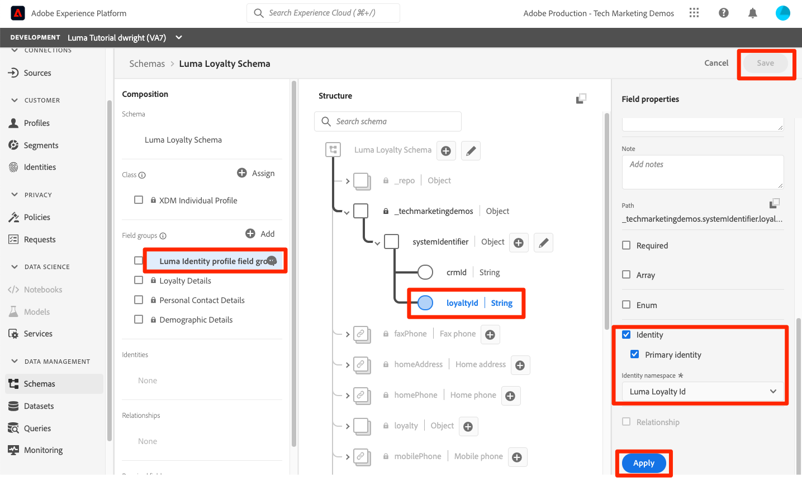
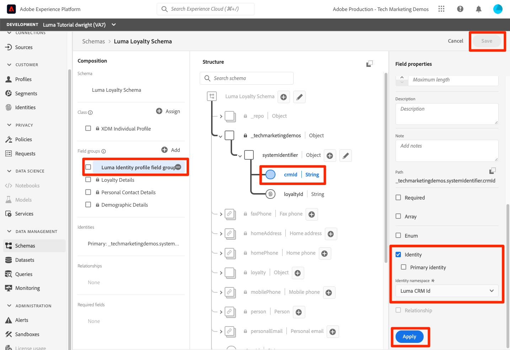
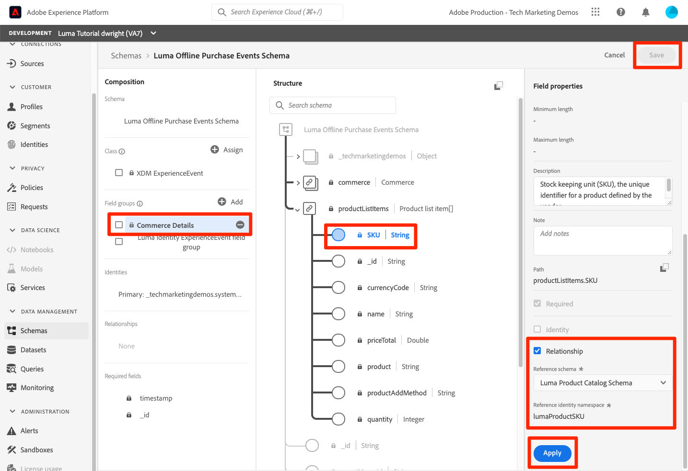

# Mapear identidades

<!-- 30 min-->

Nesta lição, criaremos namespaces de identidade e adicionaremos campos de identidade aos nossos esquemas. Depois de fazer isso, também poderemos concluir as relações de esquema da lição anterior.

O Serviço de identidade da Adobe Experience Platform ajuda você a obter uma melhor visualização dos clientes e de seus comportamentos, unindo identidades em dispositivos e sistemas, permitindo que você forneça experiências digitais pessoais e de impacto em tempo real. Campos de identidade e namespaces são a cola que une diferentes fontes de dados para criar o perfil do cliente em tempo real de 360 graus.

**Os Arquitetos de Dados** precisarão mapear identidades fora deste tutorial.

Antes de começar os exercícios, assista a este vídeo curto para saber mais sobre identidade no Adobe Experience Platform:
>[!VIDEO](https://video.tv.adobe.com/v/27841?learn=on)

>[!NOTE]
>
>Os campos de identidade só serão necessários se você criar perfis de clientes em tempo real. Elas não são necessárias se você estiver assimilando apenas dados no data lake.

<!--explain identity maps-->
<!--explain the strategy behind the identity selection, how these identities will join all the data together-->

## Permissões necessárias

Na lição [Configurar Permissões](configure-permissions.md), você configura todos os controles de acesso necessários para concluir esta lição.

<!--
* Permission items **[!UICONTROL Identity Management]** > **[!UICONTROL View Identity Namespaces]** and **[!UICONTROL Manage Identity Namespaces]**
* Permission item **[!UICONTROL Data Modeling]** > **[!UICONTROL View Schemas]** and **[!UICONTROL Manage Schemas]**
* Permission item **[!UICONTROL Sandboxes]** > `Luma Tutorial`
* User-role access to the `Luma Tutorial Platform` product profile
* Developer-role access to the `Luma Tutorial Platform` product profile (for API)
-->

## Criar namespace de identidade

Neste exercício, criaremos namespaces de identidade para os campos de identidade personalizados da Luma, `loyaltyId`, `crmId` e `productSku`. Os namespaces de identidade desempenham uma função essencial na criação de perfis de clientes em tempo real, pois dois valores correspondentes no mesmo namespace permitem que duas fontes de dados formem um gráfico de identidade.


### Criar namespaces na interface

Vamos começar criando um namespace para o Esquema de fidelidade Luma:

1. Na interface do usuário da Platform, acesse **[!UICONTROL Identidades]** na navegação à esquerda
1. Você observará que há vários namespaces de identidade prontos para uso disponíveis. Selecione o botão **[!UICONTROL Criar namespace de identidade]**
1. Forneça os detalhes a seguir

   | Campo | Valor |
   |---------------|-----------|
   | Nome de exibição | ID de fidelidade Luma |
   | Símbolo de identidade | lumaLoyaltyId |
   | Tipo | Entre dispositivos |

1. Selecionar **[!UICONTROL Criar]**

   

Agora configure outro namespace para o Esquema do catálogo de produtos Luma com os seguintes detalhes:

| Campo | Valor |
|---------------|-----------|
| Nome de exibição | SKU do produto Luma |
| Símbolo de identidade | lumaProductSKU |
| Tipo | Identificador não pessoal |


## Criar namespace de identidade usando a API

Criaremos nosso namespace do CRM por meio da API.

>[!NOTE]
>
>Se preferir ignorar os exercícios de API, sinta-se à vontade para criar o namespace do CRM por meio do método de interface do usuário usado com os seguintes detalhes:
>
> 1. Como o **[!UICONTROL Nome de exibição]**, use `Luma CRM Id`
> 1. Como o **[!UICONTROL símbolo de identidade]**, use `lumaCrmId`
> 1. Como o **[!UICONTROL Tipo]**, use entre dispositivos

Vamos criar o Namespace de Identidade `Luma CRM Id`:

1. Baixe o [Identity Service.postman_collection.json](https://raw.githubusercontent.com/adobe/experience-platform-postman-samples/master/apis/experience-platform/Identity%20Service.postman_collection.json) na pasta `Luma Tutorial Assets`
1. Importar a coleção para [!DNL Postman]
1. Se você não tiver um token de acesso, abra a solicitação **[!DNL OAuth: Request Access Token]** e selecione **Enviar** para solicitar um novo token de acesso.
1. Selecione a solicitação **[!UICONTROL Serviço de Identidade] > [!UICONTROL Namespace de Identidade] > [!UICONTROL Criar um novo namespace de identidade].**
1. Cole o seguinte como o [!DNL Body] da solicitação:

   ```json
   {
       "name": "Luma CRM Id",
       "code": "lumaCrmId",
       "idType": "Cross_device"
   }
   ```

1. Pressione o botão **Enviar** e você deverá obter uma resposta **200 OK**:

   

Se você retornar à interface do usuário do, agora deverá ver seus três novos namespaces personalizados:


## Rotular campos de identidade em esquemas

Agora que temos nossos namespaces, a próxima etapa é atualizar nossos esquemas para rotular nossos campos de identidade.


### Rotular campos XDM para identidade principal

Cada esquema usado com o Perfil de cliente em tempo real precisa ter uma identidade principal especificada. E cada registro assimilado deve ter um valor para esse campo.

Vamos adicionar uma identidade principal ao `Luma Loyalty Schema`:

1. Abrir o `Luma Loyalty Schema`
1. Selecione o `Luma Identity profile field group`
1. Selecionar o campo `loyaltyId`
1. Marque a caixa **[!UICONTROL Identidade]**
1. Marque também a caixa **[!UICONTROL Identidade principal]**
1. Selecione o namespace `Luma Loyalty Id` na lista suspensa **[!UICONTROL Namespaces de identidade]**
1. Selecione **[!UICONTROL Aplicar]**
1. Selecione **[!UICONTROL Salvar]**

   

Repita o processo para algum outro esquema:

1. No `Luma CRM Schema`, rotule o campo `crmId` como a identidade primária usando o namespace `Luma CRM Id`
1. No `Luma Offline Purchase Events Schema`, rotule o campo `loyaltyId` como a identidade primária usando o namespace `Luma Loyalty Id`
1. No `Luma Product Catalog Schema`, rotule o campo `productSku` como a identidade primária usando o namespace `Luma Product SKU`

>[!NOTE]
>
>Os dados coletados com o SDK da Web são uma exceção à prática típica de rotular campos de identidade no esquema. O SDK da Web usa o Mapa de Identidade para rotular identidades *no lado da implementação* e, portanto, determinaremos as identidades para o `Luma Web Events Schema` quando implementarmos o SDK da Web no site Luma. Nessa lição posterior, coletaremos a ID de visitante do Experience Cloud (ECID) como a ID primária e a crmId como uma ID secundária.

Com nossa seleção de identidades primárias, fica claro como o `Luma CRM Schema` pode se conectar ao `Luma Offline Purchase Events Schema`, já que ambos usam `loyaltyId` como identificador. Mas como podemos conectar nossas compras offline ao comportamento online? Como podemos classificar os produtos comprados com nosso catálogo de produtos? Usaremos campos de identidade e relações de esquema adicionais.

<!--use a visual-->

### Rotular campos XDM para identidade secundária

Vários campos de identidade podem ser adicionados a um esquema. As identidades não primárias geralmente são chamadas de identidades secundárias. Para conectar compras offline ao comportamento online, adicionaremos o crmId como um identificador secundário ao nosso `Luma Loyalty Schema` e, posteriormente, aos nossos dados de eventos da Web. Vamos atualizar o `Luma Loyalty Schema`:

1. Abrir o `Luma Loyalty Schema`
1. Selecionar `Luma Identity Profile Field group`
1. Selecionar campo `crmId`
1. Marque a caixa **[!UICONTROL Identidade]**
1. Selecione o namespace `Luma CRM Id` na lista suspensa **[!UICONTROL Namespaces de identidade]**
1. Selecione **[!UICONTROL Aplicar]** e, em seguida, o botão **[!UICONTROL Salvar]** para salvar suas alterações

   

## Concluir os relacionamentos do esquema

Agora que temos nossos campos de identidade rotulados, podemos concluir a configuração das relações de esquema entre o catálogo de produtos do Luma e os esquemas de evento:

1. Abrir o `Luma Offline Purchase Events Schema`
1. Selecionar grupo de campos **[!UICONTROL Detalhes do Commerce]**
1. Selecione o campo **[!UICONTROL productListItems]** > **[!UICONTROL SKU]**
1. Marque a caixa **[!UICONTROL Relacionamento]**
1. Selecione `Luma Product Catalog Schema` como o **[!UICONTROL Esquema de referência]**
1. `Luma Product SKU` deve ser preenchido automaticamente como **[!UICONTROL Namespace de identidade de referência]**
1. Selecione **[!UICONTROL Aplicar]**
1. Selecione **[!UICONTROL Salvar]**

   

Repita esse processo para criar uma relação entre o `Luma Web Events Schema` e o `Luma Product Catalog Schema`.

Observe que, após definir a relação, ela é indicada nas seções **[!UICONTROL Composição]** e **[!UICONTROL Estrutura]** do editor de esquema.


<!--need to verify that the relationship schema works-->

## Recursos adicionais

* [Documentação do Serviço de Identidade](https://experienceleague.adobe.com/docs/experience-platform/identity/home.html?lang=pt-BR)
* [API do Serviço de Identidade](https://www.adobe.io/experience-platform-apis/references/identity-service/)

Agora que nossas identidades estão em vigor, podemos [criar nossos conjuntos de dados](create-datasets.md)!
