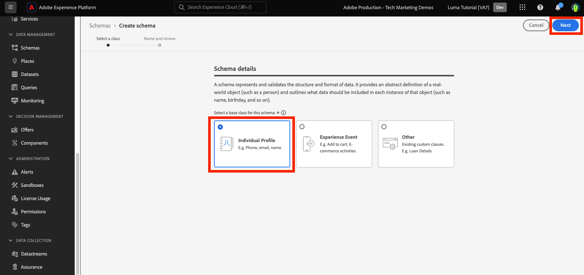

# Dados de modelo em esquemas

<!-- 60min -->
Nesta lição, você modelará os dados do Luma em esquemas. Esta é uma das lições mais longas do tutorial, então pegue um copo de água e aperte a fivela!

A padronização e a interoperabilidade são os principais conceitos por trás da Adobe Experience Platform. O Experience Data Model (XDM) é um esforço para padronizar os dados de experiência do cliente e definir esquemas para o gerenciamento da experiência do cliente.

O XDM é uma especificação documentada publicamente projetada para melhorar o potencial das experiências digitais. Ela fornece estruturas e definições comuns para qualquer aplicativo usar na comunicação com os serviços da plataforma. Seguindo os padrões XDM, todos os dados de experiência do cliente podem ser incorporados a uma representação comum que pode fornecer insights de maneira mais rápida e integrada. Você pode obter insights valiosos das ações do cliente, definir públicos-alvo do cliente por meio de segmentos e expressar atributos do cliente para fins de personalização.

O XDM é a estrutura fundamental que permite ao Adobe Experience Cloud, viabilizado pelo Experience Platform, enviar a mensagem certa à pessoa certa, no canal certo, no momento exato. A metodologia na qual o Experience Platform é criado, **XDM System**, operacionaliza esquemas do Experience Data Model para uso pelos serviços da plataforma.

<!--
This seems too lengthy. The video should suffice

Key terms:

* **Schema**: a representation of your data. A schema is comprised of a class and optional field groups and is used to create datasets. A schema includes behavioral attributes, timestamp, identity, attribute definitions, and relationships.
* **XDM Profile Class**: a common schema class used to represent record data
* **XDM ExperienceEvent Class**: a common schema class used to represent time-series data
* **Field group**: allows users to extend reusable fields that contain variables defining one or more attribute intended to be included in a schema or added to a class.
* **Standard Field group**: an open-source Field group built to conform to common industry standards, used to accelerate implementation and support repeatable services operating on the data
* **Data type**: a reusable object with properties in a hierarchical representation. These can be standard types or custom-defined defined types to describe your own data in your own way (for example, a collection of fields that you use to describe your products). Unlike Field groups, data types can be used in schemas regardless of the class.
* **Field**: a field is the lowest level element of a schema. Each field has a name for referencing and a type to identify the type of data that it contains. Field types can include, integer, number, string, Boolean and schema.
-->

Os **Arquitetos de dados** precisarão criar esquemas fora deste tutorial, mas os **Engenheiros de dados** trabalharão em conjunto com os esquemas criados pelo Arquiteto de dados.

Antes de começar os exercícios, assista a este vídeo curto para saber mais sobre esquemas e o Experience Data Model (XDM):
>[!VIDEO](https://video.tv.adobe.com/v/27105?learn=on&enablevpops)

>[!TIP]
>
> Para aprofundar a modelagem de dados no Experience Platform, recomendamos assistir à lista de reprodução [Modelar os dados da experiência do cliente com XDM](https://experienceleague.adobe.com/en/playlists/experience-platform-model-your-customer-experience-data-with-xdm), disponível gratuitamente no Experience League!

## Permissões necessárias

Na lição [Configurar Permissões](configure-permissions.md), você configura todos os controles de acesso necessários para concluir esta lição.

<!--, specifically:

* Permission items **[!UICONTROL Data Modeling]** > **[!UICONTROL View Schemas]** and **[!UICONTROL Manage Schemas]**
* Permission item **[!UICONTROL Sandboxes]** > `Luma Tutorial`
* User-role access to the `Luma Tutorial Platform` product profile
* Developer-role access to the `Luma Tutorial Platform` product profile (for API)-->


<!--
## Luma's goals
-->

## Criar esquema de fidelidade por meio da interface

Neste exercício, criaremos um esquema para os dados de fidelidade do Luma.

1. Vá para a interface do usuário da Platform e verifique se sua sandbox está selecionada.
1. Vá para **[!UICONTROL Esquemas]** na navegação à esquerda.
1. Selecione o botão **[!UICONTROL Criar esquema]** na parte superior direita.
   

1. No fluxo de trabalho Criar esquema, selecione **[!UICONTROL Perfil Individual]** como a classe base do esquema, já que modelaremos os atributos de um cliente individual (pontos, status, etc.).
1. Selecione **[!UICONTROL Próximo]**.
   

1. Digite `Luma Loyalty Schema` no campo de texto **[!UICONTROL Nome para exibição do esquema]**. Na tela abaixo, você também pode revisar e verificar a estrutura do esquema base fornecida pela classe escolhida.
1. Selecione **[!UICONTROL Concluir]** para criar seu esquema.
   

### Adicionar grupos de campos padrão

Depois que o esquema for criado, você será redirecionado para o Editor de esquema, onde poderá adicionar campos ao esquema. Você pode adicionar campos individuais diretamente ao esquema ou usar grupos de campos. É importante observar que todos os campos individuais ainda estão associados a uma classe ou grupo de campos. Você pode escolher entre um grande conjunto de grupos de campos padrão do setor fornecidos pelo Adobe ou criar os seus próprios. À medida que você começa a modelar seus próprios dados no Experience Platform, é bom se familiarizar com os grupos de campo padrão do setor fornecidos pelo Adobe. Sempre que possível, é uma prática recomendada usá-los, pois eles às vezes alimentam serviços downstream, como IA do cliente, IA de atribuição e Adobe Analytics.

Ao trabalhar com seus próprios dados, uma etapa significativa será determinar quais dos seus próprios dados devem ser capturados na Platform e como eles devem ser modelados. Este grande tópico é discutido com mais detalhes na lista de reprodução [Modelar os dados da experiência do cliente com o XDM](https://experienceleague.adobe.com/en/playlists/experience-platform-model-your-customer-experience-data-with-xdm). Neste tutorial, eu vou guiá-lo pela implementação de alguns esquemas predeterminados.

Para adicionar grupos de campos:

1. Selecione **[!UICONTROL Adicionar]** sob o cabeçalho **[!UICONTROL Grupos de campos]**.
   
1. No modal **[!UICONTROL Adicionar grupos de campos]**, selecione os seguintes grupos de campos:
   1. **[!UICONTROL Detalhes demográficos]** para dados básicos do cliente, como nome e data de nascimento
   1. **[!UICONTROL Detalhes de Contato Pessoal]** para obter detalhes de contato básicos, como endereço de email e número de telefone
1. Você pode visualizar os campos de contribuição no grupo de campos selecionando o ícone no lado direito da linha.
   

1. Marque a caixa **[!UICONTROL Setor]** > **[!UICONTROL Varejo]** para expor grupos de campos específicos do setor.
1. Selecione **[!UICONTROL Detalhes de fidelidade]** para adicionar os campos do programa de fidelidade.
1. Selecione **[!UICONTROL Adicionar grupos de campos]** para adicionar todos os três grupos de campos ao esquema.
   


Agora dedique algum tempo para explorar o estado atual do schema. Os grupos de campos adicionaram campos padrão relacionados a uma pessoa, seus detalhes de contato e status do programa de fidelidade. Esses dois grupos de campos podem ser úteis ao criar esquemas para os dados da sua própria empresa. Selecione uma linha de grupo de campos específica ou marque a caixa ao lado do nome do grupo de campos para ver como a visualização é alterada.

Para salvar o esquema, selecione **[!UICONTROL Salvar]**.


>[!NOTE]
>
>Não há problema se um grupo de campos adicionar um campo para um ponto de dados que você não coleta. Por exemplo, &quot;faxPhone&quot; pode ser um campo para o qual a Luma não coleta dados. Tudo bem. O fato de um campo estar definido no esquema não significa que os dados para ele *devem* ser assimilados posteriormente. Também é possível remover o campo do esquema.

### Adicionar um grupo de campos personalizado

Agora, vamos criar um grupo de campos personalizado.

Embora o grupo de campos de fidelidade contivesse um campo `loyaltyID`, a Luma gostaria de gerenciar todos os identificadores de sistema em um único grupo para ajudar a garantir a consistência em seus esquemas.

Os grupos de campos devem ser criados no fluxo de trabalho de esquema. É possível:

* Primeiro adicione um novo campo personalizado ao esquema e depois crie um grupo de campos personalizado, ou
* Primeiro crie um grupo de campos personalizado e depois adicione os campos a ele.

Neste tutorial, começamos com a criação de um grupo de campos personalizado.

Para criar o grupo de campos:

1. Selecione **[!UICONTROL Adicionar]** sob o cabeçalho **[!UICONTROL Grupos de Campos de Esquema]**
   
1. Selecionar **[!UICONTROL Criar novo grupo de campos]**
1. Usar `Luma Identity profile field group` como **[!UICONTROL Nome de exibição]**
1. Usar `system identifiers for XDM Individual Profile class` como **[!UICONTROL Descrição]**
1. Selecionar **[!UICONTROL Adicionar grupos de campos]**
   

O novo grupo de campos vazio é adicionado ao esquema. Os botões **[!UICONTROL +]** podem ser usados para adicionar novos campos a qualquer local na hierarquia. Em nosso caso, queremos adicionar campos no nível raiz:

1. Selecione **[!UICONTROL +]** ao lado do nome do esquema. Isso adiciona um novo campo no namespace de id do locatário para gerenciar conflitos entre os campos personalizados e quaisquer campos padrão.
1. Na barra lateral **[!UICONTROL Propriedades do campo]**, adicione os detalhes do novo campo:
   1. **[!UICONTROL Nome do campo]**: `systemIdentifier`
   1. **[!UICONTROL Nome de exibição]**: `System Identifier`
   1. **[!UICONTROL Tipo]**: **[!UICONTROL Objeto]**
   1. Na lista suspensa **[!UICONTROL Grupo de Campos]**, selecione o **grupo de campos do perfil de identidade Luma** que criamos.
      
   1. Selecione **[!UICONTROL Aplicar]**
      

Agora adicione dois campos sob o objeto `systemIdentifier`:

1. Primeiro campo
   1. **[!UICONTROL Nome do campo]**: `loyaltyId`
   1. **[!UICONTROL Nome de exibição:]** `Loyalty Id`
   1. **[!UICONTROL Tipo]**: **[!UICONTROL Cadeia]**
1. Segundo campo
   1. **[!UICONTROL Nome do Campo]**: `crmId`
   1. **[!UICONTROL Nome para Exibição]**: `CRM Id`
   1. **[!UICONTROL Tipo]**: **[!UICONTROL Cadeia]**

Seu novo grupo de campos deve ter esta aparência. Selecione o botão **[!UICONTROL Salvar]** para salvar seu esquema, mas deixe o esquema aberto para o próximo exercício.


## Criar um tipo de dados

Os grupos de campos, como o novo `Luma Identity profile field group`, podem ser reutilizados em outros esquemas, permitindo que você aplique definições de dados padrão em vários sistemas. Mas eles só podem ser reutilizados _em esquemas que compartilham uma classe_, neste caso a classe Perfil Individual XDM.

O tipo de dados é outra construção de vários campos que pode ser reutilizada em esquemas _em várias classes_. Vamos converter nosso novo objeto `systemIdentifier` em um tipo de dados:

Com o `Luma Loyalty Schema` ainda aberto, selecione o objeto `systemIdentifier` e selecione **[!UICONTROL Converter em novo tipo de dados]**


Se você **[!UICONTROL Cancelar]** do esquema e navegar até a guia **[!UICONTROL Tipos de dados]**, verá seu tipo de dados recém-criado. Usaremos esse tipo de dados posteriormente na lição.


## Criar esquema do CRM por meio da API

Agora criaremos um esquema usando a API.

>[!TIP]
>
> Se preferir ignorar o exercício de API, você poderá criar o seguinte schema usando o método de interface do usuário:
>
> 1. Usar a classe [!UICONTROL Perfil Individual]
> 1. Nomeie como `Luma CRM Schema`
> 1. Use os seguintes grupos de campos: Detalhes demográficos, Detalhes de contato pessoal e grupo de campos de perfil de identidade da Luma

Primeiro, criamos o schema vazio:

1. Abrir [!DNL Postman]
1. Se você não tiver um token de acesso, abra a solicitação **[!DNL OAuth: Request Access Token]** e selecione **Enviar** para solicitar um novo token de acesso.
1. Abra as variáveis de ambiente e altere o valor de **CONTAINER_ID** de `global` para `tenant`. Lembre-se, você deve usar `tenant` sempre que quiser interagir com seus próprios elementos personalizados na Platform, como criar um esquema.
1. Selecione **Salvar**
   
1. Abrir a solicitação **[!DNL Schema Registry API > Schemas > Create a new custom schema.]**
1. Abra a guia **Corpo**, cole o seguinte código e selecione **Enviar** para fazer a chamada de API. Esta chamada cria um novo esquema usando a mesma classe base `XDM Individual Profile`:

   ```json
   {
     "type": "object",
     "title": "Luma CRM Schema",
     "description": "Schema for CRM data of Luma Retail ",
     "allOf": [{
       "$ref": "https://ns.adobe.com/xdm/context/profile"
     }]
   }
   ```

   >[!NOTE]
   >
   >As referências de namespace nesta e em amostras de código subsequentes (por exemplo, `https://ns.adobe.com/xdm/context/profile`) podem ser obtidas usando-se chamadas de API de lista com o **[!DNL CONTAINER_ID]** e o cabeçalho de aceitação definido com os valores corretos. Alguns também são facilmente acessíveis na interface do usuário.

1. Você deve receber uma resposta de `201 Created`
1. Copiar `meta:altId` do corpo da Resposta. Usaremos depois em outro exercício.
   

1. O novo schema deve estar visível na interface do usuário, mas sem grupos de campos
   

>[!NOTE]
>
> A `meta:altId` ou a ID do esquema também pode ser obtida fazendo a solicitação de API **[!DNL Schema Registry API > Schemas > Retrieve a list of schemas within the specified container.]** com o **[!UICONTROL CONTAINER_ID]** definido como `tenant` e um cabeçalho de aceitação `application/vnd.adobe.xdm+json`.

>[!TIP]
>
> Problemas comuns com esta chamada e prováveis correções:
>
> * Nenhum token de autenticação: execute a solicitação **OAuth: Request Access Token** para gerar um novo token
> * `401: Not Authorized to PUT/POST/PATCH/DELETE for this path : /global/schemas/`: Atualizar a variável de ambiente **CONTAINER_ID** de `global` para `tenant`
> * `403: PALM Access Denied. POST access is denied for this resource from access control`: Verifique suas permissões de usuário no Admin Console

### Adicionar grupos de campos padrão

Agora é hora de adicionar os grupos de campos ao esquema:

1. Em [!DNL Postman], Abrir a solicitação **[!DNL Schema Registry API > Schemas > Update one or more attributes of a custom schema specified by ID.]**
1. Na guia **Params**, cole o valor `meta:altId` da resposta anterior como `SCHEMA_ID`
1. Abra a guia Corpo e cole o seguinte código e selecione **Enviar** para fazer a chamada de API. Esta chamada adiciona os grupos de campos padrão ao seu `Luma CRM Schema`:

   ```json
   [{
       "op": "add",
       "path": "/allOf/-",
       "value": {
         "$ref": "https://ns.adobe.com/xdm/context/profile-personal-details"
       }
     },
     {
       "op": "add",
       "path": "/allOf/-",
       "value": {
         "$ref": "https://ns.adobe.com/xdm/context/profile-person-details"
       }
     }
   ]
   ```

1. Você deve obter um status 200 OK para a resposta e os grupos de campos devem estar visíveis como parte do esquema na interface

   


### Adicionar grupo de campos personalizado

Agora vamos adicionar nosso `Luma Identity profile field group` ao esquema. Primeiro, precisamos encontrar a ID do novo grupo de campos, usando uma API de lista:

1. Abrir a solicitação **[!DNL Schema Registry API > Field groups > Retrieve a list of field groups within the specified container.]**
1. Selecione o botão **Enviar** para recuperar uma lista de todos os grupos de campos personalizados da sua conta
1. Pegue o valor `$id` de `Luma Identity profile field group` (o seu será diferente do valor nesta captura de tela)
   
1. Abra a solicitação **[!DNL Schema Registry API > Schemas > Update one or more attributes of a custom schema specified by ID.]** novamente
1. A guia **Params** ainda deve ter o `$id` do esquema
1. Abra a guia **Corpo** e cole o seguinte código, substituindo o valor `$ref` pelo `$id` de seu próprio `Luma Identity profile field group`:

   ```json
   [{
     "op": "add",
     "path": "/allOf/-",
     "value": {
       "$ref": "REPLACE_WITH_YOUR_OWN_FIELD_GROUP_ID"
     }
   }]
   ```

1. Selecionar **Enviar**
   

Verifique se o grupo de campos foi adicionado ao esquema verificando a resposta da API e na interface.

## Criar esquema de eventos de compra offline

Agora vamos criar um esquema com base na classe **[!UICONTROL Evento de experiência]** para os dados de compra offline da Luma. Como você agora está se familiarizando com a interface do usuário do editor de esquemas, reduzirei o número de capturas de tela nas instruções:

1. Crie um esquema com a classe **[!UICONTROL Evento de experiência]**.
1. Nomeie seu esquema `Luma Offline Purchase Events Schema`.
1. Adicione o grupo de campos padrão **[!UICONTROL Detalhes do Commerce]** para capturar detalhes de pedidos comuns. Passe alguns minutos explorando os objetos internos.
1. Pesquisar por `Luma Identity profile field group`. Não está disponível! Lembre-se de que os grupos de campos estão vinculados a uma classe e, como estamos usando uma classe diferente para este esquema, não podemos usá-lo. Precisamos adicionar um novo grupo de campos para a classe XDM ExperienceEvent que contém os campos de identidade. Nosso tipo de dados tornará isso realmente fácil!
1. Selecione o botão de opção **[!UICONTROL Criar novo grupo de campos]**
1. Insira o **[!UICONTROL Nome de exibição]** como `Luma Identity ExperienceEvent field group` e selecione o botão **[!UICONTROL Adicionar grupos de campos]**
1. Selecione **[!UICONTROL +]** ao lado do nome do esquema.
1. Como o **[!UICONTROL Nome do Campo]**, digite `systemIdentifier`.
1. Como o **[!UICONTROL Nome para Exibição]**, digite `System Identifier`.
1. Como o **[!UICONTROL Tipo]**, selecione **Identificador de Sistema**, que é o tipo de dados personalizado que você criou anteriormente.
1. Como o **[!UICONTROL Grupo de Campos]**, selecione o **grupo de campos Identity ExperienceEvent da Luma**.
1. Selecione o botão **[!UICONTROL Aplicar]**.
1. Selecione o botão **[!UICONTROL Salvar]**.

Observe como o tipo de dados adicionou todos os campos.


Além disso, selecione **[!UICONTROL XDM ExperienceEvent]** sob o cabeçalho **[!UICONTROL Class]** e inspecione alguns dos campos contribuídos por essa classe. Observe que os campos _id e carimbo de data e hora são necessários ao usar a classe XDM ExperienceEvent — esses campos devem ser preenchidos para cada registro assimilado ao usar esse esquema:


## Criar esquema de eventos da Web

Agora vamos criar mais um schema para os dados do site do Luma. Até agora, você deve ser um especialista na criação de esquemas! Crie o seguinte esquema com essas propriedades

| Propriedade | Valor |
|---------------|-----------------|
| Classe | Evento de experiência |
| Nome do esquema | Esquema de eventos da Web da Luma |
| Grupo de campos | AEP Web SDK ExperienceEvent |
| Grupo de campos | Evento de experiência do consumidor |

Selecione o grupo de campos **[!UICONTROL Evento de experiência do consumidor]**. Este grupo de campos contém os objetos de comércio e productListItems que também estavam nos [!UICONTROL Detalhes do Commerce]. Na verdade, o [!UICONTROL Evento de Experiência do Consumidor] é uma combinação de vários outros grupos de campos padrão que também estão disponíveis separadamente. O grupo de campos [!UICONTROL ExperienceEvent] do AEP Web SDK também contém outros grupos de campos, incluindo alguns dos mesmos em [!UICONTROL Evento de Experiência do Consumidor]. Felizmente, eles se misturam perfeitamente.

Observe que não adicionamos `Luma Identity ExperienceEvent field group` a este esquema. Isso ocorre porque o Web SDK tem uma maneira diferente de coletar identidades. Se você selecionar a classe **[!UICONTROL XDM ExperienceEvent]** na seção **[!UICONTROL Composition]** do editor de esquema, você observará que um dos campos adicionados por padrão é chamado **[!UICONTROL IdentityMap]**. [!DNL IdentityMap] é usado por vários aplicativos da Adobe para vincular à Platform. Você verá como as identidades são enviadas para a Platform via identityMap na lição de assimilação de streaming.


## Criar esquema do catálogo de produtos

Usando os [!UICONTROL Detalhes do Commerce] e os [!UICONTROL Eventos de Experiência do Consumidor] grupos de campos, a Luma relata alguns detalhes de eventos relacionados ao produto por meio do tipo de dados padrão productListItems. Mas eles também têm campos adicionais de detalhes do produto que gostariam de enviar para a Platform. Em vez de capturar todos esses campos em seus sistemas de ponto de venda e comércio eletrônico, a Luma preferiria assimilar esses campos diretamente do sistema de catálogo de produtos. Uma &quot;relação de esquema&quot; permite definir uma relação entre dois esquemas para fins de classificação ou pesquisas. A Luma usará um relacionamento para classificar os detalhes do produto. Começaremos o processo agora e o concluiremos no final da próxima lição.

>[!NOTE]
>
>Se você for um cliente existente do Analytics ou do Target, classificar entidades com relacionamentos de esquema é análogo às classificações do SAINT ou fazer upload do catálogo de produtos para o Recommendations

Primeiro, devemos criar um esquema para o catálogo de produtos da Luma usando uma classe personalizada:

1. Selecione o botão **[!UICONTROL Criar esquema]**.
1. No fluxo de trabalho Criar esquema, selecione a opção **[!UICONTROL Outros]**.
   
1. Selecione o botão **[!UICONTROL Criar classe]**
1. Nomeie como `Luma Product Catalog Class`
1. Deixe o **[!UICONTROL Comportamento]** como **[!UICONTROL Registro]**
1. Selecione o botão **[!UICONTROL Criar]**.
   
1. A **Classe de Catálogo de Produtos Luma** criada aparece na tabela Classes abaixo. Verifique se a classe está selecionada e selecione **[!UICONTROL Próximo]**.
   
1. Nomeie o esquema `Luma Product Catalog Schema`.
1. Crie um novo [!UICONTROL grupo de campos] chamado `Luma Product Catalog field group` com os seguintes campos:
   1. productName: Nome do produto: String
   1. productCategory: Categoria do produto: String
   1. productColor: Cor do produto: String
   1. productSku: SKU do produto: Cadeia de caracteres | Obrigatório
   1. productSize: Product Size: String
   1. productPrice: Preço do produto: Duplo
1. **[!UICONTROL Salvar]** o esquema

O novo esquema deve ter esta aparência. Observe como o campo `productSku` é listado na seção [!UICONTROL Campos obrigatórios]:


A próxima etapa é definir a relação entre os dois esquemas ExperienceEvent e o `Luma Product Catalog Schema`. No entanto, há algumas etapas adicionais que devemos seguir na próxima lição antes que possamos fazer isso.


## Recursos adicionais

* [Documentação do sistema do Experience Data Model (XDM)](https://experienceleague.adobe.com/docs/experience-platform/xdm/home.html?lang=pt-BR)
* [API do Registro de Esquema](https://www.adobe.io/experience-platform-apis/references/schema-registry/)


Agora que você tem seus esquemas, você pode [mapear identidades](map-identities.md)!
