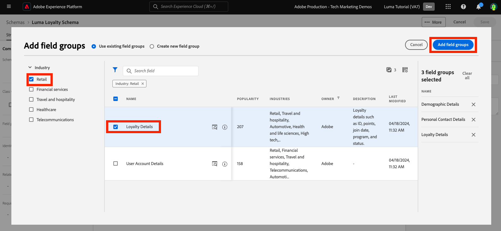

# Dados do modelo em schemas

<!-- 60min -->
Nesta lição, você modelará os dados do Luma em schemas. Esta é uma das lições mais longas do tutorial, então pegue um copo de água e balde!

A padronização e a interoperabilidade são conceitos-chave por trás do Adobe Experience Platform. O Experience Data Model (XDM) é um esforço para padronizar os dados de experiência do cliente e definir esquemas para o gerenciamento da experiência do cliente.

O XDM é uma especificação publicamente documentada projetada para melhorar o poder das experiências digitais. Ele fornece estruturas e definições comuns para qualquer aplicativo usar para se comunicar com os serviços da plataforma. Ao seguir os padrões XDM, todos os dados de experiência do cliente podem ser incorporados a uma representação comum que pode fornecer insights de uma maneira mais rápida e integrada. Você pode obter informações valiosas das ações do cliente, definir públicos-alvo do cliente por meio de segmentos e expressar atributos do cliente para fins de personalização.

O XDM é a estrutura fundamental que permite ao Adobe Experience Cloud, viabilizado por Experience Platform, enviar a mensagem certa para a pessoa certa, no canal certo, no momento certo. A metodologia na qual o Experience Platform é construído, **Sistema XDM** O , o operacionaliza esquemas do Experience Data Model para serem usados pelos serviços da plataforma.

<!--
This seems too lengthy. The video should suffice

Key terms:

* **Schema**: a representation of your data. A schema is comprised of a class and optional field groups and is used to create datasets. A schema includes behavioral attributes, timestamp, identity, attribute definitions, and relationships.
* **XDM Profile Class**: a common schema class used to represent record data
* **XDM ExperienceEvent Class**: a common schema class used to represent time-series data
* **Field group**: allows users to extend reusable fields that contain variables defining one or more attribute intended to be included in a schema or added to a class.
* **Standard Field group**: an open-source Field group built to conform to common industry standards, used to accelerate implementation and support repeatable services operating on the data
* **Data type**: a reusable object with properties in a hierarchical representation. These can be standard types or custom-defined defined types to describe your own data in your own way (for example, a collection of fields that you use to describe your products). Unlike Field groups, data types can be used in schemas regardless of the class.
* **Field**: a field is the lowest level element of a schema. Each field has a name for referencing and a type to identify the type of data that it contains. Field types can include, integer, number, string, Boolean and schema.
-->

**Arquitetos de dados** precisará criar schemas fora deste tutorial, mas **Engenheiros de dados** trabalhará em conjunto com os esquemas criados pelo Arquiteto de dados.

Antes de começar os exercícios, assista a este breve vídeo para saber mais sobre schemas e o Experience Data Model (XDM):
>[!VIDEO](https://video.tv.adobe.com/v/27105?quality=12&learn=on)

>[!TIP]
>
> Para aprofundar a modelagem de dados no Experience Platform, recomendamos seguir o curso [Modelar seus dados de experiência do cliente com o XDM](https://experienceleague.adobe.com/?recommended=ExperiencePlatform-D-1-2021.1.xdm), disponível gratuitamente no Experience League!

## Permissões necessárias

No [Configurar permissões](configure-permissions.md) lição, configure todos os controles de acesso necessários para concluir esta lição.

<!--, specifically:

* Permission items **[!UICONTROL Data Modeling]** > **[!UICONTROL View Schemas]** and **[!UICONTROL Manage Schemas]**
* Permission item **[!UICONTROL Sandboxes]** > `Luma Tutorial`
* User-role access to the `Luma Tutorial Platform` product profile
* Developer-role access to the `Luma Tutorial Platform` product profile (for API)-->


<!--
## Luma's goals
-->

## Criar esquema de fidelidade por meio da interface do usuário

Neste exercício, criaremos um schema para os dados de fidelidade do Luma.

1. Vá para a interface do usuário da Platform e verifique se a sandbox está selecionada.
1. Ir para **[!UICONTROL Esquemas]** na navegação à esquerda
1. Selecione o **[!UICONTROL Criar esquema]** no canto superior direito
1. No menu suspenso , selecione **[!UICONTROL Perfil individual XDM]**, já que faremos a modelagem de atributos de um cliente individual (pontos, status e assim por diante).
   

### Adicionar grupos de campos padrão

Em seguida, será solicitado que você adicione grupos de campos ao esquema. Todos os campos devem ser adicionados a esquemas usando grupos. É possível escolher entre um grande conjunto de grupos de campos padrão do setor fornecido pelo Adobe ou criar os seus próprios. Ao começar a modelar seus próprios dados no Experience Platform, é bom conhecer os grupos de campos padrão do setor fornecidos pelo Adobe. Sempre que possível, é uma prática recomendada usá-los, pois, às vezes, alimentam serviços de downstream, como a API do cliente, o Attribution AI e a Adobe Analytics.

Ao trabalhar com seus próprios dados, um grande passo será determinar qual de seus próprios dados deve ser capturado na Plataforma e como deve ser modelado. Este grande tópico é discutido com mais profundidade no curso [Modelar seus dados de experiência do cliente com o XDM](https://experienceleague.adobe.com/?recommended=ExperiencePlatform-D-1-2021.1.xdm). Neste tutorial, eu só guiarei você pela implementação de alguns schemas predeterminados.

Para adicionar grupos de campos:

1. No **[!UICONTROL Adicionar grupos de campos]** modal, selecione os seguintes grupos de campos:
   1. **[!UICONTROL Detalhes demográficos]** para dados básicos do cliente como nome e data de nascimento
   1. **[!UICONTROL Detalhes de contato pessoal]** para detalhes básicos de contato como endereço de email e número de telefone
1. É possível visualizar os campos que contribuíram no grupo de campos selecionando o ícone no lado direito da linha.
   

1. Verifique a **[!UICONTROL Setor]** > **[!UICONTROL Varejo]** para expor grupos de campos específicos do setor.
1. Selecionar **[!UICONTROL Fidelidade]** para adicionar os campos do programa de fidelidade.
1. Selecionar **[!UICONTROL Adicionar grupo de campos]** para adicionar todos os três grupos de campos ao schema.
   


Agora, use algum tempo para explorar o estado atual do schema. Os grupos de campos adicionaram campos padrão relacionados a uma pessoa, seus detalhes de contato e o status do programa de fidelidade. Esses dois grupos de campos podem ser úteis quando você cria esquemas para os dados de sua própria empresa. Selecione uma linha de grupo de campos específica ou marque a caixa ao lado do nome do grupo de campos para ver como a visualização muda.

Para salvar o schema:

1. Selecione o nó superior do schema.
1. Enter `Luma Loyalty Schema` como **[!UICONTROL Nome de exibição]**.
1. Selecione **[!UICONTROL Salvar]**.
   

>[!NOTE]
>
>Não há problema se um grupo de campos adicionar um campo para um ponto de dados que você não coletar. Por exemplo, &quot;faxPhone&quot; pode ser um campo para o qual o Luma não coleta dados. Isso é bom. Apenas porque um campo é definido no schema não significa que os dados para ele *must* ser assimilado posteriormente.

### Adicionar um grupo de campos personalizado

Agora vamos criar um grupo de campos personalizado.

Enquanto o grupo de campos de fidelidade continha um `loyaltyID` , o Luma gostaria de gerenciar todos os identificadores de sistema em um único grupo para ajudar a garantir a consistência em seus esquemas.

Os grupos de campos devem ser criados no workflow do schema. Para criar o grupo de campos:

1. Selecionar **[!UICONTROL Adicionar]** nos termos do **[!UICONTROL Grupos de campos de esquema]** título
   
1. Selecionar **[!UICONTROL Criar novo grupo de campos]**
1. Use `Luma Identity profile field group` como **[!UICONTROL Nome de exibição]**
1. Use `system identifiers for XDM Individual Profile class` como **[!UICONTROL Descrição]**
1. Selecionar **[!UICONTROL Adicionar grupos de campos]**

   

O novo grupo de campos vazio é adicionado ao esquema. O **[!UICONTROL +]** botões podem ser usados para adicionar novos campos a qualquer local na hierarquia. Em nosso caso, queremos adicionar campos no nível raiz:

1. Selecionar **[!UICONTROL +]** ao lado do nome do schema. Isso adiciona um novo campo no namespace da id do locatário para gerenciar conflitos entre os campos personalizados e quaisquer campos padrão.
1. No **[!UICONTROL Propriedades do campo]** barra lateral adicione os detalhes do novo campo:
   1. **[!UICONTROL Nome do campo]**: `systemIdentifier`
   1. **[!UICONTROL Nome de exibição]**: `System Identifier`
   1. **[!UICONTROL Tipo]**: **[!UICONTROL Objeto]**
   1. Selecionar **[!UICONTROL Aplicar]**

   

Agora, adicione dois campos sob a variável `systemIdentifier` objeto:

1. Primeiro campo
   1. **[!UICONTROL Nome do campo]**: `loyaltyId`
   1. **[!UICONTROL Nome de exibição:]** `Loyalty Id`
   1. **[!UICONTROL Tipo]**: **[!UICONTROL String]**
1. Segundo campo
   1. **[!UICONTROL Nome do campo]**: `crmId`
   1. **[!UICONTROL Nome de exibição]**: `CRM Id`
   1. **[!UICONTROL Tipo]**: **[!UICONTROL String]**

O novo grupo de campos deve ter esta aparência. Selecione o **[!UICONTROL Salvar]** para salvar o schema, mas deixe o schema aberto para o próximo exercício.


## Criar um tipo de dados

Grupos de campos, como o novo `Luma Identity profile field group`, podem ser reutilizadas em outros esquemas, permitindo que você imponha definições de dados padrão em vários sistemas. Mas só podem ser reutilizadas _em esquemas que compartilham uma classe_, nesse caso, a classe Perfil individual XDM.

O tipo de dados é outra construção de vários campos que pode ser reutilizada em schemas _em várias classes_. Vamos converter nosso novo `systemIdentifier` em um tipo de dados:

Com o `Luma Loyalty Schema` ainda aberto, selecione a `systemIdentifier` e selecione  **[!UICONTROL Converter em novo tipo de dados]**


Se você **[!UICONTROL Cancelar]** do esquema e navegue até a variável **[!UICONTROL Tipos de dados]** , você verá seu tipo de dados recém-criado. Usaremos esse tipo de dados posteriormente na lição.


## Criar esquema CRM por meio da API

Agora criaremos um schema usando a API .

>[!TIP]
>
> Se preferir ignorar o exercício da API, é possível criar o seguinte schema usando o método da interface do usuário:
>
> 1. Use o [!UICONTROL Perfil individual XDM] classe
> 1. Nomeie-o `Luma CRM Schema`
> 1. Use os seguintes grupos de campos: Detalhes demográficos, Detalhes de contato pessoal e grupo de campos de perfil de identidade Luma


Primeiro criamos o schema vazio:

1. Abrir [!DNL Postman]
1. Se você não tiver feito uma solicitação nas últimas 24 horas, seus tokens de autorização provavelmente expiraram. Abrir a solicitação **[!DNL Adobe I/O Access Token Generation > Local Signing (Non-production use-only) > IMS: JWT Generate + Auth via User Token]** e selecione **Enviar** para solicitar novos tokens de acesso e JWT.
1. Abra as variáveis de ambiente e altere o valor de **CONTAINER_ID** from `global` para `tenant`. Lembre-se, você deve usar `tenant` sempre que quiser interagir com seus próprios elementos personalizados no Platform, como criar um schema.
1. Selecione **Salvar**
   
1. Abrir a solicitação **[!DNL Schema Registry API > Schemas > Create a new custom schema.]**
1. Abra o **Corpo** e cole o seguinte código e selecione **Enviar** para fazer a chamada da API . Essa chamada cria um novo schema usando o mesmo `XDM Individual Profile` classe base:

   ```json
   {
     "type": "object",
     "title": "Luma CRM Schema",
     "description": "Schema for CRM data of Luma Retail ",
     "allOf": [{
       "$ref": "https://ns.adobe.com/xdm/context/profile"
     }]
   }
   ```

   >[!NOTE]
   >
   >As referências de namespace neste e nas amostras de código subsequentes (por exemplo, `https://ns.adobe.com/xdm/context/profile`), pode ser obtida usando a opção listar chamadas de API com o **[!DNL CONTAINER_ID]** e aceitar o cabeçalho definido para os valores corretos. Alguns também são facilmente acessíveis na interface do usuário do .

1. Você deveria pegar um `201 Created` response
1. Copiar `meta:altId` do corpo da Resposta. Usá-lo-emos mais tarde noutro exercício.
   

1. O novo schema deve estar visível na interface do usuário, mas sem nenhum grupo de campos
   

>[!NOTE]
>
> O `meta:altId` ou a id do schema também pode ser obtida fazendo a solicitação da API **[!DNL Schema Registry API > Schemas > Retrieve a list of schemas within the specified container.]** com o **[!UICONTROL CONTAINER_ID]** defina como `tenant` e um cabeçalho accept `application/vnd.adobe.xdm+json`.

>[!TIP]
>
> Problemas comuns com esta chamada e possíveis correções:
>
> * Nenhum token de autenticação: Execute o **IMS: JWT Generate + Auth via Token de usuário** chamada para gerar novos tokens
> * `401: Not Authorized to PUT/POST/PATCH/DELETE for this path : /global/schemas/`: Atualize o **CONTAINER_ID** variável de ambiente de `global` para `tenant`
> * `403: PALM Access Denied. POST access is denied for this resource from access control`: Verifique as permissões do usuário no Admin Console


### Adicionar grupos de campos padrão

Agora é hora de adicionar os grupos de campos ao schema:

1. Em [!DNL Postman], Abra a solicitação **[!DNL Schema Registry API > Schemas > Update one or more attributes of a custom schema specified by ID.]**
1. No **Params** cole a guia `meta:altId` da resposta anterior como `SCHEMA_ID`
1. Abra a guia Corpo , cole o seguinte código e selecione **Enviar** para fazer a chamada da API . Essa chamada adiciona os grupos de campos padrão ao seu `Luma CRM Schema`:

   ```json
   [{
       "op": "add",
       "path": "/allOf/-",
       "value": {
         "$ref": "https://ns.adobe.com/xdm/context/profile-personal-details"
       }
     },
     {
       "op": "add",
       "path": "/allOf/-",
       "value": {
         "$ref": "https://ns.adobe.com/xdm/context/profile-person-details"
       }
     }
   ]
   ```

1. Você deve obter um status 200 OK para a resposta e os grupos de campos devem estar visíveis como parte do esquema na interface do usuário

   


### Adicionar grupo de campos personalizado

Agora vamos adicionar nosso `Luma Identity profile field group` ao schema. Primeiro, precisamos localizar a id do novo grupo de campos, usando uma API de lista:

1. Abrir a solicitação **[!DNL Schema Registry API > Field groups > Retrieve a list of field groups within the specified container.]**
1. Selecione o **Enviar** botão para recuperar uma lista de todos os grupos de campos personalizados em sua conta
1. Pegue o `$id` do `Luma Identity profile field group` (o seu será diferente do valor desta captura de tela)
   
1. Abrir a solicitação **[!DNL Schema Registry API > Schemas > Update one or more attributes of a custom schema specified by ID.]** again
1. O **Params** A guia ainda deve ter a variável `$id` do esquema
1. Abra o **Corpo** e cole o seguinte código, substituindo o `$ref` com o valor `$id` do seu `Luma Identity profile field group`:

   ```json
   [{
     "op": "add",
     "path": "/allOf/-",
     "value": {
       "$ref": "REPLACE_WITH_YOUR_OWN_FIELD_GROUP_ID"
     }
   }]
   ```

1. Selecionar **Enviar**

   

Verifique se o grupo de campos foi adicionado ao schema verificando a resposta da API e na interface.

## Criar Esquema de Eventos de Compra Offline

Agora vamos criar um schema baseado no **[!UICONTROL ExperiênciaEvento XDM]** classe para os dados de compra offline do Luma. Como você está se familiarizando com a interface do usuário do editor de esquema, reduzirei o número de capturas de tela nas instruções:

1. Crie um esquema com a **[!UICONTROL ExperiênciaEvento XDM]** classe
1. Adicionar o grupo de campos padrão **[!UICONTROL Detalhes de comércio]** para capturar detalhes comuns do pedido. Gaste alguns minutos explorando os objetos dentro.
1. Procurar por `Luma Identity profile field group`. Não está disponível! Lembre-se de que os grupos de campos estão vinculados a uma classe e, como estamos usando uma classe diferente para esse schema, não podemos usá-lo. Precisamos adicionar um novo grupo de campos para a classe XDM ExperienceEvent contendo os campos de identidade. Nosso tipo de dados facilitará muito isso!
1. Selecione o **[!UICONTROL Criar novo grupo de campos]** botão de opção
1. Insira o **[!UICONTROL Nome de exibição]** as `Luma Identity ExperienceEvent field group` e selecione o **[!UICONTROL Adicionar grupos de campos]** botão
1. Certifique-se de que o **[!UICONTROL +]** os botões aparecem no **[!UICONTROL Estrutura]** para que você possa adicionar novos campos
1. Em **[!UICONTROL Estrutura]** seção , selecione **[!UICONTROL +]** no nível superior do esquema
1. Como **[!UICONTROL Nome do campo]**, insira `systemIdentifier`
1. Como **[!UICONTROL Nome de exibição]**, insira `System Identifier`
1. Como **[!UICONTROL Tipo]**, selecione **Identificador do sistema** que é o tipo de dados personalizado criado anteriormente
1. Selecione o **[!UICONTROL Aplicar]** botão
1. Dê um nome ao esquema `Luma Offline Purchase Events Schema`
1. Selecione o botão **[!UICONTROL Salvar]**

Observe como o tipo de dados adicionou todos os campos!


Além disso, selecione **[!UICONTROL ExperiênciaEvento XDM]** nos termos do **[!UICONTROL Classe]** e inspecione alguns dos campos contribuídos por esta classe. Observe que os campos _id e timestamp são necessários ao usar a classe XDM ExperienceEvent — esses campos devem ser preenchidos para cada registro que você assimilar ao usar este esquema:


## Criar esquema de eventos da Web

Agora vamos criar mais um schema para os dados do site do Luma. Por este ponto, você deve ser um especialista em criar schemas! Crie o seguinte schema com essas propriedades

| Propriedade | Valor |
|---------------|-----------------|
| Classe | ExperiênciaEvento XDM |
| Grupo de campos | Mistura AEP Web SDK ExperienceEvent |
| Grupo de campos | Evento de experiência do consumidor |
| Nome do esquema | Esquema de eventos da Web Luma |

Selecione o **[!UICONTROL Evento de experiência do consumidor]** grupo de campos. Este grupo de campos contém os objetos commerce e productListItems que também estavam em [!UICONTROL Detalhes de comércio]. De fato [!UICONTROL Evento de experiência do consumidor] é uma combinação de vários outros grupos de campos padrão que também estão disponíveis separadamente. [!UICONTROL Mistura AEP Web SDK ExperienceEvent] grupo de campos também contém outros grupos de campos, incluindo alguns dos mesmos em [!UICONTROL Evento de experiência do consumidor]. Felizmente, eles se misturam perfeitamente.

Observe que não adicionamos a variável `Luma Identity ExperienceEvent field group` para este schema. Isso ocorre porque o SDK da Web tem uma maneira diferente de coletar identidades. Se você selecionar a variável **[!UICONTROL ExperiênciaEvento XDM]** na **[!UICONTROL Composição]** do editor de esquema, você observará que um dos campos adicionados por padrão é chamado **[!UICONTROL IdentityMap]**. [!DNL IdentityMap] é usada por vários aplicativos Adobe para vincular à Platform. Você verá como as identidades são enviadas para a plataforma pelo identityMap na lição de assimilação de streaming.


## Criar esquema de catálogo de produtos

Ao usar a variável  [!UICONTROL Detalhes de comércio] e [!UICONTROL Evento de experiência do consumidor] grupos de campos, o Luma relata alguns detalhes de eventos relacionados ao produto por meio do tipo de dados productListItems padrão. Mas também têm campos de detalhes adicionais do produto que desejam enviar para a Platform. Em vez de capturar todos esses campos em seus sistemas de ponto de venda e comércio eletrônico, a Luma preferiria assimilar esses campos diretamente de seu sistema de catálogo de produtos. Uma &quot;relação de schema&quot; permite definir uma relação entre dois schemas para fins de classificação ou pesquisas. O Luma usará uma relação para classificar os detalhes do produto. Começaremos o processo agora e o concluiremos no final da próxima lição.

>[!NOTE]
>
>Se você for um cliente existente do Analytics ou do Target, a classificação de entidades com relações de esquema é semelhante às classificações de SAINT ou ao upload do catálogo de produtos para o Recommendations

Primeiro, devemos criar um schema para o catálogo de produtos do Luma usando uma classe personalizada:

1. Selecione o **[!UICONTROL Criar esquema]** e selecione o **[!UICONTROL Procurar]** na lista suspensa
   
1. Selecione o **[!UICONTROL Criar nova classe]** botão de opção
1. Nomeie-o `Luma Product Catalog Class`
1. Deixe o **[!UICONTROL Comportamento]** as **[!UICONTROL Registro]**
1. Selecione o **[!UICONTROL Atribuir classe]** botão
   
1. Crie um novo [!UICONTROL grupo de campos] chamado `Luma Product Catalog field group` com os seguintes campos:
   1. productName: Nome do produto: String
   1. productCategory: Categoria do produto: String
   1. productColor: Cor do produto: String
   1. productSku: SKU do produto: String | Obrigatório
   1. productSize: Tamanho do produto: String
   1. productPrice: Preço do produto: Duplo
1. Nomeie o schema `Luma Product Catalog Schema` (certifique-se de atualizar o campo correto e não atualizar o nome da classe)
1. **[!UICONTROL Salvar]** o schema

O novo schema deve ser semelhante a este. Observe como a função `productSku` é listado na variável [!UICONTROL Campos obrigatórios] seção:


A próxima etapa é definir a relação entre os dois esquemas ExperienceEvent e o `Luma Product Catalog Schema`Contudo, há alguns passos adicionais que temos de dar na próxima lição antes de o podermos fazer.


## Recursos adicionais

* [Documentação do sistema do Experience Data Model (XDM)](https://experienceleague.adobe.com/docs/experience-platform/xdm/home.html?lang=pt-BR)
* [API do Registro de Schema](https://www.adobe.io/experience-platform-apis/references/schema-registry/)


Agora que você tem seus esquemas, é possível [mapear identidades](map-identities.md)!
