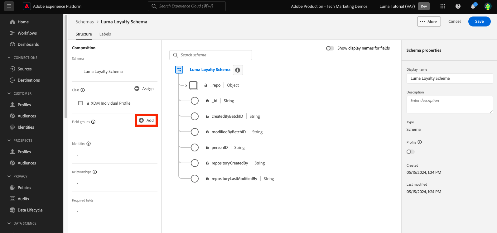

# Dados de modelo em esquemas

<!-- 60min -->
Nesta lição, você modelará os dados do Luma em esquemas. Esta é uma das lições mais longas do tutorial, então pegue um copo de água e aperte a fivela!

A padronização e a interoperabilidade são os principais conceitos por trás da Adobe Experience Platform. O Experience Data Model (XDM) é um esforço para padronizar os dados de experiência do cliente e definir esquemas para o gerenciamento da experiência do cliente.

O XDM é uma especificação documentada publicamente projetada para melhorar o potencial das experiências digitais. Ela fornece estruturas e definições comuns para qualquer aplicativo usar na comunicação com os serviços da plataforma. Seguindo os padrões XDM, todos os dados de experiência do cliente podem ser incorporados a uma representação comum que pode fornecer insights de maneira mais rápida e integrada. Você pode obter insights valiosos das ações do cliente, definir públicos-alvo do cliente por meio de segmentos e expressar atributos do cliente para fins de personalização.

O XDM é a estrutura fundamental que permite ao Adobe Experience Cloud, acionado pelo Experience Platform, enviar a mensagem certa à pessoa certa, no canal direito, no momento exato. A metodologia em que o Experience Platform é construído, **Sistema XDM** O, operacionaliza esquemas do Experience Data Model para uso pelos serviços da plataforma.

<!--
This seems too lengthy. The video should suffice

Key terms:

* **Schema**: a representation of your data. A schema is comprised of a class and optional field groups and is used to create datasets. A schema includes behavioral attributes, timestamp, identity, attribute definitions, and relationships.
* **XDM Profile Class**: a common schema class used to represent record data
* **XDM ExperienceEvent Class**: a common schema class used to represent time-series data
* **Field group**: allows users to extend reusable fields that contain variables defining one or more attribute intended to be included in a schema or added to a class.
* **Standard Field group**: an open-source Field group built to conform to common industry standards, used to accelerate implementation and support repeatable services operating on the data
* **Data type**: a reusable object with properties in a hierarchical representation. These can be standard types or custom-defined defined types to describe your own data in your own way (for example, a collection of fields that you use to describe your products). Unlike Field groups, data types can be used in schemas regardless of the class.
* **Field**: a field is the lowest level element of a schema. Each field has a name for referencing and a type to identify the type of data that it contains. Field types can include, integer, number, string, Boolean and schema.
-->

**Arquitetos de dados** precisará criar esquemas fora deste tutorial, mas **Engenheiros de dados** O funcionará em conjunto com os esquemas criados pelo Arquiteto de dados.

Antes de começar os exercícios, assista a este vídeo curto para saber mais sobre esquemas e o Experience Data Model (XDM):
>[!VIDEO](https://video.tv.adobe.com/v/27105?learn=on)

>[!TIP]
>
> Para aprofundar a modelagem de dados no Experience Platform, recomendamos fazer o curso [Modelar seus dados de experiência do cliente com o XDM](https://experienceleague.adobe.com/?recommended=ExperiencePlatform-D-1-2021.1.xdm&amp;lang=pt-BR), disponível gratuitamente no Experience League!

## Permissões necessárias

No [Configurar permissões](configure-permissions.md) você configura todos os controles de acesso necessários para concluir esta lição.

<!--, specifically:

* Permission items **[!UICONTROL Data Modeling]** > **[!UICONTROL View Schemas]** and **[!UICONTROL Manage Schemas]**
* Permission item **[!UICONTROL Sandboxes]** > `Luma Tutorial`
* User-role access to the `Luma Tutorial Platform` product profile
* Developer-role access to the `Luma Tutorial Platform` product profile (for API)-->


<!--
## Luma's goals
-->

## Criar esquema de fidelidade por meio da interface

Neste exercício, criaremos um esquema para os dados de fidelidade do Luma.

1. Vá para a interface do usuário da Platform e verifique se sua sandbox está selecionada.
1. Ir para **[!UICONTROL Esquemas]** na navegação à esquerda
1. Clique no botão **[!UICONTROL Criar esquema]** no canto superior direito
1. No menu suspenso, selecione **[!UICONTROL Perfil individual XDM]**, já que modelaremos atributos de um cliente individual (pontos, status e assim por diante).
   

### Adicionar grupos de campos padrão

Em seguida, será solicitado que você adicione grupos de campos ao esquema. Todos os campos devem ser adicionados a esquemas que usam grupos. Você pode escolher entre um grande conjunto de grupos de campo padrão do setor fornecidos pelo Adobe ou criar os seus próprios. À medida que você começa a modelar seus próprios dados no Experience Platform, é bom se familiarizar com os grupos de campo padrão do setor fornecidos pelo Adobe. Sempre que possível, é uma prática recomendada usá-los, pois eles às vezes alimentam serviços downstream, como IA do cliente, Attribution AI e Adobe Analytics.

Ao trabalhar com seus próprios dados, um grande passo será determinar quais de seus próprios dados devem ser capturados na Platform e como eles devem ser modelados. Esse grande tópico é discutido com mais detalhes no curso [Modelar seus dados de experiência do cliente com o XDM](https://experienceleague.adobe.com/?recommended=ExperiencePlatform-D-1-2021.1.xdm&amp;lang=pt-BR). Neste tutorial, eu vou apenas guiá-lo pela implementação de alguns esquemas predeterminados.

Para adicionar grupos de campos:

1. No **[!UICONTROL Adicionar grupos de campos]** , selecione os seguintes grupos de campos:
   1. **[!UICONTROL Detalhes demográficos]** para dados básicos do cliente, como nome e data de nascimento
   1. **[!UICONTROL Detalhes de contato pessoal]** para obter detalhes básicos de contato, como endereço de email e número de telefone
1. Você pode visualizar os campos de contribuição no grupo de campos selecionando o ícone no lado direito da linha.
   

1. Verifique a **[!UICONTROL Setor]** > **[!UICONTROL Varejo]** para expor grupos de campos específicos do setor.
1. Selecionar **[!UICONTROL Fidelidade]** para adicionar os campos do programa de fidelidade.
1. Selecione **[!UICONTROL Adicionar grupo de campos]** para adicionar todos os três grupos de campos ao esquema.
   


Agora reserve um tempo para explorar o estado atual do esquema. Os grupos de campos adicionaram campos padrão relacionados a uma pessoa, seus detalhes de contato e status do programa de fidelidade. Esses dois grupos de campos podem ser úteis ao criar esquemas para os dados da sua própria empresa. Selecione uma linha de grupo de campos específica ou marque a caixa ao lado do nome do grupo de campos para ver como a visualização é alterada.

Para salvar o esquema:

1. Selecione o nó superior do esquema.
1. Enter `Luma Loyalty Schema` como o **[!UICONTROL Nome de exibição]**.
1. Selecione **[!UICONTROL Salvar]**.
   

>[!NOTE]
>
>Não há problema se um grupo de campos adicionar um campo para um ponto de dados que você não coleta. Por exemplo, &quot;faxPhone&quot; pode ser um campo para o qual a Luma não coleta dados. Tudo bem. O fato de um campo estar definido no esquema não significa que os dados dele *deve* ser assimilado posteriormente.

### Adicionar um grupo de campos personalizado

Agora vamos criar um grupo de campos personalizado.

Embora o grupo de campos de fidelidade contivesse uma `loyaltyID` A Luma gostaria de gerenciar todos os identificadores do sistema em um único grupo para ajudar a garantir a consistência em seus esquemas.

Os grupos de campos devem ser criados no fluxo de trabalho de esquema. Para criar o grupo de campos:

1. Selecionar **[!UICONTROL Adicionar]** no **[!UICONTROL Grupos de campos de esquema]** cabeçalho
   
1. Selecione **[!UICONTROL Criar novo grupo de campos]**
1. Uso `Luma Identity profile field group` como o **[!UICONTROL Nome de exibição]**
1. Uso `system identifiers for XDM Individual Profile class` como o **[!UICONTROL Descrição]**
1. Selecione **[!UICONTROL Adicionar grupos de campos]**
   

O novo grupo de campos vazio é adicionado ao esquema. A variável **[!UICONTROL +]** botões podem ser usados para adicionar novos campos a qualquer local na hierarquia. Em nosso caso, queremos adicionar campos no nível raiz:

1. Selecione **[!UICONTROL +]** ao lado do nome do esquema. Isso adiciona um novo campo no namespace de id do locatário para gerenciar conflitos entre os campos personalizados e quaisquer campos padrão.
1. No **[!UICONTROL Propriedades do campo]** adicione os detalhes do novo campo:
   1. **[!UICONTROL Nome do campo]**: `systemIdentifier`
   1. **[!UICONTROL Nome de exibição]**: `System Identifier`
   1. **[!UICONTROL Tipo]**: **[!UICONTROL Objeto]**
   1. Selecione **[!UICONTROL Aplicar]**

   

Agora adicione dois campos sob `systemIdentifier` objeto:

1. Primeiro campo
   1. **[!UICONTROL Nome do campo]**: `loyaltyId`
   1. **[!UICONTROL Nome de exibição:]** `Loyalty Id`
   1. **[!UICONTROL Tipo]**: **[!UICONTROL String]**
1. Segundo campo
   1. **[!UICONTROL Nome do campo]**: `crmId`
   1. **[!UICONTROL Nome de exibição]**: `CRM Id`
   1. **[!UICONTROL Tipo]**: **[!UICONTROL String]**

Seu novo grupo de campos deve ter esta aparência. Selecione o **[!UICONTROL Salvar]** botão para salvar seu esquema, mas deixe o esquema aberto para o próximo exercício.


## Criar um tipo de dados

Grupos de campos, como o novo `Luma Identity profile field group`, podem ser reutilizados em outros esquemas, permitindo que você aplique definições de dados padrão em vários sistemas. Mas elas só podem ser reutilizadas _em esquemas que compartilham uma classe_, nesse caso, a classe Perfil individual XDM.

O tipo de dados é outra construção de vários campos que pode ser reutilizada em esquemas _em várias classes_. Vamos converter o nosso novo `systemIdentifier` em um tipo de dados:

Com o `Luma Loyalty Schema` ainda aberto, selecione a variável `systemIdentifier` objeto e selecione  **[!UICONTROL Converter em novo tipo de dados]**


Se você **[!UICONTROL Cancelar]** fora do esquema e navegue até o **[!UICONTROL Tipos de dados]** , você verá seu tipo de dados recém-criado. Usaremos esse tipo de dados posteriormente na lição.


## Criar esquema do CRM por meio da API

Agora criaremos um esquema usando a API.

>[!TIP]
>
> Se preferir ignorar o exercício de API, você poderá criar o seguinte schema usando o método de interface do usuário:
>
> 1. Use o [!UICONTROL Perfil individual XDM] classe
> 1. Nomeie-a como `Luma CRM Schema`
> 1. Use os seguintes grupos de campos: Detalhes demográficos, Detalhes de contato pessoal e grupo de campos de perfil de identidade da Luma

Primeiro, criamos o schema vazio:

1. Abrir [!DNL Postman]
1. Se você não tiver um token de acesso, abra a solicitação **[!DNL OAuth: Request Access Token]** e selecione **Enviar** para solicitar um novo token de acesso.
1. Abra as variáveis de ambiente e altere o valor de **CONTAINER_ID** de `global` para `tenant`. Lembre-se, você deve usar `tenant` sempre que quiser interagir com seus próprios elementos personalizados na Platform, como criar um esquema.
1. Selecione **Salvar**
   
1. Abrir a solicitação **[!DNL Schema Registry API > Schemas > Create a new custom schema.]**
1. Abra o **Corpo** e cole o código a seguir e selecione **Enviar** para fazer a chamada de API. Esta chamada cria um novo esquema usando a mesma `XDM Individual Profile` classe base:

   ```json
   {
     "type": "object",
     "title": "Luma CRM Schema",
     "description": "Schema for CRM data of Luma Retail ",
     "allOf": [{
       "$ref": "https://ns.adobe.com/xdm/context/profile"
     }]
   }
   ```

   >[!NOTE]
   >
   >O namespace faz referência a esta e às amostras de código subsequentes (por exemplo, `https://ns.adobe.com/xdm/context/profile`), pode ser obtido usando chamadas de API de lista com o **[!DNL CONTAINER_ID]** e aceite o cabeçalho definido com os valores corretos. Alguns também são facilmente acessíveis na interface do usuário.

1. Você deve obter um `201 Created` resposta
1. Copiar `meta:altId` do Corpo de resposta. Usaremos depois em outro exercício.
   

1. O novo schema deve estar visível na interface do usuário, mas sem grupos de campos
   

>[!NOTE]
>
> A variável `meta:altId` ou a id do esquema também pode ser obtida fazendo a solicitação da API **[!DNL Schema Registry API > Schemas > Retrieve a list of schemas within the specified container.]** com o **[!UICONTROL CONTAINER_ID]** definir como `tenant` e um cabeçalho accept `application/vnd.adobe.xdm+json`.

>[!TIP]
>
> Problemas comuns com esta chamada e prováveis correções:
>
> * Sem token de autenticação: execute o **OAuth: solicitar token de acesso** solicitação para gerar um novo token
> * `401: Not Authorized to PUT/POST/PATCH/DELETE for this path : /global/schemas/`: atualize o **CONTAINER_ID** variável de ambiente de `global` para `tenant`
> * `403: PALM Access Denied. POST access is denied for this resource from access control`: verifique suas permissões de usuário no Admin Console

### Adicionar grupos de campos padrão

Agora é hora de adicionar os grupos de campos ao esquema:

1. Entrada [!DNL Postman], Abrir a solicitação **[!DNL Schema Registry API > Schemas > Update one or more attributes of a custom schema specified by ID.]**
1. No **Params** , cole a `meta:altId` valor da resposta anterior como a `SCHEMA_ID`
1. Abra a guia Corpo, cole o seguinte código e selecione **Enviar** para fazer a chamada de API. Esta chamada adiciona os grupos de campos padrão ao `Luma CRM Schema`:

   ```json
   [{
       "op": "add",
       "path": "/allOf/-",
       "value": {
         "$ref": "https://ns.adobe.com/xdm/context/profile-personal-details"
       }
     },
     {
       "op": "add",
       "path": "/allOf/-",
       "value": {
         "$ref": "https://ns.adobe.com/xdm/context/profile-person-details"
       }
     }
   ]
   ```

1. Você deve obter um status 200 OK para a resposta e os grupos de campos devem estar visíveis como parte do esquema na interface

   


### Adicionar grupo de campos personalizado

Agora, vamos adicionar nossa `Luma Identity profile field group` ao esquema. Primeiro, precisamos encontrar a ID do novo grupo de campos, usando uma API de lista:

1. Abrir a solicitação **[!DNL Schema Registry API > Field groups > Retrieve a list of field groups within the specified container.]**
1. Selecione o **Enviar** botão para recuperar uma lista de todos os grupos de campos personalizados em sua conta
1. Pegue o `$id` valor de `Luma Identity profile field group` (o seu será diferente do valor nesta captura de tela)
   
1. Abrir a solicitação **[!DNL Schema Registry API > Schemas > Update one or more attributes of a custom schema specified by ID.]** novamente
1. A variável **Params** ainda deve ter a `$id` do esquema
1. Abra o **Corpo** e cole o seguinte código, substituindo o `$ref` valor com o `$id` do seu próprio `Luma Identity profile field group`:

   ```json
   [{
     "op": "add",
     "path": "/allOf/-",
     "value": {
       "$ref": "REPLACE_WITH_YOUR_OWN_FIELD_GROUP_ID"
     }
   }]
   ```

1. Selecionar **Enviar**
   

Verifique se o grupo de campos foi adicionado ao esquema verificando a resposta da API e na interface.

## Criar esquema de eventos de compra offline

Agora vamos criar um esquema com base na variável **[!UICONTROL XDM ExperienceEvent]** classe para dados de compra offline do Luma. Como você agora está se familiarizando com a interface do usuário do editor de esquemas, reduzirei o número de capturas de tela nas instruções:

1. Crie um esquema com o **[!UICONTROL XDM ExperienceEvent]** classe
1. Adicionar o grupo de campos padrão **[!UICONTROL Detalhes do comércio]** para capturar detalhes comuns da ordem. Passe alguns minutos explorando os objetos internos.
1. Pesquisar por `Luma Identity profile field group`. Não está disponível! Lembre-se de que os grupos de campos estão vinculados a uma classe e, como estamos usando uma classe diferente para este esquema, não podemos usá-lo. Precisamos adicionar um novo grupo de campos para a classe XDM ExperienceEvent que contém os campos de identidade. Nosso tipo de dados tornará isso realmente fácil!
1. Selecione o **[!UICONTROL Criar novo grupo de campos]** botão de opção
1. Insira o **[!UICONTROL Nome de exibição]** as `Luma Identity ExperienceEvent field group` e selecione o **[!UICONTROL Adicionar grupos de campos]** botão
1. Verifique se **[!UICONTROL +]** botões são exibidos em no **[!UICONTROL Estrutura]** para adicionar novos campos
1. Entrada **[!UICONTROL Estrutura]** , selecione **[!UICONTROL +]** no nível superior do esquema
1. Como a variável **[!UICONTROL Nome do campo]**, insira `systemIdentifier`
1. Como a variável **[!UICONTROL Nome de exibição]**, insira `System Identifier`
1. Como a variável **[!UICONTROL Tipo]**, selecione **Identificador do sistema** que é o tipo de dados personalizado que você criou anteriormente
1. Selecione o **[!UICONTROL Aplicar]** botão
1. Dê um nome ao esquema `Luma Offline Purchase Events Schema`
1. Selecione o botão **[!UICONTROL Salvar]**

Observe como o tipo de dados adicionou todos os campos.


Além disso, **[!UICONTROL XDM ExperienceEvent]** no **[!UICONTROL Classe]** e inspecione alguns dos campos contribuídos por essa classe. Observe que os campos _id e carimbo de data e hora são necessários ao usar a classe XDM ExperienceEvent — esses campos devem ser preenchidos para cada registro assimilado ao usar esse esquema:


## Criar esquema de eventos da Web

Agora vamos criar mais um schema para os dados do site do Luma. Até agora, você deve ser um especialista na criação de esquemas! Crie o seguinte esquema com essas propriedades

| Propriedade | Valor |
|---------------|-----------------|
| Classe | XDM ExperienceEvent |
| Grupo de campos | Mixin ExperienceEvent do SDK da Web da AEP |
| Grupo de campos | Evento de experiência do consumidor |
| Nome do esquema | Esquema de eventos da Web da Luma |

Selecione o **[!UICONTROL Evento de experiência do consumidor]** grupo de campos. Este grupo de campos contém os objetos de comércio e productListItems que também estavam [!UICONTROL Detalhes do comércio]. Realmente [!UICONTROL Evento de experiência do consumidor] é uma combinação de vários outros grupos de campos padrão que também estão disponíveis separadamente. [!UICONTROL Mixin ExperienceEvent do SDK da Web da AEP] grupo de campos também contém outros grupos de campos, incluindo alguns dos mesmos em [!UICONTROL Evento de experiência do consumidor]. Felizmente, eles se misturam perfeitamente.

Observe que não adicionamos o `Luma Identity ExperienceEvent field group` para este esquema. Isso ocorre porque o SDK da Web tem uma maneira diferente de coletar identidades. Se você selecionar a variável **[!UICONTROL XDM ExperienceEvent]** na classe **[!UICONTROL Composição]** do editor de esquemas, você observará que um dos campos que ele adiciona por padrão é chamado de **[!UICONTROL IdentityMap]**. [!DNL IdentityMap] é usado por vários aplicativos Adobe para vincular à Platform. Você verá como as identidades são enviadas para a Platform via identityMap na lição de assimilação de streaming.


## Criar esquema do catálogo de produtos

Ao usar o  [!UICONTROL Detalhes do comércio] e [!UICONTROL Evento de experiência do consumidor] grupos de campos, o Luma relata alguns detalhes de eventos relacionados ao produto por meio do tipo de dados padrão productListItems. Mas eles também têm campos adicionais de detalhes do produto que gostariam de enviar para a Platform. Em vez de capturar todos esses campos em seus sistemas de ponto de venda e comércio eletrônico, a Luma preferiria assimilar esses campos diretamente do sistema de catálogo de produtos. Uma &quot;relação de esquema&quot; permite definir uma relação entre dois esquemas para fins de classificação ou pesquisas. A Luma usará um relacionamento para classificar os detalhes do produto. Começaremos o processo agora e o concluiremos no final da próxima lição.

>[!NOTE]
>
>Se você for um cliente existente do Analytics ou do Target, classificar entidades com relacionamentos de esquema é análogo às classificações de SAINT ou fazer upload do catálogo de produtos para o Recommendations

Primeiro, devemos criar um esquema para o catálogo de produtos da Luma usando uma classe personalizada:

1. Selecione o **[!UICONTROL Criar esquema]** e selecione o botão **[!UICONTROL Procurar]** opção na lista suspensa
   
1. Selecione o **[!UICONTROL Criar nova classe]** botão de opção
1. Nomeie-a como `Luma Product Catalog Class`
1. Deixe a **[!UICONTROL Comportamento]** as **[!UICONTROL Gravar]**
1. Selecione o **[!UICONTROL Atribuir classe]** botão
   
1. Criar um novo [!UICONTROL grupo de campos] chamado `Luma Product Catalog field group` com os seguintes campos:
   1. productName: Nome do produto: String
   1. productCategory: Categoria do produto: String
   1. productColor: Cor do produto: String
   1. productSku: SKU do produto: Cadeia de caracteres | Obrigatório
   1. productSize: Product Size: String
   1. productPrice: Preço do produto: Duplo
1. Nomeie o esquema `Luma Product Catalog Schema` (certifique-se de atualizar o campo correto e não atualizar o nome da classe)
1. **[!UICONTROL Salvar]** o schema

O novo esquema deve ter esta aparência. Observe como `productSku` está listado no campo [!UICONTROL Campos obrigatórios] seção:


A próxima etapa é definir a relação entre os dois esquemas ExperienceEvent e o `Luma Product Catalog Schema`No entanto, há alguns passos adicionais que devemos dar na próxima lição antes de podermos fazer isso.


## Recursos adicionais

* [Documentação do sistema do Experience Data Model (XDM)](https://experienceleague.adobe.com/docs/experience-platform/xdm/home.html?lang=pt-BR)
* [API do registro de esquema](https://www.adobe.io/experience-platform-apis/references/schema-registry/)


Agora que tem seus esquemas, você pode [mapear identidades](map-identities.md)!
