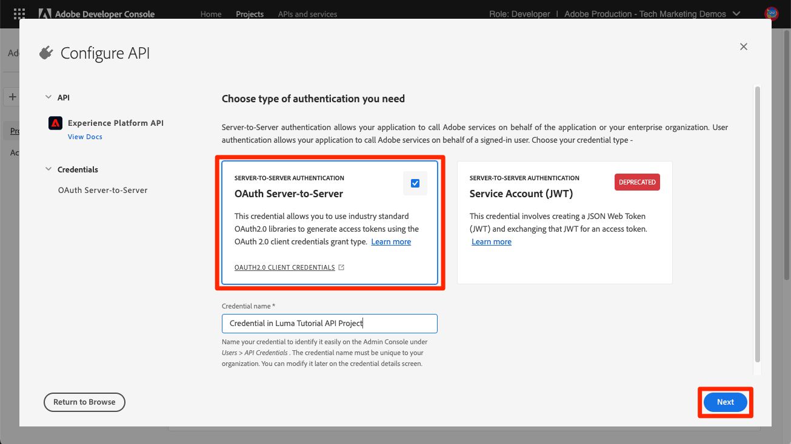

# Configurar o Developer Console e o [!DNL Postman]

<!--30min-->

Nesta lição, você configurará um projeto no Adobe Developer Console e baixará [!DNL Postman] coleções para poder começar a usar APIs da plataforma.

Para concluir os exercícios de API neste tutorial, [baixe o aplicativo Postman para seu sistema operacional.](https://www.postman.com/downloads/) Embora não seja necessário para usar APIs de Experience Platform, o Postman facilita os fluxos de trabalho de API, e o Adobe Experience Platform fornece dezenas de coleções do Postman para ajudar você a executar chamadas de API e saber como elas operam. O restante deste tutorial presume algum conhecimento prático do Postman. Para obter ajuda, consulte a [documentação do Postman](https://learning.postman.com/).

A Platform é criada como API. Embora as opções de interface também existam para todas as principais tarefas, você pode querer usar a API da plataforma em algum momento. Por exemplo, para assimilar dados, mover itens entre sandboxes, automatizar tarefas de rotina ou usar novos recursos da Platform antes que a interface do usuário tenha sido criada.

Talvez os **Arquitetos de dados** e os **Engenheiros de dados** precisem usar a API da plataforma fora deste tutorial.

## Permissões necessárias

Na lição [Configurar Permissões](configure-permissions.md), você configura todos os controles de acesso necessários para concluir esta lição.

<!--
* Permission item Sandboxes > `Luma Tutorial`
* Developer-role access to the `Luma Tutorial Platform` product profile
-->

## Configurar o Adobe Developer Console

O Adobe Developer Console é o destino do desenvolvedor para acessar APIs e SDKs do Adobe, ouvir eventos quase em tempo real, executar funções no tempo de execução ou criar plug-ins ou aplicativos App Builder. Você o usará para acessar a API Experience Platform. Para obter mais detalhes, consulte a [documentação do Adobe Developer Console](https://www.adobe.io/apis/experienceplatform/console/docs.html)

1. Crie uma pasta no computador local chamada `Luma Tutorial Assets` para arquivos usados no tutorial.

1. Abra o [Adobe Developer Console](https://console.adobe.io){target="_blank"}

1. Faça logon e confirme se você está na organização correta

1. Selecione **[!UICONTROL Criar Novo Projeto]** no menu [!UICONTROL Início Rápido].

   

1. No projeto recém-criado, selecione o botão **[!UICONTROL Editar Projeto]**
1. Altere o **[!UICONTROL Título do Projeto]** para `Luma Tutorial API Project` (adicione seu nome ao final, se várias pessoas da sua empresa estiverem fazendo este tutorial)
1. Selecione **[!UICONTROL Salvar]**

   

1. Selecione **[!UICONTROL Adicionar API]**

   

1. Filtre a lista selecionando **[!UICONTROL Adobe Experience Platform]**

1. Na lista de APIs disponíveis, selecione **[!UICONTROL API de Experience Platform]** e selecione **[!UICONTROL Avançar]**.

   

1. Selecione **[!UICONTROL OAuth Server-to-Server]** como a credencial e selecione **[!UICONTROL Próximo]**.
   

1. Selecione o perfil de produto `AEP-Default-All-Users` e selecione **[!UICONTROL Salvar API configurada]**

   

1. Agora que seu projeto do Developer Console foi criado!

1. Na seção **[!UICONTROL Experimente]** da página, selecione **[!UICONTROL Baixar para Postman]** e selecione **[!UICONTROL Servidor para Servidor OAuth]** para baixar o arquivo json do ambiente [!DNL Postman]. Salve o `oauth_server_to_server.postman_environment.json` na pasta `Luma Tutorial Assets`.

   

## Faça um administrador do sistema adicionar a credencial de API à função

Para usar a credencial de API para interagir com o Experience Platform, será necessário que um administrador do sistema atribua as credenciais de API à função criada na lição anterior.  Caso você não seja um Administrador do sistema, envie-os:

1. O [!UICONTROL Nome] da credencial de API (`Credential in Luma Tutorial API Project`)
1. O [!UICONTROL Email da Conta Técnica] da sua credencial (isso ajudará o Administrador do Sistema a encontrar a credencial)

   ![[!UICONTROL Nome] e [!UICONTROL Email de Conta Técnica] da sua credencial](assets/postman-credentialDetails.png)

Estas são as instruções para o Administrador do sistema:

1. Fazer logon no [Adobe Experience Platform](https://platform.adobe.com)
1. Selecione **[!UICONTROL Permissões]** na navegação à esquerda, que o levará à tela [!UICONTROL Funções]
1. Abrir a função `Luma Tutorial Platform`
   
1. Selecione a guia **[!UICONTROL Credenciais da API]**
1. Selecione **[!UICONTROL Adicionar credenciais de API]**
   
1. Encontre a credencial `Credential in Luma Tutorial API Project`, filtrando com o [!UICONTROL Email de Conta Técnica] fornecido pelo participante do tutorial, se a lista for longa
1. Selecionar a credencial
1. Selecione **[!UICONTROL Salvar]**

   

## Configurar o Postman

>[!CAUTION]
>
>A interface do Postman é atualizada regularmente. As capturas de tela neste tutorial foram feitas com o Postman v10.15.1 para Mac, mas as opções de interface podem ter sido alteradas.

1. Baixar e instalar [[!DNL Postman]](https://www.postman.com/downloads/)
1. Abrir [!DNL Postman] e criar um espaço de trabalho
   

1. Importar o arquivo de ambiente json baixado, `oauth_server_to_server.postman_environment.json`
   
1. Em [!DNL Postman], selecione seu ambiente na lista suspensa

1. Selecione o ícone para exibir as variáveis de ambiente:

   

### Adicionar o nome da sandbox e a ID do locatário

As variáveis `SANDBOX_NAME` e `TENANT_ID` e `CONTAINER_ID` não estão incluídas na exportação do Adobe Developer Console, então elas são adicionadas manualmente:

1. Em [!DNL Postman], abra as **Variáveis de Ambiente**
1. Selecione o link **Editar** à direita do nome do ambiente
1. No campo **Adicionar nova variável**, digite `SANDBOX_NAME`
1. Em ambos os campos de valor, insira `luma-tutorial`, o nome que demos à nossa sandbox na lição anterior. Se você usou um nome diferente para sua sandbox, por exemplo, luma-tutorial-ignatiusjreilly, certifique-se de usar esse valor.
1. No campo **Adicionar nova variável**, digite `TENANT_ID`
1. Alterne para o navegador da Web e procure a ID do locatário da sua empresa acessando a interface do Experience Platform e extraindo a parte da URL *após o sinal @*. Por exemplo, minha ID de locatário é `techmarketingdemos`, mas a sua é diferente:

   

1. Copiar este valor e retornar à tela Gerenciar Ambientes [!DNL Postman]
1. Cole sua ID do locatário nos dois campos de valor
1. No campo **Adicionar nova variável**, digite `CONTAINER_ID`
1. Inserir `global` em ambos os campos de valor

   >[!NOTE]
   >
   >`CONTAINER_ID` é um campo cujo valor alteramos várias vezes durante o tutorial. Quando `global` é usado, a API interage com elementos fornecidos pelo Adobe na sua conta da Platform. Quando `tenant` é usado, a API interage com seus próprios elementos personalizados.

1. Selecione **Salvar**

   

## Fazer chamadas de API

### Recuperar um token de acesso

O Adobe fornece um conjunto avançado de [!DNL Postman] coleções para ajudar você a explorar a API de Experience Platform. Essas coleções estão no [repositório GitHub de Exemplos do Adobe Experience Platform Postman](https://github.com/adobe/experience-platform-postman-samples). Você deve marcar este repositório como você usará isso várias vezes neste tutorial e posteriormente ao implementar o Experience Platform para sua própria empresa.

A primeira coleção funciona com as APIs do Adobe Identity Management Service (IMS). É uma maneira conveniente de recuperar um token de acesso de dentro do Postman.

Para gerar o token de acesso:

1. Baixe a [coleção de APIs de serviço do Identity Management](https://github.com/adobe/experience-platform-postman-samples/blob/master/apis/ims/Identity%20Management%20Service.postman_collection.json) na pasta `Luma Tutorial Assets`
1. Importar a coleção para [!DNL Postman]
1. Selecione a solicitação **oAuth: Solicitar Token de Acesso** e selecione **Enviar**
1. Você deve obter uma resposta `200 OK` com um token de acesso na resposta

   

1. O token de acesso deve ser armazenado automaticamente como a variável de ambiente **ACCESS_TOKEN** do ambiente [!DNL Postman].

   

### Interagir com uma API da plataforma

Agora vamos fazer uma chamada à API da plataforma para confirmar se configuramos tudo corretamente.

Abra as coleções [Experience Platform [!DNL Postman] no GitHub](https://github.com/adobe/experience-platform-postman-samples/tree/master/apis/experience-platform). Há muitas coleções nesta página, para várias APIs da plataforma. Eu recomendo fortemente marcá-lo.

Agora, vamos fazer nossa primeira chamada de API:

1. Baixe a [coleção de APIs do Registro de Esquema](https://raw.githubusercontent.com/adobe/experience-platform-postman-samples/master/apis/experience-platform/Schema%20Registry%20API.postman_collection.json) na pasta `Luma Tutorial Assets`
1. Importar para [!DNL Postman]
1. Abra **API do Registro de Esquemas > Esquemas > Listar esquemas**
1. Examine as guias **Params** e **Headers** e observe como elas incluem algumas das variáveis de ambiente inseridas anteriormente.
1. Observe que o campo de valor **Cabeçalhos > Aceitar** está definido como `application/vnd.adobe.xed-id+json`. As APIs do Registro de Esquema exigem um destes [valores do cabeçalho Aceitar especificados](https://experienceleague.adobe.com/docs/experience-platform/xdm/api/getting-started.html?lang=en#accept), que fornecem formatos diferentes na resposta.
1. Selecione **Enviar** para fazer sua primeira chamada de API da plataforma!

Esperamos que você tenha uma resposta `200 OK` bem-sucedida contendo uma lista dos esquemas XDM fornecidos pelo Adobe disponíveis em sua sandbox, como mostrado abaixo.

Se a chamada não tiver sido bem-sucedida, aguarde um pouco para depurar usando os detalhes de resposta de erro da chamada da API e revise as etapas acima. Se você ficar preso, solicite ajuda no [Fórum da Comunidade](https://experienceleaguecommunities.adobe.com/t5/adobe-experience-platform/ct-p/adobe-experience-platform-community?profile.language=pt) ou use o link no lado direito desta página para &quot;Registrar um problema&quot;.

Com suas permissões da Platform, sandbox e [!DNL Postman] configuradas, você está pronto para [modelar dados em esquemas](model-data-in-schemas.md)!
