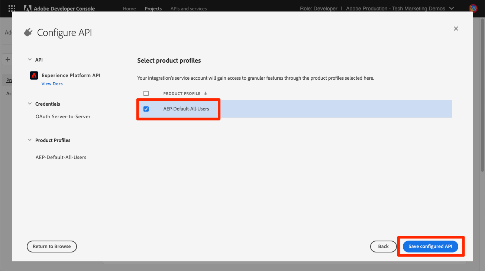

# Configurar o Console do desenvolvedor e [!DNL Postman]

<!--30min-->

Nesta lição, você configurará um projeto no Console do Adobe Developer e baixará [!DNL Postman] coleções para começar a usar as APIs da plataforma.

Para concluir os exercícios de API neste tutorial, [baixe o aplicativo Postman para seu sistema operacional.](https://www.postman.com/downloads/) Embora não seja necessário para usar APIs do Experience Platform, o Postman facilita os fluxos de trabalho da API e o Adobe Experience Platform fornece dezenas de coleções de Postman para ajudar você a executar chamadas da API e saber como elas operam. O restante deste tutorial assume alguns conhecimentos práticos do Postman. Para obter ajuda, consulte o [Documentação do Postman](https://learning.postman.com/).

A plataforma é criada com a API primeiro. Embora as opções de interface também existam para todas as tarefas principais, você pode usar a API da plataforma em algum momento. Por exemplo, para assimilar dados, mova itens entre sandboxes, automatize tarefas de rotina ou use novos recursos da plataforma antes que a interface do usuário seja criada.

**Arquitetos de dados** e **Engenheiros de dados** pode precisar usar a API da plataforma fora deste tutorial.

## Permissões necessárias

No [Configurar permissões](configure-permissions.md) lição, configure todos os controles de acesso necessários para concluir esta lição.

<!--
* Permission item Sandboxes > `Luma Tutorial`
* Developer-role access to the `Luma Tutorial Platform` product profile
-->

## Configurar o console do Adobe Developer

O Adobe Developer Console é o destino do desenvolvedor para acessar APIs e SDKs do Adobe, ouvir eventos quase em tempo real, executar funções em tempo de execução ou criar plug-ins ou aplicativos do App Builder. Você o usará para acessar a API do Experience Platform. Para obter mais detalhes, consulte a [Documentação do console do Adobe Developer](https://www.adobe.io/apis/experienceplatform/console/docs.html)

1. Crie uma pasta no computador local com o nome `Luma Tutorial Assets` para arquivos usados no tutorial.

1. Abra o [Console do Adobe Developer](https://console.adobe.io)

1. Faça logon e confirme se você está na Org correta

1. Selecionar **[!UICONTROL Criar novo projeto]** em [!UICONTROL Início rápido] menu.

   

1. No projeto recém-criado, selecione o **[!UICONTROL Adicionar ao projeto]** e selecione **[!UICONTROL API]**

   

1. Filtre a lista selecionando **[!UICONTROL Adobe Experience Platform]**

1. Na lista de APIs disponíveis, selecione **[!UICONTROL API Experience Platform]** e selecione **[!UICONTROL Próximo]**.

   

1. Para autenticação de sistemas externos como [!DNL Postman], exigimos um par de chaves públicas/privadas. Para gerar um novo par de chaves, selecione **[!UICONTROL Opção 1]**  e pressione a tecla **[!UICONTROL Gerar par de chaves]** botão

   

1. Quando as chaves estiverem prontas, você poderá ser solicitado a baixar as chaves no computador local. Salve as chaves empacotadas em `config.zip` para a pasta `Luma Tutorial Assets`. Precisaremos deles no próximo exercício.

1. Depois que a chave for gerada, a chave pública será adicionada automaticamente ao seu projeto, como mostrado na captura de tela. Selecione o **[!UICONTROL Próximo]** botão.

   

1. Selecione o `Luma Tutorial Platform` e selecione o **[!UICONTROL Salvar API configurada]** botão

   

1. Agora, seu projeto do Console do desenvolvedor foi criado!

1. No **[!UICONTROL Experimente]** da página, selecione **[!UICONTROL Download para Postman]** e depois selecione **[!UICONTROL Conta de serviço (JWT)]** para baixar a [!DNL Postman] arquivo json do ambiente. Salve as `service.postman_environment.json` em seu `Luma Tutorial Assets` pasta.

   

   >[!NOTE]
   >
   >Os administradores de sistema da sua organização podem ver o projeto como uma &quot;Credencial de API&quot; no perfil de produto no Admin Console
   >
   >

Você pode ter notado que o projeto recebeu um número, por exemplo, &quot;Projeto 12&quot;:

1. Selecione o número do projeto na navegação estrutural
1. Selecione o **[!UICONTROL Editar projeto]** botão
1. Altere o **[!UICONTROL Título do projeto]** para `Luma Tutorial API Project` (adicione seu nome ao final, se várias pessoas de sua empresa estiverem recebendo este tutorial)
1. Selecione o botão **[!UICONTROL Salvar]**

   

## Configurar Postman

>[!CAUTION]
>
>A interface do Postman é atualizada regularmente. As capturas de tela deste tutorial foram tiradas com o Postman v9.0.5 para Mac, mas as opções de interface podem ter sido alteradas.

1. Baixe e instale [[!DNL Postman]](https://www.postman.com/downloads/)
1. Abrir [!DNL Postman] e importe o arquivo de ambiente json baixado, `service.postman_environment.json`
   
1. Em [!DNL Postman], selecione o ambiente na lista suspensa

   
1. Selecione o **olho** ícone para exibir as variáveis de ambiente:

   

### Atualize o nome do ambiente

Como o nome exportado do ambiente do Console do desenvolvedor é gerado aleatoriamente, dê a ele um nome mais descritivo para que você não confunda os ambientes posteriormente quando começar a trabalhar na implementação real da Plataforma:

1. Com a tela de variáveis de ambiente ainda aberta, selecione **Editar** no canto superior direito
1. Atualize o **Nome do ambiente** para `Luma Tutorial`
1. Sair **Gerenciar ambientes** abrir modal no modo de edição, pois editaremos ainda mais na próxima etapa

   

### Adicionar a chave privada

Agora é hora de adicionar o valor PRIVATE_KEY ao ambiente do Postman

1. Extraia o download `config.zip` arquivo que foi gerado no exercício anterior durante a criação do Projeto do Console do Desenvolvedor. Este zip contém dois arquivos:
   * `private.key`
   * `certificate_pub.crt`
1. Abra o `private.key` em um editor de texto e copie o conteúdo.
1. Na Postman, no **Gerenciar ambientes** > **Editar** modal que ainda está aberto a partir do último exercício, cole os valores copiados na frente de **PRIVATE_KEY** no **Valor inicial** e **Valor atual** colunas.
1. Selecione **Salvar**

   

### Adicionar os tokens de acesso e JWT

Adobe fornece um conjunto avançado de [!DNL Postman] para ajudá-lo a explorar a API do Experience Platform. Essas coleções estão no [Adobe Experience Platform Postman Samples GitHub repo](https://github.com/adobe/experience-platform-postman-samples). Você deve marcar esse repositório, pois ele será usado várias vezes em todo este tutorial e posteriormente, durante a implementação do Experience Platform para sua própria empresa.

A primeira coleção funciona com as APIs do Adobe Identity Management Service (IMS). É uma maneira conveniente de preencher o JWT_TOKEN e o ACCESS_TOKEN no Postman *destinados a casos de utilização não relacionados com a produção* como concluir este tutorial na sandbox. Como alternativa, o Token JWT pode ser gerado no Console do Adobe Developer. No entanto, como expira regularmente, usar essa coleção permite atualizá-la sem precisar revisitar o Adobe Developer Console novamente ao concluir este tutorial.

>[!WARNING]
>
>Conforme observado no [README das APIs do serviço Adobe Identity Management](https://github.com/adobe/experience-platform-postman-samples/tree/master/apis/ims), os métodos de geração indicados são adequados para fins não relacionados com a produção. A assinatura local carrega uma biblioteca do JavaScript de um host de terceiros e a assinatura remota envia a chave privada para um serviço da Web de propriedade e operado pelo Adobe. Embora o Adobe não armazene essa chave privada, as chaves de produção nunca devem ser compartilhadas com ninguém.

Para gerar os tokens:

1. Baixe o [Coleção de geração de token de acesso ao Console do desenvolvedor](https://raw.githubusercontent.com/adobe/experience-platform-postman-samples/master/apis/ims/Identity%20Management%20Service.postman_collection.json) para `Luma Tutorial Assets` pasta
1. Importe a coleção para [!DNL Postman]
1. Selecionar a solicitação **IMS: JWT Generate + Auth via Token de usuário** e selecione **Enviar**

   
1. O **JWT_TOKEN** e **ACCESS_TOKEN** preencher automaticamente nas variáveis de ambiente de [!DNL Postman].

   

### Adicionar o nome da sandbox e a ID do locatário

O `SANDBOX_NAME` e `TENANT_ID` e `CONTAINER_ID` não estão incluídas na exportação do Console do Adobe Developer, então adicionamos manualmente:

1. Em [!DNL Postman], abra o **Variáveis de ambiente**
1. Selecione o **Editar** link à direita do nome do ambiente
1. No **Adicionar novo campo de variável**, insira `SANDBOX_NAME`
1. Em ambos os campos de valor, insira `luma-tutorial`, o nome que demos à nossa sandbox na lição anterior. Se você usou um nome diferente para a sandbox, por exemplo, luma-tutorial-ignatiusjreilly, certifique-se de usar esse valor.
1. No **Adicionar novo campo de variável**, insira `TENANT_ID`
1. Alterne para a ID do locatário de sua empresa e procure a interface do navegador da Web e extraia a parte do URL *depois do sinal @*. Por exemplo, minha ID de locatário é `techmarketingdemos` mas o seu é diferente:

   

1. Copie esse valor e retorne à [!DNL Postman] Tela Gerenciar ambientes
1. Cole a ID do locatário em ambos os campos de valor
1. No **Adicionar novo campo de variável**, insira `CONTAINER_ID`
1. Enter `global` em ambos os campos de valor

   >[!NOTE]
   >
   >`CONTAINER_ID` é um campo cujo valor é alterado várias vezes durante o tutorial. When `global` for usada, a API interage com elementos fornecidos pelo Adobe na conta da plataforma. When `tenant` for usada, a API interage com seus próprios elementos personalizados.

1. Selecione **Salvar**

   

## Faça uma chamada à API da plataforma

Agora vamos fazer uma chamada à API de plataforma para confirmar que configuramos tudo corretamente.

Abra o [Experience Platform [!DNL Postman] coleções no GitHub](https://github.com/adobe/experience-platform-postman-samples/tree/master/apis/experience-platform). Há muitas coleções nesta página, para várias APIs da plataforma. É altamente recomendável marcá-lo.

Agora, vamos fazer nossa primeira chamada de API:

1. Baixe o [Coleção de API do Registro de Schema](https://raw.githubusercontent.com/adobe/experience-platform-postman-samples/master/apis/experience-platform/Schema%20Registry%20API.postman_collection.json) para `Luma Tutorial Assets` pasta
1. Importe-o para [!DNL Postman]
1. Abrir **API do Registro de Schema > Classes > Classes de lista**
1. Veja o **Params** e **Cabeçalhos** e observe como eles incluem algumas das variáveis de ambiente inseridas anteriormente.
1. Observe que a variável **Cabeçalhos > Aceitar campo de valor** está definida como `application/vnd.adobe.xed-id+json`. As APIs do Registro de Esquema exigem uma dessas [valores do cabeçalho Accept especificados](https://experienceleague.adobe.com/docs/experience-platform/xdm/api/getting-started.html?lang=en#accept) que fornecem formatos diferentes na resposta.
1. Selecionar **Enviar** para fazer sua primeira chamada à API da plataforma!

Espero que você tenha um sucesso `200 OK` resposta contendo uma lista das classes XDM padrão disponíveis na sandbox, como mostrado abaixo.

Se a chamada não tiver sido bem-sucedida, faça uma depuração usando os detalhes de resposta do erro da chamada da API e revise as etapas acima. Se você ficar preso, solicite ajuda no [Fórum da comunidade](https://experienceleaguecommunities.adobe.com/t5/adobe-experience-platform/ct-p/adobe-experience-platform-community?profile.language=pt) ou use o link no lado direito desta página para &quot;Registrar um problema&quot;.

Com permissões da plataforma, sandbox e [!DNL Postman] configurar, você estará pronto para [dados de modelo em schemas](model-data-in-schemas.md)!
