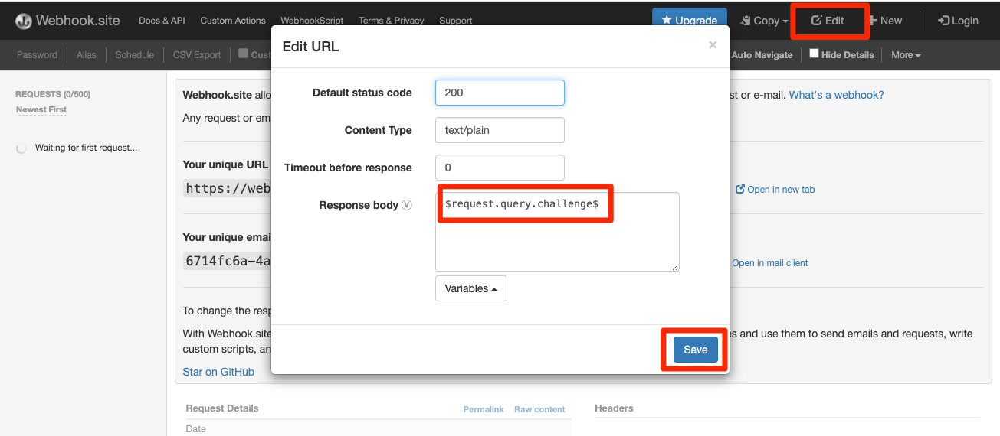
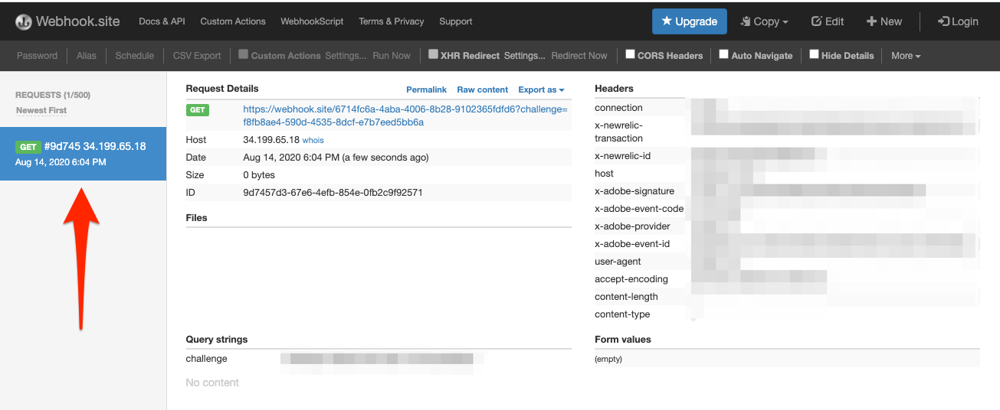

# Assinar eventos de assimilação de dados

<!--25min-->

Nesta lição, você se inscreverá nos eventos de assimilação de dados configurando um webhook com a Adobe Developer Console e uma ferramenta de desenvolvimento de webhook online. Você usará esses eventos para monitorar o status dos trabalhos de assimilação de dados nas lições subsequentes.

**Os engenheiros de dados** desejarão assinar eventos de assimilação de dados fora deste tutorial.
**Os Arquitetos de Dados** _podem ignorar esta lição_ e ir para a [lição de assimilação em lote](ingest-batch-data.md).

## Permissões necessárias

Na lição [Configurar Permissões](configure-permissions.md), você configura todos os controles de acesso necessários para concluir esta lição, especificamente:

<!--* Developer-role access to the `Luma Tutorial Platform` product profile (for API)
-->

>[!IMPORTANT]
>
> Essas notificações acionadas pelos eventos de assimilação de dados se aplicarão a _todas as sandboxes_, não apenas a `Luma Tutorial`. Você também pode ver notificações originadas de outros eventos de assimilação de dados em sua conta.

## Configurar um webhook

Neste exercício, criaremos um webhook usando uma ferramenta online chamada webhook.site (sinta-se livre para substituir qualquer outra ferramenta de desenvolvimento de webhook que preferir usar):

1. Em outra guia do navegador, abra o site [https://webhook.site/](https://webhook.site/)
1. Você recebe um URL exclusivo, que deve ser marcado, conforme retornado posteriormente nas lições de assimilação de dados:

   
1. Selecione o botão **Editar** na navegação superior
1. Como corpo da Resposta, insira `$request.query.challenge$`. As notificações de Adobe I/O Eventos que configuramos posteriormente nesta lição enviam um desafio para o webhook e exigem que ele seja incluído no corpo da resposta.
1. Selecione o botão **Salvar**

   

## Configuração

1. Em outra guia do navegador, abra a [Adobe Developer Console](https://console.adobe.io/)
1. Abra seu `Luma Tutorial API Project`
1. Selecione o botão **[!UICONTROL Adicionar ao Projeto]** e selecione **[!UICONTROL Evento]**

   
1. Filtre a lista selecionando **[!UICONTROL Experience Platform]**
1. Selecionar **[!UICONTROL notificações da plataforma]**
1. Selecione o botão **[!UICONTROL Avançar]**
   
1. Selecionar todos os eventos
1. Selecione o botão **[!UICONTROL Avançar]**
   
1. Na próxima tela para configurar credenciais, selecione novamente o botão **[!UICONTROL Avançar]**
   
1. Como o **[!UICONTROL Nome de registro de evento]**, digite `Platform notifications`
1. Role para baixo e selecione para abrir a seção **[!UICONTROL Webhook]**
1. Como a **[!UICONTROL URL do Webhook]**, cole o valor do campo **Sua URL exclusiva** do webhook.site
1. Selecione o botão **[!UICONTROL Salvar eventos configurados]**
   
1. Aguarde até que sua configuração seja salva e você verá que seu evento `Platform notifications` está Ativo com os detalhes do webhook e nenhuma mensagem de erro
   
1. Volte para a guia webhook.site e você deverá ver a primeira solicitação para o webhook, resultante da validação da configuração do Developer Console:
   

Pronto por enquanto, você aprenderá mais sobre essas notificações nas próximas lições ao assimilar dados.

## Recursos adicionais

* [Webhook.site](https://webhook.site/)
* [Documentação de notificações de assimilação de dados](https://experienceleague.adobe.com/docs/experience-platform/ingestion/quality/subscribe-events.html)
* [Introdução à documentação de Adobe I/O Events](https://www.adobe.io/apis/experienceplatform/events/docs.html)

Ok, finalmente vamos começar [assimilando dados](ingest-batch-data.md)!
