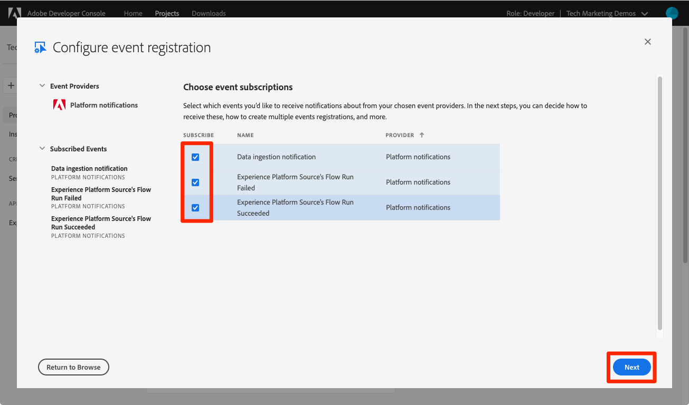

# Assinar eventos de assimilação de dados

<!--25min-->

Nesta lição, você assinará eventos de assimilação de dados configurando um webhook com o Adobe Developer Console e uma ferramenta de desenvolvimento de webhook online. Você usará esses eventos para monitorar o status dos trabalhos de assimilação de dados nas lições subsequentes.

**Engenheiros de dados** assinará eventos de assimilação de dados fora deste tutorial.
**Arquitetos de dados** _pode ignorar esta lição_ e vá para o [lição de ingestão em lote](ingest-batch-data.md).

## Permissões necessárias

No [Configurar permissões](configure-permissions.md) lição, você configura todos os controles de acesso necessários para concluir esta lição, especificamente:

<!--* Developer-role access to the `Luma Tutorial Platform` product profile (for API)
-->

>[!IMPORTANT]
>
> Essas notificações acionadas pelos eventos de assimilação de dados serão aplicadas a _todas as suas sandboxes_, não apenas o seu `Luma Tutorial`. Você também pode ver notificações originadas de outros eventos de assimilação de dados em sua conta do .

## Configurar um webhook

Neste exercício, criaremos um webhook usando uma ferramenta online chamada webhook.site (sinta-se à vontade para substituir qualquer outra ferramenta de desenvolvimento de webhook que você preferir usar):

1. Em outra guia do navegador, abra o site [https://webhook.site/](https://webhook.site/)
1. Você recebe um URL exclusivo, que deve ser marcado, conforme você retorna posteriormente nas lições de assimilação de dados:

   
1. Selecione o **Editar** no início da navegação
1. Como o corpo de resposta, insira `$request.query.challenge$`. As notificações de eventos do Adobe I/O que configuramos posteriormente nesta lição enviam um desafio para o webhook e exigem que ele seja incluído no corpo da resposta.
1. Selecione o botão **Salvar**

   

## Configurar

1. Em outra guia do navegador, abra o [Console do Adobe Developer](https://console.adobe.io/)
1. Abra seu `Luma Tutorial API Project`
1. Selecione o **[!UICONTROL Adicionar ao projeto]** e selecione **[!UICONTROL Evento]**

   
1. Filtre a lista selecionando **[!UICONTROL Experience Platform]**
1. Selecionar **[!UICONTROL Notificações da plataforma]**
1. Selecione o **[!UICONTROL Próximo]** botão
   
1. Selecionar todos os eventos
1. Selecione o **[!UICONTROL Próximo]** botão
   
1. Na próxima tela para configurar credenciais, selecione a variável **[!UICONTROL Próximo]** botão novamente
   
1. Como **[!UICONTROL Nome de registro do evento]**, insira `Platform notifications`
1. Role para baixo e selecione para abrir o **[!UICONTROL Webhook]** seção
1. Como **[!UICONTROL URL do Webhook]**, cole o valor do **Seu URL exclusivo** campo de webhook.site
1. Selecione o **[!UICONTROL Salvar eventos configurados]** botão
   
1. Aguarde até que sua configuração seja salva e você deve ver que sua configuração de `Platform notifications` O evento está ativo com os detalhes do webhook e sem mensagens de erro
   
1. Volte para a guia webhook.site e você deve ver a primeira solicitação para o webhook, resultante da validação da configuração do Console do desenvolvedor:
   

Por enquanto, você aprenderá mais sobre essas notificações nas próximas lições ao assimilar dados.

## Recursos adicionais

* [Webhook.site](https://webhook.site/)
* [Documentação das notificações de assimilação de dados](https://experienceleague.adobe.com/docs/experience-platform/ingestion/quality/subscribe-events.html)
* [Introdução à documentação de Adobe I/O Events](https://www.adobe.io/apis/experienceplatform/events/docs.html)

Ok, vamos finalmente começar [assimilação de dados](ingest-batch-data.md)!
