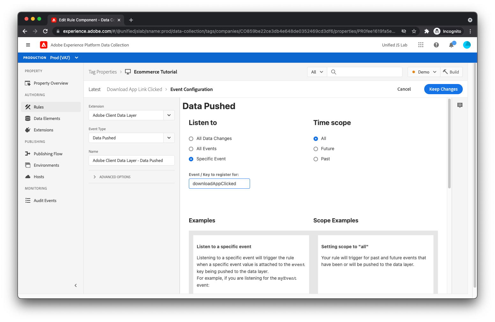

# Criar um elemento de dados e uma regra para rastrear downloads de aplicativos

Como lembrete, ao rastrear quando um usuário clica no [!UICONTROL Baixar o aplicativo] , você foi enviado para a camada de dados da seguinte maneira:

```js
window.adobeDataLayer.push({
  "event": "downloadAppClicked",
  "eventInfo": {
    "web": {
      "webInteraction": {
        "URL": "https://example.com/download",
        "name": "App Download",
        "type": "download"
      }
    }
  }
});
```

Você usou o `eventInfo` , que informa à camada de dados para comunicar esses dados juntamente com o evento, mas para _not_ mantenha os dados dentro da camada de dados. Para um clique em um link, não é útil adicionar informações sobre o link clicado à camada de dados, pois não é aplicável a outros eventos que podem ocorrer posteriormente na página.

Para essa implementação, você envia um evento de experiência para o Adobe Experience Platform contendo o resultado mesclado de (1) o estado calculado da camada de dados e (2) o conteúdo de `eventInfo`.

Para fazer isso, você precisa criar um elemento de dados que mescle essas duas partes de informações.

## Criar um elemento de dados

Para criar o elemento de dados apropriado:

1. Clique em [!UICONTROL Elementos de dados] no menu lateral esquerdo.
1. Em seguida, clique no botão [!UICONTROL Criar novo elemento de dados] link .
1. Insira o nome do elemento de dados, `computedStateAndEventInfo`.
1. Para o [!UICONTROL Extensão] , selecione [!UICONTROL Núcleo] se ainda não estiver selecionado.
1. Para o [!UICONTROL Tipo de elemento de dados] , selecione **[!UICONTROL Objetos Mesclados]**. Esse elemento de dados permite mesclar vários objetos. O resultado mesclado é retornado pelo elemento de dados.
1. Adicione o primeiro objeto que deseja incluir na mesclagem. Enter `%event.fullState%` no [!UICONTROL Objeto(obrigatório)] campo. Quando usado em uma regra acionada por uma [!UICONTROL Dados enviados] evento de regra, isso faz referência ao estado calculado da Camada de dados do cliente do Adobe no momento em que a regra foi acionada.
1. Clique no botão  **[!UICONTROL Adicionar outro]** comando.
1. Adicione o segundo objeto. Enter `%event.eventInfo%` no [!UICONTROL Objeto(obrigatório)] campo. Quando usado em uma regra acionada por uma [!UICONTROL Dados enviados] evento de regra, isso faz referência à variável `eventInfo` parte que foi enviada para a Camada de dados do cliente do Adobe.
1. Salve o elemento de dados clicando no botão [!UICONTROL Salvar] botão.
   

O elemento de dados foi concluído.

## Criar uma regra

Para criar a regra para rastrear cliques no [!UICONTROL Baixar o aplicativo] link:

1. Clique em **[!UICONTROL Regras]** no menu lateral esquerdo.
1. Clique em **[!UICONTROL Adicionar regra]**.
1. Enter **_Link do aplicativo de download clicado_** no [!UICONTROL Nome] campo.

## Adicionar um evento

1. Clique no botão **[!UICONTROL Adicionar]** botão abaixo [!UICONTROL Eventos]. Agora você mostra estar na exibição de evento.
1. Para o [!UICONTROL Extensão] , selecione **[!UICONTROL Camada de dados do cliente Adobe]**.
1. Para o [!UICONTROL Tipo de evento] , selecione **[!UICONTROL Dados enviados]**.
1. Clique em **[!UICONTROL Manter alterações]**.
   
Porque você deseja que essa regra seja acionada somente quando a variável `downloadAppClicked` for enviado para a camada de dados, selecione a **[!UICONTROL Evento específico]** rádio debaixo de [!UICONTROL Ouça] e tipo **_downloadAppClicked_** na [!UICONTROL Evento / Chave para se registrar]  campo de texto exibido.

## Adicionar uma ação

Agora que você está de volta à exibição de regra:

1. Clique no botão **[!UICONTROL Adicionar]** em [!UICONTROL Ações].
1. Agora você deve estar na exibição de ação. Para o [!UICONTROL Extensão] , selecione **[!UICONTROL Adobe Experience Platform Web SDK]**. Para o [!UICONTROL Tipo de ação] , selecione **[!UICONTROL Enviar evento]**.
1. No [!UICONTROL Tipo] à direita, selecione `web.webinteraction.linkClicks`.
1. Para o [!UICONTROL Dados XDM] , clique no botão seletor de elemento de dados à direita e selecione **[!UICONTROL computedStateAndEventInfo]**. Esse é o elemento de dados criado recentemente.
1. Para essa regra (diferente das outras regras que você criou), marque a opção **[!UICONTROL O documento será descarregado]** caixa de seleção.
   
1. Salve a ação clicando no botão **[!UICONTROL Manter alterações]** botão.

>[!TIP]
>
>O [!UICONTROL O documento irá descarregar o recurso] informa ao SDK que o usuário sai da página ao clicar no link. Isso é importante, pois permite que o SDK faça a solicitação mesmo se o usuário sair da página, pois a solicitação continua sendo executada em segundo plano e alcança o servidor. Se essa caixa de seleção estiver desmarcada, a solicitação não será feita dessa maneira e, portanto, provavelmente será cancelada quando o documento atual for descarregado.
>
>Você pode estar se perguntando: &quot;Isso parece legal. Por que essa opção nem sempre está ativada?&quot;
>
>Bem, é um pouco complicado, mas ao usar esse recurso, o SDK usa um método de navegador chamado [`sendBeacon`](https://developer.mozilla.org/pt-BR/docs/Web/API/Navigator/sendBeacon) para enviar a solicitação. Ao enviar uma solicitação usando `sendBeacon`, o navegador não permite que o SDK (ou qualquer outra coisa) acesse quaisquer dados retornados do servidor. Se o SDK usasse esse recurso para cada solicitação, o SDK nunca poderia receber dados do servidor. Por isso, é importante verificar a variável [!UICONTROL O documento será descarregado] caixa de seleção somente quando o documento atual for descarregado, nesse caso, os dados de resposta poderão ser descartados de qualquer maneira.

## Salve a regra

Sua regra deve estar concluída.

1. Clique em **[!UICONTROL Salvar]** no canto superior direito.
   

[Próximo: ](publish-the-library.md)

>[!NOTE]
>
>Obrigado por investir seu tempo para aprender sobre a coleta de dados. Em caso de dúvidas, desejo compartilhar comentários gerais ou ter sugestões sobre conteúdo futuro, compartilhe-as sobre isso [Posto de discussão da comunidade do Experience League](https://experienceleaguecommunities.adobe.com/t5/adobe-experience-platform-launch/tutorial-discussion-use-adobe-experience-platform-data/m-p/543877)