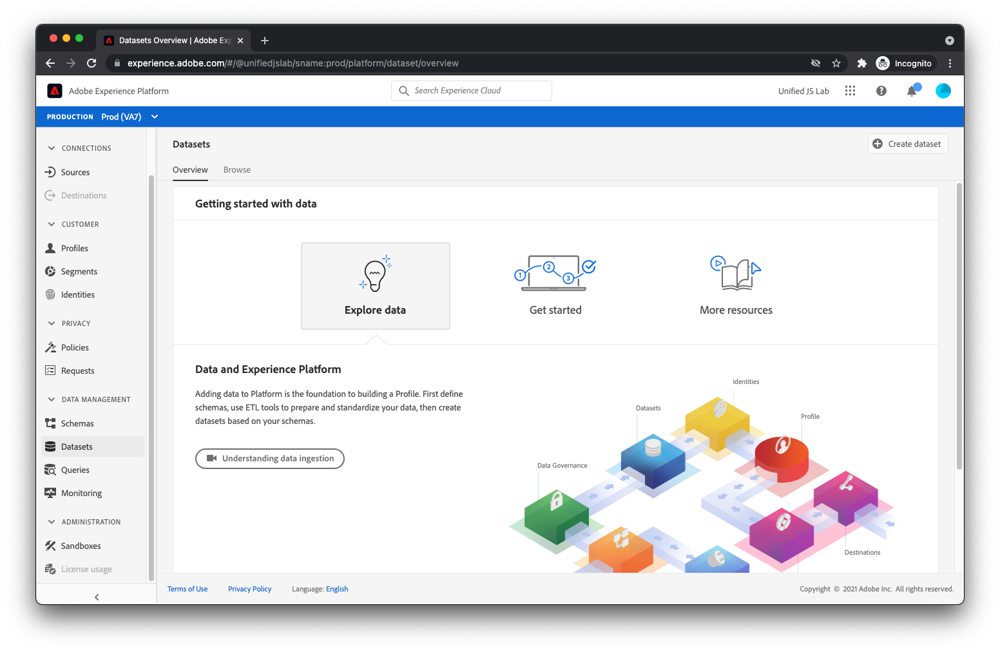

# Criar um conjunto de dados

Além de descrever os dados enviados para o Adobe Experience Platform, é necessário ter um local para manter os dados. No Adobe Experience Platform, esses buckets onde você pode colocar dados são chamados de conjuntos de dados.

>[!NOTE]
>
>Os conjuntos de dados não são necessários se você estiver usando somente o SDK da Web da plataforma para enviar dados para o Adobe Analytics, Adobe Target e Adobe Audience Manager ou usar o Encaminhamento de eventos. Se você estiver usando somente o SDK da Web para esses fins, poderá ignorar esta página do tutorial.

1. Selecionar **[!UICONTROL Conjuntos de dados]** under [!UICONTROL Gerenciamento de dados] no menu do lado esquerdo do Adobe Experience Platform.
1. Em seguida, selecione o **[!UICONTROL Criar conjunto de dados]** no canto superior direito.
   

## Criar um conjunto de dados a partir do esquema

1. No [!UICONTROL Fluxo de trabalho] , selecione o primeiro bloco, **[!UICONTROL Criar conjunto de dados a partir do esquema]**.
1. Procure a variável [o esquema criado anteriormente](create-a-schema.md) e selecione-a.
   
1. Selecionar **[!UICONTROL Próximo]** e forneça um nome e uma descrição.
   
1. Selecionar **[!UICONTROL Concluir]**. Seu conjunto de dados foi criado e está pronto para receber dados.

À medida que você começa a enviar dados para um conjunto de dados, o Adobe Experience Platform valida que os dados que você está tentando colocar no conjunto de dados estão em conformidade com o esquema aplicado. Se os dados não estiverem em conformidade com o schema, eles serão rejeitados e não serão colocados no conjunto de dados. Como resultado dessa etapa de validação, os consumidores do conjunto de dados (produtos de Adobe, terceiros ou sua própria empresa) podem ter algum nível de certeza em relação à estrutura e à limpeza dos dados do conjunto de dados.

Para obter mais informações sobre como criar conjuntos de dados, consulte [Criar conjuntos de dados e assimilar dados](/help/platform/data-ingestion/create-datasets-and-ingest-data.md).

[Próximo: ](create-a-datastream.md)

>[!NOTE]
>
>Obrigado por investir seu tempo para aprender sobre a coleta de dados. Em caso de dúvidas, desejo compartilhar comentários gerais ou ter sugestões sobre conteúdo futuro, compartilhe-as sobre isso [Posto de discussão da comunidade do Experience League](https://experienceleaguecommunities.adobe.com/t5/adobe-experience-platform-launch/tutorial-discussion-use-adobe-experience-platform-data/m-p/543877)

