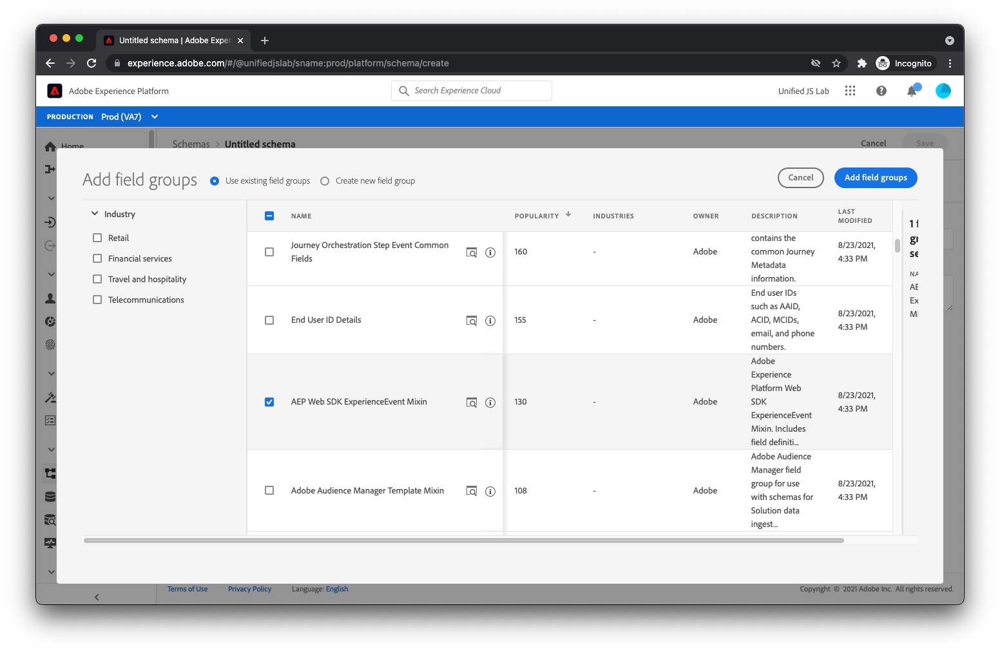

# Criar um esquema

Conforme discutido no [Estruturação de dados](../structuring-your-data.md), os dados enviados para a Adobe Experience Platform devem estar no XDM. Mais especificamente, seus dados devem corresponder a um _schema_. Um esquema é basicamente uma descrição de como os dados devem ser. Ela descreve os nomes dos campos e onde eles devem estar localizados nos dados. Ela também descreve o tipo de valor que cada campo deve ter (por exemplo, um booleano, uma string com 12 caracteres de comprimento, uma matriz de números).

O Adobe Experience Platform fornece alguns blocos componentes prontos para uso, conhecidos como grupos de campo, que são comuns no setor. Por exemplo, para o setor dos serviços financeiros, existem grupos de campos para transferências de saldos e pedidos de empréstimos. Para o setor de viagens e hospitalidade, há grupos de campo para voos e reservas de alojamento.

Recomendamos usar os grupos de campos incorporados, sempre que possível, ao criar o esquema. Também entendemos que você pode precisar de campos específicos da sua empresa. Por isso, você pode criar seus próprios grupos de campos personalizados para usar nos esquemas criados.

Vamos analisar a criação de um esquema para um site de comércio eletrônico típico.

1. Selecionar **[!UICONTROL Esquemas]** under [!UICONTROL Gerenciamento de dados] no menu do lado esquerdo da interface do Adobe Experience Platform.
1. Selecionar **[!UICONTROL Criar esquema]** no canto superior direito, e **[!UICONTROL ExperiênciaEvento XDM]** no menu suspenso.

Agora você está na tela do construtor de esquema.

## Adicionar grupos de campos

1. No **[!UICONTROL Grupos de campos]** no lado esquerdo do **[!UICONTROL Estrutura]** selecione a **[!UICONTROL + Adicionar]** link . Nesse ponto, um modal será exibido para escolher os grupos de campos que serão adicionados ao esquema.
1. Primeiro, selecione o grupo de campos chamado **[!UICONTROL AEP Web SDK ExperienceEvent]**. Esse grupo de campos adiciona um conjunto de campos que acomoda dados coletados automaticamente pelo SDK da Web da Adobe Experience Platform.
   
1. Em seguida, como o site deste tutorial é um site de comércio eletrônico, selecione o **[!UICONTROL Detalhes de comércio]** grupo de campos. Esse grupo de campos permite enviar dados de comércio típicos como quais produtos estão sendo visualizados, adicionados ao carrinho e comprados.
1. Selecione o **[!UICONTROL Adicionar grupos de campos]** na parte superior direita da caixa de diálogo.
   
1. Nesse ponto, você deve ver a estrutura do esquema.
   

## Salvar o esquema

1. Por último, forneça um nome e uma descrição à direita da tela e selecione **[!UICONTROL Salvar]**.
   

Seu esquema foi criado. Em seguida, aprendamos a criar um conjunto de dados para armazenar seus dados.

Para obter mais informações sobre como criar schemas, consulte [Criar esquemas](/help/platform/schemas/create-schemas.md).

[Próximo: ](create-a-dataset.md)

>[!NOTE]
>
>Obrigado por investir seu tempo para aprender sobre a coleta de dados. Em caso de dúvidas, desejo compartilhar comentários gerais ou ter sugestões sobre conteúdo futuro, compartilhe-as sobre isso [Posto de discussão da comunidade do Experience League](https://experienceleaguecommunities.adobe.com/t5/adobe-experience-platform-launch/tutorial-discussion-use-adobe-experience-platform-data/m-p/543877)
