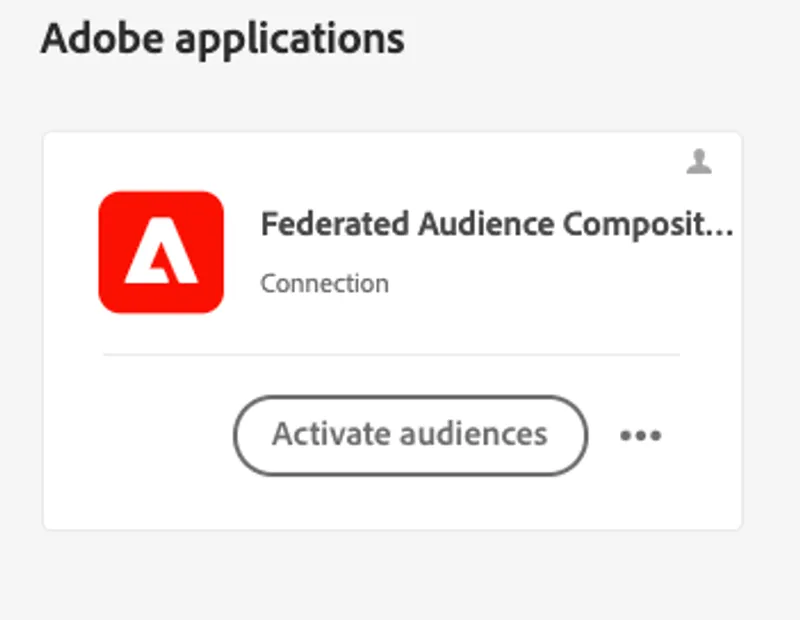

# Composição de público-alvo federado

A Composição de público-alvo federado permite enriquecer públicos-alvo existentes no Adobe Experience Platform (AEP) usando dados de público-alvo compostos que foram federados a partir do data warehouse corporativo. Esses dados não serão mantidos nos perfis de clientes da Adobe Experience Platform.

## Maneiras de enriquecer uma composição de público-alvo federado

Há dois métodos primários para enriquecer uma Composição de público-alvo federado.

### &#x200B;1. Leitura de um público-alvo do AEP em uma composição federada

Neste primeiro exemplo, usaremos o público-alvo **Visitante da página do aplicativo de empréstimo do SecurFinancial** armazenado no Serviço de perfil da AEP para iniciar nossa composição federada. Vamos enriquecer o público usando dados federados no Snowflake para determinar a pré-aprovação com base na pontuação de crédito e na atividade de empréstimo.

1. **Mapeie o público-alvo do AEP** para o destino da Composição do Público Federado.
2. **Crie sua composição** com o público mapeado como um público de leitura.
3. **Reconcilie as identidades** no seu público-alvo de leitura para ingressar com dados federados.

### &#x200B;2. Enriquecimento da regra de público-alvo do Experience Platform com um público-alvo federado

No segundo exemplo, usaremos o público-alvo federado consultado com pontuação de crédito e atividade de empréstimo para enriquecer o público-alvo comportamental dos visitantes da página da Web de aplicativos de empréstimo.

Ao avaliar esse público-alvo no Edge, podemos redirecionar instantaneamente os visitantes da página de aplicativos de empréstimo pré-aprovados com ofertas personalizadas no site.

1. **Salve e inicie** sua composição de público-alvo federado. Depois que a composição for executada, o público-alvo federado aparecerá no portal de público-alvo.
2. **Crie uma regra de público-alvo** usando atributos de perfil e eventos de experiência do Serviço de Perfil, incorporando seu público federado.

Vamos concluir com um [resumo dos aprendizados e das lições finais](conclusion.md)!
