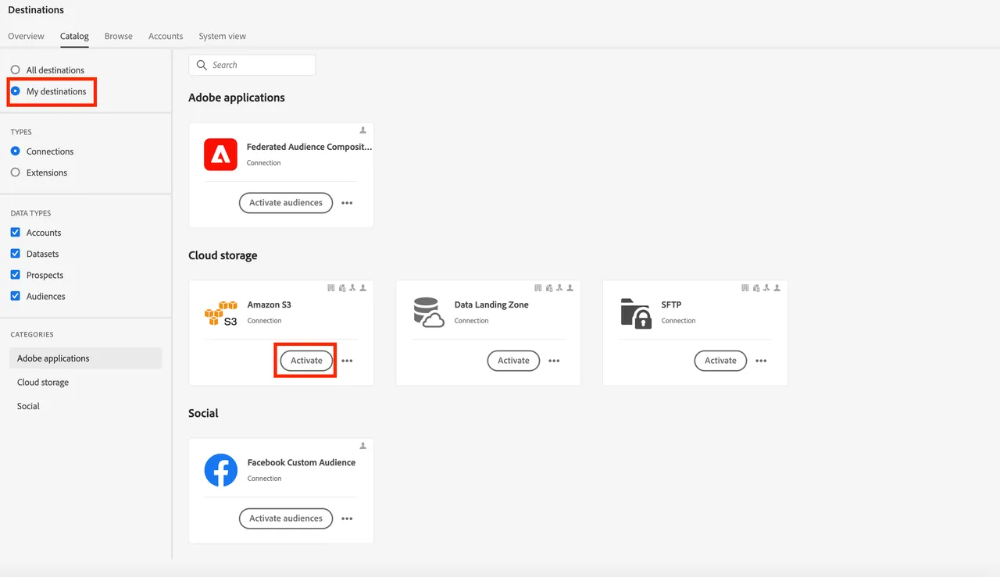

# Mapear o público-alvo federado para S3 para aproveitar os atributos do público-alvo para enriquecimento

Neste exercício, você aprenderá a aproveitar os atributos de público-alvo no data warehouse para enriquecer a experiência do público-alvo em workflows de ativação downstream usando destinos do RTCDP. Para o SecurFinancial, esses atributos federados podem ser usados para aprimorar a experiência de personalização offline do público-alvo do cliente. Neste exemplo, mapearemos o público-alvo federado para um destino do Amazon S3 pré-configurado.

## Etapas

1. Navegue até o portal **Destinos**.

2. Clique no botão **3 do menu de pontos** ao lado do destino pré-configurado do Amazon S3 e clique em **Ativar Públicos-alvo**.

   

3. Selecione o **destino S3** e clique em **Avançar**.

   

4. Selecione o público **SecureFinancial Customers - No Loans, Good Credit**.

   

5. Na seção **Agendando**, deixe todas as configurações padrão e clique em **Avançar**.

6. Na etapa **Mapping**, verifique se o item a seguir está incluído e selecionado como a **Chave de Desduplicação**. Em seguida, clique em **Avançar**:
   - `xdm: personalEmail.address`

   

7. Na etapa de mapeamento a seguir, é possível selecionar atributos de enriquecimento com base nos mapeamentos de campo de público-alvo na composição de público-alvo federado. Clique no ícone de **lápis (editar)** para exibir os atributos pré-selecionados.

   

   

8. Revise seu mapeamento de público e clique em **Concluir**.

Estamos prontos para avançar para [criar uma jornada](build-journey-federated-audience.md).
