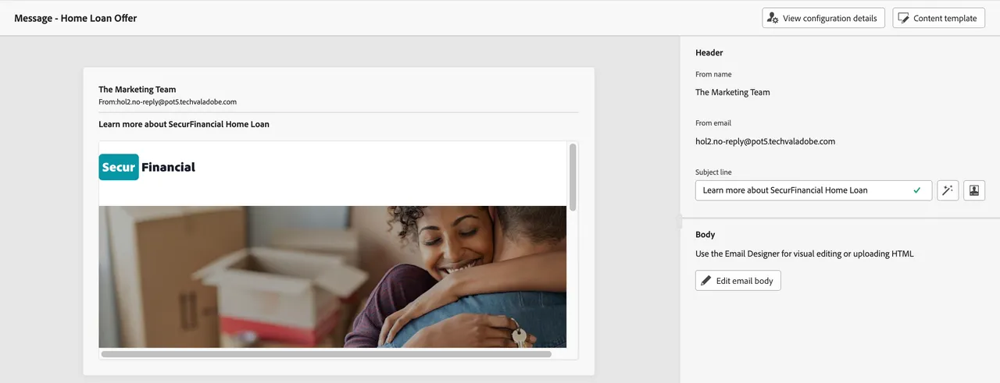

# Criar uma Jornada com um público-alvo federado

Públicos federados podem ser usados em jornadas no Adobe Journey Optimizer (AJO). Isso inclui o uso de atributos consultados da Composição de público-alvo federado para personalizar as mensagens.

Para dar continuidade à história do SecurFinancial, especificamente o caso de uso de redirecionamento e personalização de clientes, orquestramos uma jornada para clientes pré-qualificados. O objetivo é enviar um e-mail personalizado com base nos atributos federados do Data Warehouse do SecurFinancial.

## Etapas

### Criar uma Jornada com um público-alvo de leitura

1. Navegue até o portal **Jornada** e clique no botão **Criar Jornada**.

   

2. Atualize as Propriedades da Jornada com um novo nome. No nosso exemplo: **`SecurFinancial - Home Loan Offer`**.

3. Clique em **Orquestração** e arraste e solte o bloco **Ler público** na tela.

4. Clique no **ícone de lápis** ao lado da caixa Público-alvo no lado direito da tela.

5. Na barra de pesquisa, pesquise pelo público-alvo. Em nosso exemplo: **`SecureFinancial Customers - No Loans, Good Credit`**. Clique em **Salvar**.

   

6. Deixe todas as configurações como padrão no menu do lado direito e clique em **Salvar**.

   

### Personalizar email

1. Clique em **Ações**, em seguida, clique e arraste o bloco **Email** para a tela.

2. No menu do lado direito, clique em **Configuração de email** e selecione **EmailMarketing**. Clique em **Editar conteúdo**.

3. Adicione uma linha de assunto. Em nosso exemplo: **`Learn more about SecurFinancial Home Loan`**. Em seguida, clique em **Editar corpo do email**.

4. Clique no botão **Modelo de conteúdo** no canto superior direito. Localize e selecione o modelo apropriado. Nosso exemplo usa o `SecureFinancial Template`. Depois clique em **Confirmar**.

   

   

5. Revise o modelo e clique em **Usar Modelo**.

6. Agora você estará no Designer de email. Passe o mouse sobre a macro `{profile.person.name.firstName}` e clique no **avatar da personalização**.

7. Na janela de personalização, vá para o caminho da pasta com o público federado carregado. Em nosso exemplo: **`[sandbox] > audienceEnrichment > CustomerAudienceUpload`**

8. Clique na pasta **ler público**. Os atributos de enriquecimento do público-alvo federado podem ser encontrados aqui.

9. Selecione o atributo **Nome** para o construtor de expressões. O email expressará dinamicamente o valor do nome do cliente para personalizar o email.

10. Clique em **Salvar**.

11. Agora que a personalização do nome foi adicionada, adicione `Hi, ` na frente da variável de personalização. Depois clique em **Salvar**.

   

12. Clique no botão **Voltar** duas vezes para retornar à tela de jornada. No menu **Ação: Email** à direita, clique em **Salvar**.

   

Criamos uma jornada no AJO usando um público federado e atributos de enriquecimento federados.

Agora vamos ver como [enriquecer os públicos-alvo existentes](federated-audience-composition.md) na Experience Platform com dados federados do data warehouse.
