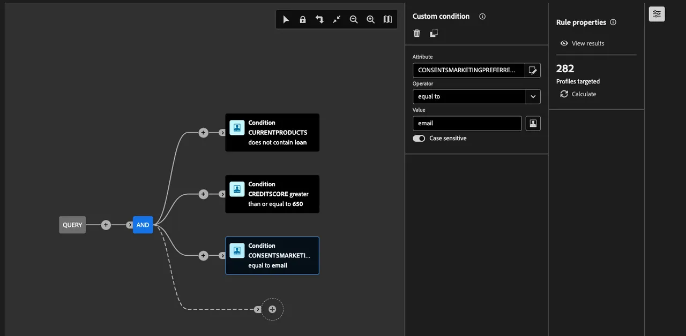

# Criar um público federado

Em seguida, orientamos você na criação de um público-alvo do data warehouse do Snowflake usando a Federated Audience Composition. O público-alvo é composto de clientes do SecurFinancial com pontuação de crédito de 650 ou superior e que atualmente não têm um empréstimo em seu portfólio do SecurFinancial.

## Etapas

1. No portal **Cliente > Públicos-alvo**, clique na guia **Federated compositions**.
2. Clique em **Criar composição**.

   

3. Rotular sua composição. Em nosso exemplo: `SecurFinancial Customers - No Loans, Good Credit`. Clique em **Criar**.

4. Clique no botão **+** na tela e selecione **Criar público-alvo**. O painel direito é exibido.

5. Clique em **Selecionar um esquema**, selecione o esquema apropriado e clique em **Confirmar**.

6. Clique em **Continuar**. Na janela do construtor de consultas, clique no botão **+** e depois em **Condição Personalizada**. Escreva as condições. Nosso exemplo usa:

   `CURRENTPRODUCTS does not contain loan`
   `AND`
   `CREDITSCORE greater than or equal to 650`
   `AND`
   `CONSENTSMARKETINGPREFERRED equal to email`

   *A última condição garante que os dados de preferência de marketing sejam usados para segmentar clientes que optaram por email como seu canal de comunicação preferido*.

   **Observação:** o campo de valor diferencia maiúsculas de minúsculas.

   

7. Clique no botão **+** seguinte e em **Salvar público-alvo**. Rotular esta etapa. No nosso exemplo, vamos rotular como `SecurFinancial Customers - No Loans, Good Credit`.

8. Adicione os mapeamentos de público pertinentes. Neste exemplo:

   - **Campo de público-alvo do Source:** EMAIL
   - **Campo de público-alvo do Source:** PRODUTOSATUAIS
   - **Campo de público-alvo do Source:** NOME

9. Selecione a identidade e o namespace principais a serem usados para perfis. Estas são as identidades e os campos usados para nossos dados:

   - **Campo de identidade principal:** email
   - **Namespace de identidade:** email

10. Clique em **Salvar** e em **Iniciar** para executar a consulta da composição.

>[**RESUMO**]
>
> Neste exemplo, as informações de produto e crédito foram usadas para criar nosso público-alvo por meio do acesso direto aos dados corporativos do Snowflake, sem fazer uma cópia deles no Adobe Experience Platform. Depois que o sistema externo processa o query, somente o email relevante, os produtos atuais e os valores de nome serão trazidos para a definição de público-alvo para ativação downstream. Isso se aplica a todos os destinos compatíveis com o RTCDP.

Para obter mais informações sobre a composição de públicos, visite [Experience League](https://experienceleague.adobe.com/pt-br/docs/federated-audience-composition/using/compositions/create-composition/create-composition){target="_blank"}.

Agora que nosso público-alvo federado foi criado, nós o [mapearemos para uma conta S3](map-federated-audience-to-s3.md).
