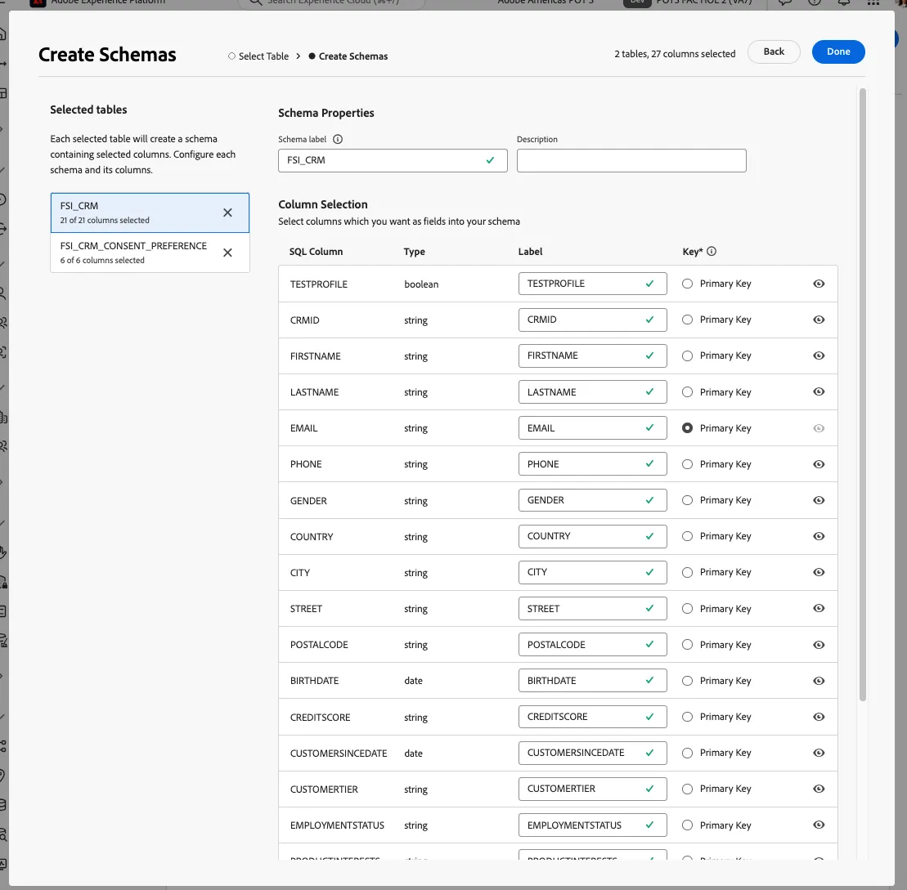

# Conexão de data warehouse

Começamos configurando uma conexão entre o Adobe Experience Platform e o seu Enterprise Data Warehouse. Usamos esquemas e modelos de dados com base em como os dados se encontram na Data Warehouse para oferecer suporte à criação de consultas.

Para demonstrar, nos conectamos a uma conta do Snowflake. A Federated Audience Composition oferece suporte a uma lista crescente de conexões de data warehouse. Consulte a [lista atualizada de integrações](https://experienceleague.adobe.com/en/docs/federated-audience-composition/using/start/access-prerequisites){target="_blank"}.

## Etapas

1. Navegue até a seção **DADOS FEDERADOS** no painel esquerdo.
2. No link **Federated Databases**, clique no botão **Add federated database**.
3. Adicione um nome e selecione **Snowflake**.
4. Preencha os detalhes, clique no botão **Testar conexão** e no botão **Implantar funções**.

   

   

   

## Criar um esquema

Para criar esquemas na Composição de público federado, siga estas etapas:

### Etapas

1. Na seção **DADOS FEDERADOS**, clique em **Modelos**.
2. Navegue pela guia **Esquema** e clique no botão **Criar Esquema**.
3. Selecione o banco de dados de origem na lista e clique na guia **Adicionar tabelas**.
4. Escolha as tabelas da origem federada. No nosso exemplo:
   - FSI_CRM
   - FSI_CRM_CONSENT_PREFERENCE

   

   

Depois de selecionar as tabelas, revise as colunas em cada tabela e selecione a chave primária. Para dar suporte ao business case, o **EMAIL** é selecionado como a chave primária em ambas as tabelas.

## Criar um modelo de dados

Os modelos de dados permitem criar um vínculo entre tabelas. O link pode ser criado entre tabelas no mesmo banco de dados, como tabelas no Snowflake, ou entre tabelas em bancos de dados diferentes, como um link entre uma tabela no Snowflake e uma tabela no Amazon Redshift.

### Etapas

1. Na seção **DADOS FEDERADOS**, clique em **Modelos** e em **Modelo de Dados**.
2. Clique no botão **Criar modelo de dados**.
3. Forneça um nome para o modelo de dados.
4. Clique em **Adicionar esquemas** e selecione os novos esquemas de dados federados. Neste exemplo, selecionamos os esquemas **FSI_CRM** e **FSI_CRM_CONSENT_PREFERENCE**.
5. Crie um link entre essas tabelas clicando em **Criar links**.

Ao criar um link, escolha a cardinalidade aplicável:

- **1-N**: uma ocorrência da tabela de origem pode ter várias ocorrências correspondentes da tabela de destino, mas uma ocorrência da tabela de destino pode ter no máximo uma ocorrência correspondente da tabela de origem.
- **N-1**: uma ocorrência da tabela de destino pode ter várias ocorrências correspondentes da tabela de origem, mas uma ocorrência da tabela de origem pode ter no máximo uma ocorrência correspondente da tabela de destino.
- **1-1**: uma ocorrência da tabela de origem pode ter no máximo uma ocorrência correspondente da tabela de destino.

Veja abaixo uma pré-visualização do link criado com base nas etapas acima. O link permite uma associação entre o CRM e as tabelas de consentimento, usando a chave primária de **EMAIL** para executar uma associação.

Agora, estamos prontos para [criar e público-alvo](create-a-federated-audience.md).
