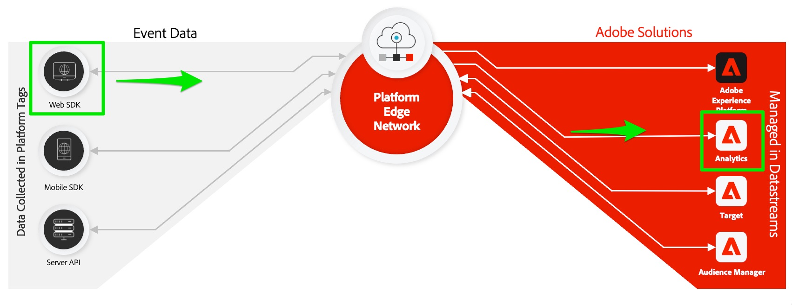

# Criar e configurar um fluxo de dados

Saiba como criar e configurar um novo fluxo de dados para que os dados do seu site possam ser roteados para o Adobe Analytics.

Nesta lição, você aprenderá a criar e configurar o sistema para que seus dados fluam do site para a Adobe Edge e, em seguida, sejam roteados daí para a Adobe Analytics.

## Criar um novo fluxo de dados de desenvolvimento

1. Abra a interface da Coleta de dados do Adobe
   1. Navegue no seu navegador para https://experience.adobe.com
   1. Verifique se a organização correta está selecionada na parte superior da página (por exemplo, Produção de Adobe - Demonstrações de marketing técnico na imagem abaixo)
   1. Clique nos &quot;nove pontos&quot;, também conhecido como alternador de aplicativos, e selecione **Coleção de dados**

      

1. Vá para **[!UICONTROL Datastreams]** na navegação à esquerda
1. Selecionar **[!UICONTROL Nova Sequência De Dados]**
1. Insira o **[!UICONTROL Nome]** desejado e inclua um indicador de que ele será usado para o ambiente de desenvolvimento do Web SDK. Por exemplo, você pode nomeá-lo como o nome do site, como mostrado abaixo. Anote-o, pois esse nome será referenciado posteriormente ao configurar a extensão do Web SDK na propriedade da tag. Insira uma descrição, se desejar.

   >[!NOTE]
   >
   >Você só precisa selecionar um esquema se estiver usando o recurso [Preparação de dados para a coleção de dados](https://experienceleague.adobe.com/pt-br/docs/platform-learn/data-collection/edge-network/data-prep), o que não faremos neste tutorial. Visite o link para saber mais.

1. Selecione **[!UICONTROL Salvar]**

   

1. Depois que a sequência de dados for salva, uma nova tela será exibida, informando que você ainda não tem nenhum serviço configurado. Em outras palavras, seus dados chegarão aos servidores da Edge, mas não serão enviados para nenhum aplicativo até que um serviço seja adicionado. Agora configuraremos o fluxo de dados para enviar os dados ao Adobe Analytics. Clique em **[!UICONTROL Adicionar Serviço]**.
   
1. No menu suspenso do serviço, selecione **[!UICONTROL Adobe Analytics]**.
1. No campo ID do conjunto de relatórios, insira a ID (não o título, mas a ID do conjunto de relatórios) do conjunto de relatórios de validação criado na atividade [Criar um conjunto de relatórios de validação](create-a-validation-report-suite.md). Clique em **[!UICONTROL Salvar]**.

## Fluxos de dados de preparo e produção

Agora você vai querer **percorrer as mesmas etapas novamente** mais duas vezes: uma para o ambiente de preparo e outra para o ambiente de produção. A seguir estão algumas observações à medida que você configura esses dois fluxos de dados adicionais.

### A sequência de dados de preparo

* Ao nomear o fluxo de dados (e ao adicionar a descrição), você pode/deve ter o mesmo nome com a diferença de adicionar &quot;preparo&quot; em vez de &quot;desenvolvimento&quot;.
* Adicione o serviço Adobe Analytics, como você fez antes, e defina o conjunto de relatórios para o mesmo conjunto de relatórios de desenvolvimento.
* Se você deseja um ambiente mais limpo para analisar os números de preparo nos relatórios do Adobe Analytics, é possível criar um novo conjunto de relatórios apenas para preparo e, em seguida, verificar se você está apontando para esse conjunto de relatórios no serviço do Analytics dessa sequência de dados.

### A sequência de dados de produção

* Ao nomear o fluxo de dados (e ao adicionar a descrição), você pode/deve ter o mesmo nome com a diferença de adicionar &quot;produção&quot; em vez de &quot;desenvolvimento&quot;.
* Ao escolher o conjunto de relatórios para o qual mapear os dados, em vez de escolher o conjunto de relatórios de desenvolvimento ou até mesmo um novo conjunto de relatórios, você pode mapear essa sequência de dados para seu conjunto de relatórios de produção **atual** que está sendo alimentado pela implementação do AppMeasurement. Dessa forma, após concluir a migração, testá-la e estar satisfeito com os números, é possível remover o código de AppMeasurement antigo, enviar as bibliotecas de tags para produção e alimentar os novos dados de produção no mesmo conjunto de relatórios de produção, para que haja continuidade entre implementações antigas e novas.
