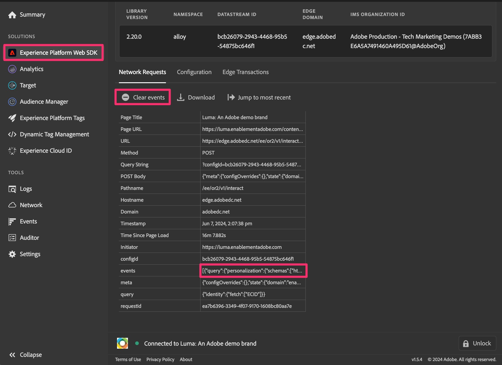

# Depurar e validar a migração do Web SDK

Neste exercício, você aprenderá a depurar e validar seus dados ao migrar para o Web SDK. Queremos incentivar duas atividades de validação diferentes que podem ajudar você a garantir que tudo esteja funcionando corretamente:

1. **A atividade de validação #1** está executando o Adobe Experience Platform Debugger, que é uma extensão de navegador, e permite que você verifique corretamente se seus dados estão sendo enviados para o Analytics. É recomendável fazer essa atividade com frequência, já que você faz alterações na propriedade de tags e publica as alterações em uma biblioteca de desenvolvimento.
1. **A atividade de validação #2** vai para o Adobe Analytics, configura um ou mais projetos para receber dados do Web SDK (por meio do conjunto de relatórios de migração recém-criado) e verifica se os dados estão entrando nos relatórios corretamente à medida que você clica no site etc.

## O ADOBE EXPERIENCE PLATFORM DEBUGGER

Esse depurador é uma extensão de navegador e está disponível na loja da Chrome. Há um [tutorial em vídeo](https://experienceleague.adobe.com/en/docs/platform-learn/data-collection/debugger/overview) que explica como baixar e usar o depurador, e é recomendável que você primeiro passe por isso para saber o uso básico.

Depois que o depurador estiver ativo e em execução, você poderá usá-lo para garantir que os dados estejam fluindo do seu site e pelo Edge Network corretamente. Este tutorial continuará com o uso bastante básico, mas use o depurador com toda a capacidade para verificar seus dados.

**Pressuposição (sempre perigosa, mas neste caso, esperamos que esteja boa):** Como estamos migrando a propriedade de marcas para o Web SDK neste exemplo, não precisamos colocar um novo código de inserção no site. Já terá estado lá. No entanto, se você decidir que deseja fazer mais de uma abordagem de &quot;lift and shift&quot; em uma propriedade de tags totalmente nova, terá novos códigos incorporados para colocar em seus ambientes de desenvolvimento, preparo e produção. Portanto, neste tutorial, desde que tenhamos a extensão Web SDK instalada e configurada com regras para enviar dados no, faremos com que os dados sejam exibidos no depurador.

### Exibir dados do Web SDK no depurador

Agora que você migrou sua regra de página padrão (ou se migrou alguma regra) e a publicou em uma biblioteca no ambiente de desenvolvimento, você pode executar o site e ver os dados fluindo para o depurador.

Etapas para visualizar seus dados:

1. Abrir o ambiente de desenvolvimento do site no navegador
1. Abra o depurador clicando na extensão do navegador na bandeja de extensões na parte superior da janela do navegador

   

   >[!TIP]
   >
   >No canto inferior direito do depurador, há um ícone e rótulo &quot;Bloquear&quot; e, à esquerda dele, você pode ver qual página está depurando. Quando estiver no site, clique no ícone de bloqueio, que bloqueará o depurador na janela do site. Caso contrário, se você clicar em uma guia/janela diferente do navegador, o depurador responderá a esse site. Durante a depuração do site, é mais fácil garantir que o depurador sempre forneça informações do site.

1. Verifique se você está na página **Resumo** do depurador (ícone &quot;Início&quot; na parte superior esquerda). **Atualize o site** na janela do navegador. Se o depurador estiver selecionando o código incorporado no site e se você não tiver excluído o código do Analytics (de acordo com este tutorial), você verá indicações de que havia código para o Adobe Experience Platform Web SDK e o Adobe Analytics, bem como para as Tags do Adobe Experience Platform. Outros serão esmaecidos.

   

1. Para ver os dados adicionados através do Web SDK, clique no link **Experience Platform Web SDK** no painel esquerdo
1. Clique em **Limpar eventos** apenas para se livrar das ocorrências que ocorreram
1. Atualize o site novamente e volte para o depurador
1. Em seguida, clique no campo de dados ao lado de **eventos** na tabela

   

1. No campo Valor, expanda até 0, data, __adobe e analytics
1. Você deve ver as variáveis definidas nas regras que são acionadas nessa página, incluindo a regra de carregamento de página padrão e quaisquer regras especiais.

   

1. Execute essas etapas sempre que alterar algo na propriedade de tags e publicar as alterações no desenvolvimento, para que possa ver o efeito das alterações feitas na implementação do Analytics.

## Validar dados no Analysis Workspace

O objetivo principal dessa recomendação é pegar os dados atuais do Analytics provenientes da implementação de tags usando a extensão do Adobe Analytics e compará-los aos mesmos relatórios que agora serão preenchidos pelo Web SDK.
Há possivelmente várias maneiras de configurar estas comparações, mas eu vou dar a vocês dois exemplos de como fazer isto.

### Opção 1: comparar os dados usando dois painéis em um único projeto

1. Criar um novo projeto no Analysis Workspace e adicionar dois painéis
1. Defina o conjunto de relatórios no painel 1 para seu conjunto de relatórios de produção atual do Adobe Analytics
1. Defina o conjunto de relatórios no painel 2 como seu novo conjunto de relatórios de desenvolvimento do Web SDK
1. Coloque o mesmo relatório em ambos os painéis, usando um período que inclua dias completos apenas onde os dados foram enviados para ambos os conjuntos de relatórios
1. Comparar os dados

Isso pode ser semelhante a (entendendo que não há dados nesses conjuntos de relatórios de demonstração vazios):

Como você pode ver, o relatório é o mesmo em ambos os painéis e o calendário também é o mesmo. A diferença é o conjunto de relatórios, conforme indicado nas etapas acima.
**Vantagem desta opção:** você pode ir um por um com relatórios/dimensões e testar exatamente o que deseja testar, conforme faz alterações na implementação.

### Opção 2: comparar os dados usando dois projetos

1. Abrir um projeto existente que use os dados atuais da extensão do Adobe Analytics
1. Faça um &quot;Salvar como&quot; para fazer uma cópia desse projeto, nomeando-o como &quot;projeto de validação de migração do Web SDK&quot;
1. Altere o conjunto de relatórios do projeto copiado para que ele aponte para o conjunto de relatórios de desenvolvimento do Web SDK
1. Abrir cada projeto em uma janela diferente e dimensioná-los para que você possa vê-los próximos uns aos outros no monitor
1. Comparar os dados

Isso se parecerá muito com a imagem acima, exceto que cada painel está em seu próprio projeto e em uma janela diferente.
**Vantagem desta opção:** nesse caso, não é necessário adicionar e configurar todos os seus relatórios novamente, mas você verá como seus relatórios atuais serão exibidos usando a nova extensão Web SDK com configuração mínima.

É possível que você queira fazer as duas coisas, o que também é uma ótima opção.

>[!IMPORTANT]
>
>Agora que você concluiu a validação da regra de carregamento de página padrão, pode seguir em frente no tutorial. No entanto, recomendamos que você teste/valide com frequência, provavelmente pelo menos sempre que alterar uma regra ou fazer outras alterações significativas. Lembre-se de que se encontrar um problema ao seguir em frente, você ficará mais satisfeito se precisar apenas verificar UM item, em vez de testar várias alterações feitas desde a última validação.

Validação feliz!
