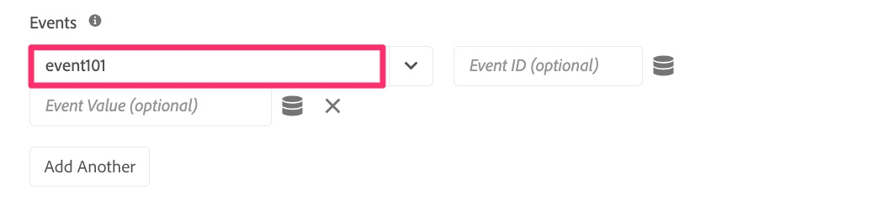

# Migrar regras de página adicionais

Neste exercício, você aprenderá a migrar regras adicionais baseadas em página para a extensão do Web SDK. Isso é semelhante ao exercício que você já fez ao migrar a regra padrão de carregamento de página para o Web SDK. Os métodos ainda se aplicam. A maior diferença é que, com essas regras, você não adicionará uma ação Enviar evento, pois, na maioria dos casos, a regra não contém a ação Enviar beacon de uma extensão do Analytics.

## Visão geral

Vamos fazer um backup um pouco, e falar sobre as implementações do Analytics como elas são com a extensão de tags da Adobe Analytics (também conhecida como implementação &quot;AppMeasurement&quot;, pois esse é o nome do arquivo da JavaScript).

Eu não presumirei saber exatamente como você é implementado, mas em muitas implementações usando tags Experience Platform, há um número de regras que são acionadas apenas condicionalmente, com base em algo na página ou no URL. Exemplos disso podem incluir:

* Regra de resultados da pesquisa, disparando somente quando uma pesquisa interna é executada e a página de resultados da pesquisa é exibida
* Regra de página de aterrissagem de campanha, acionada somente quando há um código de rastreamento no URL
* Regra de tipo de página, acionando apenas para uma página que seja um determinado tipo de página, por exemplo, a página de detalhes do produto, a página do carrinho de compras etc.
* Qualquer outra página que seja acionada condicionalmente

O ponto principal aqui é que todos esses casos de uso só são acionados **às vezes** em uma página, e **também** esperaríamos que a regra de página padrão fosse acionada. Portanto, não queremos incluir um Send Beacon (extensão AA) ou um Send Event (extensão do Web SDK) com qualquer uma dessas regras, caso contrário, ele resultaria em duas ocorrências para o mesmo carregamento de página.

Portanto, essas regras criam o objeto, mas não enviam os dados. Apenas garantimos que essas regras sejam acionadas **antes** da regra de carregamento de página padrão, para que, após a criação do objeto, a ação Enviar sinal/Enviar evento na regra de carregamento de página padrão envie tudo. Agora, é provável que você saiba tudo isso e que seja assim que seu site é configurado. Mas se você é novo na sua própria implementação do, ou se precisa &quot;corrigir&quot; sua implementação para assemelhar-se a este método, este exercício é especialmente útil para você.

## Exemplo de migração de regra condicional

Este é um exemplo de migração de uma regra que é acionada condicionalmente. Vou usar o exemplo acima de uma landing page de campanha. Como disse acima, isso segue o mesmo padrão com o qual já trabalhamos na regra de página padrão, exceto que é ainda mais fácil porque estamos apenas definindo variáveis e não acionando nenhum hit.

1. Localize a regra condicional. Neste exemplo, encontramos a regra do código de rastreamento da campanha e a selecionamos.

   

1. Quando a regra é aberta, podemos ver que há uma condição no acionamento dessa regra com base em um parâmetro de cadeia de caracteres de consulta. Não precisamos alterar nada sobre a condição, pois queremos apenas atualizar/migrar a ação, não o evento ou a condição.
1. Clique na ação **Adobe Analytics - Definir variável**
1. Anote qualquer coisa que estiver sendo definida na ação. Neste exemplo, observamos que **event101** está definido, bem como a variável **Campaign**.

   
   

1. Nós só clicamos aqui para fazer a anotação, e não precisamos alterar nada, então agora podemos simplesmente clicar em **cancelar**.
1. Crie uma nova ação clicando no **ícone de adição** na seção de ações

   

1. Configurar a nova regra
   1. Selecione **Adobe Experience Platform Web SDK** no menu suspenso Extensão.
   1. Selecione **Atualizar Variável** no menu suspenso Tipo de Ação.
   1. No painel direito, selecione o objeto do **Analytics** dentro do objeto de dados

      

1. Agora defina event101 e a variável campaign com os mesmos valores que foram definidos na ação existente.

   
   

1. Agora você pode **Manter alterações** e **Salvar na Biblioteca**, e sua regra foi migrada para o Web SDK.

>[!IMPORTANT]
>
>Como a regra de carregamento de página padrão, deixamos a ação **Definir variável** da extensão do Analytics na regra para que possamos comparar os dados à medida que validamos nossa migração. Não se esqueça de entrar novamente mais tarde e remover a ação da extensão do Analytics enquanto você faz a limpeza final.
