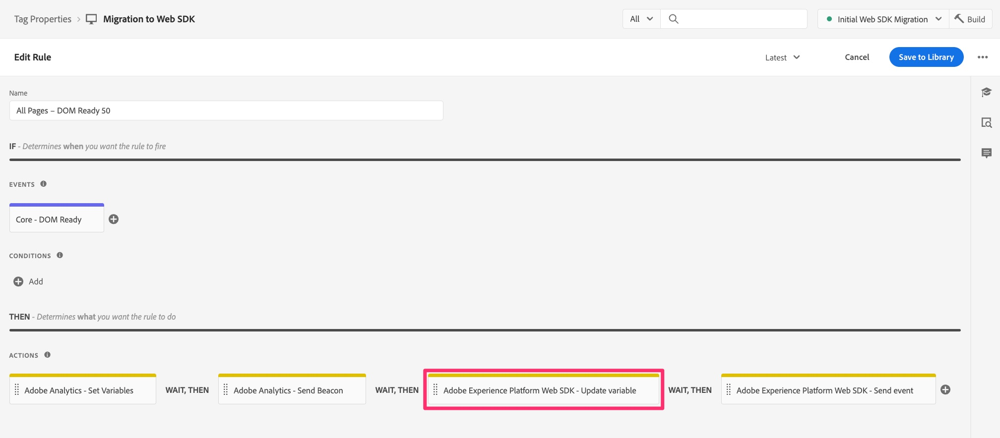
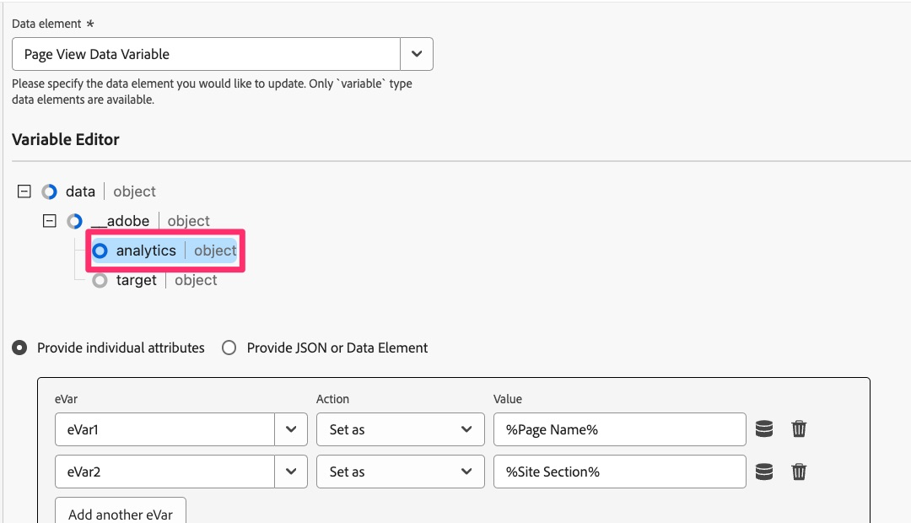
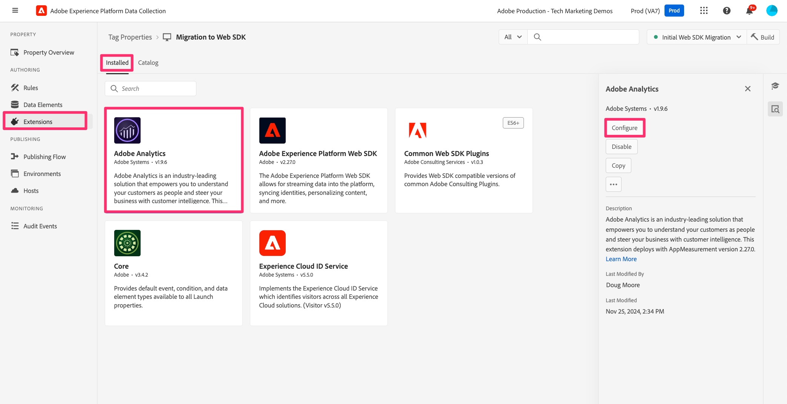
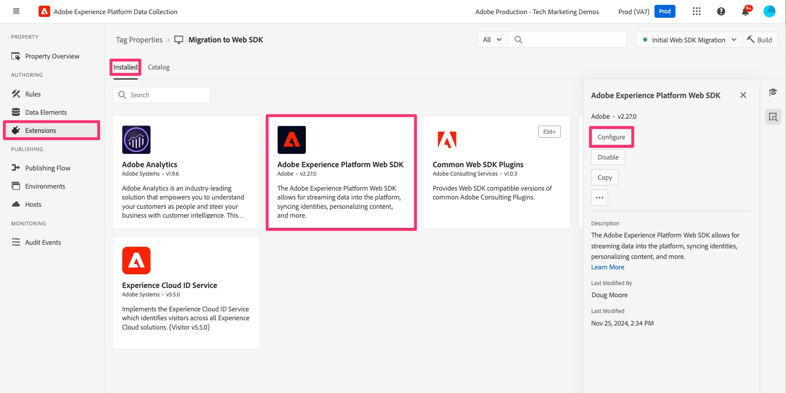

# Migrar código personalizado para o Web SDK

Neste exercício, você aprenderá a migrar o código personalizado da extensão do Adobe Analytics para a extensão do Adobe Experience Platform Web SDK em Tags Experience Platform.

## O grande aviso

Tenho certeza de que você não ficará surpreso de que adicionarei algo como isso a um documento que começa informando a melhor/mais fácil/mais eficaz maneira de trabalhar com código. Há claramente várias maneiras diferentes de escrever, editar e manipular o código. Neste exercício, vou fornecer uma maneira de pegar facilmente o código que você tem em uma regra existente e copiá-lo, adicionar uma alteração e fazer com que funcione para a regra migrada. Se você pensar em uma maneira melhor de fazê-lo, isso é fantástico, e eu não apenas dou as boas-vindas a você para usá-lo, mas para compartilhá-lo conosco e com seus colegas na comunidade Experience League (especialmente na publicação da comunidade sobre este tutorial). O mesmo vale para a metade inferior da página, trabalhando com plug-ins de implementação. Vou sugerir um jeito aqui, e então você faz o que é bom para você. OK, vamos entrar nos detalhes.

>[!IMPORTANT]
>
>No espírito do último parágrafo, também é importante recomendar que você aproveite essa oportunidade durante a migração para o Web SDK para observar bem o código e ver se algum dele deve ser atualizado ou até excluído. Nos parágrafos e etapas abaixo, você verá como migrar seu código e, mesmo que seja mais fácil movê-lo de uma só vez, seria negligente não recomendar uma limpeza de mola, por assim dizer.

## Migração de qual código?

O código que abordaremos primeiro nesta seção é o código que você pode ter na janela &quot;Código personalizado&quot; em qualquer ação do Adobe Analytics, incluindo as ações **Definir variável**. Em outras palavras, abra uma das regras e procure na seção ações. Se você tiver uma ação &quot;Adobe Analytics - Definir variáveis&quot;, clique para abri-la.


Em seguida, role para baixo no lado direito até a parte inferior e você verá o botão &quot;Abrir editor&quot; da janela Código personalizado. Clique para abrir.


Se você tiver código lá, será necessário migrá-lo para que possa ser executado e enviado para o Adobe Analytics usando a Web SDK.
A ideia principal aqui é que vamos converter o objeto &quot;s&quot; em &quot;content.__adobe.analytics&quot;.

Precisaremos apenas adicionar um código adicional antes da primeira chamada ao objeto s, para que ele possa ser entendido e manipulado pelo Web SDK. O local em que adicionamos o código recém-alterado é na janela Custom Code da ação &quot;Adobe Experience Platform Web SDK - Atualizar variável&quot;.

Por exemplo, digamos que você tenha o seguinte bloco de código na janela de código personalizado:

```javascript
const products = window.digitalData.products;
const productIndex = event.element.dataset.productIndex;
const product = products[productIndex];
s.products = [
product.cat3Tag,
product.id,
1,
product.price
].join(";");
```

O código que você precisa incluir é o seguinte:

```javascript
content.__adobe = content.__adobe || {};
content.__adobe.analytics = content.__adobe.analytics || {};
const s = content.__adobe.analytics;
```

Portanto, siga estas etapas para migrar o código personalizado:

1. Copie o código personalizado da janela na ação Definir variáveis do Adobe Analytics
1. Feche essa janela de código e feche (cancele) a ação.
1. Abra a ação Web SDK - Atualizar variável clicando nela (ou se você ainda não tiver uma, adicione uma).

   

1. Selecione o objeto do Analytics na parte superior da janela do lado direito

   

1. Role para baixo e abra a janela Código personalizado

   

1. Cole o código que você trouxe da janela de código personalizado do Analytics
1. Agora, coloque as novas linhas de código no meio do código existente, para que fique acima da primeira menção do objeto s, como no exemplo a seguir:


Agora você pode salvar o código na janela Código personalizado e manter as alterações na ação Atualizar variáveis. Além disso, salve a regra e publique as novas alterações na biblioteca de trabalho.

## E os plug-ins?

Se você tiver uma implementação &quot;appMeasurement&quot; do Adobe Analytics, usando a extensão do Analytics em Tags Experience Platform (anteriormente conhecida como &quot;Launch&quot;), é provável que você esteja usando um ou mais &quot;plug-ins&quot; do JavaScript para definir variáveis ou fazer outras tarefas. Se essas funções e chamadas do JavaScript estiverem em uma janela de código dentro de uma regra, as informações acima nesta página deverão ajudar a migrar o código para o Web SDK.
No entanto, também é mais provável que seu código de plug-in esteja na janela de código na configuração da própria extensão do Adobe Analytics. Para verificar se você tem plug-ins e outros códigos para migrar, abra a extensão do Analytics acessando Coleção de dados e Marcas, abra a propriedade e clique em **Extensões** na navegação à esquerda.

1. Selecione a guia **Instalado** na parte superior da página e selecione sua extensão do Adobe Analytics.
1. Em seguida, no lado direito da página, clique em **Configurar**

   

1. Expanda a seção **Configurar rastreador usando código personalizado**
1. Clique para **Abrir editor**

   

Nesse ponto, é possível ver o código do que você tem lá, e você pode ter &quot;plug-ins&quot; do JavaScript, ou seja, trechos de código que ajudam a obter alguns dados desejados e atribuí-los a dimensões personalizadas etc.

Nem tudo nesta janela de código pode ser considerado plug-ins, no sentido mais verdadeiro do Adobe Analytics. É importante entender isso ao decidir como migrar seu código.

### Recomendação para migrar o código da janela de código principal da extensão

Novamente, nem tudo na janela de código pode ser um plug-in oficial criado pela Adobe Consulting. Alguns deles podem ser códigos que você escreveu, independentemente de você chamar isso de plug-in. Recomendamos duas alterações. Eles são para usar uma nova extensão e também para copiar e colar o restante do código em um novo local.

**Primeiro**, há uma extensão disponível nas Marcas denominada **Plug-ins Comuns do Web SDK**. Essa extensão é um subconjunto da lista total de plug-ins de implementação listados na documentação do Adobe Analytics. Ao instalar essa extensão na propriedade Tags, você está instalando o código dos plug-ins incluídos. Em seguida, para usar esses plug-ins, você os encontrará ao criar novos **elementos de dados**. Mais sobre isso em um momento.

**Segundo**, há uma janela de código na configuração da extensão do Web SDK em que você pode colocar todo (ou parte) seu código, SE quiser que esse código seja executado antes que os eventos sejam enviados para o Adobe Analytics. As etapas para descobrir essa janela de código são:

1. Supondo que você já tenha adicionado a extensão Web SDK à sua propriedade, navegue até **Extensões** e selecione a guia **Instalado**
1. Selecione a **extensão do Adobe Experience Platform Web SDK** e abra-a clicando em **Configurar** no painel direito.

   

1. Role para baixo até a seção **Coleção de dados** e clique para abrir a janela de código para **onBeforeEventSend**.

   

É aqui que você colará qualquer código que deseje executar antes que o evento seja enviado para o Analytics a partir do Web SDK. Basicamente, era isso que a função doPlugins fazia na implementação antiga do Analytics.

A **boa notícia** é que isso deve ser executado **a qualquer momento** quando você envia um evento, de modo que, independentemente de isso acontecer no carregamento da página ou com um link personalizado, esse código deve ser executado, definir suas variáveis etc.

#### Preciso alterar meu código?

Bem, sim e não. Sim, você precisa alterar algumas pequenas coisas, mas não, você não precisará alterar a maior parte do seu código, desde que você altere essas pequenas coisas:

_&#x200B;**Alteração de código 1:**&#x200B;_
Depois (ou antes, sua escolha) de colar o código do &quot;plug-in&quot; na janela de código na extensão do Web SDK, **remova** as linhas &quot;doPlugin&quot; do código. Você não vai precisar deles e eles causarão um erro, pois fazem parte do appMeasurement.js, mas não do código do Web SDK.


_&#x200B;**Alteração de código 2:**&#x200B;_
A outra alteração que você precisará fazer é adicionar algum código para que o objeto &quot;s&quot; seja definido, muito semelhante ao que é discutido acima sobre o código em ações de regra. Nesse caso, precisaremos definir o código de forma um pouco diferente, adicionando um nó &quot;dados&quot; que já está definido na ação de regra, mas não aqui.
Essa definição deve ser colocada na parte superior da janela de código. O código que precisa ser copiado no (ao colocar o código na extensão do Web SDK) é o seguinte:

```javascript
content.data.__adobe = content.data.__adobe || {};
content.data.__adobe.analytics = content.data.__adobe.analytics || {};
const s = content.data.__adobe.analytics;
```

_&#x200B;**Com ambas as alterações de código:**&#x200B;_
Este é o código listado acima, mas com ambas as alterações que acabamos de discutir:


### Etapas para migrar o código da extensão principal para o Web SDK

Como dito acima, a recomendação é dupla: usar a nova extensão de plug-ins comuns do Web SDK e também copiar e colar seu código da configuração de extensão do Analytics na configuração de extensão do Web SDK. Com isso em mente, juntamente com a observação importante na parte superior da página para limpar seu código, estas são as etapas recomendadas em alto nível:

1. Copie todo o código da janela de código de configuração da extensão do Analytics e cole-o na janela onBeforeEventSend na configuração da extensão do Web SDK (embora possamos estar copiando o código que precisa ser removido ou atualizado, faremos algumas passagens no código na nova janela).
1. Percorra o código agora na extensão Web SDK e procure chamadas para plug-ins ou definição de função para plug-ins definidos na **extensão Plug-ins Comuns do Web SDK**. Você pode encontrar a lista de plug-ins na janela de definição do elemento de dados do Web SDK após instalar a extensão de plug-ins. Você também pode encontrá-lo na [documentação dessa extensão](https://exchange.adobe.com/apps/ec/108520).
1. Para cada plug-in encontrado na nova extensão de plug-ins do Web SDK, remova a extensão e a chamada a ela do código. Em seguida, compense essa remoção criando um elemento de dados e chamando esse elemento de dados na regra apropriada para definir variáveis etc.
1. Em seguida, passe pelo código para ver se há chamadas para funções que foram definidas no arquivo appMeasurement.js. **Alteração de Código 1** acima é um exemplo disso, e você pode fazer essa remoção do código doPlugins neste momento, caso ainda não o tenha feito. Para outras instâncias, isso será mais evidente quando você tiver uma chamada para uma função que não está definida em nenhum lugar do código. Você também pode consultar o Suporte ao cliente do Adobe ou seus colegas na Comunidade do Experience League para verificar se esse é o caso com esse código.
1. Em seguida, passe pelo código para atualizar ou excluir qualquer código antigo que não se aplique mais às suas necessidades de análise, conforme recomendado na parte superior desta página.
1. Agora faça a **Alteração de código 2** listada acima, adicionando as linhas extras para que qualquer referência ao objeto s não cause erros no código.
1. Por último, mas certamente não menos importante, teste, teste e teste mais alguns. Depois disso, teste novamente. Certifique-se de que seu código esteja fornecendo os resultados esperados no depurador de Experience Platform, bem como nos relatórios no Adobe Analytics.

>[!NOTE]
>
>Duas últimas considerações sobre as etapas acima.
>Primeiro, você pode estar pensando que seria mais fácil deixar todo o código do plug-in lá em vez de removê-lo e usar a nova extensão de plug-ins comuns do Web SDK. Isso é verdadeiro e correto, mas ao usar a extensão você obtém as vantagens de usar uma interface do usuário, definir um elemento de dados reutilizável e também receber automaticamente qualquer atualização de código no futuro. Provavelmente vale a pena fazer a troca.
>
>Em segundo lugar, falando em &quot;fazer a troca&quot;, você também pode decidir atualizar TODO o seu código personalizado para que ele não faça referência ao objeto &quot;s&quot; antigo, que é uma espécie de extensão da etapa 5 acima. Isso é, é claro, totalmente aceitável e uma ótima ideia. Este tutorial de migração está apenas tentando facilitar um pouco a migração do seu código personalizado, caso você tenha muito dele e não tenha os recursos para atualizá-lo agora. Você decide.

Encerraremos esta lição da maneira que a iniciamos, com um reconhecimento de que há muitas maneiras de escrever código, e este documento fornece algumas etapas a serem seguidas se você quiser fazer isso dessa maneira. O principal é que seu código funciona e obtém os resultados que você espera, então sinta-se livre para fazer do seu jeito, e eu mencionei que você deveria testar?
