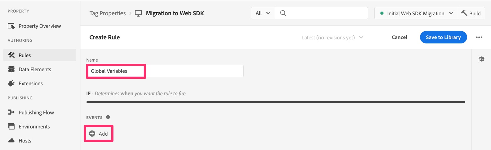

# Migrar variáveis globais

Neste exercício, você aprenderá a migrar variáveis globais da configuração da extensão do Analytics para o Web SDK.

## Visão geral

Na extensão do Adobe Analytics, há uma seção de configuração chamada &quot;Variáveis globais&quot;.

As variáveis globais são variáveis definidas no objeto de rastreamento do Analytics quando esse objeto é inicializado na página. Todas as variáveis definidas aqui serão definidas quando o objeto de rastreamento for criado em cada página.

Se você tiver variáveis definidas aqui, precisamos migrá-las também para o Web SDK.

## Onde adicionar variáveis globais no Web SDK

A **conclusão** aqui é que não há uma área equivalente na configuração da extensão Web SDK, portanto, não será tão fácil quanto copiar as variáveis como fizemos no exercício Regra de carregamento de página padrão.
Em vez disso, a resposta curta é: **Crie uma nova regra que seja executada antes das outras regras em cada página e defina as variáveis nela.**

Se você não precisar de etapas definidas para você, faça isso e termine esta lição. Se desejar ajuda, continue...

### Etapas para migrar Variáveis globais para o Web SDK

1. Abra a configuração da extensão do Adobe Analytics.

   

1. Role para baixo até a seção Variáveis globais (imagem acima), abra-a e anote qualquer/todas as variáveis que estão sendo definidas. Você precisará conhecer essas variáveis e esses valores em uma etapa posterior.
1. Cancele novamente fora da extensão do Analytics.
1. Selecione **Regras** na navegação à esquerda e clique em **Adicionar regra**.
1. Dê um nome à nova regra &quot;Variáveis globais&quot;.
1. Clique no botão Adicionar em Eventos.

   

1. Configure o evento para ser acionado antes das outras regras. Você precisará saber o tipo de evento e a ordem usada em outras regras. Valores de exemplo:
   1. Definir a **Extensão** como Principal
   1. O **Tipo de Evento** pode estar Pronto para DOM, dependendo da implementação
   1. Expanda as **Opções Avançadas**
   1. Defina o **Pedido** com um número menor do que suas outras regras, para que ele seja executado primeiro.
      
      >[!NOTE]
      >
      >O principal aqui é que essa regra é acionada antes da regra padrão de carregamento de página, para que qualquer variável definida nessa regra possa ser enviada para o Analytics por meio da regra sendEvent. No entanto, sugerimos que esta regra seja executada **primeiro** no geral, pois as variáveis definidas na seção Variáveis globais da extensão do Analytics podem ser alteradas em outras regras. Estamos mimetizando essa funcionalidade. Na amostra acima, estamos supondo que &quot;10&quot; seja um número de ordem menor do que qualquer uma de suas outras regras. Se isso não estiver correto, altere o número para um número menor que suas outras regras.
1. Selecione **Manter alterações** para salvar seu trabalho.
1. Não é necessário adicionar condições a esta regra, para que você possa deixar essa seção de criação de regra sozinha.
1. Clique no ícone de adição na seção **Ações**
1. Configurar a nova ação
   1. Escolha a **Extensão** do Adobe Experience Platform Web SDK
   1. Para o **Tipo de ação**, escolha Atualizar variável
   1. À direita, escolha sua variável **Elemento de dados** (para este tutorial, ele foi chamado de &quot;Elemento de dados de exibição de página&quot;, mas a sua pode variar)
   1. Selecione **Analytics** no objeto de dados
   1. Preencha as variáveis salvas na seção Variáveis globais da configuração da extensão Analytics (no exemplo deste tutorial, definir o eVar10 como o elemento de dados tipo página)

   

1. Manter alterações
1. Salve a regra na biblioteca de trabalho e crie

Suas variáveis globais agora são migradas para o Web SDK e serão acionadas em qualquer carregamento de página.
