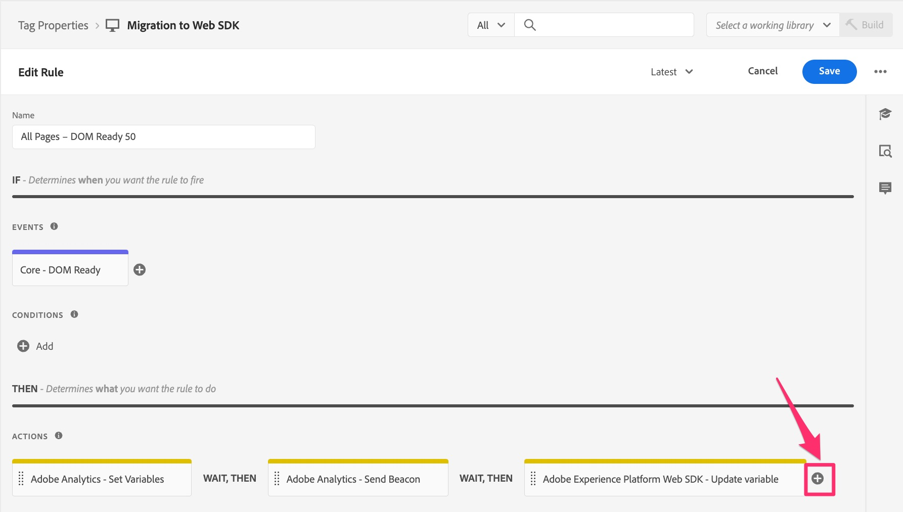

# Migrar sua regra de carregamento de página padrão

Neste exercício, você aprenderá a migrar uma regra de carregamento de página padrão nas Tags do Adobe Experience Cloud da extensão do Analytics para a extensão do Web SDK.

## Visão geral

Vamos voltar um pouco. É provável que você tenha uma regra em Tags acionada em cada página, uma que defina uma ou mais variáveis padrão e, em seguida, acione um beacon ou uma ocorrência no Adobe Analytics. No momento, essa regra está usando &quot;ações&quot; na extensão do Adobe Analytics para fazer essas coisas. À medida que migramos nossa implementação para o Web SDK, precisamos remover todas as referências (como as ações) à extensão do Analytics e substituí-las por ações que pertençam ao Web SDK. Nas etapas abaixo, assumiremos o que foi descrito acima; ou seja, você tem uma regra padrão de carregamento de página que define variáveis e envia um beacon de rastreamento para o Analytics.

## Migrar a ação Definir variáveis

Nesta atividade, criaremos uma ação do Web SDK que é equivalente à ação **Definir Variáveis** na extensão do Adobe Analytics.

1. Na interface da Coleção de dados e na propriedade, acesse a tela **[!UICONTROL Regras]** selecionando-a na navegação à esquerda.
1. Selecione a regra que é a sua **regra de carregamento padrão do Analytics**. Se você não souber qual regra é a sua regra de carregamento padrão, fale com alguém que tenha conhecimento das regras e do que está nelas. Novamente, estamos procurando uma regra que seja executada em cada página, defina algumas variáveis padrão (por exemplo, nome da página) e envie um beacon para o Analytics. Vamos fazer alterações nessa regra. A minha se chama &quot;Todas as páginas - DOM Pronto 50&quot;, mas a sua pode ter qualquer nome.

   

1. Para migrar as ações atuais da extensão do Analytics para a extensão do Web SDK, precisamos saber quais variáveis estão sendo definidas. Portanto, clique na ação **Adobe Analytics - Definir variáveis** para ver quais variáveis estão sendo definidas (por exemplo, PageName, props, eVars, eventos etc.).

   
   1. Observe quais variáveis estão sendo definidas nessa regra
      

1. Na parte superior da página, altere o botão de opção para **Fornecer JSON** e será exibida uma exibição de código das variáveis definidas. Essa visualização de código e a visualização da interface do usuário são intercambiáveis, e quando você definir qualquer item em uma interface do usuário, ela também será atualizada na outra interface do usuário.

   

1. Copie esses dados para a área de transferência ou salve-os em um arquivo para usar imediatamente, pois nas próximas etapas você colará esse código em uma nova ação do Web SDK.
1. Cancele a ação Definir variáveis do Analytics para voltar à regra.

   >[!IMPORTANT]
   >
   >Você tem opções nesta etapa, incluindo o seguinte:
   >1. Em vez de adicionar uma nova ação, basta alterar as ações existentes, que, quando salvas, cortam imediatamente quaisquer dados para o novo conjunto de relatórios do Web SDK e não são mais exibidos no conjunto de relatórios atual do Analytics.
   >1. Você pode criar uma nova ação para enviar os dados para o Analytics por meio do Web SDK, deixando a ação do Analytics em vigor por enquanto. Isso lhe dará a chance de comparar os dados no novo conjunto de relatórios do Web SDK com o conjunto de relatórios atual do Analytics. **Este é o que faremos neste tutorial.** Lembre-se que esse método RESULTARÁ em ocorrências duplas enquanto você compara os dados, resultando também em um custo para as chamadas de servidor adicionais, até que você remova as ações da extensão antiga do Analytics. Obviamente, você não desejará manter as ações da extensão do Analytics lá para sempre, mas apenas tempo suficiente para validar se os dados estão fluindo corretamente para o conjunto de relatórios da nova extensão do Web SDK.

1. Clique no **botão de adição** para adicionar uma nova ação do Web SDK.

   

1. Selecione **Adobe Experience Platform Web SDK** no menu suspenso Extensão.
1. Selecione **Atualizar Variável** no menu suspenso Tipo de Ação.
1. Certifique-se de que o **Elemento de dados** listado na parte superior do painel direito seja realmente seu novo elemento de dados de tipo variável.
1. No painel direito, selecione o objeto do **Analytics** dentro do objeto de dados
   
1. Agora altere o botão de opção para **Fornecer JSON ou Elemento de Dados** e cole o código que você copiou na etapa anterior de Definir Variáveis nesta janela de código. Lembre-se de que o que estamos mostrando aqui no tutorial são apenas exemplos. Você está copiando e colando suas próprias variáveis.

   
Essa ferramenta de cópia JSON foi criada especialmente para facilitar a migração. Tenho certeza de que você pode ver como isso é fácil, em vez de precisar fazer anotações abrangentes da ação antiga e aplicá-las à nova ação.

1. Você pode, a qualquer momento, alternar o botão de opção para frente e para trás para ver os valores na versão do código (mostrada acima) ou na versão da interface do usuário da visualização dos atributos. Selecione o botão de opção **Fornecer atributos individuais** para ver os atributos preenchidos.

   
   

1. Quando você puder ver suas variáveis definidas corretamente, clique em **Manter Alterações/Salvar.**

## Migrar a ação Enviar sinal

Nesta atividade, criaremos um equivalente do Web SDK da ação &quot;Enviar beacon&quot; do Analytics, chamada **Enviar evento**.

1. Volte para a regra de página padrão na qual você estava.
1. Na seção de ações, clique no **botão de adição** para adicionar outra ação. Esta será nossa ação **Enviar Evento**.

   

1. Para configurar a ação, selecione **Adobe Experience Platform Web SDK** no menu suspenso Extensão.
1. Selecione **Enviar evento** no Tipo de ação.
1. No painel direito, selecione o ícone de elemento de dados ao lado do Objeto **Dados**.

   

1. Selecione a Variável de dados de Exibição de página (ou o elemento de dados do tipo chamado &quot;dados&quot;) e clique no botão **Selecionar**.

   

1. Clique em **Manter alterações/Salvar**.
1. Agora você deve ver todas as quatro ações (duas antigas e duas novas) na regra

   

## Devo excluir as ações da extensão do Analytics?

Ótima pergunta. A resposta é se você deseja ou não validar as novas ações antes de se livrar das antigas. Como mencionei acima, se você deixar as ações do Analytics e do Web SDK que enviam dados (Enviar beacon e Enviar evento), como escolhemos fazer neste tutorial, você terá os mesmos dados entrando em dois conjuntos de relatórios (ou seja, o conjunto de relatórios de produção da extensão do Analytics e seu novo conjunto de relatórios de validação da extensão do Web SDK). Isso resulta na duplicação das chamadas de servidor para o Analytics e há um custo associado a elas. No entanto, essa é a quantidade de clientes que está optando por fazê-lo para que possam validar os novos dados antes de desligar os dados antigos. Faremos um exercício no final deste tutorial que mostra como limpar os itens antigos quando você estiver satisfeito com a validação, mas se quiser fazer isso agora para salvar chamadas de servidor e não se preocupar com a validação, sinta-se à vontade para pular para o final do tutorial ou simplesmente exclua as ações da extensão do Analytics fora das regras conforme avança.
