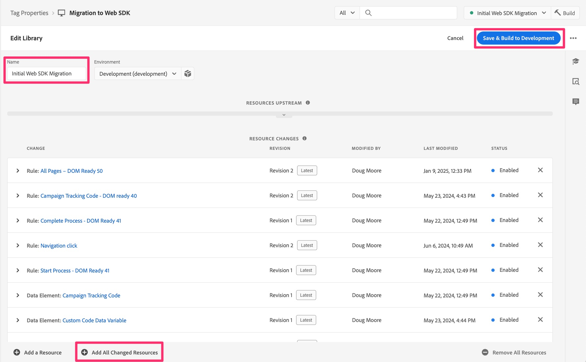

# Publicar a migração para preparo e produção

Quando todo o desenvolvimento for concluído para a migração e validado, crie para preparo e, em seguida, publique para produção quando estiver pronto.

## Visão geral

Essa é realmente a última etapa principal da migração, e é mover a biblioteca que você tem usado para desenvolver e testar a migração para o ambiente de preparo, a fim de realizar os testes finais nele e, em seguida, para o ambiente de produção.

Se você voltar para a lição [Criar e configurar uma sequência de dados](create-and-configure-the-analytics-datastream.md), verá no final dela que apontamos a sequência de dados de preparo para enviar os dados de análise para o mesmo conjunto de relatórios de desenvolvimento (ou, como alternativa, para um novo conjunto de relatórios de preparo). Você também será lembrado de que apontamos a sequência de dados de produção para enviar dados ao conjunto de relatórios de produção existente que você tem usado.
Essas são apenas boas informações a serem fornecidas, pois agora enviamos a biblioteca migrada pelo caminho de publicação para o armazenamento temporário e a produção.

## Envio para ambientes de preparo e produção

Estas são as etapas que levarão nossa biblioteca para ambientes de preparo e produção:

1. Na interface Tags, selecione Fluxo de publicação na navegação à esquerda
1. Você deve ver sua biblioteca de migração em Desenvolvimento (sendo o nome escolhido no início deste processo de migração)

   

1. Se você tiver certeza de que já adicionou cada alteração à biblioteca, poderá mover a biblioteca para frente sob os três pontos e pular as próximas várias etapas. Se não tiver certeza, siga as próximas cinco etapas.
1. Clique no nome da biblioteca para acessar os detalhes da biblioteca
1. Verifique se você está na biblioteca correta através do nome
1. Selecione Adicionar todos os recursos alterados na parte inferior da página
1. Em seguida, clique em Salvar e criar no desenvolvimento para adicionar todas as alterações na fila à biblioteca

   

1. Isso o levará de volta à interface do fluxo de publicação e, se a criação for concluída com êxito, haverá um ponto verde ao lado da biblioteca.
1. Você pode prosseguir com a biblioteca no processo de publicação, com base nas suas necessidades. Você pode defini-lo para aprovações, movê-lo diretamente para o ambiente de preparo para testar e aprovar lá ou até mesmo movê-lo para aprovação ou publicação diretamente na produção. Novamente, isso depende das necessidades de publicação da sua organização.

   

Parabéns! Neste ponto, sua implementação do Analytics está totalmente no Web SDK.

Vou adicionar uma observação importante aqui que tivemos no início deste tutorial:

>[!IMPORTANT]
>
>É importante observar que um dos principais motivos pelos quais você está fazendo essa migração da sua implementação é para se preparar para usar os aplicativos da Adobe Experience Platform, como o Customer Journey Analytics, o Real-Time CDP ou o Journey Optimizer. Usar os dados do site para essa finalidade incluirá etapas adicionais que não estão incluídas neste tutorial, mas este tutorial certamente será um pré-requisito para esse avanço adicional da implementação. Agora que concluiu este tutorial, você está pronto para executar as etapas necessárias para enviar também os mesmos dados do site para a Experience Platform.

Boa sorte na sua jornada com análises e outros esforços de conteúdo e marketing!
