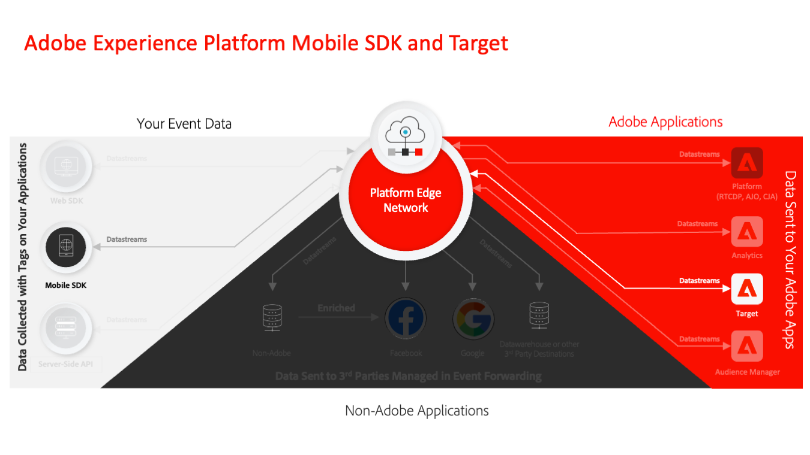

# Migrar do Adobe Target para o Adobe Journey Optimizer - Extensão móvel de decisão

Este guia é para implementadores experientes do Adobe Target que aprendem a migrar implementações existentes do Adobe Experience Platform Mobile SDK da extensão do Adobe Target para a Adobe Journey Optimizer - Extensão de decisão.

O Adobe Experience Platform Mobile SDK capacita o engajamento completo em seus aplicativos móveis. A extensão do Target se baseia no Mobile SDK para ajudar você a personalizar as experiências do aplicativo com o Adobe Target. A extensão Decisioning é uma abordagem mais recente para implementar o Adobe Target em aplicativos móveis que usa recursos de Edge Network do Adobe Experience Platform que ajudam a integrar o Target a aplicativos baseados em plataforma, como Real-Time CDP e Journey Optimizer.

>[!INFO]
>
>No ecossistema do Adobe Experience Platform Mobile SDK, as extensões são implementadas pelos SDKs importados para seus aplicativos que podem ter nomes diferentes:
>
> * **Target SDK** implementa a **extensão do Adobe Target**
> * **Otimizar o SDK** implementa a **Adobe Journey Optimizer - Extensão de decisão**

## Principais benefícios

Alguns dos benefícios da extensão do Adobe Journey Optimizer Decisioning em comparação à extensão do Target incluem:

* Compartilhamento mais rápido de públicos do [Real-time Customer Data Platform](https://experienceleague.adobe.com/docs/platform-learn/tutorials/experience-cloud/next-hit-personalization.html?lang=pt-BR)
* Integração do Target ao Journey Optimizer para oferecer suporte à [entrega de Offer decisioning](https://experienceleague.adobe.com/docs/target/using/integrate/ajo/offer-decision.html)
* Uma integração mais estreita com o Adobe Analytics, que não depende da compilação de informações de chamadas de rede separadas
* Flexibilidade adicional na implementação para desenvolvedores

Indiscutivelmente, o maior benefício para os clientes do Target da migração é a integração com o Real-time Customer Data Platform. A Real-Time CDP oferece excelentes recursos de criação de público com base na gama completa de dados assimilados no Experience Platform e em seu recurso de Perfil do cliente em tempo real. Uma estrutura integrada de governança de dados automatiza o uso responsável desses dados. A IA do cliente permite usar facilmente modelos de aprendizado de máquina para criar modelos de propensão e churn cuja saída pode ser compartilhada de volta com a Adobe Target. E, por fim, os clientes dos complementos opcionais de Assistência médica, Privacidade e segurança podem usar o recurso de aplicação de consentimento para aplicar as preferências de consentimento de clientes individuais. O Platform Mobile SDK e a extensão Decisioning são um requisito para usar esses recursos do Real-Time CDP no canal móvel.

## Etapas de migração

O nível de esforço para migrar da extensão do Target para a extensão do Decisioning depende da complexidade da implementação atual e dos recursos do Target usados.

Independentemente da simplicidade ou complexidade de sua implementação, é importante entender totalmente seu estado atual antes de migrar. Este guia ajuda a detalhar os componentes da implementação atual e desenvolver um plano gerenciável para migrar cada parte.

O processo de migração envolve as seguintes etapas principais:

1. Avalie sua implementação atual e determine uma abordagem de migração
1. Configure os componentes iniciais para conectar ao Edge Network Adobe Experience Platform
1. Atualizar a implementação básica para substituir a extensão do Target pela extensão do Decisioning
1. Melhore a implementação Otimizar o SDK para seus casos de uso específicos. Isso pode envolver a transmissão de parâmetros adicionais, o uso de tokens de resposta e muito mais.
1. Atualizar objetos na interface do Target, como scripts de perfil, atividades e definições de público-alvo
1. Valide a implementação final antes de fazer a mudança no aplicativo de produção

>[!INFO]
>
>No ecossistema do Adobe Experience Platform Mobile SDK, as extensões são implementadas pelos SDKs importados para seus aplicativos que podem ter nomes diferentes:
>
> * **Target SDK** implementa a **extensão do Adobe Target**
> * **Otimizar o SDK** implementa a **Adobe Journey Optimizer - Extensão de decisão**

Em seguida, analise a [comparação detalhada entre a extensão do Target e a extensão do Decisioning](detailed-comparison.md) para obter uma melhor compreensão das diferenças técnicas e identificar áreas que exigem foco adicional.

>[!NOTE]
>
>Estamos empenhados em ajudá-lo a ser bem-sucedido na migração para dispositivos móveis do Target da extensão do Target para a extensão do Decisioning. Se você encontrar obstáculos com sua migração ou achar que há informações críticas ausentes neste guia, envie-nos uma mensagem em [esta discussão da comunidade](https://experienceleaguecommunities.adobe.com/t5/adobe-experience-platform-data/tutorial-discussion-migrate-target-from-at-js-to-web-sdk/m-p/575587#M463).
