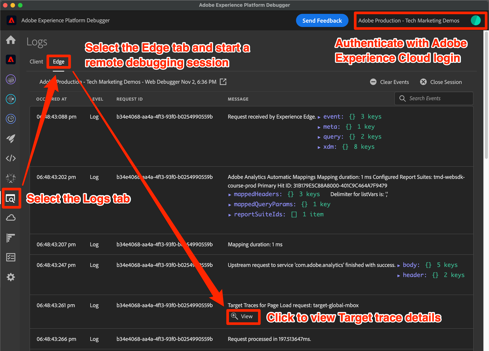

# Depurar o Target com o SDK da Web da plataforma

Verificação de atividades do Target e depuração do SDK da Web para solucionar problemas de implementação, entrega de conteúdo ou qualificação de público-alvo. Esta página do guia de migração explica as diferenças entre a depuração com at.js e o SDK da Web da plataforma.

A tabela abaixo resume os recursos e o suporte para testes e abordagens de depuração.

| Recurso ou ferramenta | Suporte à at.js | Suporte ao SDK da Web da plataforma |
| --- | --- | --- |
| URLs de controle de qualidade da atividade | Sim | Sim |
| `mboxDisable` Parâmetro de URL | Sim | Consulte as informações abaixo para [desativar a funcionalidade do Target](#disable-target-functionality) |
| `mboxDebug` Parâmetro de URL | Sim | Use `alloy_debug` parâmetro para informações de depuração semelhantes |
| `mboxTrace` Parâmetro de URL | Sim | Usar a extensão de navegador do Experience Platform Debugger |
| Extensão do Adobe Experience Platform Debugger | Sim | Sim |
| `alloy_debug` Parâmetro de URL | Não aplicável | Sim |
| Adobe Experience Platform Assurance | Não aplicável | Sim |

## Extensão do navegador do Adobe Experience Platform Debugger

A extensão do Adobe Experience Platform Debugger para Chrome e Firefox avalia as páginas da Web e ajuda a validar as implementações do Adobe Experience Cloud.

Você pode executar o Platform Debugger em qualquer página da Web e a extensão tem acesso a dados públicos. Para acessar dados não públicos usando a extensão , como informações de rastreamento do Target, você deve autenticar no Experience Cloud por meio da **[!UICONTROL Fazer logon]** link .

### Obter e instalar o Adobe Experience Platform Debugger

O Adobe Experience Platform Debugger pode ser instalado nos navegadores Google Chrome ou Mozilla Firefox. Siga o link apropriado abaixo para instalar a extensão em seu navegador preferido:

- [Google Chrome](https://chrome.google.com/webstore/detail/adobe-experience-platform/bfnnokhpnncpkdmbokanobigaccjkpob)
- [Firefox](https://addons.mozilla.org/pt-BR/firefox/addon/adobe-experience-platform-dbg/)

Depois de instalar a extensão do Chrome ou o complemento Firefox, um ícone () é adicionada à barra de extensão. Selecione este ícone para abrir a extensão.

Consulte o guia dedicado para obter mais informações sobre o [Extensão do Adobe Experience Platform Debugger](https://experienceleague.adobe.com/docs/experience-platform/debugger/home.html) e como depurar todos os aplicativos web do Adobe.

## Visualizar atividades do Target com URLs de controle de qualidade

A at.js e o SDK da Web da plataforma permitem visualizar as atividades do Target usando URLs de controle de qualidade do Target, e ambos os métodos de implementação oferecem suporte aos mesmos recursos de controle de qualidade.

Os URLs de controle de qualidade do Target que funcionam com as instruções da at.js ou do SDK da Web da plataforma para gravar um cookie específico em seu navegador chamado `at_qa_mode`. Esse cookie é usado para forçar a qualificação de uma atividade e experiência específicas.

>[!CAUTION]
>
>A funcionalidade do modo de QA do Target é compatível com o SDK da Web da plataforma versão 2.13.0 ou superior. O modo de controle de qualidade do Target é ativado com base no `xdm.web.webPageDetails.URL` valor transmitido na variável `sendEvent` chame. Quaisquer modificações nesse valor, como a redução de todos os caracteres, podem impedir que o modo de QA do Target funcione corretamente.

Consulte o guia dedicado para obter mais informações sobre [Controle de qualidade da atividade do Target](https://experienceleague.adobe.com/docs/target/using/activities/activity-qa/activity-qa.html).

## Implementação do Target de depuração

A tabela abaixo descreve as diferenças entre as táticas de depuração da at.js e do SDK da Web da plataforma:

| recurso at.js | Equivalente ao SDK da Web da plataforma |
| --- | --- |
| **Desativar Mbox** - desative a busca e renderização do Target para verificar se a página está quebrada sem interações do Target  Carregar página com parâmetro de URL: `mboxDisable=true` | Nenhum equivalente direto. Você pode bloquear todas as solicitações do SDK da Web da plataforma com as ferramentas de desenvolvedor do navegador. |
| **Depuração da Mbox** - registra cada ação do at.js no console do navegador para ajudar a solucionar problemas de renderização  Carregar página com parâmetro de URL: `mboxDebug=true` | **Depuração de Alloy** - registra ações detalhadas do SDK, incluindo, entre outras, as ações de personalização do Target.  Carregar página com parâmetro de URL: `alloy_debug=true`    Ou executar `alloy("setDebug", { "enabled": true });` no console do desenvolvedor |
| **Target Trace** - com um token de rastreamento de mbox gerado na interface do usuário do Target, um objeto de rastreamento com detalhes que participaram do processo de decisão está disponível em `window.___target_trace` objeto.  Carregar página com parâmetro de URL: `mboxTrace=window&authorization={TOKEN}` | Use a extensão Adobe Experience Platform Debugger ou o Platform Assurance. |

>[!NOTE]
>
>Todos os recursos de depuração da at.js listados acima estão disponíveis com recursos aprimorados no Adobe Experience Platform Debugger.

### Desativar a funcionalidade do Target

No momento, o SDK da Web da plataforma não tem um recurso para suprimir seletivamente as respostas do Target. No entanto, é possível suprimir as solicitações do SDK da Web da plataforma com as ferramentas de desenvolvedor do seu navegador, várias extensões de navegador ou aplicativos de terceiros. Por exemplo, para bloquear o SDK da Web da plataforma com o Google Chrome:

1. Clique com o botão direito do mouse em qualquer lugar da página e selecione **Inspect**
1. Selecione o **Rede** guia
1. Filtrar pela string `//ee//` para exibir somente as chamadas do SDK da Web da plataforma
1. Recarregar a página
1. Clique com o botão direito do mouse em uma das solicitações de rede filtradas e selecione **Bloquear domínio de solicitação**
1. Recarregue a página e observe que a solicitação de rede está bloqueada
1. Quando terminar de depurar, clique com o botão direito do mouse na solicitação de rede bloqueada e selecione **Desbloquear** ou feche o painel Ferramentas do desenvolvedor

### Visualizar log de depuração

Registro de depuração para at.js usando o `mboxDebug=true` O parâmetro de URL mostra informações detalhadas sobre cada solicitação do Target, resposta e tentativa de renderizar o conteúdo para a página. O SDK da Web da plataforma tem registro de depuração semelhante usando o `alloy_debug=true` Parâmetro de URL.

| Informações registradas | at.js (`mboxDebug=true`) | SDK da Web da Platform (`alloy_debug=true`) |
| --- | --- | --- |
| Prefixo de registro para filtragem | `AT:` | `[alloy]` |
| Detalhes da solicitação de carregamento de página | Sim | Sim |
| Detalhes da solicitação de mbox ou escopo | Sim | Sim |
| Status da solicitação | Sim | Sim |
| Detalhes de resposta | Sim | Sim |
| Status da renderização | Sucesso e erros | Somente erros |
| Detalhes da renderização | Sim | Sim |

>[!NOTE]
>
>Os logs de depuração do at.js e do SDK da Web da plataforma fornecem nível de detalhes semelhante à exceção notável que o SDK da Web notifica apenas sobre erros de renderização devido a seletores inválidos. No momento, o log de depuração não confirma que a renderização foi bem-sucedida.

### Exibir rastreamentos do Target

Os rastreamentos do Target fornecem informações detalhadas sobre as qualificações da atividade e o perfil do Target do visitante. Como os rastreamentos do Target contêm informações que não estão disponíveis publicamente, exibi-las requer um token de autorização ou a autenticação na janela de extensão do navegador do Adobe Experience Platform Debugger.

| Método de rastreamento do Target | at.js | SDK da Web da Platform |
| --- | --- | --- |
| `mboxTrace` Parâmetro de URL | Sim | Não |
| Extensão do navegador do Adobe Experience Platform Debugger | Sim | Sim |
| Adobe Experience Platform Assurance | Não | Sim |

Para exibir os rastreamentos do Platform Web SDK do Target com o Adobe Experience Platform Debugger, faça o seguinte:

1. Navegue para uma página em seu site que tenha o Target implementado com o SDK da Web da plataforma
1. Abra a extensão do Adobe Experience Platform Debugger selecionando o ícone () na barra de navegação do navegador
1. Selecione o **[!UICONTROL Fazer logon]** link
1. Autentique usando seu logon Adobe Experience Cloud
1. Selecione o **[!UICONTROL Logs]** à esquerda
1. Selecione o **[!UICONTROL Edge]** na parte superior
1. Opcionalmente, dê um nome à sessão de depuração e clique no botão **[!UICONTROL Connect]** botão
1. Recarregue a página e o log deve ser preenchido com informações detalhadas sobre as interações da rede de borda
1. Concentre-se nas entradas de log que começam com &quot;Target Traces&quot; na descrição e selecione **[!UICONTROL Exibir]** para ver os detalhes de rastreamento do Target

{zoomable=&quot;yes&quot;}

Depois de selecionar **[!UICONTROL Exibir]**, uma sobreposição será exibida permitindo que você veja as seguintes informações relacionadas à solicitação:

- Atividades correspondentes
- Atividades sem correspondência
- Detalhes da solicitação
- Instantâneo do perfil

Consulte o guia dedicado sobre [depuração da entrega de conteúdo do Target](https://experienceleague.adobe.com/docs/target/using/activities/troubleshoot-activities/content-trouble.html) para obter mais informações sobre rastreamentos do Target.

### Solução de problemas com o Assurance

As informações de rastreamento do Target podem ser visualizadas na extensão do navegador do Adobe Experience Platform Debugger e no aplicativo Assurance (anteriormente conhecido como Project Griffon). Para exibir os rastreamentos do Target no Assurance, faça o seguinte:

1. Abra a extensão de navegador do Adobe Experience Platform Debugger e conecte uma sessão de depuração remota, como descrito acima
1. Selecione o link com o nome da sessão acima do log de depuração
1. O Platform Assurance carrega e mostra o registro detalhado de todos os aplicativos do Adobe configurados no fluxo de dados para sua implementação
1. Filtrar o log por `adobe.target`
1. Selecione uma entrada de log com o tipo `com.adobe.target.trace`
1. Expanda os detalhes do payload e visualize as informações em `context > targetTrace`

{zoomable=&quot;yes&quot;}

## Examinar solicitação e resposta de rede

A carga e a resposta da solicitação do SDK da Web da plataforma `sendEvent` As chamadas do diferem da at.js. A estrutura abaixo deve ajudar você a entender a estrutura da solicitação e da resposta enquanto examina as chamadas de rede com as ferramentas de desenvolvedor do navegador.

### Carga da solicitação de conteúdo

{zoomable=&quot;yes&quot;}

- Perfil, entidade e outros parâmetros que não sejam de mbox são transmitidos na matriz de eventos em `data.__adobe.target`
- Os escopos de decisão estão localizados na matriz de eventos em `query.personalization.decisionScopes`
- Os dados XDM que são mapeados para parâmetros de mbox downstream estão localizados na matriz de eventos em `xdm`

### Corpo de resposta do conteúdo

{zoomable=&quot;yes&quot;}

- O SDK da Web da plataforma retorna ações para todos os aplicativos Adobe sob `handle` objeto
- O `personalization:decisions` ação significa uma resposta do Target ou offer decisioning
- As apresentações do Target são apresentadas como uma matriz, cada uma com uma ID de proposta exclusiva com o prefixo `AT:`
- O escopo de decisão e os detalhes da atividade estão localizados na matriz de propostas
- Os detalhes da oferta estão localizados na seção `items` array em `data`
- Os tokens de resposta estão localizados na seção `items` array em `meta`

### Carga do evento de apresentação

{zoomable=&quot;yes&quot;}

- Os eventos do SDK específicos do Target são `decisioning.propositionDisplay` para uma impressão ou `decisioning.propositionInteract` para uma interação, como um clique
- Os detalhes do evento de proposta estão localizados na matriz de eventos em `xdm._experience.decisioning`
- A ID de proposta do evento de exibição ou interação deve corresponder à ID de proposta do conteúdo retornado do Target

Parabéns, você chegou ao fim do tutorial! Boa sorte ao migrar a implementação do Adobe Target para o SDK da Web!

>[!NOTE]
>
>Temos o compromisso de ajudar você a ser bem-sucedido com sua migração do Target da at.js para o SDK da Web. Se você encontrar obstáculos com sua migração ou achar que há informações críticas ausentes neste guia, informe-nos ao publicar em [este debate comunitário](https://experienceleaguecommunities.adobe.com/t5/adobe-experience-platform-data/tutorial-discussion-migrate-target-from-at-js-to-web-sdk/m-p/575587#M463).
