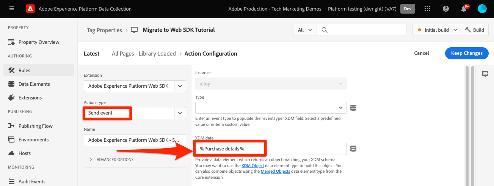

# Enviar parâmetros para o Target usando o SDK da Web da plataforma

As implementações do Target diferem entre sites devido à arquitetura do site, aos requisitos comerciais e aos recursos usados. A maioria das implementações do Target inclui a transmissão de vários parâmetros para informações contextuais, públicos-alvo e recomendações de conteúdo.

Vamos usar uma página simples de detalhes do produto e uma página de confirmação de pedido para demonstrar as diferenças entre as bibliotecas ao transmitir parâmetros para o Target.

Considere os dois exemplos de páginas a seguir usando a at.js:

+++at.js em uma página de Detalhes do produto:

```HTML
<!doctype html>
<html>
<head>
  <title>Product Details - Men's Shirt</title>
  <!--Target parameters -->
  <script>
    targetPageParams = function() {
      return {
        // Property token
        "at_property": "5a0fd9bb-67de-4b5a-0fd7-9cc09f50a58d",
        // Mbox parameters
        "pageName": "product detail",
        // Profile parameters
        "profile.gender": "male",
        "user.categoryId": "clothing",
        // Entity parameters for Target Recomendations
        "entity.id": "SKU-00001-LARGE",
        "entity.categoryId": "clothing,shirts",
        "entity.customEntity": "some value",
        "cartIds": "SKU-00002,SKU-00003",
        "excludedIds": "SKU-00001-SMALL",
        // Customer ID for cross-device profile synching and Customer Attributes
        "mbox3rdPartyId": "TT8675309",
      };
    };
  </script>
  <!--Target at.js library loaded asynchonously-->
  <script src="/libraries/at.js" async></script>
</head>
<body>
  <h1 id="title">Men's Large Shirt</h1>
  <p>SKU: SKU-00001-LARGE</p>
</body>
</html>
```

+++


+++at.js em uma página de confirmação de pedido:

```HTML
<!doctype html>
<html>
<head>
  <title>Order Confirmation</title>-->
  <!--Target parameters -->
  <script>
    targetPageParams = function() {
      return {
        // Property token
        "at_property": "5a0fd9bb-67de-4b5a-0fd7-9cc09f50a58d",
        // Order confirmation parameters
        "orderId": "ABC123",
        "productPurchasedId": "SKU-00002,SKU-00003",
        "orderTotal": 1337.89,
        // Customer ID for cross-device profile synching and Customer Attributes
        "mbox3rdPartyId": "TT8675309",
      };
    };
  </script>
  <!--Target at.js library loaded asynchonously-->
  <script src="/libraries/at.js" async></script>
</head>
<body>
  <h1 id="title">Order Confirmation</h1>
  <p>Thank you for your order</p>
</body>
</html>
```

+++


## Resumo do mapeamento de parâmetros

Os parâmetros do Target para essas páginas são enviados de forma diferente usando o SDK da Web da plataforma. Há várias maneiras de enviar parâmetros para o Target usando at.js:

- Defina com `targetPageParams()` para o evento de carregamento de página
- Defina com `targetPageParamsAll()` para todas as solicitações do Target na página
- Envie parâmetros diretamente com o `getOffer()` para um único local
- Envie parâmetros diretamente com o `getOffers()` para um ou mais locais

Para esses exemplos, a variável `targetPageParams()` é utilizada.

O SDK da Web da plataforma fornece uma única maneira consistente de enviar dados sem a necessidade de funções adicionais. Todos os parâmetros devem ser transmitidos no payload com a variável `sendEvent` comando.

Parâmetros transmitidos com o SDK da Web da plataforma `sendEvent` a carga está dividida em duas categorias:

1. Mapeado automaticamente do `xdm` objeto
1. Passado manualmente usando o `data.__adobe.target` objeto

A tabela abaixo descreve como os parâmetros de exemplo seriam remapeados usando o SDK da Web da plataforma:

| Exemplo de parâmetro at.js | Opção de SDK da Web da plataforma | Notas |
| --- | --- | --- |
| `at_property` | N/D | Os tokens de propriedade são configurados no [datastream](https://experienceleague.adobe.com/docs/experience-platform/edge/datastreams/configure.html#target) e não podem ser definidas no `sendEvent` chame. |
| `pageName` | `xdm.web.webPageDetails.name` | Todos os parâmetros da mbox do Target devem ser enviados como parte do `xdm` e estar em conformidade com um esquema usando a classe XDM ExperienceEvent. Os parâmetros da mbox não podem ser transmitidos como parte do `data` objeto. |
| `profile.gender` | `data.__adobe.target.profile.gender` | Todos os parâmetros de perfil do Target devem ser passados como parte do `data` objeto e prefixado com `profile.` a mapear adequadamente. |
| `user.categoryId` | `data.__adobe.target.user.categoryId` | Parâmetro reservado usado para o recurso Afinidade de categorias do Target que deve ser passado como parte do `data` objeto. |
| `entity.id` | `data.__adobe.target.entity.id` <br>OR<br> `xdm.productListItems[0].SKU` | As IDs de entidade são usadas para contadores comportamentais do Target Recommendations. Essas IDs de entidade podem ser passadas como parte do `data` objeto ou mapeado automaticamente a partir do primeiro item no `xdm.productListItems` matriz se sua implementação usar esse grupo de campos. |
| `entity.categoryId` | `data.__adobe.target.entity.categoryId` | As IDs de categoria de entidade podem ser passadas como parte do `data` objeto. |
| `entity.customEntity` | `data.__adobe.target.entity.customEntity` | Os parâmetros de entidade personalizados são usados para atualizar o catálogo de produtos do Recommendations. Esses parâmetros personalizados devem ser passados como parte do `data` objeto. |
| `cartIds` | `data.__adobe.target.cartIds` | Usado para os algoritmos de recomendações baseadas em carrinho do Target. |
| `excludedIds` | `data.__adobe.target.excludedIds` | Usado para impedir que IDs de entidade específicas retornem em um design de recomendações. |
| `mbox3rdPartyId` | Definido no identityMap. | Usada para sincronizar perfis do Target em dispositivos e atributos do cliente. O namespace a ser usado para a ID do cliente deve ser especificado na variável [Configuração do Target do armazenamento de dados](https://experienceleague.adobe.com/docs/experience-platform/edge/personalization/adobe-target/using-mbox-3rdpartyid.html). |
| `orderId` | `xdm.commerce.order.purchaseID` | Usado para identificar um pedido exclusivo para rastreamento de conversão do Target. |
| `orderTotal` | `xdm.commerce.order.priceTotal` | Usado para rastrear totais de pedidos para metas de conversão e otimização do Target. |
| `productPurchasedId` | `data.__adobe.target.productPurchasedId` <br>OR<br> `xdm.productListItems[0-n].SKU` | Usado para algoritmos de recomendações e rastreamento de conversão do Target. Consulte a [parâmetros da entidade](#entity-parameters) para obter detalhes, consulte a seção abaixo. |
| `mboxPageValue` | `data.__adobe.target.mboxPageValue` | Usado para o [pontuação personalizada](https://experienceleague.adobe.com/docs/target/using/activities/success-metrics/capture-score.html) objetivo da atividade. |

{style=&quot;table-layout:auto&quot;}

## Parâmetros personalizados

Os parâmetros de mbox personalizados devem ser passados como dados XDM com o `sendEvent` comando. É importante garantir que o esquema XDM inclua todos os campos necessários para sua implementação do Target.

Exemplo de at.js usando `targetPageParams()`:

```JavaScript
targetPageParams = function() {
  return {
    "pageName": "product detail"
  };
};
```

Exemplos de JavaScript do SDK da Web da plataforma usando `sendEvent` comando:

>[!BEGINTABS]

>[!TAB JavaScript]

```JavaScript
alloy("sendEvent", {
  "xdm": {
    "web": {
      "webPageDetails": {
        // Other attributes included according to xdm schema
        "name": "product detail"
      }
    }
  }
});
```

>[!TAB Tags]

Nas tags , primeiro use um [!UICONTROL Objeto XDM] elemento de dados a ser mapeado para o campo XDM:

{zoomable=&quot;yes&quot;}

E inclua seu [!UICONTROL Objeto XDM] em seu [!UICONTROL Enviar evento] [!UICONTROL ação] (vários [!UICONTROL Objetos XDM] pode ser [mesclado](https://experienceleague.adobe.com/docs/experience-platform/tags/extensions/client/core/overview.html?lang=en#merged-objects)):

{zoomable=&quot;yes&quot;}

>[!ENDTABS]


>[!NOTE]
>
>Como os parâmetros de mbox personalizados fazem parte do `xdm` objeto , é necessário atualizar qualquer público-alvo, atividade ou script de perfil que faça referência a esses parâmetros usando seus novos nomes. Consulte a [Atualizar públicos-alvo do Target e scripts de perfil para compatibilidade com o SDK da Web da plataforma](update-audiences.md) deste tutorial para obter mais informações.


## Parâmetros do perfil

Os parâmetros do perfil do Target devem ser transmitidos no `data.__adobe.target` objeto no SDK da Web da plataforma `sendEvent` carga do comando.

Semelhante à at.js, todos os parâmetros de perfil também devem ter o prefixo `profile.` para que o valor seja armazenado apropriadamente como um atributo de perfil persistente do Target. O reservado `user.categoryId` O parâmetro para o recurso Afinidade de categorias do Target recebe o prefixo `user.`.

Exemplo de at.js usando `targetPageParams()`:

```JavaScript
targetPageParams = function() {
  return {
    "profile.gender": "male",
    "user.categoryId": "clothing"
  };
};
```

Exemplos de SDK da Web da plataforma usando `sendEvent` comando:

>[!BEGINTABS]

>[!TAB JavaScript]

```JavaScript
alloy("sendEvent", {
  "data": {
    "__adobe": {
      "target": {
        "profile.gender": "male",
        "user.categoryId": "clothing"
      }
    }
  }
});
```

>[!TAB Tags]

Nas tags , primeiro crie um elemento de dados para definir a variável `data.__adobe.target` objeto:

{zoomable=&quot;yes&quot;}

Em seguida, inclua seu objeto de dados em [!UICONTROL Enviar evento] [!UICONTROL ação] (vários [!UICONTROL objetos] pode ser [mesclado](https://experienceleague.adobe.com/docs/experience-platform/tags/extensions/client/core/overview.html?lang=en#merged-objects)):

{zoomable=&quot;yes&quot;}

>[!ENDTABS]

## Parâmetros da entidade

Parâmetros de entidade são usados para transmitir dados comportamentais e informações de catálogo complementares para o Target Recommendations. Semelhante aos parâmetros do perfil, todos os parâmetros de entidade devem ser transmitidos no `data.__adobe.target` objeto no SDK da Web da plataforma `sendEvent` carga do comando.

Parâmetros de entidade para um item específico devem receber o prefixo `entity.` para captura de dados adequada. O reservado `cartIds` e `excludedIds` os parâmetros para algoritmos do recommendations não devem ter o prefixo e o valor de cada deve conter uma lista separada por vírgulas de IDs de entidade.

Exemplo de at.js usando `targetPageParams()`:

```JavaScript
targetPageParams = function() {
  return {
    "entity.id": "SKU-00001-LARGE",
    "entity.categoryId": "clothing,shirts",
    "entity.customEntity": "some value",
    "cartIds": "SKU-00002,SKU-00003",
    "excludedIds": "SKU-00001-SMALL"
  };
};
```

Exemplos de SDK da Web da plataforma usando `sendEvent` comando:

>[!BEGINTABS]

>[!TAB JavaScript]

```JavaScript
alloy("sendEvent", {
  "data": {
    "__adobe": {
      "target": {
        "entity.id": "SKU-00001-LARGE",
        "entity.categoryId": "clothing,shirts",
        "entity.customEntity": "some value",
        "cartIds": "SKU-00002,SKU-00003",
        "excludedIds": "SKU-00001-SMALL"
      }
    }
  }
});
```

>[!TAB Tags]

Nas tags , primeiro crie um elemento de dados para definir a variável `data.__adobe.target` objeto:

{zoomable=&quot;yes&quot;}

Em seguida, inclua seu objeto de dados em [!UICONTROL Enviar evento] [!UICONTROL ação] (vários [!UICONTROL objetos] pode ser [mesclado](https://experienceleague.adobe.com/docs/experience-platform/tags/extensions/client/core/overview.html?lang=en#merged-objects)):

{zoomable=&quot;yes&quot;}

>[!ENDTABS]


Todos [parâmetros da entidade](https://experienceleague.adobe.com/docs/target/using/recommendations/entities/entity-attributes.html) compatível com at.js também é compatível com o SDK da Web da plataforma.

>[!NOTE]
>
>Se a variável `commerce` grupo de campos é usado e o `productListItems` A matriz está incluída na carga do XDM e, em seguida, na primeira `SKU` nesta matriz está mapeado para `entity.id` para incrementar uma visualização de produto.


## Parâmetros de compra

Os parâmetros de compra são passados em uma página de confirmação de pedido após um pedido bem-sucedido e são usados para metas de conversão e otimização do Target. Com uma implementação do SDK da Web da plataforma, esses parâmetros e são mapeados automaticamente a partir de dados XDM passados como parte do `commerce` grupo de campos.

Exemplo de at.js usando `targetPageParams()`:

```JavaScript
targetPageParams = function() {
  return {
    "orderId": "ABC123",
    "productPurchasedId": "SKU-00002,SKU-00003"
    "orderTotal": 1337.89
  };
};
```

As informações de compra são passadas para o Target quando a variável `commerce` grupo de campos possui `purchases.value` defina como `1`. A ID do pedido e o total do pedido são mapeados automaticamente do `order` objeto. Se a variável `productListItems` estiver presente, então a variável `SKU` são usados para `productPurchasedId`.

Exemplos de SDK da Web da plataforma usando `sendEvent` comando:

>[!BEGINTABS]

>[!TAB JavaScript]

```JavaScript
alloy("sendEvent", {
  "xdm": {
    "commerce": {
      "order": {
        "purchaseID": "ABC123",
        "priceTotal": 1337.89
      },
      "purchases": {
        "value": 1
      }
    },
    "productListItems": [{
      "SKU": "SKU-00002"
    }, {
      "SKU": "SKU-00003"
    }]
  }
});
```

>[!TAB Tags]

Nas tags , primeiro use um [!UICONTROL Objeto XDM] elemento de dados para mapear para os campos XDM:

{zoomable=&quot;yes&quot;}

E inclua seu [!UICONTROL Objeto XDM] em seu [!UICONTROL Enviar evento] [!UICONTROL ação] (vários [!UICONTROL Objetos XDM] pode ser [mesclado](https://experienceleague.adobe.com/docs/experience-platform/tags/extensions/client/core/overview.html?lang=en#merged-objects)):

{zoomable=&quot;yes&quot;}

>[!ENDTABS]


>[!NOTE]
>
>O `productPurchasedId` também pode ser passado como uma lista separada por vírgulas de IDs de entidade no `data` objeto.


## ID do cliente (mbox3rdPartyId)

O Target permite a sincronização de perfis entre dispositivos e sistemas usando uma única ID do cliente. Com a at.js, isso pode ser definido como `mbox3rdPartyId` na solicitação do Target ou como a primeira ID do cliente enviada para o serviço de identidade do Experience Cloud. Ao contrário da at.js, a implementação do SDK da Web da plataforma permite especificar qual ID do cliente usar como a `mbox3rdPartyId` se houver vários. Por exemplo, se sua empresa tem uma ID de cliente global e IDs de cliente separadas para diferentes linhas de negócios, você pode configurar qual ID o Target deve usar.

Há algumas etapas para configurar a sincronização de ID para os casos de uso de Atributos do cliente e entre dispositivos do Target:

1. Crie um **[!UICONTROL namespace de identidade]** para a ID do cliente em **[!UICONTROL Identidades]** tela Coleta de dados ou plataforma
1. Certifique-se de que a variável **[!UICONTROL alias]** em Atributos do cliente corresponde à variável **[!UICONTROL símbolo de identidade]** do namespace
1. Especifique a **[!UICONTROL símbolo de inabundância]** como **[!UICONTROL Namespace da ID de terceiros do Target]** na configuração do Target do conjunto de dados
1. Executar um `sendEvent` usando o `identityMap` grupo de campos

Exemplo de at.js usando `targetPageParams()`:

```JavaScript
targetPageParams = function() {
  return {
    "mbox3rdPartyId": "TT8675309"
  };
};
```

Exemplos de SDK da Web da plataforma usando `sendEvent` comando:

>[!BEGINTABS]

>[!TAB JavaScript]

```JavaScript
alloy("sendEvent", {
  "xdm": {
    "identityMap": {
      "GLOBAL_CUSTOMER_ID": [{
        "id": "TT8675309",
        "authenticatedState": "authenticated"
      }]
    }
  }
});
```

>[!TAB Tags]

O [!UICONTROL ID] valor, [!UICONTROL Estado autenticado] e [!UICONTROL Namespace] são capturados em um [!UICONTROL Mapa de identidade] elemento de dados:
{zoomable=&quot;yes&quot;}

O [!UICONTROL Mapa de identidade] o elemento de dados é usado para definir a variável [!UICONTROL identityMap] no campo [!UICONTROL Objeto XDM] elemento de dados:
{zoomable=&quot;yes&quot;}

O [!UICONTROL Objeto XDM] é incluída no [!UICONTROL Enviar evento] ação de uma regra:

{zoomable=&quot;yes&quot;}

No serviço Adobe Target do armazenamento de dados, certifique-se de definir a variável [!UICONTROL Namespace da ID de terceiros do Target] para o mesmo namespace usado no [!UICONTROL Mapa de identidade] elemento de dados:
{zoomable=&quot;yes&quot;}

>[!ENDTABS]

## Exemplo de SDK da Web da plataforma

Agora que você entende como os diferentes parâmetros do Target são mapeados usando o SDK da Web da plataforma, as duas páginas de exemplo podem ser migradas da at.js para o SDK da Web da plataforma, conforme mostrado abaixo. As páginas de exemplo incluem:

- O Target pré-oculta o trecho para uma implementação de biblioteca assíncrona
- O código base do SDK da Web da plataforma
- A biblioteca JavaScript do SDK da Web da plataforma
- A `configure` comando para inicializar a biblioteca
- A `sendEvent` comando para enviar dados e solicitar a renderização do conteúdo do Target

+++SDK da Web em uma página Detalhes do produto:

```HTML
<!doctype html>
<html>
<head>
  <title>Product Details - Men's Shirt</title>

  <!--Prehiding snippet for Target with asynchronous Web SDK deployment-->
  <script>
    !function(e,a,n,t){var i=e.head;if(i){
    if (a) return;
    var o=e.createElement("style");
    o.id="alloy-prehiding",o.innerText=n,i.appendChild(o),setTimeout(function(){o.parentNode&&o.parentNode.removeChild(o)},t)}}
    (document, document.location.href.indexOf("mboxEdit") !== -1, ".body { opacity: 0 !important }", 3000);
  </script>

  <!--Platform Web SDK base code-->
  <script>
    !function(n,o){o.forEach(function(o){n[o]||((n.__alloyNS=n.__alloyNS||
    []).push(o),n[o]=function(){var u=arguments;return new Promise(
    function(i,l){n[o].q.push([i,l,u])})},n[o].q=[])})}
    (window,["alloy"]);
  </script>

  <!--Platform Web SDK loaded asynchonously. Change the src to use the latest supported version.-->
  <script src="https://cdn1.adoberesources.net/alloy/2.6.4/alloy.min.js" async></script>

  <!--Configure Platform Web SDK and send event-->
  <script>
    alloy("configure", {
      "edgeConfigId": "ebebf826-a01f-4458-8cec-ef61de241c93",
      "orgId":"ADB3LETTERSANDNUMBERS@AdobeOrg"
    });
    alloy("sendEvent", {
      "renderDecisions": true,
      "xdm": {
        "identityMap": {
          "GLOBAL_CUSTOMER_ID": [{
            "id": "TT8675309",
            "authenticatedState": "authenticated"
          }]
        },
        "web": {
          "webPageDetails": {
            // Other attributes included according to XDM schema
            "pageName": "product detail"
          }
        }
      },
      "data": {
        "__adobe": {
          "target": {
            "profile.gender": "male",
            "user.categoryId": "clothing",
            "entity.id": "SKU-00001-LARGE",
            "entity.categoryId": "clothing,shirts",
            "entity.customEntity": "some value",
            "cartIds": "SKU-00002,SKU-00003",
            "excludedIds": "SKU-00001-SMALL"
          }
        }
      }
    });
  </script>
</head>
<body>
  <h1 id="title">Men's Large Shirt</h1>
  <p>SKU: SKU-00001-LARGE</p>
</body>
</html>
```

+++

+++SDK da Web em uma página de confirmação de pedido:

```HTML
<!doctype html>
<html>
<head>
  <title>Order Confirmation</title>


  <!--Prehiding snippet for Target with asynchronous Web SDK deployment-->

  <script>
    !function(e,a,n,t){var i=e.head;if(i){
    if (a) return;
    var o=e.createElement("style");
    o.id="alloy-prehiding",o.innerText=n,i.appendChild(o),setTimeout(function(){o.parentNode&&o.parentNode.removeChild(o)},t)}}
    (document, document.location.href.indexOf("mboxEdit") !== -1, ".body { opacity: 0 !important }", 3000);
  </script>

  <!--Platform Web SDK base code-->

  <script>
    !function(n,o){o.forEach(function(o){n[o]||((n.__alloyNS=n.__alloyNS||
    []).push(o),n[o]=function(){var u=arguments;return new Promise(
    function(i,l){n[o].q.push([i,l,u])})},n[o].q=[])})}
    (window,["alloy"]);
  </script>
  <!--Platform Web SDK loaded asynchonously. Change the src to use the latest supported version.-->
  <script src="https://cdn1.adoberesources.net/alloy/2.6.4/alloy.min.js" async></script>

  <!--Configure Platform Web SDK and send event-->
  <script>
    alloy("configure", {
      "edgeConfigId": "ebebf826-a01f-4458-8cec-ef61de241c93",
      "orgId":"ADB3LETTERSANDNUMBERS@AdobeOrg"
    });
    alloy("sendEvent", {
      "xdm": {
        "identityMap": {
          "GLOBAL_CUSTOMER_ID": [{
            "id": "TT8675309",
            "authenticatedState": "authenticated"
          }]
        },
        "commerce": {
          "order": {
            "purchaseID": "ABC123",
            "priceTotal": 1337.89
          },
          "purchases": {
            "value": 1
          }
        },
        "productListItems": [{
          "SKU": "SKU-00002"
        }, {
          "SKU": "SKU-00003"
        }]
      }
    });
  </script>
</head>
<body>
  <h1 id="title">Order Confirmation</h1>
  <p>Thank you for your order</p>
</body>
</html>
```

+++

Em seguida, saiba como [rastrear eventos de conversão do Target](track-events.md) com o SDK da Web da plataforma.

>[!NOTE]
>
>Temos o compromisso de ajudar você a ser bem-sucedido com sua migração do Target da at.js para o SDK da Web. Se você encontrar obstáculos com sua migração ou achar que há informações críticas ausentes neste guia, informe-nos ao publicar em [este debate comunitário](https://experienceleaguecommunities.adobe.com/t5/adobe-experience-platform-launch/tutorial-discussion-implement-adobe-experience-cloud-with-web/td-p/444996).
