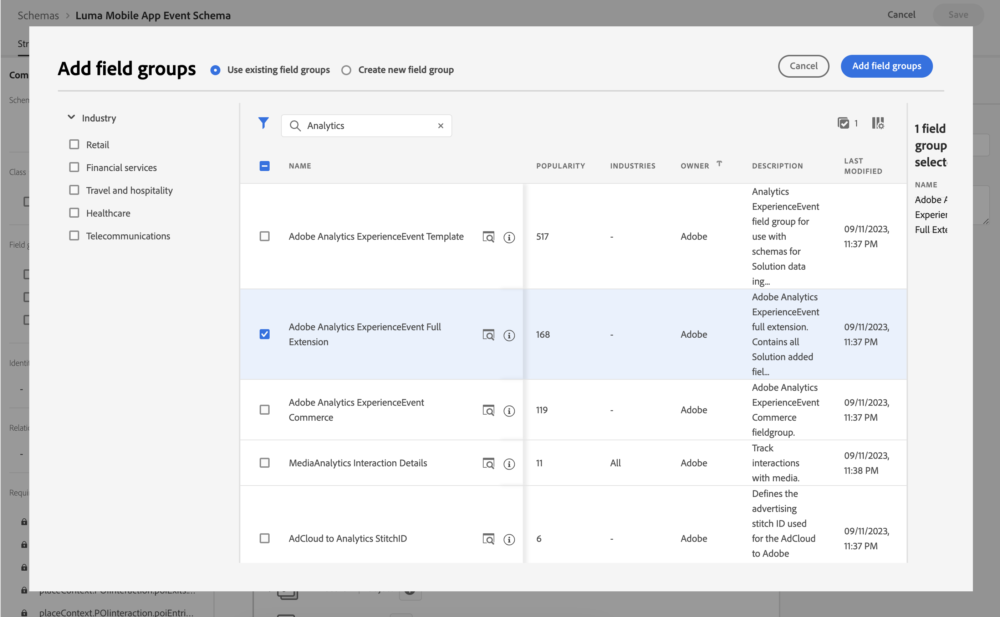

# Coletar e mapear dados do Analytics

Saiba como mapear dados móveis para o Adobe Analytics.

A variável [evento](events.md) Os dados coletados e enviados para a Platform Edge Network em lições anteriores são encaminhados para os serviços configurados na sua sequência de dados, incluindo o Adobe Analytics. Mapeie os dados para as variáveis corretas em seu conjunto de relatórios.


## Pré-requisitos

* Noções básicas sobre o rastreamento de ExperienceEvent.
* Dados XDM enviados com sucesso no aplicativo de amostra.
* Sequência de dados configurada para o Adobe Analytics

## Objetivos de aprendizagem

Nesta lição, você vai:

* Configure seu fluxo de dados com o serviço Adobe Analytics.
* Entenda o mapeamento automático de variáveis do Analytics.
* Configurar regras de processamento para mapear dados XDM para variáveis do Analytics.

## Adicionar serviço de sequência de dados do Adobe Analytics

Para enviar seus dados XDM da rede de borda para a Adobe Analytics, configure o serviço da Adobe Analytics para o fluxo de dados configurado como parte da [Criar um fluxo de dados](create-datastream.md).

1. Na interface da Coleção de dados, selecione **[!UICONTROL Datastreams]** e sua sequência de dados.

1. Em seguida, selecione  **[!UICONTROL Adicionar serviço]**.

1. Adicionar **[!UICONTROL Adobe Analytics]** do [!UICONTROL Serviço] lista,

1. Insira o nome do conjunto de relatórios do Adobe Analytics que você deseja usar no **[!UICONTROL ID do conjunto de relatórios]**.

1. Habilitar o serviço alternando **[!UICONTROL Ativado]** em.

1. Selecione **[!UICONTROL Salvar]**.

   


## Mapeamento automático

Muitos dos campos XDM padrão são mapeados automaticamente para variáveis do Analytics. Veja a lista completa [aqui](https://experienceleague.adobe.com/docs/experience-platform/edge/data-collection/adobe-analytics/automatically-mapped-vars.html?lang=en).

### Exemplo #1 - s.products

Um bom exemplo é o [variável products](https://experienceleague.adobe.com/docs/analytics/implementation/vars/page-vars/products.html?lang=en) que não podem ser preenchidos com regras de processamento. Com uma implementação XDM, você passa todos os dados necessários no `productListItems` e `s.products` são automaticamente preenchidos por meio do mapeamento do Analytics.

Este objeto:

```swift
"productListItems": [
    [
      "name":  "Yoga Mat",
      "SKU": "5829",
      "priceTotal": "49.99",
      "quantity": 1
    ],
    [
      "name":  "Water Bottle",
      "SKU": "9841",
      "priceTotal": "30.00",
      "quantity": 3
    ]
]
```

resulta em:

```
s.products = ";Yoga Mat;1;49.99,;Water Bottle,3,30.00"
```

>[!NOTE]
>
>Atualmente `productListItems[N].SKU` é ignorado pelo mapeamento automático.


### Exemplo #2 - scAdd

Se você observar de perto, todos os eventos têm dois campos `value` (obrigatório) e `id` (opcional). A variável `value` é usado para incrementar a contagem de eventos. A variável `id` é usado para serialização.

Este objeto:

```swift
"commerce" : {
  "productListAdds" : {
    "value" : 1
  }
}
```

resulta em:

```
s.events = "scAdd"
```

Este objeto:

```swift
"commerce" : {
  "productListAdds" : {
    "value" : 1,
    "id": "321435"
  }
}
```

resulta em:

```
s.events = "scAdd:321435"
```

## Validar com garantia

Usar o [Assurance](assurance.md) você pode confirmar que está enviando um evento de experiência, que os dados XDM estão corretos e que o mapeamento do Analytics está acontecendo conforme esperado. Por exemplo:

1. Envie um evento productListAdds.

1. Veja a ocorrência do ExperienceEvent.

   

1. Revise a parte XDM do JSON.

   ```json
   "xdm" : {
     "productListItems" : [ {
       "SKU" : "LLWS05.1-XS",
       "name" : "Desiree Fitness Tee",
       "priceTotal" : 24
     } ],
   "timestamp" : "2023-08-04T12:53:37.662Z",
   "eventType" : "commerce.productListAdds",
   "commerce" : {
     "productListAdds" : {
       "id" : "LLWS05.1-XS",
       "value" : 1
     }
   }
   // ...
   ```

1. Revise o **[!UICONTROL analytics.mapping]** evento.

   

Observe o seguinte no mapeamento do Analytics:

* **[!UICONTROL events]** são preenchidos com `scAdd` baseado em `commerce.productListAdds`.
* **[!UICONTROL pl]** (variável products) são preenchidos com um valor concatenado com base em `productListItems`.
* Há outras informações interessantes nesse evento, incluindo todos os dados de contexto.


## Mapeamento com dados de contexto

Os dados XDM encaminhados para o Analytics são convertidos em [dados de contexto](https://experienceleague.adobe.com/docs/mobile-services/ios/getting-started-ios/proc-rules.html?lang=en) incluindo campos padrão e personalizados.

A chave de dados de contexto é construída seguindo esta sintaxe:

```
a.x.[xdm path]
```

Por exemplo:

```
// Standard Field
a.x.commerce.saveforlaters.value

// Custom Field
a.x._techmarketingdemos.appinformation.appstatedetails.screenname
```

>[!NOTE]
>
>Campos personalizados são colocados sob o identificador Experience Cloud Org.
>
>`_techmarketingdemos` é substituída pelo valor único de sua organização.

Para mapear esses dados de contexto XDM para seus dados do Analytics em seu conjunto de relatórios, você pode:

* Adicione o **[!UICONTROL Extensão completa do Adobe Analytics ExperienceEvent]** grupo de campos ao seu esquema.

  
* Crie regras na propriedade Tags para mapear os dados de contexto para os campos no grupo de campos Extensão completa do Adobe Analytics ExperienceEvent. Por exemplo, mapear `_techmarketingdemo.appinformation.appstatedetails.screenname` para `_experience.analytics.customDimensions.eVars.eVar2`.

<!-- Old processing rules section
Here is what a processing rule using this data might look like:

* You **[!UICONTROL Overwrite value of]** (1) **[!UICONTROL App Screen Name (eVar2)]** (2) with the value of **[!UICONTROL a.x._techmarketingdemo.appinformation.appstatedetails.screenname]** (3) if **[!UICONTROL a.x._techmarketingdemo.appinformation.appstatedetails.screenname]** (4) **[!UICONTROL is set]** (5).

* You **[!UICONTROL Set event]** (6) **[!UICONTROL Add to Wishlist (Event 3)]** (7) to **[!UICONTROL a.x.commerce.saveForLaters.value(Context)]** (8) if **[!UICONTROL a.x.commerce.saveForLaters.value(Context)]** (9) **[!UICONTROL is set]** (10).


>[!IMPORTANT]
>
>
>Some of the automatically mapped variables may not be available for use in processing rules.
>
>
>The first time you map to a processing rule, the interface does not show you the context data variables from the XDM object. To fix that select any value, Save, and come back to edit. All XDM variables should now appear.


Additional information about processing rules and context data can be found [here](https://experienceleague.adobe.com/docs/analytics-learn/tutorials/implementation/implementation-basics/map-contextdata-variables-into-props-and-evars-with-processing-rules.html?lang=en).

>[!TIP]
>
>Unlike previous mobile app implementations, there is no distinction between a page / screen views and other events. Instead you can increment the **[!UICONTROL Page View]** metric by setting the **[!UICONTROL Page Name]** dimension in a processing rule. Since you are collecting the custom `screenName` field in the tutorial, it is highly recommended to map screen name to **[!UICONTROL Page Name]** in a processing rule.

-->

>[!SUCCESS]
>
>Você configurou o aplicativo para mapear os objetos XDM da Experience Edge para variáveis do Adobe Analytics, habilitando o serviço da Adobe Analytics no fluxo de dados e usando regras de processamento, quando aplicável.<br/> Obrigado por investir seu tempo aprendendo sobre o Adobe Experience Platform Mobile SDK. Se você tiver dúvidas, quiser compartilhar comentários gerais ou tiver sugestões sobre conteúdo futuro, compartilhe-as nesta [Publicação de discussão da comunidade do Experience League](https://experienceleaguecommunities.adobe.com/t5/adobe-experience-platform-launch/tutorial-discussion-implement-adobe-experience-cloud-in-mobile/td-p/443796).

Próximo: **[Enviar dados para o Experience Platform](platform.md)**
