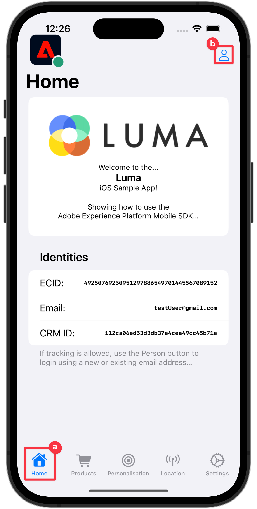

# Coletar dados de identidade

Saiba como coletar dados de identidade em um aplicativo móvel.

O Serviço de identidade da Adobe Experience Platform ajuda você a obter uma melhor visualização dos clientes e de seus comportamentos, unindo identidades em dispositivos e sistemas, permitindo que você forneça experiências digitais pessoais e de impacto em tempo real. Campos de identidade e namespaces são a cola que une diferentes fontes de dados para criar o perfil do cliente em tempo real de 360 graus.

Saiba mais sobre o [Extensão de identidade](https://developer.adobe.com/client-sdks/documentation/identity-for-edge-network/) e a variável [serviço de identidade](https://experienceleague.adobe.com/docs/experience-platform/identity/home.html?lang=pt-BR) na documentação.

## Pré-requisitos

* O aplicativo com SDKs instalados e configurados foi criado e executado com sucesso.

## Objetivos de aprendizagem

Nesta lição, você vai:

* Configurar um namespace de identidade personalizado.
* Atualizar identidades.
* Valide o gráfico de identidade.
* Obtenha a ECID e outras identidades.


## Configurar um namespace de identidade personalizado

Os namespaces de identidade são componentes de [Serviço de identidade](https://experienceleague.adobe.com/docs/experience-platform/identity/home.html?lang=pt-BR) que servem como indicadores do contexto ao qual uma identidade está relacionada. Por exemplo, eles distinguem um valor de `name@email.com` como um endereço de email ou `443522` como uma ID do CRM numérica.

>[!NOTE]
>
>O SDK móvel gera uma identidade exclusiva em seu próprio namespace, chamada de ID de Experience Cloud (ECID) quando o aplicativo é instalado. Essa ECID é armazenada na memória persistente no dispositivo móvel e é enviada com cada ocorrência. A ECID é removida quando o usuário desinstala o aplicativo ou define o status de privacidade global do SDK móvel como recusa. No aplicativo Luma de amostra, você deve remover e reinstalar o aplicativo para criar um novo perfil com sua própria ECID exclusiva.


Para criar um novo namespace de identidade:

1. Na interface da Coleção de dados, selecione **[!UICONTROL Identidades]** no painel de navegação esquerdo.
1. Selecione **[!UICONTROL Criar namespace de identidade]**.
1. Forneça um **[!UICONTROL Nome de exibição]** de `Luma CRM ID` e uma **[!UICONTROL Símbolo de identidade]** valor de `lumaCRMId`.
1. Selecionar **[!UICONTROL ID entre dispositivos]**.
1. Selecione **[!UICONTROL Criar]**.

   


## Atualizar identidades

Você deseja atualizar a identidade padrão (email) e a identidade personalizada (ID do CRM da Luma) quando o usuário fizer logon no aplicativo.

1. Navegue até **[!DNL Luma]** > **[!DNL Luma]** > **[!DNL Utils]** > **[!UICONTROL MobileSDK]** no navegador do Projeto Xcode e localize o `func updateIdentities(emailAddress: String, crmId: String)` implementação da função. Adicione o código a seguir à função.

   ```swift
   // Set up identity map, add identities to map and update identities
   let identityMap: IdentityMap = IdentityMap()
   
   let emailIdentity = IdentityItem(id: emailAddress, authenticatedState: AuthenticatedState.authenticated)
   let crmIdentity = IdentityItem(id: crmId, authenticatedState: AuthenticatedState.authenticated)
   identityMap.add(item:emailIdentity, withNamespace: "Email")
   identityMap.add(item: crmIdentity, withNamespace: "lumaCRMId")
   
   Identity.updateIdentities(with: identityMap)
   ```

   Este código:

   1. Cria um vazio `IdentityMap` objeto.

      ```swift
      let identityMap: IdentityMap = IdentityMap()
      ```

   1. Configura `IdentityItem` objetos para email e ID de CRM.

      ```swift
      let emailIdentity = IdentityItem(id: emailAddress, authenticatedState: AuthenticatedState.authenticated)
      let crmIdentity = IdentityItem(id: crmId, authenticatedState: AuthenticatedState.authenticated)
      ```

   1. Adiciona estes `IdentityItem` objetos para o `IdentityMap` objeto.

      ```swift
      identityMap.add(item:emailIdentity, withNamespace: "Email")
      identityMap.add(item: crmIdentity, withNamespace: "lumaCRMId")
      ```

   1. Envia o `IdentityItem` como parte da `Identity.updateIdentities` chamada de API para a Rede de borda.

      ```swift
      Identity.updateIdentities(with: identityMap) 
      ```

1. Navegue até **[!DNL Luma]** **[!DNL Luma]** > **[!DNL Views]** > **[!DNL General]** > **[!UICONTROL LoginSheet]** no navegador do Projeto Xcode e localize o código a ser executado ao selecionar o **[!UICONTROL Logon]** botão. Adicione o seguinte código:

   ```swift
   // Call updateIdentities
   MobileSDK.shared.updateIdentities(emailAddress: currentEmailId, crmId: currentCRMId)                             
   ```


>[!NOTE]
>
>É possível enviar várias identidades em um único `updateIdentities` chame. Você também pode modificar identidades enviadas anteriormente.


## Remover uma identidade

Você pode usar o [`Identity.removeIdentity`](https://developer.adobe.com/client-sdks/documentation/identity-for-edge-network/api-reference/#removeidentity) API para remover a identidade do mapa de identidade armazenado do lado do cliente. A extensão Identity interrompe o envio do identificador para a Rede de borda. O uso dessa API não remove o identificador do gráfico de identidade do lado do servidor. Consulte [Visualização de gráficos de identidade](https://experienceleague.adobe.com/docs/platform-learn/tutorials/identities/view-identity-graphs.html?lang=en) para obter mais informações sobre gráficos de identidade.

1. Navegue até **[!DNL Luma]** > **[!DNL Luma]** > **[!DNL Utils]** > **[!UICONTROL MobileSDK]** no navegador do Projeto Xcode e adicione o seguinte código à `func removeIdentities(emailAddress: String, crmId: String)` função:

   ```swift
   // Remove identities and reset email and CRM Id to their defaults
   Identity.removeIdentity(item: IdentityItem(id: emailAddress), withNamespace: "Email")
   Identity.removeIdentity(item: IdentityItem(id: crmId), withNamespace: "lumaCRMId")
   currentEmailId = "testUser@gmail.com"
   currentCRMId = "112ca06ed53d3db37e4cea49cc45b71e"
   ```

1. Navegue até **[!DNL Luma]** > **[!DNL Luma]** > **[!DNL Views]** > **[!DNL General]** > **[!UICONTROL LoginSheet]** no navegador do Projeto Xcode e localize o código a ser executado ao selecionar o **[!UICONTROL Sair]** botão. Adicione o seguinte código:

   ```swift
   // Remove identities
   MobileSDK.shared.removeIdentities(emailAddress: currentEmailId, crmId: currentCRMId)                  
   ```


## Validar com garantia

1. Revise o [instruções de configuração](assurance.md#connecting-to-a-session) seção para conectar seu simulador ou dispositivo ao Assurance.
1. No aplicativo Luma
   1. Selecione o **[!UICONTROL Início]** e mova o ícone Assurance para a esquerda.
   1. Selecione o  ícone na parte superior direita.

      

   1. Forneça um endereço de email e uma ID de CRM ou
   1. Selecionar  para gerar um evento aleatoriamente **[!UICONTROL E-mail]** e **[!UICONTROL ID do CRM]**.
   1. Selecionar **[!UICONTROL Logon]**.

      


1. Examine a interface da Web do Assurance para **[!UICONTROL Identidades de atualização de identidade da borda]** evento do **[!UICONTROL com.adobe.griffon.mobile]** fornecedor.
1. Selecione o evento e revise os dados na variável **[!UICONTROL ACPExtensionEventData]** objeto. Você deve ver as identidades atualizadas.
   

## Validar com gráfico de identidade

Depois de concluir as etapas no [lição do Experience Platform](platform.md), você poderá confirmar a captura de identidade no visualizador de gráficos de identidade de Plataformas:

1. Selecionar **[!UICONTROL Identidades]** na interface da Coleção de dados.
1. Selecionar **[!UICONTROL Gráfico de identidade]** na barra superior.
1. Enter `Luma CRM ID` como o **[!UICONTROL Namespace de identidade]** e sua ID do CRM (por exemplo, `24e620e255734d8489820e74f357b5c8`) como a **[!UICONTROL Valor de identidade]**.
1. Você vê a **[!UICONTROL Identidades]** listado.

   

>[!INFO]
>
>Não há código no aplicativo para redefinir a ECID, o que significa que você só pode redefinir a ECID (e efetivamente criar um novo perfil com uma nova ECID no dispositivo) por meio de uma desinstalação e uma reinstalação do aplicativo. Para implementar a redefinição de identificadores, consulte a [`Identity.resetIdentities`](https://developer.adobe.com/client-sdks/documentation/mobile-core/identity/api-reference/#resetidentities) e [`MobileCore.resetIdentities`](https://developer.adobe.com/client-sdks/documentation/mobile-core/api-reference/#resetidentities) Chamadas de API. Entretanto, esteja ciente de que, ao usar um identificador de notificação por push (consulte [Enviando notificações por push](journey-optimizer-push.md)), esse identificador se torna outro identificador de perfil &quot;adesivo&quot; no dispositivo.


>[!SUCCESS]
>
>Agora você configurou o aplicativo para atualizar identidades na Rede de borda e (quando configurado) com o Adobe Experience Platform.<br/>Obrigado por investir seu tempo aprendendo sobre o Adobe Experience Platform Mobile SDK. Se você tiver dúvidas, quiser compartilhar comentários gerais ou tiver sugestões sobre conteúdo futuro, compartilhe-as nesta [Publicação de discussão da comunidade do Experience League](https://experienceleaguecommunities.adobe.com/t5/adobe-experience-platform-launch/tutorial-discussion-implement-adobe-experience-cloud-in-mobile/td-p/443796)

Próximo: **[Coletar dados de perfil](profile.md)**
