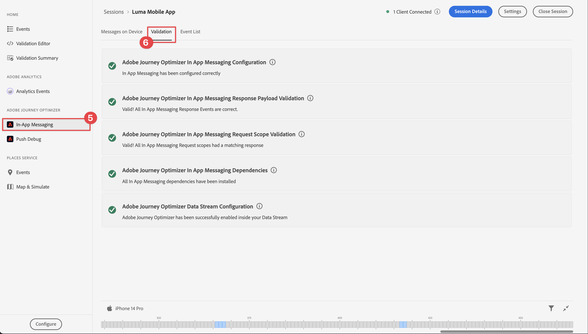

# Mensagens no aplicativo do Journey Optimizer

Saiba como criar mensagens no aplicativo para aplicativos móveis com o SDK móvel da plataforma e o Journey Optimizer.

O Journey Optimizer permite criar campanhas para enviar mensagens no aplicativo a públicos-alvo direcionados. Antes de enviar mensagens no aplicativo com o Journey Optimizer, você deve garantir que as configurações e integrações adequadas estejam em vigor. Para entender o fluxo de dados de mensagens no aplicativo no Journey Optimizer, consulte [a documentação](https://experienceleague.adobe.com/docs/journey-optimizer/using/in-app/inapp-configuration.html?lang=en).

>[!NOTE]
>
>Essa lição é opcional e se aplica somente aos usuários do Journey Optimizer que desejam enviar mensagens no aplicativo.


## Pré-requisitos

* O aplicativo com SDKs instalados e configurados foi criado e executado com sucesso.
* Acesso ao Journey Optimizer e permissões suficientes, conforme descrito [aqui](https://experienceleague.adobe.com/docs/journey-optimizer/using/configuration/configuration-message/push-config/push-configuration.html?lang=en). Além disso, você precisa de permissão suficiente para os seguintes recursos do Journey Optimizer.
   * Gerenciar campanhas.
* Conta de desenvolvedor paga do Apple com acesso suficiente para criar certificados, identificadores e chaves.
* Dispositivo ou simulador físico iOS para teste.
* ID do aplicativo registrada com o serviço de notificação por push da Apple
* Adicionadas suas credenciais de push do aplicativo na Coleção de dados
* Extensão de tags do Journey Optimizer instalada
* Journey Optimizer implementado no aplicativo


## Objetivos de aprendizagem

Nesta lição, você

* Registrar a ID do aplicativo no serviço de notificação por push (APN) da Apple.
* Crie uma Superfície de aplicativo no AJO.
* Instalar e configurar a extensão de tag do Journey Optimizer.
* Atualize seu aplicativo para incluir a extensão de tag da Journey Optimizer.
* Valide a configuração no Assurance.
* Defina sua própria experiência de campanha e mensagens no aplicativo no Journey Optimizer.
* Envie sua própria mensagem no aplicativo de dentro do aplicativo.

## Configuração

>[!TIP]
>
>Se você já tiver configurado seu ambiente como parte da [mensagens por push do Journey Optimizer](journey-optimizer-push.md) tutorial, você pode ignorar esta seção.

### Registrar ID do aplicativo com APNS

As etapas a seguir não são específicas do Adobe Experience Cloud e foram projetadas para orientá-lo pela configuração do APNS.

### Criar uma chave privada

1. No portal do desenvolvedor do Apple, navegue até **[!UICONTROL Chaves]**.
1. Para criar uma chave, selecione **[!UICONTROL +]**.
   

1. Forneça um **[!UICONTROL Nome da chave]**.
1. Selecione o **[!UICONTROL Serviço de notificação por push da Apple] (APNs)** caixa de seleção
1. Selecionar **[!UICONTROL Continuar]**.
   
1. Revise a configuração e selecione **[!UICONTROL Registrar]**.
1. Baixe o `.p8` chave privada. É usado na configuração da Superfície do aplicativo.
1. Anote o **[!UICONTROL ID da chave]**. É usado na configuração da Superfície do aplicativo.
1. Anote o **[!UICONTROL ID da equipe]**. É usado na configuração da Superfície do aplicativo.
   

A documentação adicional pode ser [encontrado aqui](https://help.apple.com/developer-account/#/devcdfbb56a3).

### Adicionar suas credenciais de push do aplicativo na Coleção de dados

1. No [Interface da coleção de dados](https://experience.adobe.com/br/data-collection/), selecione **[!UICONTROL Superfícies do aplicativo]** no painel esquerdo.
1. Para criar uma configuração, selecione **[!UICONTROL Criar superfície do aplicativo]**.
   
1. Insira um **[!UICONTROL Nome]** para a configuração do, por exemplo `Luma App Tutorial`  .
1. De **[!UICONTROL Configuração do aplicativo móvel]**, selecione **[!UICONTROL Apple iOS]**.
1. Insira a ID do pacote do aplicativo móvel na **[!UICONTROL ID do aplicativo (ID do pacote iOS)]** campo. Por exemplo,  `com.adobe.luma.tutorial.swiftui`.
1. Ligue o **[!UICONTROL Credenciais por push]** para adicionar suas credenciais.
1. Arraste e solte o `.p8` **Chave de autenticação da notificação por push do Apple** arquivo.
1. Forneça o **[!UICONTROL ID da chave]**, uma sequência de 10 caracteres atribuída durante a criação de `p8` chave de autenticação. Ele pode ser encontrado no campo **[!UICONTROL Chaves]** na guia **Certificados, identificadores e perfis** página das páginas do portal Apple Developer. Consulte também [Criar uma chave privada](#create-a-private-key).
1. Forneça o **[!UICONTROL ID da equipe]**. A ID da equipe é um valor que pode ser encontrado na variável **Associação** ou na parte superior da página do portal Apple Developer. Consulte também [Criar uma chave privada](#create-a-private-key).
1. Selecione **[!UICONTROL Salvar]**.

   

### Instalar extensão de tags do Journey Optimizer

Para que seu aplicativo funcione com a Journey Optimizer, é necessário atualizar a propriedade da tag.

1. Navegue até **[!UICONTROL Tags]** > **[!UICONTROL Extensões]** > **[!UICONTROL Catálogo]**,
1. Abra a propriedade, por exemplo **[!UICONTROL Tutorial do aplicativo móvel Luma]**.
1. Selecionar **[!UICONTROL Catálogo]**.
1. Procure por **[!UICONTROL Adobe Journey Optimizer]** extensão.
1. Instale a extensão.
1. No **[!UICONTROL Instalar extensão]** caixa de diálogo
   1. Selecione um ambiente, por exemplo **[!UICONTROL Desenvolvimento]**.
   1. Selecione o **[!UICONTROL Conjunto de dados do evento de experiência de rastreamento de push do AJO]** conjunto de dados da **[!UICONTROL Conjunto de dados do evento]** lista.
   1. Selecionar **[!UICONTROL Salvar na biblioteca e criar]**.
      

>[!NOTE]
>
>Se você não vir `AJO Push Tracking Experience Event Dataset` como opção, entre em contato com o atendimento ao cliente.
>

### Implementar o Journey Optimizer no aplicativo

Conforme discutido nas lições anteriores, a instalação de uma extensão de tag móvel fornece apenas a configuração. Em seguida, você deve instalar e registrar o SDK de mensagens. Se essas etapas não estiverem claras, revise o [Instalar SDKs](install-sdks.md) seção.

>[!NOTE]
>
>Se você concluiu o [Instalar SDKs](install-sdks.md) , o SDK já estará instalado e você poderá ignorar essa etapa.
>

1. No Xcode, verifique se [Mensagens AEP](https://github.com/adobe/aepsdk-messaging-ios.git) é adicionado à lista de pacotes nas Dependências de pacote. Consulte [Gerenciador de pacotes Swift](install-sdks.md#swift-package-manager).
1. Navegue até **[!UICONTROL Luma]** > **[!UICONTROL Luma]** > **[!UICONTROL AppDelegate]** no navegador do Projeto Xcode.
1. Assegurar `AEPMessaging` faz parte da lista de importações.

   `import AEPMessaging`

1. Assegurar `Messaging.self` O faz parte da matriz de extensões que você está registrando.

   ```swift
   let extensions = [
       AEPIdentity.Identity.self,
       Lifecycle.self,
       Signal.self,
       Edge.self,
       AEPEdgeIdentity.Identity.self,
       Consent.self,
       UserProfile.self,
       Places.self,
       Messaging.self,
       Optimize.self,
       Assurance.self
   ]
   ```

1. Adicione o `MobileCore.setPushIdentifier` para o `func application(_ application: UIApplication, didRegisterForRemoteNotificationsWithDeviceToken deviceToken: Data)` função.

   ```swift
   // Send push token to Experience Platform
   MobileCore.setPushIdentifier(deviceToken)
   ```

   Essa função recupera o token do dispositivo exclusivo para o dispositivo no qual o aplicativo está instalado. Em seguida, define o token para delivery de notificação por push usando a configuração definida e que depende do Serviço de notificação por push (APNs) da Apple.


## Validar garantia de configuração

1. Revise o [instruções de configuração](assurance.md) seção.
1. Instale o aplicativo no dispositivo físico ou no simulador.
1. Inicie o aplicativo usando o URL gerado pelo Assurance.
1. Na interface do usuário do Assurance, selecione **[!UICONTROL Configurar]**.
   
1. Selecione o  botão ao lado de **[!UICONTROL Mensagens no aplicativo]**.
1. Selecione **[!UICONTROL Salvar]**.
   
1. Selecionar **[!UICONTROL Mensagens no aplicativo]** no painel de navegação esquerdo.
1. Selecione o **[!UICONTROL Validação]** guia.
1. Confirme se não está recebendo erros.
   


## Criar sua própria mensagem no aplicativo

Para criar sua própria mensagem no aplicativo, você deve definir uma campanha no Journey Optimizer que acione uma mensagem no aplicativo com base nos eventos que ocorrem. Esses eventos podem ser:

* dados enviados para o Adobe Experience Platform,
* eventos principais de rastreamento, como ação ou estado ou coleção de dados PII, por meio das APIs genéricas principais móveis,
* eventos do ciclo de vida do aplicativo, como iniciar, instalar, atualizar, fechar ou falhar,
* eventos de geolocalização, como entrar ou sair de um ponto de interesse.

Neste tutorial, você usará as APIs genéricas e independentes de extensão do Mobile Core para facilitar o rastreamento de eventos de telas de usuários, ações e dados de PII. Os eventos gerados por essas APIs são publicados no hub de eventos do SDK e estão disponíveis para uso por extensões. Por exemplo, quando a extensão do Analytics é instalada, todos os dados de eventos de ações do usuário e telas do aplicativo são enviados para os endpoints de relatório apropriados do Analytics.

1. Na interface do Journey Optimizer, selecione **[!UICONTROL Campanhas]** do painel esquerdo.
1. Selecionar **[!UICONTROL Criar campanha]**.
1. No **[!UICONTROL Criar campanha]** tela:
   1. Selecionar **[!UICONTROL Mensagem no aplicativo]** e selecione uma superfície de aplicativo na **[!UICONTROL Superfície do aplicativo]** lista, por exemplo **[!UICONTROL Aplicativo móvel Luma]**.
   1. Selecione **[!UICONTROL Criar]**
      
1. Na tela Campaign definition, em **[!UICONTROL Propriedades]**, insira um **[!UICONTROL Nome]** para a campanha, por exemplo `Luma - In-App Messaging Campaign`, e uma **[!UICONTROL Descrição]**, por exemplo `In-app messaging campaign for Luma app`.
   
1. Role para baixo até **[!UICONTROL Ação]** e selecione **[!UICONTROL Editar conteúdo]**.
1. No **[!UICONTROL Mensagem no aplicativo]** tela:
   1. Selecionar **[!UICONTROL Modal]** como o **[!UICONTROL Layout da mensagem]**.
   2. Enter `https://luma.enablementadobe.com/content/dam/luma/en/logos/Luma_Logo.png` para **[!UICONTROL URL de mídia]**.
   3. Insira um **[!UICONTROL Cabeçalho]**, por exemplo `Welcome to this Luma In-App Message` e insira um **[!UICONTROL Corpo]**, por exemplo `Triggered by pushing that button in the app...`.
   4. Enter **[!UICONTROL Ignorar]** como o **[!UICONTROL Texto do botão #1 (principal)]**.
   5. Observe como a visualização é atualizada.
   6. Selecionar **[!UICONTROL Revisar para ativar]**.
      
1. No **[!UICONTROL Revise para ativar (Luma - Campanha de mensagens no aplicativo)]** , selecione  no **[!UICONTROL Agendar]** bloco.
   
1. De volta ao **[!UICONTROL Luma - Campanha de mensagens no aplicativo]** , selecione  **[!UICONTROL Editar acionadores]**.
1. No **[!UICONTROL Acionador de mensagem no aplicativo]** , você configura os detalhes da ação de rastreamento que aciona a mensagem no aplicativo:
   1. Para remover **[!UICONTROL Evento de inicialização de aplicativo]**, selecione  .
   1. Uso  **[!UICONTROL Adicionar condição]** criar repetidamente a seguinte lógica para **[!UICONTROL Mostrar mensagem se]**.
   1. Clique em **[!UICONTROL Concluído]**.
      

   Você definiu uma ação de rastreamento, onde a variável **[!UICONTROL Ação]** igual a `in-app` e a variável **[!UICONTROL Dados de contexto]** com a ação é um par de valores fundamental de `"showMessage" : "true"`.

1. De volta ao **[!UICONTROL Luma - Campanha de mensagens no aplicativo]** , selecione **[!UICONTROL Revisar para ativar]**.
1. No **[!UICONTROL Revise para ativar (Luma - Campanha de mensagens no aplicativo)]** , selecione **[!UICONTROL Ativar]**.
1. Você vê o seu **[!UICONTROL Luma - Campanha de mensagens no aplicativo]** com status **[!UICONTROL Ao vivo]** no **[!UICONTROL Campanhas]** lista.
   


## Acionamento da mensagem no aplicativo

Você tem todos os ingredientes em vigor para enviar uma mensagem no aplicativo. O que resta é como acionar essa mensagem no aplicativo.

1. Ir para **[!UICONTROL Luma]** > **[!UICONTROL Luma]** > **[!UICONTROL Utils]** > **[!UICONTROL MobileSDK]** no navegador do Projeto Xcode. Localize o `func sendTrackAction(action: String, data: [String: Any]?)` e adicione o seguinte código, que chama a função `MobileCore.track` baseada nos parâmetros `action` e `data`.


   ```swift
   // send trackAction event
   MobileCore.track(action: action, data: data)
   ```

1. Ir para **[!UICONTROL Luma]** > **[!UICONTROL Luma]** > **[!UICONTROL Visualizações]** > **[!UICONTROL Geral]** > **[!UICONTROL ConfigView]** no Navegador de projetos do Xcode. Localize o código do botão Mensagens no aplicativo e adicione o seguinte código:

   ```swift
   Task {
       AEPService.shared.sendTrackAction(action: "in-app", data: ["showMessage": "true"])
   }
   ```

## Validar usando seu aplicativo

1. Abra o aplicativo em um dispositivo ou no simulador.

1. Vá para a **[!UICONTROL Configurações]** guia.

1. Toque **[!UICONTROL Mensagem no aplicativo]**. Você vê a mensagem no aplicativo aparecer no seu aplicativo.

   


## Validar implementação no Assurance

Você pode validar as mensagens no aplicativo na interface do usuário do Assurance.

1. Selecionar **[!UICONTROL Mensagens no aplicativo]**.
1. Selecionar **[!UICONTROL Lista de Eventos]**.
1. Selecione um **[!UICONTROL Exibir mensagem]** entrada.
1. Inspect é o evento bruto, especialmente o `html`, que contém o layout completo e o conteúdo da mensagem no aplicativo.
   


## Próximas etapas

Agora você deve ter todas as ferramentas para começar a adicionar mensagens no aplicativo, quando relevante e aplicável, ao aplicativo Luma. Por exemplo, promover produtos com base em interações específicas rastreadas no aplicativo.

>[!SUCCESS]
>
>Você habilitou o aplicativo para mensagens no aplicativo e adicionou uma campanha de mensagens no aplicativo usando o Journey Optimizer e a extensão Journey Optimizer para o SDK móvel do Experience Platform.<br/>Obrigado por investir seu tempo aprendendo sobre o Adobe Experience Platform Mobile SDK. Se você tiver dúvidas, quiser compartilhar comentários gerais ou tiver sugestões sobre conteúdo futuro, compartilhe-as nesta [Publicação de discussão da comunidade do Experience League](https://experienceleaguecommunities.adobe.com/t5/adobe-experience-platform-launch/tutorial-discussion-implement-adobe-experience-cloud-in-mobile/td-p/443796).

Próximo: **[Exibir ofertas com o Journey Optimizer](journey-optimizer-offers.md)**
