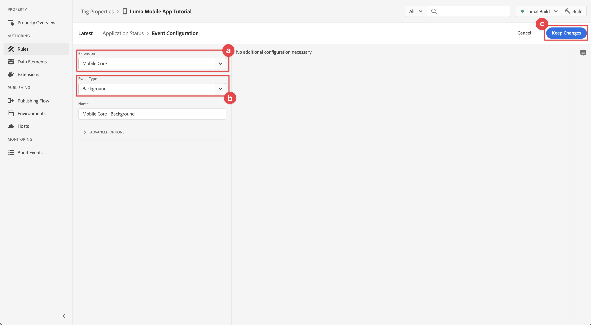
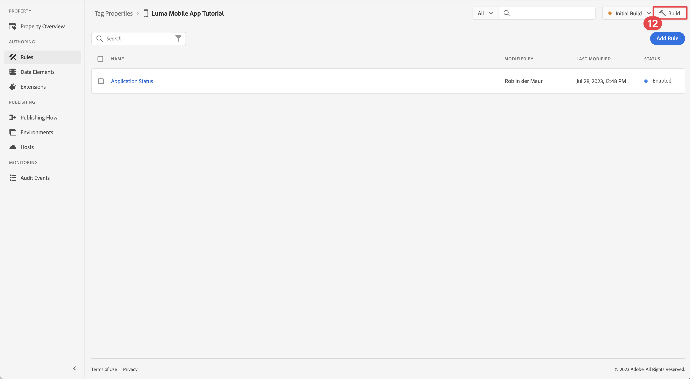

# Dados do ciclo de vida

Saiba como coletar dados do ciclo de vida em um aplicativo móvel.

A extensão de ciclo de vida do SDK do Adobe Experience Platform Mobile habilita a coleta de dados do ciclo de vida do seu aplicativo móvel. A extensão de rede de borda da Adobe Experience Platform envia esses dados do ciclo de vida para a rede de borda da Platform, onde são encaminhados para outros aplicativos e serviços de acordo com a configuração da sequência de dados. Saiba mais sobre o [Extensão de ciclo de vida](https://developer.adobe.com/client-sdks/documentation/lifecycle-for-edge-network/) na documentação do produto.


## Pré-requisitos

* O aplicativo com SDKs instalados e configurados foi criado e executado com sucesso.
* Registrada a extensão do Assurance conforme descrito no [lição anterior](install-sdks.md).

## Objetivos de aprendizagem

Nesta lição, você vai:

<!--
* Add lifecycle field group to the schema.
* -->
* Ative métricas de ciclo de vida precisas iniciando/pausando corretamente à medida que o aplicativo se move entre o primeiro e o segundo plano.
* Envie dados do aplicativo para a Platform Edge Network.
* Validar no Assurance.

<!--
## Add lifecycle field group to schema

The Consumer Experience Event field group you added in the [previous lesson](create-schema.md) already contains the lifecycle fields, so you can skip this step. If you don't use Consumer Experience Event field group in your own app, you can add the lifecycle fields by doing the following:

1. Navigate to the schema interface as described in the [previous lesson](create-schema.md).
1. Open the **Luma Mobile App Event Schema** schema and select **[!UICONTROL Add]** next to Field groups.
    
1. In the search bar, enter "lifecycle".
1. Select the checkbox next to **[!UICONTROL AEP Mobile Lifecycle Details]**.
1. Select **[!UICONTROL Add field groups]**.
    
1. Select **[!UICONTROL Save]**.
    
-->

## Alterações de implementação

Agora você pode atualizar seu projeto para registrar os eventos de ciclo de vida.

1. Navegue até Luma > Luma > SceneDelegate no navegador de projetos do Xcode.

1. Quando iniciado, se o aplicativo sair do estado em segundo plano, o iOS pode chamar o `sceneWillEnterForeground:` delegar método e é aqui que você deseja acionar um evento de início de ciclo de vida. Adicionar este código a `func sceneWillEnterForeground(_ scene: UIScene)`:

   ```swift
   // When in foreground start lifecycle data collection
   MobileCore.lifecycleStart(additionalContextData: nil)
   ```

1. Quando o aplicativo entra em segundo plano, você deseja pausar a coleta de dados do ciclo de vida do aplicativo `sceneDidEnterBackground:` método delegado. Adicionar este código a  `func sceneDidEnterBackground(_ scene: UIScene)`:

   ```swift
   // When in background pause lifecycle data collection
   MobileCore.lifecyclePause()
   }
   ```

## Validar com garantia

1. Revise o [instruções de configuração](assurance.md) e conecte seu simulador ou dispositivo ao Assurance.
1. Inicie o aplicativo.
1. Envie o aplicativo para o plano de fundo. Verificar **[!UICONTROL LifecyclePause]** eventos na interface do usuário do Assurance.
1. Coloque o aplicativo em primeiro plano. Verificar **[!UICONTROL LifecycleResume]** eventos na interface do usuário do Assurance.
   


## Encaminhar dados para a Rede de borda da plataforma

O exercício anterior despacha os eventos em primeiro e segundo plano para o SDK do Adobe Experience Platform Mobile. Para encaminhar esses eventos à Rede de borda da Platform:

1. Selecionar **[!UICONTROL Regras]** na interface da Coleção de dados.
   
1. Selecionar **[!UICONTROL Build inicial]** como a biblioteca a ser usada.
1. Selecione **[!UICONTROL Criar nova regra]**.
   
1. No [!UICONTROL Criar regra] , insira `Application Status` para **[!UICONTROL Nome]**.
1. Selecionar  **[!UICONTROL Adicionar]** abaixo **[!UICONTROL EVENTOS]**.
   
1. No [!UICONTROL Configuração de evento] etapa:
   1. Selecionar **[!UICONTROL Núcleo móvel]** como o **[!UICONTROL Extensão]**.
   1. Selecionar **[!UICONTROL Primeiro plano]** como o **[!UICONTROL Tipo de evento]**.
   1. Selecione **[!UICONTROL Manter alterações]**.
      
1. Na tela Criar regra, selecione  **[!UICONTROL Adicionar]** ao lado de **[!UICONTROL Mobile Core - Primeiro plano]**.
   
1. No [!UICONTROL Configuração de evento] etapa:
   1. Selecionar **[!UICONTROL Núcleo móvel]** como o **[!UICONTROL Extensão]**.
   1. Selecionar **[!UICONTROL Histórico]** como o **[!UICONTROL Tipo de evento]**.
   1. Selecione **[!UICONTROL Manter alterações]**.
      
1. Na tela Criar regra, selecione  **[!UICONTROL Adicionar]** abaixo **[!UICONTROL AÇÕES]**.
   
1. No [!UICONTROL Configuração de ação] etapa:
   1. Selecionar **[!UICONTROL Rede de borda da Adobe Experience]** como o **[!UICONTROL Extensão]**.
   1. Selecionar **[!UICONTROL Encaminhar evento para a rede de borda]** como o **[!UICONTROL Tipo de ação]**.
   1. Selecione **[!UICONTROL Manter alterações]**.
      
1. Selecionar **[!UICONTROL Salvar na biblioteca]**.
   
1. Selecionar **[!UICONTROL Build]** para reconstruir a biblioteca.
   

Depois de criar a propriedade com êxito, os eventos são enviados para a Rede de borda da Platform e são encaminhados para outros aplicativos e serviços de acordo com a configuração da sequência de dados.

Você deve ver **[!UICONTROL Fechamento do aplicativo (plano de fundo)]** e **[!UICONTROL Inicialização do aplicativo (primeiro plano)]** eventos que contêm dados XDM no Assurance.


>[!SUCCESS]
>
>Agora você configurou o aplicativo para enviar eventos de estado do aplicativo (primeiro plano, segundo plano) para a Rede de borda da Adobe Experience Platform e todos os serviços definidos no fluxo de dados.<br>Obrigado por investir seu tempo aprendendo sobre o Adobe Experience Platform Mobile SDK. Se você tiver dúvidas, quiser compartilhar comentários gerais ou tiver sugestões sobre conteúdo futuro, compartilhe-as nesta [Publicação de discussão da comunidade do Experience League](https://experienceleaguecommunities.adobe.com/t5/adobe-experience-platform-launch/tutorial-discussion-implement-adobe-experience-cloud-in-mobile/td-p/443796)

Próximo: **[Rastrear eventos](events.md)**
