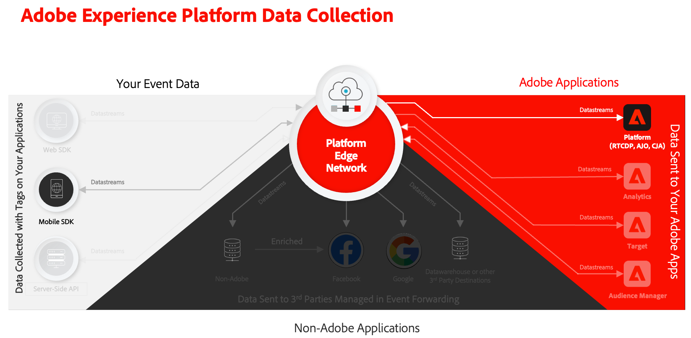

# Enviar dados para o Experience Platform

Saiba como enviar dados do aplicativo móvel para o Adobe Experience Platform.

Esta lição opcional é relevante para todos os clientes do Real-time Customer Data Platform (Real-Time CDP), Journey Optimizer e Customer Journey Analytics. o Experience Platform, a base dos produtos Experience Cloud, é um sistema aberto que transforma todos os seus dados (Adobe e não Adobe) em perfis robustos de clientes. Esses perfis do cliente são atualizados em tempo real e usam insights orientados por IA para ajudar você a fornecer as experiências certas em cada canal.

A variável [evento](events.md), [ciclo de vida](lifecycle-data.md), e [identidade](identity.md) Os dados coletados e enviados para a Platform Edge Network em lições anteriores são encaminhados para os serviços configurados na sua sequência de dados, incluindo o Adobe Experience Platform.

## Pré-requisitos

Sua organização deve ser provisionada e as permissões devem ser concedidas para o Adobe Experience Platform.

Se você não tiver acesso, poderá [ignorar esta lição](install-sdks.md).

## Objetivos de aprendizagem

Nesta lição, você vai:

* Crie um conjunto de dados de Experience Platform.
* Configure seu fluxo de dados para encaminhar dados para o Experience Platform.
* Validar dados no conjunto de dados.
* Ative seu esquema e conjunto de dados para o Perfil de cliente em tempo real.
* Validar dados no Perfil do cliente em tempo real.
* Validar dados no gráfico de identidade.

## Criar um conjunto de dados

Todos os dados assimilados com sucesso na Adobe Experience Platform são mantidos no data lake como conjuntos de dados. Um conjunto de dados é uma construção de armazenamento e gerenciamento para uma coleção de dados (normalmente uma tabela) que contém um esquema (colunas) e campos (linhas). Os conjuntos de dados também contêm metadados que descrevem vários aspectos dos dados armazenados. Consulte a [documentação](https://experienceleague.adobe.com/docs/experience-platform/catalog/datasets/overview.html?lang=pt-BR) para obter informações.

1. Navegue até a interface do Experience Platform selecionando-a nos Aplicativos  no canto superior direito.

1. Selecionar **[!UICONTROL Conjuntos de dados]** no menu de navegação esquerdo.

1. Selecionar  **[!UICONTROL Criar conjunto de dados]**.

1. Selecione **[!UICONTROL Criar conjunto de dados a partir do esquema]**.
   

1. Procure pelo esquema. por exemplo, usando `Luma Mobile` no campo de pesquisa.
1. Selecione seu esquema, por exemplo **[!DNL Luma Mobile App Event Schema]**.

1. Selecione **[!UICONTROL Próximo]**.
   

1. Forneça um **[!UICONTROL Nome]**, por exemplo `Luma Mobile App Events Dataset` e uma **[!UICONTROL Descrição]**.

1. Selecione **[!UICONTROL Concluir]**.
   

## Adicionar serviço de sequência de dados do Adobe Experience Platform

Para enviar seus dados XDM da rede de borda para a Adobe Experience Platform, configure o serviço da Adobe Experience Platform para o fluxo de dados configurado como parte da [Criar um fluxo de dados](create-datastream.md).

>[!IMPORTANT]
>
>Você só pode ativar o serviço Adobe Experience Platform ao criar um conjunto de dados de evento.

1. Na interface da Coleção de dados, selecione **[!UICONTROL Datastreams]** e sua sequência de dados.

1. Em seguida, selecione  **[!UICONTROL Adicionar serviço]**.

1. Selecione **[!UICONTROL Adobe Experience Platform]** na lista [!UICONTROL Serviço].

1. Habilitar o serviço alternando **[!UICONTROL Ativado]** em.

1. Selecione o **[!UICONTROL Conjunto de dados do evento]** que você criou anteriormente, por exemplo **[!DNL Luma Mobile App Event Dataset]**.

1. Selecione **[!UICONTROL Salvar]**.

   
1. A configuração final deve ser semelhante a esta.

   

## Validar dados no conjunto de dados

Agora que você criou um conjunto de dados e atualizou seu fluxo de dados para enviar dados para o Experience Platform, todos os dados XDM enviados para a Rede de borda da Platform são encaminhados para a Platform e chegam ao conjunto de dados.

Abra o aplicativo e navegue até as telas onde você está rastreando eventos. Você também pode acionar medições de ciclo de vida.

Abra o conjunto de dados na interface da Platform. Você deve ver os dados que chegam em lotes ao conjunto de dados

Também é possível ver registros e campos de exemplo usando o **[!UICONTROL Visualizar conjunto de dados]** recurso:

Uma ferramenta mais robusta para validar dados é a [serviço de consulta](https://experienceleague.adobe.com/docs/platform-learn/tutorials/queries/explore-data.html?lang=pt-BR).

## Ativar o Perfil do cliente em tempo real

O Perfil do cliente em tempo real do Experience Platform permite criar uma visualização integral de cada cliente individual que combina dados de vários canais, incluindo dados online, offline, de CRM e de terceiros. O Perfil permite consolidar dados diferentes do cliente em uma visualização unificada, oferecendo uma conta acionável com carimbo de data e hora de cada interação com o cliente.

### Ativar o esquema

1. Abra o esquema, por exemplo **[!DNL Luma Mobile App Event Schema]**.
1. Ativar **[!UICONTROL Perfil]**.
1. Selecionar **[!UICONTROL Os dados deste esquema conterão uma identidade principal no campo identityMap.]** na caixa de diálogo.
1. **[!UICONTROL Salvar]** o schema.

   

### Ativar o conjunto de dados

1. Abra seu conjunto de dados, por exemplo **[!DNL Luma Mobile App Event Dataset]**.
1. Ativar **[!UICONTROL Perfil]**.

   

### Validar dados no perfil

Abra o aplicativo e navegue até as telas onde você está rastreando eventos, por exemplo: faça logon no aplicativo Luma e faça uma compra.

Use o Assurance para localizar uma das identidades transmitidas no identityMap (Email, lumaCrmId ou ECID), por exemplo, a ID do CRM.

Na interface da Platform,

1. Navegue até **[!UICONTROL Perfis]** e selecione **[!UICONTROL Procurar]** na barra superior.
1. Especifique os detalhes de identidade que você acabou de capturar, por exemplo `Luma CRM ID` para **[!UICONTROL Namespace de identidade]** e o valor copiado para **[!UICONTROL Valor de identidade]**. Em seguida, selecione **[!UICONTROL Exibir]**.
1. Para exibir detalhes, selecione o perfil.

No **[!UICONTROL Detalhe]** você pode ver informações básicas sobre o usuário, incluindo o **[!UICONTROL ** identidades vinculadas **]**:

No **[!UICONTROL Eventos]**, você pode ver os eventos coletados da implementação do aplicativo móvel para este usuário:

Na tela de detalhes do perfil:

1. Para exibir o gráfico de identidade, clique no link ou navegue até **[!UICONTROL Identidades]** e selecione **[!UICONTROL Gráfico de identidade]** na barra superior.
1. Para pesquisar o valor de identidade, especifique `Luma CRM ID` como o **[!UICONTROL Namespace de identidade]** e o valor copiado como o **[!UICONTROL Valor de identidade]**. Em seguida, selecione **[!UICONTROL Exibir]**.

   Esta visualização mostra todas as identidades que estão vinculadas em um perfil e suas origens. Este é um exemplo de um gráfico de identidade construído com dados coletados ao concluir este tutorial do SDK móvel (Fonte de dados 2) e o [Tutorial do SDK da Web](https://experienceleague.adobe.com/docs/platform-learn/implement-web-sdk/overview.html?lang=pt-BR) (Fonte de dados 1):

   

## Próximas etapas

Os profissionais de marketing e análise podem fazer muito mais com dados capturados no Experience Platform, inclusive analisá-los no Customer Journey Analytics e criar segmentos no Real-time Customer Data Platform. Você está indo para um bom começo!

>[!SUCCESS]
>
>Agora você configurou o aplicativo para enviar dados não apenas para a Rede de borda, mas também para a Adobe Experience Platform. Obrigado por investir seu tempo aprendendo sobre o Adobe Experience Platform Mobile SDK. Se você tiver dúvidas, quiser compartilhar comentários gerais ou tiver sugestões sobre conteúdo futuro, compartilhe-as nesta [Publicação de discussão da comunidade do Experience League](https://experienceleaguecommunities.adobe.com/t5/adobe-experience-platform-launch/tutorial-discussion-implement-adobe-experience-cloud-in-mobile/td-p/443796).

Próximo: **[Criar e notificações por push](journey-optimizer-push.md)**
