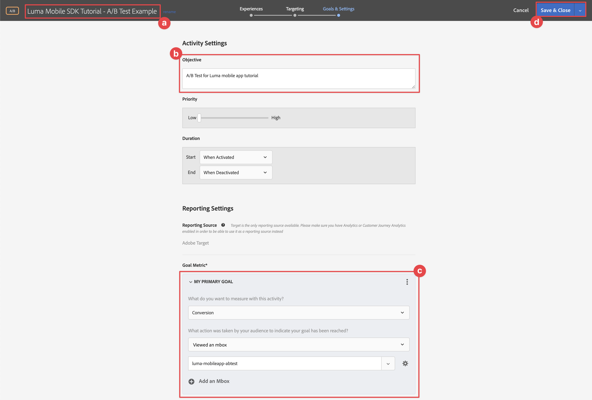

# Realizar testes A/B com o Target

Saiba como executar testes A/B em seus aplicativos móveis com o SDK móvel da plataforma e o Adobe Target.

O Target fornece tudo o que você precisa para ajustar e personalizar as experiências dos clientes. O Target ajuda a maximizar a receita em sites da Web e para dispositivos móveis, aplicativos, mídia social e outros canais digitais. O Target pode executar testes A/B, testes multivariados, recomendar produtos e conteúdo, conteúdo do Target, personalizar conteúdo automaticamente com IA e muito mais. O foco desta lição está na funcionalidade de teste A/B do Target.  Consulte a [Visão geral do teste A/B](https://experienceleague.adobe.com/docs/target/using/activities/abtest/test-ab.html?lang=en) para obter mais informações.


Antes de executar testes A/B com o Target, você deve garantir que as configurações e integrações adequadas estejam em vigor.

>[!NOTE]
>
>Essa lição é opcional e se aplica somente aos usuários do Adobe Target que desejam realizar testes A/B.


## Pré-requisitos

* O aplicativo com SDKs instalados e configurados foi criado e executado com sucesso.
* Acesso ao Adobe Target com permissões, funções corretamente configuradas, espaços de trabalho e propriedades, conforme descrito [aqui](https://experienceleague.adobe.com/docs/target/using/administer/manage-users/enterprise/property-channel.html?lang=pt-BR).


## Objetivos de aprendizagem

Nesta lição, você

* Atualize sua sequência de dados para integração com o Target.
* Atualize sua propriedade de tag com a extensão Journey Optimizer - Decisioning.
* Atualize seu esquema para capturar eventos de apresentação.
* Valide a configuração no Assurance.
* Crie um teste A/B simples no Target.
* Atualize seu aplicativo para registrar a extensão Otimizer.
* Implemente o teste A/B no aplicativo.
* Validar a implementação no Assurance.


## Configuração

>[!TIP]
>
>Se você já tiver configurado seu aplicativo como parte da variável [Ofertas do Journey Optimizer](journey-optimizer-offers.md) lição, talvez você já tenha executado algumas etapas nesta seção de configuração.

### Atualizar configuração da sequência de dados

### Adobe Target

Para garantir que os dados enviados do aplicativo móvel para a Rede de borda do Experience Platform sejam encaminhados para a Adobe Target, atualize a configuração da sequência de dados.

1. Na interface da Coleção de dados, selecione **[!UICONTROL Datastreams]** e selecione seu fluxo de dados, por exemplo **[!DNL Luma Mobile App]**.
1. Selecionar **[!UICONTROL Adicionar serviço]** e selecione **[!UICONTROL Adobe Target]** do **[!UICONTROL Serviço]** lista.
1. Se você for cliente do Target Premium e quiser usar tokens de propriedade, insira o Target **[!UICONTROL Token de propriedade]** que você deseja usar nessa integração. Os usuários do Target Standard podem ignorar esta etapa.

   Você pode encontrar suas propriedades na interface do usuário do Target, em **[!UICONTROL Administração]** > **[!UICONTROL Propriedades]**. Selecionar  para revelar o token de propriedade da propriedade que você deseja usar. O token de propriedade tem um formato como `"at_property": "xxxxxxxx-xxxx-xxxxx-xxxx-xxxxxxxxxxxx"`; você deve inserir somente o valor `xxxxxxxx-xxxx-xxxxx-xxxx-xxxxxxxxxxxx`.

1. Selecione **[!UICONTROL Salvar]**.

   


#### Adobe Journey Optimizer

Para garantir que os dados enviados do aplicativo móvel para a Rede de borda sejam encaminhados para o Journey Optimizer - Gerenciamento de decisão, atualize sua configuração do Experience Edge .

1. Na interface da Coleção de dados, selecione **[!UICONTROL Datastreams]** e selecione seu fluxo de dados, por exemplo **[!DNL Luma Mobile App]**.
1. Selecionar  para **[!UICONTROL Experience Platform]** e selecione  **[!UICONTROL Editar]** no menu de contexto.
1. No **[!UICONTROL Datastreams]** >  >  **[!UICONTROL Adobe Experience Platform]** , certifique-se **[!UICONTROL Offer decisioning]**, **[!UICONTROL Segmentação de borda]**, e **[!UICONTROL Destinos de personalização]** são selecionados. Se também seguir as lições do Journey Optimizer, selecione **[!UICONTROL Adobe Journey Optimizer]** também. Consulte [Configurações do Adobe Experience Platform](https://experienceleague.adobe.com/docs/experience-platform/datastreams/configure.html?lang=en#aep) para obter mais informações.
1. Para salvar a configuração do fluxo de dados, selecione **[!UICONTROL Salvar]** .

   


### Instalar a extensão Adobe Journey Optimizer - Decisioning tags

1. Navegue até **[!UICONTROL Tags]**, encontre sua propriedade de tag móvel e abra a propriedade.
1. Selecionar **[!UICONTROL Extensões]**.
1. Selecionar **[!UICONTROL Catálogo]**.
1. Procure por **[!UICONTROL Adobe Journey Optimizer - Decisão]** extensão.
1. Instale a extensão. A extensão não requer configuração adicional.

   


### Atualizar seu esquema

1. Navegue até a interface da Coleção de dados e selecione **[!UICONTROL Esquemas]** do painel esquerdo.
1. Selecionar **[!UICONTROL Procurar]** na barra superior.
1. Selecione seu esquema para abri-lo.
1. No editor de esquema, selecione  **[!UICONTROL Adicionar]** ao lado de **[!UICONTROL Grupos de campos]**.
1. Na caixa de diálogo Adicionar grupos de campos, procure `proposition`, selecione **[!UICONTROL Evento de experiência - Interações de apresentação]** e selecione **[!UICONTROL Adicionar grupos de campos]**.
   
1. Para salvar as alterações no esquema, selecione **[!UICONTROL Salvar]**.


### Validar configuração no Assurance

Para validar sua configuração no Assurance:

1. Vá para a interface do usuário do Assurance.
1. Selecionar **[!UICONTROL Configurar]** no painel esquerdo e selecione  ao lado de **[!UICONTROL Validar configuração]** abaixo **[!UICONTROL ADOBE JOURNEY OPTIMIZER DECISIONING]**.
1. Selecione **[!UICONTROL Salvar]**.
1. Selecionar **[!UICONTROL Validar configuração]** no painel esquerdo. A configuração da sequência de dados é validada e a configuração do SDK em seu aplicativo.
   

## Criar um teste A/B

Há muitos tipos de atividades que você pode criar no Adobe Target e implementar em um aplicativo móvel, como mencionado na introdução. Para esta lição, você se concentrará na criação e implementação de um teste A/B.

1. Na interface do usuário do Target, selecione **[!UICONTROL Atividades]** na barra superior.
1. Selecionar **[!UICONTROL Criar atividade]** e **[!UICONTROL Teste A/B]** no menu de contexto.
1. No **[!UICONTROL Criar atividade de teste A/B]** , selecione **[!UICONTROL Dispositivo móvel]** como o **[!UICONTROL Tipo]**, selecione um espaço de trabalho na **[!UICONTROL Escolher espaço de trabalho]** e selecione sua propriedade na lista **[!UICONTROL Escolher propriedade]** listar se você for um cliente do Target Premium e tiver especificado um token de propriedade na sequência de dados.
1. Selecione **[!UICONTROL Criar]**.
   

1. No **[!UICONTROL Atividade sem título]** na tela, no **[!UICONTROL Experiências]** etapa:

   1. Enter `luma-mobileapp-abtest` in **[!UICONTROL Selecionar localização]** abaixo **[!UICONTROL LOCAL 1]**. Esse nome de local (geralmente chamado de mbox) é usado posteriormente na implementação do aplicativo.
   1. Selecionar  ao lado de **[!UICONTROL Conteúdo padrão]** e selecione **[!UICONTROL Criar oferta JSON]** no menu de contexto.
   1. Copie o seguinte JSON em **[!UICONTROL Insira um objeto JSON válido]**.

      ```json
      { 
          "title": "Luma Anaolog Watch",
          "text": "Designed to stand up to your active lifestyle, this women's Luma Analog Watch features a tasteful brushed chrome finish and a stainless steel, water-resistant construction for lasting durability.", 
          "image": "https://luma.enablementadobe.com/content/dam/luma/en/products/gear/watches/Luma_Analog_Watch.jpg" 
      }
      ```

   1. Selecionar **[!UICONTROL + Adicionar experiência]**.

      

   1. Repita as etapas b e c para a Experiência B, mas use o seguinte JSON:

      ```json
      { 
          "title": "Aim Analog Watch",
          "text": "The flexible, rubberized strap is contoured to conform to the shape of your wrist for a comfortable all-day fit. The face features three illuminated hands, a digital read-out of the current time, and stopwatch functions.", 
          "image": "https://luma.enablementadobe.com/content/dam/luma/en/products/gear/watches/Aim_Watch.jpg" 
      }
      ```

   1. Selecione **[!UICONTROL Próximo]**.

      

1. No **[!DNL Targeting]** revise a configuração do seu teste A/B. Por padrão, ambas as ofertas são alocadas igualmente entre todos os visitantes. Clique em **[!UICONTROL Avançar]** para continuar.

   

1. No **[!UICONTROL Metas e configurações]** etapa:

   1. Renomeie sua atividade sem título, por exemplo, para `Luma Mobile SDK Tutorial - A/B Test Example`.
   1. Insira um **[!UICONTROL Objetivo]** para o teste A/B, por exemplo `A/B Test for Luma mobile app tutorial`.
   1. Selecionar **[!UICONTROL Conversão]**, **[!UICONTROL Visualizou uma mbox]** no **[!UICONTROL Métrica de objetivo]** > **[!UICONTROL MEU OBJETIVO PRINCIPAL]** lado a lado e insira o nome do local (mbox), por exemplo `luma-mobileapp-abtest`.
   1. Selecionar **[!UICONTROL Salvar e fechar]**.

      

1. De volta ao **[!UICONTROL Todas as atividades]** tela:

   1. Selecionar  na sua atividade.
   1. Selecionar  **[!UICONTROL Ativar]** para ativar o teste A/B.

   


## Implementar o Target no seu aplicativo

Conforme discutido nas lições anteriores, a instalação de uma extensão de tag móvel fornece apenas a configuração. Em seguida, instale e registre o SDK Otimize. Se essas etapas não estiverem claras, revise o [Instalar SDKs](install-sdks.md) seção.

>[!NOTE]
>
>Se você concluiu o [Instalar SDKs](install-sdks.md) , o SDK já estará instalado e você poderá ignorar essa etapa.
>

1. No Xcode, verifique se [Otimização da AEP](https://github.com/adobe/aepsdk-messaging-ios.git) é adicionado à lista de pacotes nas Dependências de pacote. Consulte [Gerenciador de pacotes Swift](install-sdks.md#swift-package-manager).
1. Navegue até **[!DNL Luma]** > **[!DNL Luma]** > **[!DNL AppDelegate]** no navegador do Projeto Xcode.
1. Assegurar `AEPOptimize` faz parte da lista de importações.

   `import AEPOptimize`

1. Assegurar `Optimize.self` O faz parte da matriz de extensões que você está registrando.

   ```swift
   let extensions = [
       AEPIdentity.Identity.self,
       Lifecycle.self,
       Signal.self,
       Edge.self,
       AEPEdgeIdentity.Identity.self,
       Consent.self,
       UserProfile.self,
       Places.self,
       Messaging.self,
       Optimize.self,
       Assurance.self
   ]
   ```

1. Navegue até **[!DNL Luma]** > **[!DNL Luma]** > **[!DNL Utils]** > **[!DNL MobileSDK]** no navegador do Projeto Xcode. Localize o ` func updatePropositionAT(ecid: String, location: String) async` função. Adicione o seguinte código:

   ```swift
   Task {
       let ecid = ["ECID" : ["id" : ecid, "primary" : true] as [String : Any]]
       let identityMap = ["identityMap" : ecid]
       let xdmData = ["xdm" : identityMap]
       let decisionScope = DecisionScope(name: location)
       Optimize.clearCachedPropositions()
       Optimize.updatePropositions(for: [decisionScope], withXdm: xdmData)
   }
   ```

   Esta função:

   * configura um dicionário XDM `xdmData`, contendo a ECID para identificar o perfil para o qual você deve apresentar o teste A/B, e
   * define um `decisionScope`, uma matriz de locais onde apresentar o teste A/B.

   Em seguida, a função chama duas APIs: [`Optimize.clearCachePropositions`](https://support.apple.com/en-ie/guide/mac-help/mchlp1015/mac)  e [`Optimize.updatePropositions`](https://developer.adobe.com/client-sdks/documentation/adobe-journey-optimizer-decisioning/api-reference/#updatepropositions). Essas funções limpam todas as propostas em cache e atualizam as propostas para esse perfil.

1. Navegue até **[!DNL Luma]** > **[!DNL Luma]** > **[!DNL Views]** > **[!DNL Personalization]** > **[!DNL TargetOffersView]** no navegador do Projeto Xcode. Localize o `func onPropositionsUpdateAT(location: String) async {` e inspecione o código dessa função. A parte mais importante dessa função é a  [`Optimize.onPropositionsUpdate`](https://developer.adobe.com/client-sdks/documentation/adobe-journey-optimizer-decisioning/api-reference/#onpropositionsupdate) Chamada de API, que:
   * recupera as apresentações do perfil atual com base no escopo da decisão (que é o local definido no Teste A/B),
   * recupera a oferta da proposta,
   * desenvolve o conteúdo da oferta para que ela possa ser exibida corretamente no aplicativo e
   * aciona o `displayed()` ação na oferta que enviará um evento de volta para a Rede de borda informando que a oferta é exibida.

1. Ainda em **[!DNL TargetOffersView]**, adicione o seguinte código à `.onFirstAppear` modificador. Esse código garantirá que a chamada de retorno para atualização das ofertas seja registrada apenas uma vez.

   ```swift
   // Invoke callback for offer updates
   Task {
       await self.onPropositionsUpdateAT(location: location)
   }
   ```

1. Ainda em **[!DNL TargetOffersView]**, adicione o seguinte código à `.task` modificador. Esse código atualizará as ofertas quando a visualização for atualizada.

   ```swift
   // Clear and update offers
   await self.updatePropositionsAT(ecid: currentEcid, location: location)
   ```

Você pode enviar parâmetros adicionais do Target (como mbox, perfil, produto ou parâmetros de pedido) em uma solicitação de consulta de personalização para a rede Experience Edge, adicionando-os em um dicionário de dados ao chamar o [`Optimize.updatePropositions`](https://developer.adobe.com/client-sdks/documentation/adobe-journey-optimizer-decisioning/api-reference/#updatepropositions) API. Consulte para obter mais informações [Parâmetros do Target](https://developer.adobe.com/client-sdks/documentation/adobe-journey-optimizer-decisioning/#target-parameters).


## Validar usando o aplicativo

1. Abra o aplicativo em um dispositivo ou no simulador.

1. Vá para a **[!UICONTROL Personalização]** guia.

1. Selecionar **[!UICONTROL Personalização de borda]**.

1. Role para baixo até a parte inferior e você verá uma das duas ofertas definidas no teste A/B exibida na **[!UICONTROL TARGET]** bloco.

   


## Validar implementação no Assurance

Para validar o teste AB no Assurance:

1. Vá para a interface do usuário do Assurance.
1. Selecionar **[!UICONTROL Configurar]** no painel esquerdo e selecione  ao lado de **[!UICONTROL Revisar e simular]** abaixo **[!UICONTROL ADOBE JOURNEY OPTIMIZER DECISIONING]**.
1. Selecione **[!UICONTROL Salvar]**.
1. Selecionar **[!UICONTROL Revisar e simular]** no painel esquerdo. A configuração da sequência de dados é validada e a configuração do SDK em seu aplicativo.
1. Selecionar **[!UICONTROL Solicitações]** na barra superior. Você vê o seu **[!DNL Target]** solicitações.
   

1. Você pode explorar **[!UICONTROL Simular]** e **[!UICONTROL Lista de Eventos]** guias para obter mais funcionalidades, verificando a configuração de ofertas do Target.

## Próximas etapas

Agora você deve ter todas as ferramentas para começar a adicionar mais testes A/B ou outras atividades do Target (como Direcionamento de experiência, Teste multivariado), quando relevante e aplicável, ao seu aplicativo. Há informações mais detalhadas disponíveis no [Acordo de recompra do GitHub para a extensão Otimize](https://github.com/adobe/aepsdk-optimize-ios) onde você também pode encontrar um link para uma [tutorial](https://opensource.adobe.com/aepsdk-optimize-ios/#/tutorials/README) sobre como rastrear ofertas do Adobe Target.

>[!SUCCESS]
>
>Você habilitou o aplicativo para testes A/B e exibiu os resultados de um teste A/B usando o Adobe Target e a extensão Adobe Journey Optimizer - Decisioning para o SDK do Adobe Experience Platform Mobile.<br/>Obrigado por investir seu tempo aprendendo sobre o Adobe Experience Platform Mobile SDK. Se você tiver dúvidas, quiser compartilhar comentários gerais ou tiver sugestões sobre conteúdo futuro, compartilhe-as nesta [Publicação de discussão da comunidade do Experience League](https://experienceleaguecommunities.adobe.com/t5/adobe-experience-platform-launch/tutorial-discussion-implement-adobe-experience-cloud-in-mobile/td-p/443796).

Próximo: **[Conclusão e próximas etapas](conclusion.md)**
