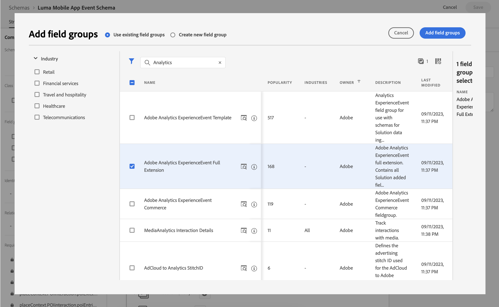

# Coletar e mapear dados do Analytics

Saiba como mapear dados móveis para o Adobe Analytics.

A variável [evento](events.md) Os dados coletados e enviados para a Platform Edge Network em lições anteriores são encaminhados para os serviços configurados na sua sequência de dados, incluindo o Adobe Analytics. Mapeie os dados para as variáveis corretas em seu conjunto de relatórios.


## Pré-requisitos

* Noções básicas sobre o rastreamento de ExperienceEvent.
* Dados XDM enviados com sucesso no aplicativo de amostra.
* Um conjunto de relatórios do Adobe Analytics que você pode usar nesta lição.

## Objetivos de aprendizagem

Nesta lição, você vai:

* Configure seu fluxo de dados com o serviço Adobe Analytics.
* Entenda o mapeamento automático de variáveis do Analytics.
* Configurar regras de processamento para mapear dados XDM para variáveis do Analytics.

## Adicionar serviço de sequência de dados do Adobe Analytics

Para enviar seus dados XDM da rede de borda para a Adobe Analytics, configure o serviço da Adobe Analytics para o fluxo de dados configurado como parte da [Criar um fluxo de dados](create-datastream.md).

1. Na interface da Coleção de dados, selecione **[!UICONTROL Datastreams]** e sua sequência de dados.

1. Em seguida, selecione  **[!UICONTROL Adicionar serviço]**.

1. Adicionar **[!UICONTROL Adobe Analytics]** do [!UICONTROL Serviço] lista,

1. Insira o nome do conjunto de relatórios do Adobe Analytics que você deseja usar no **[!UICONTROL ID do conjunto de relatórios]**.

1. Habilitar o serviço alternando **[!UICONTROL Ativado]** em.

1. Selecione **[!UICONTROL Salvar]**.

   


## Mapeamento automático

Muitos dos campos XDM padrão são mapeados automaticamente para variáveis do Analytics. Veja a lista completa [aqui](https://experienceleague.adobe.com/docs/analytics/implementation/aep-edge/variable-mapping.html?lang=en).

### Exemplo #1 - s.products

Um bom exemplo é o [variável products](https://experienceleague.adobe.com/docs/analytics/implementation/vars/page-vars/products.html?lang=en) que não podem ser preenchidos com regras de processamento. Com uma implementação XDM, você passa todos os dados necessários no `productListItems` e `s.products` são automaticamente preenchidos por meio do mapeamento do Analytics.

Este objeto:

```swift
"productListItems": [
    [
      "name":  "Yoga Mat",
      "SKU": "5829",
      "priceTotal": "49.99",
      "quantity": 1
    ],
    [
      "name":  "Water Bottle",
      "SKU": "9841",
      "priceTotal": "30.00",
      "quantity": 3
    ]
]
```

resulta em:

```
s.products = ";5829,1,49.99;9841,3,30.00"
```

>[!NOTE]
>
>Se `productListItems[].SKU` e `productListItems[].name` ambos contêm dados, o valor em `productListItems[].SKU` é usada. Consulte [Mapeamento de variável do Analytics no Adobe Experience Edge](https://experienceleague.adobe.com/docs/analytics/implementation/aep-edge/variable-mapping.html?lang=en) para obter mais informações.


### Exemplo #2 - scAdd

Se você observar de perto, todos os eventos têm dois campos `value` (obrigatório) e `id` (opcional). A variável `value` é usado para incrementar a contagem de eventos. A variável `id` é usado para serialização.

Este objeto:

```swift
"commerce" : {
  "productListAdds" : {
    "value" : 1
  }
}
```

resulta em:

```
s.events = "scAdd"
```

Este objeto:

```swift
"commerce" : {
  "productListAdds" : {
    "value" : 1,
    "id": "321435"
  }
}
```

resulta em:

```
s.events = "scAdd:321435"
```

## Validar com garantia

Usar o [Assurance](assurance.md) você pode confirmar que está enviando um evento de experiência, que os dados XDM estão corretos e que o mapeamento do Analytics está acontecendo conforme esperado.

1. Revise o [instruções de configuração](assurance.md#connecting-to-a-session) seção para conectar seu simulador ou dispositivo ao Assurance.

1. Enviar um **[!UICONTROL productListAdds]** evento (adicionar um produto à sua cesta).

1. Veja a ocorrência do ExperienceEvent.

   

1. Revise a parte XDM do JSON.

   ```json
   "xdm" : {
     "productListItems" : [ {
       "SKU" : "LLWS05.1-XS",
       "name" : "Desiree Fitness Tee",
       "priceTotal" : 24
     } ],
   "timestamp" : "2023-08-04T12:53:37.662Z",
   "eventType" : "commerce.productListAdds",
   "commerce" : {
     "productListAdds" : {
       "value" : 1
     }
   }
   // ...
   ```

1. Revise o **[!UICONTROL analytics.mapping]** evento.

   

Observe o seguinte no mapeamento do Analytics:

* **[!UICONTROL events]** são preenchidos com `scAdd` baseado em `commerce.productListAdds`.
* **[!UICONTROL pl]** (variável products) são preenchidos com um valor concatenado com base em `productListItems`.
* Há outras informações interessantes nesse evento, incluindo todos os dados de contexto.


## Mapeamento com dados de contexto

Os dados XDM encaminhados para o Analytics são convertidos em [dados de contexto](https://experienceleague.adobe.com/docs/mobile-services/ios/getting-started-ios/proc-rules.html?lang=en) incluindo campos padrão e personalizados.

A chave de dados de contexto é construída seguindo esta sintaxe:

```
a.x.[xdm path]
```

Por exemplo:

```
// Standard Field
a.x.commerce.saveforlaters.value

// Custom Field
a.x._techmarketingdemos.appinformation.appstatedetails.screenname
```

>[!NOTE]
>
>Campos personalizados são colocados sob o identificador Experience Cloud Org.
>
>`_techmarketingdemos` é substituída pelo valor único de sua organização.


Para mapear esses dados de contexto XDM para seus dados do Analytics em seu conjunto de relatórios, você pode:

### Usar um grupo de campos

* Adicione o **[!UICONTROL Extensão completa do Adobe Analytics ExperienceEvent]** grupo de campos ao seu esquema.

  

* Crie cargas XDM no aplicativo, em conformidade com o grupo de campos Extensão completa do Adobe Analytics ExperienceEvent, de modo semelhante ao que você fez no [Rastrear dados do evento](events.md) lição, ou
* Crie regras na propriedade Tags que usam ações de regra para anexar ou modificar dados ao grupo de campos Extensão completa do Adobe Analytics ExperienceEvent. Consulte para obter mais detalhes [Anexar dados a eventos do SDK](https://developer.adobe.com/client-sdks/documentation/user-guides/attach-data/) ou [Modificar dados em eventos do SDK](https://developer.adobe.com/client-sdks/documentation/user-guides/attach-data/).


### Usar regras de processamento

Veja como uma regra de processamento usando esses dados pode ser exibida:

* Você **[!UICONTROL Substituir valor de]** (1) **[!UICONTROL Nome da tela do aplicativo (eVar 2)]** (2) com o valor de **[!UICONTROL a.x._techmarketingdemo.appinformation.appstatedetails.screenname]** (3) se **[!UICONTROL a.x._techmarketingdemo.appinformation.appstatedetails.screenname]** (4) **[!UICONTROL está definido]** (5).

* Você **[!UICONTROL Definir evento]** (6) **[!UICONTROL Adicionar à lista de desejos (Evento 3)]** (7) a **[!UICONTROL a.x.commerce.saveForLaters.value(Context)]** (8) se **[!UICONTROL a.x.commerce.saveForLaters.value(Context)]** (9) **[!UICONTROL está definido]** (10).


>[!IMPORTANT]
>
>
>Algumas das variáveis mapeadas automaticamente podem não estar disponíveis para uso nas regras de processamento.
>
>
>Na primeira vez que você mapeia para uma regra de processamento, a interface não mostra as variáveis de dados de contexto do objeto XDM. Para corrigir isso, selecione qualquer valor, Salve e volte para editar. Todas as variáveis XDM agora devem aparecer.


Informações adicionais sobre regras de processamento e dados de contexto podem ser encontradas [aqui](https://experienceleague.adobe.com/docs/analytics-learn/tutorials/implementation/implementation-basics/map-contextdata-variables-into-props-and-evars-with-processing-rules.html?lang=en).

>[!TIP]
>
>Ao contrário de implementações anteriores do aplicativo móvel, não há distinção entre exibições de página/tela e outros eventos. Em vez disso, você pode incrementar a variável **[!UICONTROL Exibição da página]** ao definir a variável **[!UICONTROL Nome da página]** em uma regra de processamento. Como você está coletando o personalizado `screenName` no tutorial, é altamente recomendável mapear o nome da tela para **[!UICONTROL Nome da página]** em uma regra de processamento.


>[!SUCCESS]
>
>Você configurou o aplicativo para mapear os objetos XDM da Experience Edge para variáveis do Adobe Analytics, habilitando o serviço da Adobe Analytics no fluxo de dados e usando regras de processamento, quando aplicável.<br/> Obrigado por investir seu tempo aprendendo sobre o Adobe Experience Platform Mobile SDK. Se você tiver dúvidas, quiser compartilhar comentários gerais ou tiver sugestões sobre conteúdo futuro, compartilhe-as nesta [Publicação de discussão da comunidade do Experience League](https://experienceleaguecommunities.adobe.com:443/t5/adobe-experience-platform-data/tutorial-discussion-implement-adobe-experience-cloud-in-mobile/td-p/443796).

Próximo: **[Enviar dados para o Experience Platform](platform.md)**
