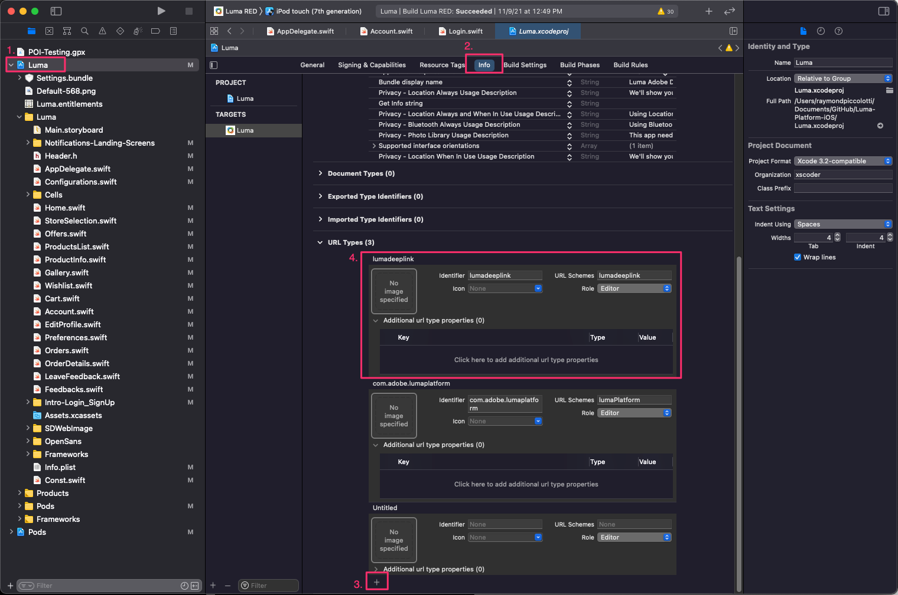

# Assurance

Saiba como configurar o Adobe Experience Platform Assurance em um aplicativo móvel.

O Assurance, formalmente conhecido como Projeto Griffon, foi projetado para ajudá-lo a inspecionar, testar, simular e validar a maneira como você coleta dados ou veicula experiências em seu aplicativo móvel.

O Assurance ajuda a inspecionar eventos brutos de SDK gerados pelo SDK móvel da Adobe Experience Platform. Todos os eventos coletados pelo SDK estão disponíveis para inspeção. Os eventos do SDK são carregados em uma exibição de lista, classificados por tempo. Cada evento tem uma exibição detalhada que fornece mais detalhes. Exibições adicionais para procurar a configuração do SDK, elementos de dados, Estados compartilhados e versões de extensão do SDK também são fornecidas. Saiba mais sobre o [Assurance](https://experienceleague.adobe.com/docs/experience-platform/assurance/home.html) na documentação do produto.


## Pré-requisitos

* O aplicativo de amostra foi criado e executado com sucesso com SDKs instalados e configurados.

## Objetivos de aprendizagem

Nesta lição, você vai:

* Confirme se sua organização tem acesso (e solicite-o caso não tenha).
* Configure seu URL base.
* Adicione o código específico necessário do iOS.
* Conectar-se a uma sessão.

## Confirmar acesso

Confirme se sua organização tem acesso ao Assurance realizando as seguintes etapas:

1. Visita [https://experience.adobe.com/#/assurance](https://experience.adobe.com/griffon){target="_blank"}
1. Faça logon usando as credenciais de Adobe ID do Experience Cloud.
1. Se você for trazido para a **[!UICONTROL Sessões]** e, em seguida, você terá acesso. Se você for trazido para a página de acesso beta, selecione **[!UICONTROL Registrar]**.

## Implementação

Para além do quadro [Instalação do SDK](install-sdks.md) você concluiu na lição anterior, o iOS também requer a seguinte adição. Adicione o seguinte código ao arquivo `AppDelegate.swift`:

```swift
func application(_ app: UIApplication, open url: URL, options: [UIApplication.OpenURLOptionsKey: Any] = [:]) -> Bool {
    Assurance.startSession(url: url)
    return true
}
```

A amostra do Luma fornecida para este tutorial usa o iOS 12.0. Se estiver seguindo com seu próprio aplicativo baseado em cenas usando o iOS 13 e posterior, use o `UISceneDelegate's scene(_:openURLContexts:)` do seguinte modo:

```swift
func scene(_ scene: UIScene, openURLContexts URLContexts: Set<UIOpenURLContext>) {
    // Called when the app in background is opened with a deep link.
    if let deepLinkURL = URLContexts.first?.url {
        Assurance.startSession(url: deepLinkURL)
    }
}
```

Mais informações podem ser encontradas [aqui](https://developer.adobe.com/client-sdks/documentation/platform-assurance-sdk/api-reference/){target="_blank"}.

## Configurar um URL de base

1. Abra o XCode e selecione o nome do projeto.
1. Navegue até a **Informações** guia.
1. Role para baixo até **Tipos de URL** e selecione o **+** botão para adicionar um novo.
1. Definir **Identificador** e **Esquemas de URL** para &quot;lumadeeplink&quot;.
1. Crie e execute o aplicativo.



Para saber mais sobre Esquemas de URL na iOS, revise [Documentação da Apple](https://developer.apple.com/documentation/xcode/defining-a-custom-url-scheme-for-your-app){target="_blank"}.

O Assurance funciona abrindo um URL, seja via navegador ou código QR, esse URL começa com o URL base que abre o aplicativo e contém parâmetros adicionais. Esses parâmetros exclusivos são usados para conectar a sessão.

## Conectar-se a uma sessão

1. Navegue até a [Interface do usuário do Assurance](https://experience.adobe.com/griffon){target="_blank"}.
1. Selecionar **[!UICONTROL Criar sessão]**.
1. Fornecer **[!UICONTROL Nome da sessão]** como `Luma App QA` e a variável **[!UICONTROL URL base]** `lumadeeplink://default`
1. Selecione **[!UICONTROL Próximo]**.
   
1. **[!UICONTROL Digitalizar código QR]** se você estiver usando um dispositivo físico. Se você estiver usando o simulador, **[!UICONTROL Copiar link]** e abra-o com o Safari no simulador.
   
1. Quando o aplicativo é carregado, você recebe um modal solicitando que você insira seu PIN da etapa anterior.
   
1. Se a conexão for bem-sucedida, você verá eventos na interface do usuário da Web do Assurance e um ícone flutuante do Assurance no aplicativo.
   * Ícone de garantia flutuante.
     
   * Experience Cloud eventos que vêm pela interface da Web.
     

Se tiver algum desafio, revise o [técnico](https://developer.adobe.com/client-sdks/documentation/platform-assurance-sdk/){target="_blank"} and [general documentation](https://experienceleague.adobe.com/docs/experience-platform/assurance/home.html){target="_blank"}.

Próximo: **[Consentimento](consent.md)**

>[!NOTE]
>
>Obrigado por investir seu tempo aprendendo sobre o Adobe Experience Platform Mobile SDK. Se você tiver dúvidas, quiser compartilhar feedback geral ou tiver sugestões sobre conteúdo futuro, compartilhe-as nesta [Publicação de discussão da comunidade do Experience League](https://experienceleaguecommunities.adobe.com/t5/adobe-experience-platform-launch/tutorial-discussion-implement-adobe-experience-cloud-in-mobile/td-p/443796)
