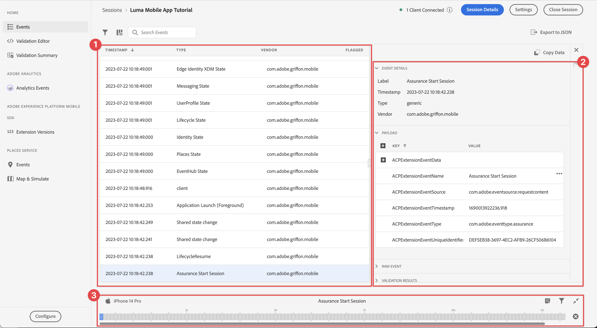
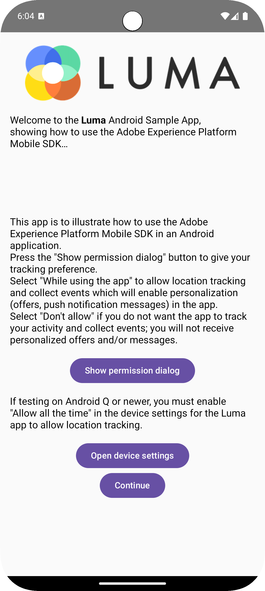

# Configurar o Assurance

Saiba como configurar o Adobe Experience Platform Assurance em um aplicativo móvel.

O Assurance, formalmente conhecido como Projeto Griffon, foi projetado para ajudá-lo a inspecionar, testar, simular e validar a maneira como você coleta dados ou veicula experiências em seu aplicativo móvel.

O Assurance ajuda a inspecionar eventos brutos de SDK gerados pelo SDK móvel da Adobe Experience Platform. Todos os eventos coletados pelo SDK estão disponíveis para inspeção. Os eventos do SDK são carregados em uma exibição de lista classificada por tempo. Cada evento tem uma exibição detalhada que fornece mais detalhes. Exibições adicionais para procurar a configuração do SDK, elementos de dados, Estados compartilhados e versões de extensão do SDK também são fornecidas. Saiba mais sobre o [Assurance](https://experienceleague.adobe.com/pt-br/docs/experience-platform/assurance/home) na documentação do produto.


## Pré-requisitos

* Aplicativo com SDKs instalado e configurado com êxito.

## Objetivos de aprendizagem

Nesta lição, você vai:

* Confirme se sua organização tem acesso (e solicite-o caso não tenha).
* Configure seu URL base.
* Adicione o código específico necessário do iOS.
* Conectar-se a uma sessão.

## Confirmar acesso

Confirme se sua organização tem acesso ao Assurance. Você, como usuário, deve ser adicionado ao perfil do Adobe Experience Platform. Consulte [Acesso de usuário](https://experienceleague.adobe.com/pt-br/docs/experience-platform/assurance/user-access) no guia do Assurance para obter mais informações.

## Implementação

Para implementar o Assurance em seu aplicativo:

>[!BEGINTABS]

>[!TAB iOS]

Além da [instalação geral do SDK](install-sdks.md), o iOS também exige o seguinte código adicional para iniciar a sessão do Assurance para o seu aplicativo.

1. Navegue até **[!DNL Luma]** > **[!DNL Luma]** > **[!UICONTROL SceneDelegate]** no navegador Project do Xcode.

1. Adicione o código a seguir a `func scene(_ scene: UIScene, openURLContexts URLContexts: Set<UIOpenURLContext>`:

   ```swift
   // Called when the app in background is opened with a deep link.
   if let deepLinkURL = URLContexts.first?.url {
       // Start the Assurance session
       Assurance.startSession(url: deepLinkURL)
   }
   ```

   Esse código inicia uma sessão de controle quando o aplicativo é colocado em segundo plano e aberto usando um deep link.

>[!TAB Android]

Além da [instalação geral do SDK](install-sdks.md), o Android também exige o seguinte código adicional para iniciar a sessão do Assurance para o seu aplicativo.

1. No Android Studio, na exibição **[!UICONTROL Android]**, navegue até **[!UICONTROL app]** > **[!UICONTROL kotlin+java]** > **[!UICONTROL com.adobe.luma.tutorial.android]** > **[!UICONTROL LumaApplication]**.

1. Adicione o código a seguir a `fun handleDeeplink(deeplink: String?)`:

   ```kotlin
   // Called when the app in background is opened with a deep link.
   if (deeplink.isNullOrEmpty()) {
      Log.w("Luma", "Deeplink is null or empty")
      return
   }
   
   Log.i("Luma", "Handling deeplink: $deeplink")
   Assurance.startSession(deeplink)
   ```

   Esse código inicia uma sessão de controle quando o aplicativo é colocado em segundo plano e aberto usando um deep link.

>[!ENDTABS]


Consulte [Referência à API do Assurance](https://developer.adobe.com/client-sdks/documentation/platform-assurance-sdk/api-reference/){target="_blank"} para obter mais informações.


## Definir um identificador de conjunto

É necessário fornecer um identificador de pacote exclusivo para seu aplicativo.

>[!BEGINTABS]

>[!TAB iOS]

1. Abra o projeto no Xcode.
1. Selecione **[!DNL Luma]** no Navegador de projetos.
1. Selecione o destino **[!DNL Luma]**.
1. Selecione a guia **Assinatura e Recursos**.
1. Defina um **[!UICONTROL Identificador de Pacote]**.

Use um identificador de conjunto _exclusivo_ e substitua o identificador de conjunto `com.adobe.luma.tutorial.swiftui`, pois cada identificador de conjunto precisa ser exclusivo. Normalmente, você usa um formato de DNS reverso para cadeias de caracteres de ID de pacote, como `com.organization.brand.uniqueidentifier`. A versão Concluída deste tutorial, por exemplo, usa `com.adobe.luma.tutorial.swiftui`.

{zoomable="yes"}

>[!TAB Android]

1. Abra o projeto no Android Studio.
1. Selecione **[!UICONTROL build.gradle.kts (Módulo :app)]** no navegador.
1. Use um identificador de conjunto _exclusivo_ e substitua o valor `com.adobe.luma.tutorial.android` para `namespace` em `android`
1. Use o mesmo identificador de conjunto _exclusivo_ e substitua o `com.adobe.luma.tutorial.android` por `applicationId` em `defaultConfig` em `android`

Normalmente, você usa um formato de DNS reverso para cadeias de caracteres de ID de pacote, como `com.organization.brand.uniqueidentifier`. A versão Concluída deste tutorial, por exemplo, usa `com.adobe.luma.tutorial.android`.

{zoomable="yes"}{zoomable="yes"}

>[!ENDTABS]


## Configurar um URL de base

Você precisa configurar um URL de base para garantir que o deep linking funcione.

>[!BEGINTABS]

>[!TAB iOS]

1. Vá para o seu projeto no Xcode.
1. Selecione **[!DNL Luma]** no Navegador de projetos.
1. Selecione o destino **[!DNL Luma]**.
1. Selecione a guia **Informações**.
1. Para adicionar uma URL base, role para baixo até **Tipos de URL** e selecione o botão **+**.
1. Defina **Identificador** para o identificador de pacote de sua escolha e defina um **Esquemas de URL** de sua escolha.

   {zoomable="yes"}

Use um identificador de conjunto _exclusivo_ e substitua o identificador de conjunto `com.adobe.luma.tutorial.swiftui`, pois cada identificador de conjunto deve ser exclusivo. Normalmente, você usa um formato de DNS reverso para cadeias de caracteres de ID de pacote, como `com.organization.brand.uniqueidentifier`. Você pode usar o mesmo identificador de conjunto usado em [Definir identificador de conjunto](#define-bundle-identifier).<br/>Da mesma forma, use um esquema de URL exclusivo e substitua o `lumatutorialswiftui` já fornecido pelo seu esquema de URL exclusivo.

Para saber mais sobre os Esquemas de URL no iOS, consulte a [documentação da Apple](https://developer.apple.com/documentation/xcode/defining-a-custom-url-scheme-for-your-app){target="_blank"}.

O Assurance funciona abrindo um URL, por meio de um navegador ou um código QR. Esse URL começa com o URL de base que abre o aplicativo e contém parâmetros adicionais. Esses parâmetros exclusivos são usados para conectar a sessão. No aplicativo de exemplo, o deep link é `lumatutorialswiftui://`.

>[!TAB Android]

1. Vá para a exibição **[!UICONTROL Android]** do seu projeto no Android Studio.
1. Selecione **[!UICONTROL app]** > **[!UICONTROL manifests]** > **[!UICONTROL AndroidManifest.xml]** no navegador.
1. Verifique se o elemento XML **[!UICONTROL manifest]** > **[!UICONTROL application]** > **[!UICONTROL activity]** é semelhante a:

   ```xml
   <activity
      android:name=".MainActivity"
      android:exported="true"
      android:theme="@style/Theme.LumaAndroid">
      <intent-filter>
            <action android:name="android.intent.action.MAIN" />
            <category android:name="android.intent.category.LAUNCHER" />
      </intent-filter>
      <intent-filter
            android:label="@string/app_name">
            <action android:name="android.intent.action.VIEW" />
            <category android:name="android.intent.category.DEFAULT" />
            <category android:name="android.intent.category.BROWSABLE" />
            <data android:scheme="lumatutorialandroid"
               android:host="default" />
      </intent-filter>
   </activity>
   ```

Certifique-se de especificar um `android:scheme` (por exemplo. `lumatutorialandroid`) e `android:host` (por exemplo `default`) para definir a URL base.

Para saber mais sobre deep links no Android, consulte [Criar deep links para conteúdo do aplicativo](https://developer.apple.com/documentation/xcode/defining-a-custom-url-scheme-for-your-app){target="_blank"}.

O Assurance funciona abrindo um URL, por meio de um navegador ou um código QR. Esse URL começa com o URL de base, que abre o aplicativo e contém parâmetros adicionais. Esses parâmetros exclusivos são usados para conectar a sessão.  No aplicativo de exemplo, o deep link é `lumatutorialandroid://default`.

>[!ENDTABS]


## Conectar-se a uma sessão

Agora você pode usar o Assurance para se conectar a uma sessão.

>[!BEGINTABS]

>[!TAB iOS]

No Xcode:

1. Compile ou recompile e execute o aplicativo no simulador ou em um dispositivo físico do Xcode, usando .

   Opcionalmente, talvez você queira *limpar* sua compilação, especialmente quando vir resultados inesperados. Selecione **[!UICONTROL Pasta de Compilação Limpa...]** no menu Xcode **[!UICONTROL Produto]**.


1. Na caixa de diálogo **[!UICONTROL Permitir que o &quot;Aplicativo Luma&quot; use sua localização]**, selecione **[!UICONTROL Permitir ao Usar o Aplicativo]**.

   

1. Na caixa de diálogo **[!UICONTROL &quot;Aplicativo Luma&quot; Deseja Enviar Notificações]**, selecione **[!UICONTROL Permitir]**.

   

1. Selecione **[!UICONTROL Continuar...]** para permitir que o aplicativo acompanhe sua atividade.

   

1. Na caixa de diálogo **[!UICONTROL Permitir que o &quot;Aplicativo Luma&quot; acompanhe sua atividade nos aplicativos e sites de outras empresas]**, selecione **[!UICONTROL Permitir]**.

   

1. Selecione **[!UICONTROL Continuar]**.


No navegador:

1. Vá para a interface da Coleção de dados.
1. Selecione **[!UICONTROL Assurance]** no painel esquerdo.
1. Selecione **[!UICONTROL Criar nova sessão]** e a opção **[!UICONTROL Conexão de deep link]**.
1. Selecione **[!UICONTROL Iniciar]**.
1. Forneça um **[!UICONTROL Nome da Sessão]**, como `Luma Mobile App Session` e a **[!UICONTROL URL Base]**, que são os Esquemas de URL inseridos no Xcode, seguido de `://` Por exemplo: `lumatutorialswiftui://`
1. Selecione **[!UICONTROL Próximo]**.
   {zoomable="yes"}
1. Na caixa de diálogo modal **[!UICONTROL Criar nova sessão]**:

   Se você estiver usando um dispositivo físico:

   * Selecione **[!UICONTROL Digitalizar código QR]**. Para abrir o aplicativo, use a câmera do dispositivo físico para digitalizar o código QR e toque no link.

     {zoomable="yes"}

   Se estiver usando um simulador:

   1. Selecione **[!UICONTROL Copiar Link]**.
   1. Copie o deep link usando  e use o deep link para abrir o aplicativo com o Safari no simulador.
      {zoomable="yes"}

1. Quando o aplicativo é carregado, uma caixa de diálogo modal é exibida solicitando que você insira o PIN mostrado na etapa 7.

   

   Insira o PIN e selecione **[!UICONTROL Conectar]**.


1. Se a conexão tiver sido bem-sucedida, você verá:
   * Um ícone do Assurance que flutua sobre seu aplicativo.

     

   * Atualizações do Experience Cloud que vêm pela interface do usuário do Assurance, mostrando:

      1. Eventos de experiência provenientes do aplicativo.
      1. Detalhes de um evento selecionado.
      1. O dispositivo e a linha do tempo.

         {zoomable="yes"}

1. Selecione **[!UICONTROL Continuar]** para ir para a tela inicial.

>[!TAB Android]

No Android Studio:

1. Compile ou recompile e execute o aplicativo no simulador ou em um dispositivo físico do Android Studio, usando .

   Opcionalmente, talvez você queira *limpar* sua compilação, especialmente quando vir resultados inesperados. Selecione **[!UICONTROL Limpar Projeto]** no menu **[!UICONTROL Compilação]** do Android Studio.


1. Na caixa de diálogo **[!UICONTROL Permitir que o Luma Android envie notificações]**, selecione **[!UICONTROL Permitir]**.

   

1. Selecione **[!UICONTROL Mostrar caixa de diálogo de permissões]**.

   

1. Em **[!UICONTROL Permitir que o Luma Android acesse a localização deste dispositivo?]**...

   

   * Selecione **[!UICONTROL Preciso]**.
   * Selecione **[!UICONTROL Ao usar o aplicativo]**.

1. De volta à tela de introdução do aplicativo, selecione **[!UICONTROL Abrir configurações do dispositivo]**.

1. Na tela **[!UICONTROL Permissão de localização]**, selecione **[!UICONTROL Permitir o tempo todo]**. Em seguida, selecione **[!UICONTROL Esquerda]** para retornar à tela de introdução do aplicativo.

   

1. Selecione **[!UICONTROL Continuar]** para ir para a tela inicial.


No navegador:

1. Vá para a interface da Coleção de dados.
1. Selecione **[!UICONTROL Assurance]** no painel esquerdo.
1. Selecione **[!UICONTROL Criar nova sessão]** e a opção **[!UICONTROL Conexão de deep link]**.
1. Selecione **[!UICONTROL Iniciar]**.
1. Forneça um **[!UICONTROL Nome da Sessão]**, como `Luma Mobile App Session` e a **[!UICONTROL URL Base]**, que são o `android:scheme` e o `android:host` definidos no **[!UICONTROL AndroidManifest.xml]** no Android Studio, separados por `://` Por exemplo: `lumatutorialandroid://default`
1. Selecione **[!UICONTROL Próximo]**.
   {zoomable="yes"}

1. Na caixa de diálogo modal **[!UICONTROL Criar nova sessão]**:

   Se você estiver usando um dispositivo físico:

   * Selecione **[!UICONTROL Digitalizar código QR]**. Para abrir o aplicativo, use a câmera do dispositivo físico para digitalizar o código QR e toque no link.

     {zoomable="yes"}

   Se estiver usando um simulador:

   1. Selecione **[!UICONTROL Copiar Link]**.
   1. Copie o deep link usando  e use o deep link para abrir o aplicativo com o Chrome no simulador.

   {zoomable="yes"}

   Quando solicitado no Chrome para **Continuar para o Luma Android**, selecione **Continuar**.

1. Quando o aplicativo é carregado, uma caixa de diálogo modal é exibida solicitando que você insira o PIN mostrado na etapa 7.

   

   Insira o PIN e selecione **[!UICONTROL Conectar]**.


1. Se a conexão tiver sido bem-sucedida, você verá:
   * Um ícone do Assurance que flutua sobre seu aplicativo.

     

   * Atualizações do Experience Cloud que vêm pela interface do usuário do Assurance, mostrando:

      1. Eventos de experiência provenientes do aplicativo.
      1. Detalhes de um evento selecionado.
      1. O dispositivo e a linha do tempo.

         {zoomable="yes"}

>[!ENDTABS]

Se tiver desafios, consulte a [documentação técnica](https://developer.adobe.com/client-sdks/documentation/platform-assurance-sdk/){target="_blank"} e a [documentação geral](https://experienceleague.adobe.com/pt-br/docs/experience-platform/assurance/home){target="_blank"}.


## Verificar extensões

Para verificar se seu aplicativo está usando as extensões mais atualizadas:

1. Selecione **[!UICONTROL Configurar]**.

1. Selecione  para  **[!UICONTROL Versões de Extensão]**.

1. Selecione **[!UICONTROL Salvar]**.

   {zoomable="yes"}

1. Selecione  **[!UICONTROL Versões de Extensão]** para ter uma visão geral das extensões mais recentes disponíveis e das extensões usadas na sua versão do aplicativo.

>[!BEGINTABS]

>[!TAB iOS]

{zoomable="yes"}

Para atualizar suas versões de extensão (por exemplo, **[!UICONTROL Mensagens]** e **[!UICONTROL Otimizar]**), selecione o pacote (extensão) de **[!UICONTROL Dependências de Pacote]** (por exemplo, **[!UICONTROL AEPMessaging]**) e, no menu de contexto, selecione **[!UICONTROL Atualizar Pacote]**. O Xcode atualiza as dependências do pacote.

>[!TAB Android]

{zoomable="yes"}

Se você vir extensões desatualizadas, consulte a [documentação do Android Studio](https://developer.android.com/build/agp-upgrade-assistant) sobre como atualizar os módulos de dependência para o seu projeto.


>[!ENDTABS]

>[!NOTE]
>
>Depois de atualizar suas extensões (pacotes) no ambiente de desenvolvimento, feche e exclua a sessão atual e repita todas as etapas de [Conectando-se a uma sessão](#connecting-to-a-session) e [Verificar extensões](#verify-extensions) para garantir que o Assurance relate corretamente as extensões corretas em uma nova sessão do Assurance.
>


>[!SUCCESS]
>
>Agora você configurou o aplicativo para usar o Assurance no restante do tutorial.
>
>Obrigado por investir seu tempo aprendendo sobre o Adobe Experience Platform Mobile SDK. Se tiver dúvidas, quiser compartilhar comentários gerais ou tiver sugestões sobre conteúdo futuro, compartilhe-os nesta [postagem de discussão da Comunidade Experience League](https://experienceleaguecommunities.adobe.com/t5/adobe-experience-platform-data/tutorial-discussion-implement-adobe-experience-cloud-in-mobile/td-p/443796?profile.language=pt)


Próximo: **[Implementar Consentimento](consent.md)**
