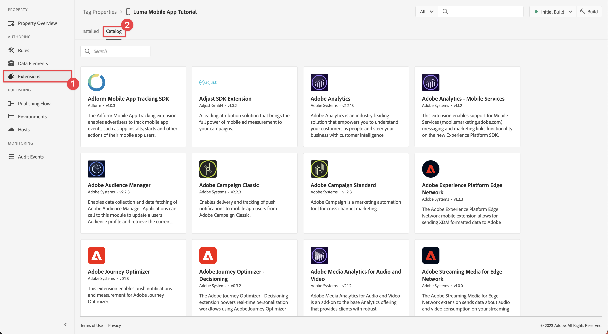
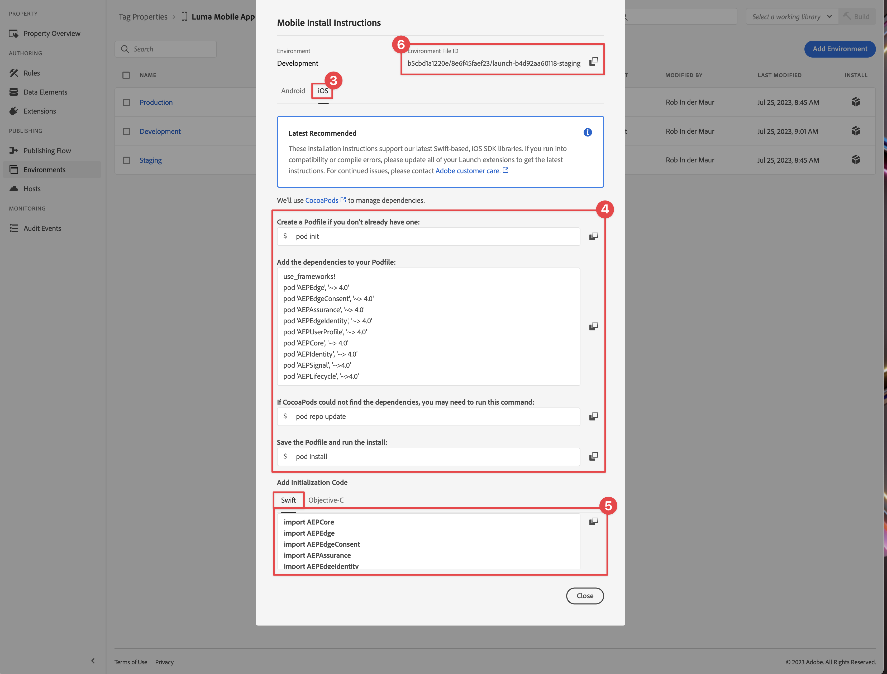

# Configurar uma propriedade de tag

Aprenda a configurar uma propriedade de tag na interface da [!UICONTROL Coleção de dados].

As tags no Adobe Experience Platform são a última palavra em gerenciamento de tags da Adobe. As tags oferecem aos clientes uma forma simples de implantar e gerenciar tags de análise, marketing e anúncios necessárias para potencializar experiências de cliente relevantes. Saiba mais sobre [Marcas](https://experienceleague.adobe.com/docs/experience-platform/tags/home.html?lang=pt-BR) na documentação do produto.

## Pré-requisitos

Para concluir a lição, você deve ter permissão para criar uma propriedade de tag. Também é útil ter uma compreensão básica das tags.

>[!NOTE]
>
> O Platform Launch (lado do cliente) agora é [Tags](https://experienceleague.adobe.com/docs/experience-platform/tags/home.html?lang=pt-BR)

## Objetivos de aprendizagem

Nesta lição, você vai:

* Instale e configure as extensões de tag para dispositivos móveis.
* Gere as instruções de instalação do SDK.

## Configuração inicial

1. Crie uma nova propriedade de tag móvel na Interface da coleção de dados:
   1. Selecione **[!UICONTROL Tags]** na navegação à esquerda.
   1. Selecionar **[!UICONTROL Nova Propriedade]**
      .
   1. Para o **[!UICONTROL Nome]**, digite `Luma Mobile App Tutorial`.
   1. Para a **[!UICONTROL Plataforma]**, selecione **[!UICONTROL Dispositivo móvel]**.
   1. Selecione **[!UICONTROL Salvar]**.

      

      >[!NOTE]
      >
      > As configurações de consentimento padrão para as implementações do sdk móvel baseado em borda, como a que você está fazendo nesta lição, vêm da [!UICONTROL Extensão de consentimento] e não da configuração [!UICONTROL Privacidade] na configuração da propriedade da tag. Você adiciona e configura a Extensão de consentimento posteriormente nesta lição. Para obter mais informações, consulte [a documentação](https://developer.adobe.com/client-sdks/edge/consent-for-edge-network/).

1. Abra a nova propriedade.
1. Criar uma biblioteca:

   1. Vá para **[!UICONTROL Fluxo de Publicação]** na navegação à esquerda.
   1. Selecione **[!UICONTROL Adicionar Biblioteca]**.

      

   1. Para o **[!UICONTROL Nome]**, digite `Initial Build`.
   1. Para o **[!UICONTROL Ambiente]**, selecione **[!UICONTROL Desenvolvimento (desenvolvimento)]**.
   1. Selecione o  **[!UICONTROL Adicionar todos os Recursos Alterados]**.
   1. Selecione **[!UICONTROL Salvar e criar no desenvolvimento]**.

      

   1. Finalmente, selecione **[!UICONTROL Build inicial]** como sua biblioteca de trabalho no menu **[!UICONTROL Selecionar uma biblioteca de trabalho]**.
      
1. Verificar extensões:

   1. Verifique se **[!UICONTROL Compilação Inicial]** está selecionada como biblioteca padrão.

   1. Selecione **[!UICONTROL Extensões]** no painel esquerdo.

   1. Selecione a guia **[!UICONTROL Instalado]**.

      As extensões do [!UICONTROL Mobile Core] e do [!UICONTROL Profile] devem ser pré-instaladas.

      

## Configuração de extensão

1. Verifique se você está em **[!UICONTROL Extensões]** na propriedade do aplicativo móvel.

1. Selecione **[!UICONTROL Catálogo]**.

   

1. Use o campo  **[!UICONTROL Pesquisa]** para localizar a extensão **Identidade**.

   1. Pesquisar por `Identity`.

   2. Selecione a extensão **[!UICONTROL Identidade]**.

   3. Selecione **[!UICONTROL Instalar]**.

      

   Essa extensão não requer nenhuma configuração adicional.

1. Use o campo  **[!UICONTROL Pesquisa]** para localizar e instalar a extensão **AEP Assurance**.

   Essa extensão não requer nenhuma configuração adicional.

1. Use o campo  **[!UICONTROL Pesquisa]** para localizar e instalar a extensão **Consentimento**. Na tela de configuração:

   1. Selecione **[!UICONTROL Pendente]**. Neste tutorial, você gerencia o consentimento ainda mais no aplicativo. Saiba mais sobre a Extensão de consentimento em [a documentação](https://developer.adobe.com/client-sdks/documentation/consent-for-edge-network/).
   1. Selecione **[!UICONTROL Salvar na biblioteca]**.

      

1. Use o campo  **[!UICONTROL Pesquisa]** para localizar e instalar a extensão **Adobe Experience Platform Edge Network**.

   1. Em **[!UICONTROL Datastreams]**, selecione o **[!UICONTROL Datastream]** criado na [etapa anterior](create-datastream.md) para cada um dos ambientes, por exemplo **[!DNL Luma Mobile App]**.

   1. Se ainda não estiver preenchido, especifique o **[!UICONTROL domínio Edge Network]** em **[!UICONTROL Configuração de Domínio]**. O domínio Edge Network é o nome da sua organização, seguido por `data.adobedc.net`, por exemplo `techmarketingdemos.data.adobedc.net`.

   1. No menu **[!UICONTROL Salvar na biblioteca]**, selecione **[!UICONTROL Salvar na biblioteca e criar]**.

      

Sua biblioteca foi criada para as novas extensões e configurações. Uma compilação bem-sucedida é indicada por um  ● no botão **[!UICONTROL Compilação Inicial]**.

## Gerar instruções de instalação do SDK

1. Selecione **[!UICONTROL Ambientes]** no painel esquerdo.

1. Selecione o ícone de instalação **[!UICONTROL Desenvolvimento]** .

   

1. Na caixa de diálogo **[!UICONTROL Instruções de Instalação Móvel]**, selecione a guia **[!UICONTROL iOS]**.

1. Você pode copiar  as instruções para configurar seu projeto usando o CocoaPods. Os CocoaPods são usados para gerenciar versões e downloads do SDK. Para saber mais, consulte a [documentação do CocoaPods](https://cocoapods.org/). Se você estiver usando o Android™ como plataforma de desenvolvimento, o Gradle será a ferramenta para gerenciar a versão, os downloads e as dependências do SDK. Para saber mais, reveja a [documentação do Gradle](https://gradle.org/)

   As instruções de instalação fornecem um bom ponto de partida para a implementação. Você pode encontrar informações adicionais [aqui](https://developer.adobe.com/client-sdks/documentation/getting-started/get-the-sdk/).

   >[!INFO]
   >
   >No restante deste tutorial, você **não** usará as instruções do CocoaPods, mas usará uma configuração nativa baseada no Swift Package Manager (SPM).
   >

1. Selecione a guia **[!UICONTROL Swift]** abaixo de **[!UICONTROL Adicionar código de inicialização]**. Este bloco de código mostra como importar os SDKs necessários e registrar as extensões no lançamento. Isso é abordado com mais detalhes em [Instalar SDKs](install-sdks.md).

1. Copie  a **[!UICONTROL ID do Arquivo de Ambiente]** e armazene-a no local necessário posteriormente. Essa ID exclusiva aponta para o ambiente de desenvolvimento. Cada ambiente (Produção, Armazenamento temporário, Desenvolvimento) tem seu próprio valor de ID exclusivo.

   

>[!NOTE]
>
>As instruções de instalação devem ser consideradas um ponto de partida e não uma documentação definitiva. As versões mais recentes do SDK e amostras de código podem ser encontradas na [documentação](https://developer.adobe.com/client-sdks/home/) oficial.

## Arquitetura de tags móveis

Se você estiver familiarizado com a versão da Web de Tags, antes chamada de Launch, é importante entender as diferenças nos dispositivos móveis.

* Na Web, uma propriedade de tag é renderizada na JavaScript, que é então (geralmente) hospedada na nuvem. Esse arquivo do JavaScript é referenciado diretamente no site.

* Em uma propriedade de tag móvel, as regras e configurações são renderizadas em arquivos JSON que são hospedados na nuvem. Os arquivos JSON são baixados e lidos pela extensão Mobile Core no aplicativo móvel. As extensões são SDKs separados que funcionam juntos. Se você adicionar uma extensão à propriedade da tag, também deverá atualizar o aplicativo. Se você alterar uma configuração de extensão ou criar uma regra, essas alterações serão refletidas no aplicativo depois de publicar a biblioteca de tags atualizada. Essa flexibilidade permite modificar configurações (como a id do conjunto de relatórios do Adobe Analytics) ou até mesmo alterar o comportamento do seu aplicativo (usando elementos de dados e regras, como você verá em lições posteriores) sem precisar alterar o código no aplicativo e reenviar a loja de aplicativos.

>[!SUCCESS]
>
>Agora você tem uma propriedade de tag móvel para usar no restante deste tutorial.
>
>Obrigado por investir seu tempo aprendendo sobre o Adobe Experience Platform Mobile SDK. Se você tiver dúvidas, quiser compartilhar comentários gerais ou tiver sugestões sobre conteúdo futuro, compartilhe-os nesta [postagem de Discussão da Comunidade Experience League](https://experienceleaguecommunities.adobe.com/t5/adobe-experience-platform-data/tutorial-discussion-implement-adobe-experience-cloud-in-mobile/td-p/443796)

Próximo: **[Instalar SDKs](install-sdks.md)**
