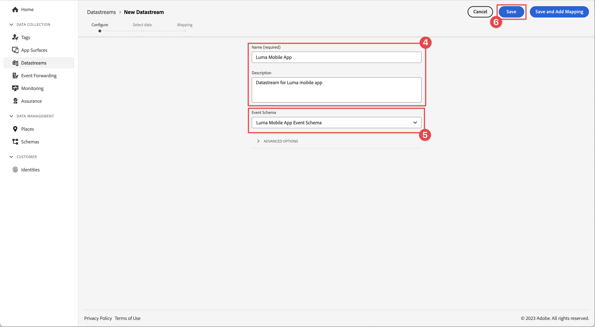

# Criar um fluxo de dados

Saiba como criar uma sequência de dados na Experience Platform.

Uma sequência de dados é uma configuração do lado do servidor no Platform Edge Network. A sequência de dados garante que os dados recebidos na Platform Edge Network sejam roteados adequadamente para aplicativos e serviços da Adobe Experience Cloud. Para obter mais informações, consulte a [documentação](https://experienceleague.adobe.com/en/docs/experience-platform/datastreams/overview) ou este [vídeo](https://experienceleague.adobe.com/en/docs/platform-learn/data-collection/edge-network/configure-datastreams).

{zoomable="yes"}

## Pré-requisitos

Para criar uma sequência de dados, sua organização deve ser provisionada para esse recurso na interface da Coleção de dados (antigo [!UICONTROL Launch]) e você deve ter permissões de usuário para gerenciar e exibir sequências de dados.

## Objetivos de aprendizagem

Nesta lição, você vai:

* Saber quando usar um fluxo de dados.
* Criar um fluxo de dados.
* Configurar um fluxo de dados.

## Criar um fluxo de dados

As sequências de dados podem ser criadas na interface [!UICONTROL Coleção de Dados] usando a ferramenta de configuração [!UICONTROL Sequência de Dados]. Para criar um fluxo de dados:

1. Verifique se você está na sandbox correta do Experience Platform, pois os fluxos de dados são definidos em um nível de sandbox.
1. Selecione **[!UICONTROL Datastreams]** no painel esquerdo.
1. Selecione **[!UICONTROL Nova Sequência De Dados]**.

   {zoomable="yes"}

1. Forneça um **[!UICONTROL Nome]**, por exemplo `Luma Mobile App` e uma **[!UICONTROL Descrição]**, por exemplo `Datastream for Luma Mobile App`.

   >[!NOTE]
   >
   >Lembrete final: se você estiver assistindo a este tutorial com várias pessoas em uma única sandbox ou se estiver usando uma conta compartilhada, considere anexar ou anexar uma identificação como parte de suas convenções de nomenclatura. Por exemplo, em vez de `Luma Mobile App Event Dataset`, use `Luma Mobile App Event Dataset - Joe Smith`. Consulte também a observação em [Visão geral](overview.md).

1. Selecione o esquema criado na lição anterior na lista **Esquema de evento**.
1. Selecione **[!UICONTROL Salvar]**.

   {zoomable="yes"}

## Adicionar serviços

Ao percorrer as lições (opcionais) do [Analytics](analytics.md) e do [Experience Platform](platform.md) neste tutorial, você adiciona serviços à sua sequência de dados para que os dados enviados para a Platform Edge Network sejam encaminhados para esses aplicativos.

<!--

### Adobe Analytics

1. Select **[!UICONTROL Add Service]**.

1. Add **[!UICONTROL Adobe Analytics]** from the [!UICONTROL Service] list, 

1. Enter the name of the report site that you want to use in **[!UICONTROL Report Suite ID]**.

1. Enable the service by switching **[!UICONTROL Enabled]** on.

1. Select **[!UICONTROL Save]**.

   {zoomable="yes"}

### Adobe Experience Platform

You might also want to enable the Adobe Experience Platform service. 

>[!IMPORTANT]
>
>You can only enable the Adobe Experience Platform service when having created an event dataset. If you don't already have an event dataset created, follow the instructions [here](platform.md).

1. Click  **[!UICONTROL Add Service]** to add another service.

1. Select **[!UICONTROL Adobe Experience Platform]** from the [!UICONTROL Service] list.

1. Enable the service by switching **[!UICONTROL Enabled]** on.

1. Select the **[!UICONTROL Event Dataset]** that you created as part of the [Create a dataset](platform.md#create-a-dataset) instructions, for example **Luma Mobile App Event Dataset**

1. Select **[!UICONTROL Save]**.

   {zoomable="yes"}
1. The final configuration should look something like this.
   
   {zoomable="yes"}

-->

>[!NOTE]
>
>Habilitar cada um dos serviços que sua organização usa garante que os dados coletados no aplicativo móvel possam ser usados em qualquer lugar. Consulte [configurações de sequência de dados](https://experienceleague.adobe.com/en/docs/experience-platform/datastreams/overview) para obter mais informações.

Ao implementar o Platform Mobile SDK em seu próprio aplicativo, você deve criar três fluxos de dados para mapear aos seus três ambientes de tag (desenvolvimento, preparo e produção). Se estiver usando o Platform Mobile SDK com aplicativos baseados em plataforma, como Adobe Real-Time Customer Data Platform ou Adobe Journey Optimizer, certifique-se de criar esses fluxos de dados nas sandboxes apropriadas.

>[!SUCCESS]
>
>Agora você tem um fluxo de dados para usar no restante do tutorial.
>
>Obrigado por investir seu tempo aprendendo sobre o Adobe Experience Platform Mobile SDK. Se tiver dúvidas, quiser compartilhar comentários gerais ou tiver sugestões sobre conteúdo futuro, compartilhe-os nesta [postagem de discussão da Comunidade Experience League](https://experienceleaguecommunities.adobe.com/t5/adobe-experience-platform-data/tutorial-discussion-implement-adobe-experience-cloud-in-mobile/td-p/443796)

Próximo: **[Configurar uma propriedade de marca](configure-tags.md)**
