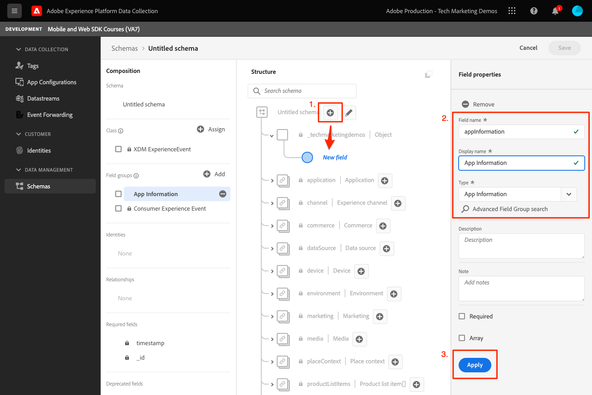

# Criar um esquema do XDM

Saiba como criar um esquema XDM para eventos de aplicativos móveis.

>[!INFO]
>
> Este tutorial será substituído por um novo tutorial usando um novo aplicativo móvel de amostra no final de novembro de 2023

A padronização e a interoperabilidade são os principais conceitos por trás da Adobe Experience Platform. O Experience Data Model (XDM), orientado pelo Adobe, é um esforço para padronizar os dados de experiência do cliente e definir esquemas para o gerenciamento da experiência do cliente.

## O que são esquemas XDM?

O XDM é uma especificação documentada publicamente projetada para melhorar o potencial das experiências digitais. Ela fornece estruturas e definições comuns que permitem que qualquer aplicativo se comunique com os serviços da plataforma. Seguindo os padrões XDM, todos os dados de experiência do cliente podem ser incorporados a uma representação comum que pode fornecer insights de maneira mais rápida e integrada. Você pode obter insights valiosos das ações do cliente, definir públicos-alvo do cliente por meio de segmentos e expressar atributos do cliente para fins de personalização.

A Experience Platform utiliza esquemas para descrever a estrutura dos dados de forma consistente e reutilizável. Ao definir os dados de forma consistente em todos os sistemas, fica mais fácil manter o significado e, portanto, obter valor dos dados.

Antes que os dados possam ser assimilados na Platform, um esquema deve ser composto para descrever a estrutura dos dados e fornecer restrições ao tipo de dados que podem estar contidos em cada campo. Os esquemas consistem em uma classe base e zero ou mais grupos de campos de esquema.

Para obter mais informações sobre o modelo de composição do schema, incluindo princípios de design e práticas recomendadas, consulte o [noções básicas da composição do esquema](https://experienceleague.adobe.com/docs/experience-platform/xdm/schema/composition.html?lang=pt-BR) ou no curso [Modelar seus dados de experiência do cliente com o XDM](https://experienceleague.adobe.com/?recommended=ExperiencePlatform-D-1-2021.1.xdm&amp;lang=pt-BR).

>[!TIP]
>
>Se você estiver familiarizado com a Referência de design de solução (SDRs) do Analytics, poderá considerar um esquema como um SDR mais robusto.

## Pré-requisitos

Para concluir a lição, você deve ter permissão para criar um esquema de Experience Platform.

## Objetivos de aprendizagem

Nesta lição, você vai:

* Criar um esquema na interface da Coleção de dados
* Adicionar um grupo de campos padrão ao esquema
* Criar e adicionar um grupo de campos personalizado ao esquema

## Navegar até esquemas

1. Faça logon na Adobe Experience Cloud.

1. Abra o alternador de aplicativos e selecione **[!UICONTROL Coleta de dados]**

   

1. Verifique se você está na sandbox do Experience Platform que está usando para este tutorial.

   >[!NOTE]
   >
   > Os clientes de aplicativos baseados em plataforma, como o Real-Time CDP, devem usar uma sandbox de desenvolvimento para este tutorial. Outros clientes usarão a sandbox de produção padrão.

1. Selecionar **[!UICONTROL Esquemas]** em **[!UICONTROL Gerenciamento de dados]**.

   

Agora você está na página principal de esquemas e uma lista dos esquemas existentes é apresentada a você. Você também pode ver guias correspondentes aos blocos de construção principais de um schema:

* **Grupos de campos** são componentes reutilizáveis que definem um ou mais campos para capturar dados específicos, como detalhes pessoais, preferências de hotel ou endereço.
* **Classes** defina os aspectos comportamentais dos dados que o esquema contém. Por exemplo: `XDM ExperienceEvent` captura séries temporais, dados do evento e `XDM Individual Profile` captura dados de atributo sobre um indivíduo.
* **Tipos de dados** são usados como tipos de campo de referência em classes ou grupos de campos da mesma forma que os campos literais básicos.

As descrições acima são uma visão geral de alto nível. Para obter mais detalhes, consulte [Blocos de construção de esquema](https://experienceleague.adobe.com/docs/platform-learn/tutorials/schemas/schema-building-blocks.html?lang=pt-BR) vídeo ou ler [Noções básicas da composição do esquema](https://experienceleague.adobe.com/docs/experience-platform/xdm/schema/composition.html?lang=pt-BR) na documentação do produto.

Neste tutorial, você usa o grupo de campos Evento de experiência do consumidor e cria um personalizado para demonstrar o processo.

>[!NOTE]
>
>O Adobe continua a adicionar mais grupos de campos padrão e eles devem ser usados sempre que possível, pois esses campos são implicitamente compreendidos pelos serviços do Experience Platform e fornecem maior consistência quando usados nos componentes da plataforma. O uso de grupos de campo padrão fornece benefícios tangíveis, como o mapeamento automático nos recursos do Analytics e IA na Platform.

## Arquitetura de esquema do aplicativo Luma

Em um cenário real, o processo de design do schema pode ser semelhante a:

* Colete os requisitos de negócios.
* Localize grupos de campos pré-criados para atender ao máximo de requisitos possível.
* Crie grupos de campos personalizados para qualquer lacuna.

Para fins de aprendizado, você usará grupos de campos pré-criados e personalizados.

* **Evento de experiência do consumidor**: grupo de campos pré-criado que tem muitos campos comuns.
* **Informações do aplicativo**: grupo de campos personalizado criado para imitar os conceitos do TrackState/TrackAction Analytics.

<!--Later in the tutorial, you can [update the schema](lifecycle-data.md) to include the **[!UICONTROL AEP Mobile Lifecycle Details]** field group.-->

## Criar um esquema

1. Selecionar **[!UICONTROL Criar esquema]** para abrir o menu suspenso de opções, selecione **[!UICONTROL XDM ExperienceEvent]**.

   

1. Pesquisar por `Consumer Experience Event`.

1. Você pode visualizar os campos e/ou ler a descrição para obter mais detalhes antes de selecionar.

1. Marque a caixa de seleção e **[!UICONTROL Adicionar grupos de campos]**.

   

   Você é redirecionado à tela principal de composição do esquema, onde é possível ver todos os campos disponíveis.

1. Nomeie seu esquema selecionando **[!UICONTROL Esquema sem título]** no canto superior esquerdo e, em seguida, **[!UICONTROL Nome de exibição]** &amp; **[!UICONTROL Descrição]**, por exemplo `Luma Tutorial Mobile` e `"Luma App" schema for Adobe Tutorial`

1. Selecione **[!UICONTROL Salvar]**.

   

>[!NOTE]
>
>Lembre-se de que não é necessário usar todos os campos em um grupo. Se for útil, você pode considerar um esquema como uma camada de dados vazia. No aplicativo, você preenche os valores relevantes no momento apropriado.
>
>A variável `Consumer Experience Event` tem um tipo de dados chamado `Web information`, que descreve eventos como exibição de página e cliques em links. No momento da escrita, não há uma paridade de aplicativo móvel para este recurso, portanto, você vai criar o seu próprio.

## Criar um tipo de dados personalizado

Você começa criando um tipo de dados personalizado que descreve os dois eventos:

* Exibição de tela
* Interação do aplicativo

1. Selecione o **[!UICONTROL Tipos de dados]** e selecione **[!UICONTROL Criar tipo de dados]**.

   

1. Dê a ele um **[!UICONTROL Nome de exibição]** e **[!UICONTROL Descrição]**, por exemplo `App Information` e `Custom data type describing "Screen Views" & "App Actions"`

   

   >[!TIP]
   >
   > Sempre use descritivo e legível [!UICONTROL nomes para exibição] para campos personalizados, conforme essa prática os torna mais acessíveis aos profissionais de marketing quando os campos são exibidos em serviços downstream, como o construtor de segmentos.

1. Para adicionar um campo, selecione o botão (+).

   Este campo é um objeto container para interação com o aplicativo. Dê a ele uma vitrine **[!UICONTROL Nome do campo]** `appInteraction`, **[!UICONTROL nome de exibição]** `App Interaction`, e **[!UICONTROL type]** `Object`.

1. Selecione **[!UICONTROL Aplicar]**.

   

1. Para medir a frequência com que uma ação ocorreu, adicione um campo selecionando o botão (+) ao lado da variável `appInteraction` objeto criado.

1. Dê a ele uma vitrine **[!UICONTROL Nome do campo]** `appAction`, **[!UICONTROL nome de exibição]** de `App Action` e **[!UICONTROL type]** `Measure`.

   Esta etapa seria equivalente a um evento bem-sucedido no Adobe Analytics.

1. Selecione **[!UICONTROL Aplicar]**.

   

1. Adicione um campo descrevendo o tipo de interação ao selecionar o botão (+) ao lado da variável `appInteraction` objeto.

1. Dê a ele um **[!UICONTROL Nome do campo]** `name`, **[!UICONTROL nome de exibição]** de `Name` e **[!UICONTROL type]** `String`.

   Esta etapa é equivalente a uma dimensão no Adobe Analytics.

   

1. Role até a parte inferior do painel direito e selecione **[!UICONTROL Aplicar]**.

1. Siga o mesmo padrão para criar uma `appStateDetails` objeto que contém um campo Measure chamado `screenView` e duas strings chamadas `screenName` e `screenType`.

1. Selecione **[!UICONTROL Salvar]**.

   

## Adicionar um grupo de campos personalizado

Agora adicione um grupo de campos personalizados usando seu tipo de dados personalizado:

1. Abra o schema criado anteriormente nesta lição.

1. Selecionar **[!UICONTROL Adicionar]** ao lado de **[!UICONTROL Grupos de campos]**.

   

1. Desta vez, você cria um grupo de campos personalizados selecionando o **[!UICONTROL Criar novo grupo de campos]** botão de opção próximo à parte superior e, em seguida, forneça um nome e uma descrição, por exemplo, `App Interactions` e `Fields for app interactions`.

   

1. Na tela principal de composição, adicione um campo à raiz do esquema.

1. Selecione o sinal de mais (+) ao lado do nome do schema.

1. No painel direito, forneça uma **[!UICONTROL Nome do campo]** de `appInformation`, um nome de exibição de `App Information`.

1. Selecionar `App Information` do **[!UICONTROL Tipo]** , o tipo de dados criado no exercício anterior.

1. Selecione **[!UICONTROL Aplicar]**.

   

>[!NOTE]
>
>Os grupos de campos personalizados são sempre colocados em seu identificador de Experience Cloud Org.
>
>`_techmarketingdemos` é substituído pelo valor único da sua organização.

Agora você tem um esquema para usar no restante do tutorial.

Próximo: **[Criar um [!UICONTROL sequência de dados]](create-datastream.md)**

>[!NOTE]
>
>Obrigado por investir seu tempo aprendendo sobre o Adobe Experience Platform Mobile SDK. Se você tiver dúvidas, quiser compartilhar feedback geral ou tiver sugestões sobre conteúdo futuro, compartilhe-as nesta [Publicação de discussão da comunidade do Experience League](https://experienceleaguecommunities.adobe.com/t5/adobe-experience-platform-launch/tutorial-discussion-implement-adobe-experience-cloud-in-mobile/td-p/443796)