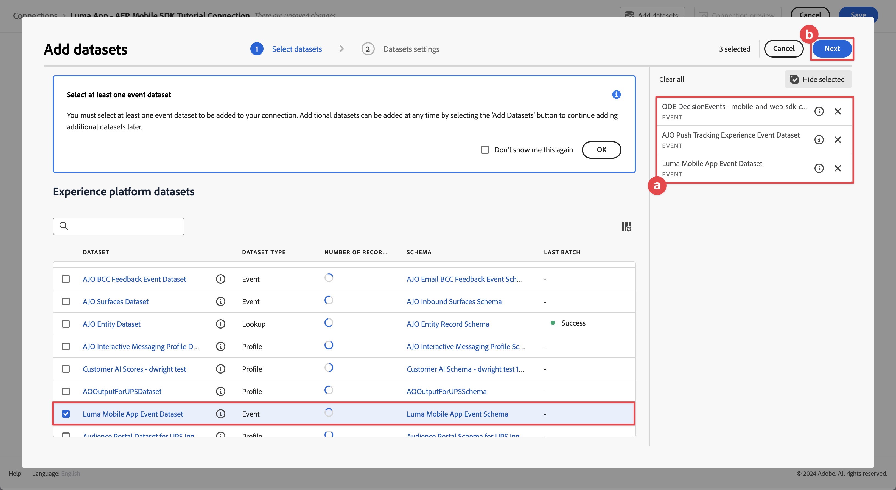

# Relatar e analisar usando o Customer Journey Analytics

Saiba como relatar e analisar as interações do aplicativo móvel com o Customer Journey Analytics.

Os dados do evento de aplicativo móvel, que você coletou e enviou para o Platform Edge Network em lições anteriores, são encaminhados para os serviços configurados em sua sequência de dados. Se você seguiu a lição [Enviar dados para o Experience Platform](platform.md), esses dados agora são armazenados em um conjunto de dados do Experience Platform e estão disponíveis para o Customer Journey Analytics usar em relatórios e análises.

Ao contrário do Adobe Analytics, o Customer Journey Analytics *usa* dados de conjuntos de dados criados no Experience Platform. Os dados não são enviados diretamente para a Customer Journey Analytics usando o Adobe Experience Platform Mobile SDK, mas enviados para conjuntos de dados. As conexões são configuradas no Customer Journey Analytics para selecionar os conjuntos de dados que você usará em seus projetos de relatórios e análises.

Esta lição no tutorial foca em relatórios e analisar os dados capturados do aplicativo tutorial do Luma. Um dos recursos exclusivos do Customer Journey Analytics é a combinação de dados de várias fontes (CRM, ponto de venda, aplicativo de fidelidade, call center) e canais (Web, móvel, offline) para obter insights profundos sobre as jornadas do cliente. Esse recurso está fora do escopo desta lição. Consulte [visão geral do Customer Journey Analytics](https://experienceleague.adobe.com/pt-br/docs/analytics-platform/using/cja-overview/cja-overview) para obter mais informações.

## Pré-requisitos

Sua organização deve ser provisionada e a permissão concedida à Customer Journey Analytics. Você deve ter acesso de administrador ao Customer Journey Analytics.

## Objetivos de aprendizagem

Nesta lição, você vai:

- Crie uma conexão para definir os conjuntos de dados do Experience Platform que você deseja usar no Customer Journey Analytics.
- Criar uma visualização de dados para preparar os dados dos conjuntos de dados para seus relatórios e análises
- Crie um projeto para criar relatórios e visualizações e analisar os dados do seu aplicativo móvel.

A sequência é intencional. As conexões usam conjuntos de dados e as visualizações de dados usam conexões.

## Criar uma conexão

Uma conexão no Customer Journey Analytics define os conjuntos de dados (e os dados dentro desses conjuntos de dados) do Experience Platform que você deseja usar para relatórios e análises.

1. Navegue até a interface do Customer Journey Analytics usando o menu Aplicativos  no canto superior direito.

1. Selecione **[!UICONTROL Conexões]** na barra de menu superior.

1. Selecione a guia **[!UICONTROL Lista]** na interface Conexões. Você verá uma lista de conexões existentes.

1. Selecione **[!UICONTROL Criar nova conexão]**.

1. Na tela **[!UICONTROL Conexões]** > **[!UICONTROL Conexão sem título]**, em **[!UICONTROL Configurações de conexão]**

   1. Insira um **[!UICONTROL Nome da conexão]**, por exemplo `Luma App - AEP Mobile SDK Tutorial Connection`.
   2. Insira uma **[!UICONTROL Descrição da conexão]**, por exemplo `Connection for the Luma app used in the AEP Mobile SDK tutorial`.

      Em **[!UICONTROL Configurações de dados]**:

   3. Selecione a sandbox que você usou para coletar os dados do aplicativo móvel, por exemplo **[!UICONTROL Cursos de SDK para dispositivos móveis e Web]**.
   4. Selecione **[!UICONTROL menos de 1 milhão]** de **[!UICONTROL Número médio de eventos diários]**.

   5. Selecione **[!UICONTROL Adicionar conjuntos de dados]** para selecionar os conjuntos de dados da Experience Platform que você deseja usar no Customer Journey Analytics.

      {zoomable="yes"}

   6. No assistente **[!UICONTROL Adicionar conjuntos de dados]**, etapa **[!UICONTROL Selecionar conjuntos de dados]**,

      1. Selecione os seguintes conjuntos de dados:

         - **[!UICONTROL Conjunto de Dados do Evento de Aplicativo Móvel Luma]**, o conjunto de dados criado como parte da seção [Criar um conjunto de dados](platform.md#create-a-dataset) na lição do Experience Platform.
         - **[!UICONTROL DecisioningEvents do ODE - *nome da sandbox*] decisão**
         - **[!UICONTROL Conjuntos de dados de eventos de rastreamento de push do AJO]**

      1. Selecione **[!UICONTROL Próximo]**.

         {zoomable="yes"}

   7. No assistente **[!UICONTROL Adicionar conjuntos de dados]**, etapa **[!UICONTROL Configurações de conjuntos de dados]**, é necessário definir os detalhes para cada um dos conjuntos de dados do evento.
      1. Consulte as tabelas a seguir para obter a configuração correta:

         | Conjunto de dados | ID de pessoa ① | Carimbo de data/hora ② | Tipo de fonte de dados ③ | Importar todos os novos ④ de dados | Preencher retroativamente todos os dados ⑤ |
         |---|---|---|---|---|---|
         | Conjunto de dados de evento do aplicativo móvel Luma | identityMap | carimbo de data e hora | Dados do aplicativo móvel | habilitar | habilitar |
         | DecisioningEvents ODE - *nome da sandbox* | identityMap | carimbo de data e hora | Dados do aplicativo móvel | habilitar | habilitar |
         | Conjunto de dados de evento de experiência de rastreamento de push do AJO | identityMap | carimbo de data e hora | Dados do aplicativo móvel | habilitar | habilitar |

      1. Selecione **[!UICONTROL Adicionar conjuntos de dados]**.

         {zoomable="yes"}

1. De volta às **[!UICONTROL Conexões]** > **[!UICONTROL Aplicativo Luma - Conexão do Tutorial do AEP Mobile SDK]**, selecione **[!UICONTROL Salvar]** para salvar sua conexão.

   {zoomable="yes"}

Agora você definiu sua conexão e o Customer Journey Analytics adiciona os dados dos conjuntos de dados ao seu próprio banco de dados interno. Essa coleta de dados pode levar algum tempo, dependendo da quantidade de dados. Para seu aplicativo tutorial, antecipe algumas horas para que os dados apareçam no Customer Journey Analytics.

Para exibir o status da sua conexão:

1. Selecione **[!UICONTROL Conexões]** na interface principal do Customer Journey Analytics.
1. Selecione o nome da sua conexão, por exemplo **[!UICONTROL Aplicativo Luma - Conexão do Tutorial do AEP Mobile SDK]**.

No **[!UICONTROL Conexões]** > **[!UICONTROL Aplicativo Luma - Conexão do Tutorial do AEP Mobile SDK]**, você verá:

1. Informações sobre o total de registros adicionados, registros ignorados e registros excluídos. Selecione **[!UICONTROL Todos os conjuntos de dados]** e escolha um período apropriado para exibir os detalhes da sua conexão. Você pode usar o  para abrir uma caixa de diálogo para selecionar o período.
1. Informações de conjuntos de dados individuais em registros adicionados, registros ignorados, registros excluídos e muito mais.

   {zoomable="yes"}

## Criar uma visualização de dados

Depois que os registros forem adicionados dos conjuntos de dados para o Customer Journey Analytics, você poderá criar uma visualização de dados para definir em quais componentes dos dados deseja criar relatórios.

Uma visualização de dados é um container específico do Customer Journey Analytics que permite determinar como interpretar dados de uma conexão. É possível configurar campos padrão e de esquema a partir de qualquer um dos conjuntos de dados definidos na Conexão como componentes (dimensões, métricas) no Analysis Workspace.

Uma visualização de dados no Customer Journey Analytics oferece enorme flexibilidade para configurar e definir corretamente os dados da sua conexão. Neste tutorial, você usa somente a funcionalidade necessária para seus relatórios e análises. Consulte [Visualizações de dados](https://experienceleague.adobe.com/pt-br/docs/analytics-platform/using/cja-dataviews/data-views) para obter mais informações.

Para criar a visualização de dados:

1. Navegue até a interface do Customer Journey Analytics usando o menu Aplicativos  no canto superior direito.

1. Selecione **[!UICONTROL Visualizações de dados]** na barra de menu superior.
1. Selecione **[!UICONTROL Criar nova visualização de dados]**.
1. Em **[!UICONTROL Visualizações de dados >]**, verifique se a guia **[!UICONTROL Configurar]** está selecionada.

   1. Selecione sua conexão na lista suspensa Conexão de configurações, por exemplo **[!UICONTROL Aplicativo Luma - Conexão do tutorial do AEP Mobile SDK]**.
   1. Insira um Nome para a visualização de dados, por exemplo: `Luma App - AEP Mobile SDK Tutorial Data view`.
   1. Selecione **[!UICONTROL Salvar e continuar]**.

      {zoomable="yes"} do CJA

1. Na guia **[!UICONTROL Componentes]** do **[!UICONTROL Aplicativo Luma - Exibição de dados do tutorial do AEP Mobile SDK]**, você pode definir as métricas e as dimensões que deseja usar nos relatórios do seu aplicativo móvel. Por padrão, várias métricas e dimensões padrão (conjuntamente chamadas de componentes) já estão configuradas para a visualização de dados. Mas sua visualização de dados requer mais componentes.  Para adicionar um campo de esquema a partir do esquema definido anteriormente ou de esquemas prontos para uso (consulte [Criar uma lição de esquema](create-schema.md)), como um componente (dimensão ou métrica):

   1. Localize o campo de esquema:

      - procure o componente usando o campo de pesquisa  ***[!UICONTROL Pesquisar campos de esquema]***. Por exemplo, `productListAdd` ou

        {zoomable="yes"}

      - passe para o campo de esquema dentro de  **[!UICONTROL Conjuntos de dados de eventos]** .  Por exemplo,  **[!UICONTROL Conjuntos de dados de eventos]**   **[!UICONTROL Comércio]**   **[!UICONTROL productListAdds]** 

        {zoomable="yes"}

   1. Arraste o campo de esquema específico do painel Campos de esquema e solte-o na lista **[!UICONTROL MÉTRICAS]** ou **[!UICONTROL DIMENSÕES]** no painel [!UICONTROL Componentes incluídos].

      {zoomable="yes"}

   1. É possível definir as configurações de um componente. Selecione o componente e defina as configurações no painel direito.  Por exemplo, você pode renomear **[!UICONTROL commerce.productListAdds]** como `Product Add To Lists` usando o campo **[!UICONTROL CONFIGURAÇÕES DO COMPONENTE]** > **[!UICONTROL Nome do componente]** no painel direito.

      {zoomable="yes"}

      Ou configure **[!UICONTROL INCLUIR/EXCLUIR VALORES]**.

      {zoomable="yes"}

   1. Agora que você entende como adicionar campos à sua visualização de dados e configurar o componente resultante, use as tabelas abaixo para obter uma lista de campos de esquema a serem adicionados como métricas ou dimensões. Use o valor da coluna **Caminho do esquema** da tabela abaixo para procurar ou percorrer o campo de esquema específico. Depois de adicionadas métricas e dimensões, verifique o valor da coluna **Configurações de Componentes** na tabela se configurações específicas são necessárias para um componente, como seu **[!UICONTROL nome do componente]** ou a definição de **[!UICONTROL VALORES PARA INCLUIR E EXCLUIR]**.

      **MÉTRICAS**

      | Nome do componente | Conjunto de dados | Tipo de dados do esquema | Caminho do esquema | Configurações do componente |
      |---|---|---|---|---|
      | Descartar | Conjunto de dados de evento de experiência de rastreamento de push do AJO, Conjunto de dados de evento de aplicativo móvel Luma | Número inteiro | _experiência.decisão. propositionEventType.dismiss | Nome do Componente: `Dismiss` |
      | Cancelar inscrição | Conjunto de dados de evento de experiência de rastreamento de push do AJO, Conjunto de dados de evento de aplicativo móvel Luma | Número inteiro | _experiência.decisão. propositionEventType.unsubscribe | Nome do Componente: `Unsubscribe` |
      | Acionador | Conjunto de dados de evento de experiência de rastreamento de push do AJO, Conjunto de dados de evento de aplicativo móvel Luma | Número inteiro | _experiência.decisão. propositionEventType.trigger | Nome do Componente: `Trigger` |
      | Exibir | Conjunto de dados de evento de experiência de rastreamento de push do AJO, Conjunto de dados de evento de aplicativo móvel Luma | Número inteiro | _experiência.decisão. propositionEventType.display | Nome do Componente: `Display` |
      | Enviar | Conjunto de dados de evento de experiência de rastreamento de push do AJO, Conjunto de dados de evento de aplicativo móvel Luma | Número inteiro | _experiência.decisão. propositionEventType.send | Nome do Componente: `Send` |
      | Interagir | Conjunto de dados de evento de experiência de rastreamento de push do AJO, Conjunto de dados de evento de aplicativo móvel Luma | Número inteiro | _experiência.decisão. propositionEventType.interaction | Nome do Componente: `Interact` |
      | Eventos de localização | Conjunto de dados de evento de experiência de rastreamento de push do AJO, conjunto de dados de evento de aplicativo móvel Luma, ODE DecisionEvents - decisão de cursos de sdk para dispositivos móveis e Web | String | Tipo de evento | Nome do Componente: `Location Events`  {zoomable="yes"} |
      | Visualizações de produto | Conjunto de dados de evento do aplicativo móvel Luma | Duplo | commerce.productViews.value | Nome do Componente: `Product Views` |
      | Adicionar produto a listas | Conjunto de dados de evento do aplicativo móvel Luma | Duplo | commerce.productListAdds.value | Nome do Componente: `Product Add To Lists` |
      | Compras | Conjunto de dados de evento do aplicativo móvel Luma | Duplo | commerce.purchases.value | Nome do Componente: `Purchases` |
      | Salvos para mais tarde | Conjunto de dados de evento do aplicativo móvel Luma | Duplo | commerce.saveForLaters.value | Nome do Componente: `Save For Laters` |
      | Interações do aplicativo | Conjunto de dados de evento do aplicativo móvel Luma | Duplo | _techmarketingdemos.appInformation. appInteraction.appAction.value | Nome do Componente: `App Interactions` |
      | Visualizações de tela | Conjunto de dados de evento do aplicativo móvel Luma | Duplo | _techmarketingdemos.appInformation. appStateDetails.screenView.value | Nome do Componente: `Screen Views` |

      {style="table-layout:auto"}

      >[!NOTE]
      >
      >Observe como o campo de esquema da métrica Eventos de local está usando **[!UICONTROL INCLUIR VALORES DE EXCLUSÃO]** para contar tipos de evento que contêm `location`.

      A configuração da visualização de dados para **[!UICONTROL MÉTRICAS]** deve corresponder às seguintes configurações depois de adicionar todos os campos de esquema da tabela acima como um componente de métrica:

      {zoomable="yes"}

      **DIMENSÕES**

      | Nome do componente | Conjunto de dados | Tipo de dados do esquema | Caminho do esquema | Configurações do componente |
      |---|---|---|---|---|
      | Cidade | Conjunto de dados de evento de experiência de rastreamento de push do AJO, Conjunto de dados de evento de aplicativo móvel Luma | String | placeContext.geo.city | Nome do Componente: `City` |
      | Tipos de evento | Conjunto de dados de evento de experiência de rastreamento de push do AJO, conjunto de dados de evento de aplicativo móvel Luma, ODE DecisionEvents - decisão de cursos de sdk para dispositivos móveis e Web | String | eventType | Nome do Componente: `Event Types` |
      | Nome da opção de decisão | Conjunto de dados de evento de experiência de rastreamento de push do AJO, conjunto de dados de evento de aplicativo móvel Luma, ODE DecisionEvents - decisão de cursos de sdk para dispositivos móveis e Web | String | _experiência.decisão. propositions.items.name | Nome do Componente: `Decision Option Name` |
      | Nome da interação do aplicativo | Conjunto de dados de evento do aplicativo móvel Luma | String | _techmarketingdemos.appInformation. appInteraction.name | Nome do Componente: `App Interaction Name` |
      | Nome da tela | Conjunto de dados de evento do aplicativo móvel Luma | String | _techmarketingdemos.appInformation. appStateDetails.screenName | Nome do Componente: `Screen Name` |
      | Nome da atividade | ODE DecisionEvents - decisão sobre os cursos de sdk para dispositivos móveis e Web | String | _experiência.decisão. propositionDetails.activity.name | Nome do Componente: `Activity Name` |
      | Nome da oferta | ODE DecisionEvents - decisão sobre os cursos de sdk para dispositivos móveis e Web | String | _experiência.decisão. propositionDetails.selections.name | Nome do Componente: `Offer Name` |

      {style="table-layout:auto"}

      A configuração da visualização de dados para **[!UICONTROL DIMENSIONS]** deve corresponder às configurações abaixo após a adição de todos os campos de esquema da tabela acima como um componente de dimensão:

      {zoomable="yes"}

   1. Selecione **[!UICONTROL Salvar e continuar]**.

1. A guia **[!UICONTROL Configurações]** do **[!UICONTROL Aplicativo Luma - Exibição de dados do tutorial do AEP Mobile SDK]** permite definir filtros e configurações de sessão. Para este tutorial, nenhuma configuração adicional é necessária.

   - Selecione **[!UICONTROL Salvar e concluir]**.

Você definiu a visualização de dados e tudo está pronto para começar a criar relatórios e visualizações.

## Criar um projeto

Os projetos do Workspace são usados no Customer Journey Analytics para criar relatórios e visualizações. Há muitas possibilidades para criar relatórios abrangentes e visualizações envolventes, mas isso está fora do escopo deste tutorial. Consulte [Visão geral do Workspace](https://experienceleague.adobe.com/pt-br/docs/customer-journey-analytics-learn/tutorials/analysis-workspace/workspace-projects/analysis-workspace-overview) e [Criar um novo projeto](https://experienceleague.adobe.com/pt-br/docs/customer-journey-analytics-learn/tutorials/analysis-workspace/workspace-projects/build-a-new-project) para obter mais informações.

Nesta seção da lição, você cria um projeto que mostra relatórios e visualizações sobre:

- Uso do aplicativo: uso das informações na tela e nas interações do aplicativo.
- Commerce: usar os eventos de comércio, como exibição de produto, adicionar ao carrinho e comprar.
- Ofertas: uso dos eventos exibidos nas ofertas do aplicativo.
- Visitas à loja: usar os eventos de geofence (simulados) do aplicativo.

Para criar seu projeto:

1. Navegue até a interface do Customer Journey Analytics usando o menu Aplicativos  no canto superior direito.

1. Selecione **[!UICONTROL Workspace]** na barra de menu superior.

1. Selecione **[!UICONTROL Criar projeto]**.

   1. Selecione **[!UICONTROL Projeto Workspace em branco]** na caixa de diálogo pop-up.

   1. Selecione **[!UICONTROL Criar]**.

      {zoomable="yes"}

1. Você verá a interface do **[!UICONTROL Novo projeto]**. Nessa interface, você cria relatórios e visualizações.

1. Selecione o nome do projeto (**[!UICONTROL Novo projeto]**) e forneça seu próprio nome para o projeto. Por exemplo, `Luma App - AEP Mobile SDK Tutorial Project`.
   {zoomable="yes"}

1. Para salvar o projeto, selecione **[!UICONTROL Projeto]** > **[!UICONTROL Salvar]**.
   {zoomable="yes"}

1. Na caixa de diálogo **[!UICONTROL Salvar]**, ignore todos os outros campos e selecione **[!UICONTROL Salvar]**.
   {zoomable="yes"}

>[!IMPORTANT]
>
>   Lembre-se de salvar o projeto regularmente; caso contrário, as alterações serão perdidas. Você pode salvar rapidamente seu projeto usando **[!UICONTROL ctrl + s]** (Windows) ou **[!UICONTROL ⌘(cmd) + s]** (macOS).

Agora você configurou o projeto. Uma tabela de forma livre é fornecida por padrão. Antes de adicionar componentes, verifique se o painel Forma livre está usando a visualização de dados e o período corretos.

1. Selecione sua visualização de dados na lista suspensa. Por exemplo, **[!UICONTROL Aplicativo Luma - Visualização de dados do tutorial do AEP Mobile SDK]**. Se não conseguir ver sua visualização de dados na lista, selecione **[!UICONTROL Mostrar tudo]** na parte inferior da lista suspensa.
   {zoomable="yes"}

1. Para definir o período apropriado para o painel, selecione a predefinição padrão **[!UICONTROL Este mês]**, insira uma data de início e término personalizada ou use uma **[!UICONTROL Predefinição]** (como **[!UICONTROL Últimos 6 meses completos]**) e selecione **[!UICONTROL Aplicar]**.
   {zoomable="yes"}

### Uso do aplicativo

Agora você está pronto para relatar como o aplicativo é usado. Você adicionou o código necessário no aplicativo para registrar as interações do aplicativo e quais telas são usadas no aplicativo (consulte a lição [Rastrear eventos](events.md)) e agora deseja criar relatórios sobre esses dados.

#### Nomes de tela

Para relatar nas telas exibidas no aplicativo:

1. Renomeie seu painel **[!UICONTROL Forma livre]** para `App Usage`.

1. Renomeie sua **[!UICONTROL Tabela de forma livre]** para `Screen Names`.

1. Selecione **[!UICONTROL Mostrar tudo]** abaixo da lista **[!UICONTROL MÉTRICAS]**.

1. Arraste e solte o componente **[!UICONTROL Exibições de tela]** em [!UICONTROL _Solte uma **métrica**&#x200B;aqui (ou qualquer outro componente_)].
   {zoomable="yes"}
A tabela de forma livre agora mostra exibições de tela para cada dia do período selecionado. No entanto, você deseja mostrar o número de exibições de tela para cada uma das diferentes telas usadas no aplicativo.

1. Para mostrar a lista de componentes **[!UICONTROL DIMENSIONS]**, selecione  para remover o filtro  **[!UICONTROL Métricas]** do painel de componentes.
   {zoomable="yes"}

1. Selecione **[!UICONTROL Mostrar tudo]** abaixo da lista **[!UICONTROL DIMENSÕES]**.

1. Arraste e solte o componente **[!UICONTROL Nome da tela]** no cabeçalho **[!UICONTROL Dia]**. A operação mostra  **[!UICONTROL Substituir]** para indicar a substituição da dimensão.
   {zoomable="yes"}

A primeira tabela de forma livre no relatório foi concluída.

{zoomable="yes"}

>[!NOTE]
>
>Salve o projeto antes de continuar.

#### Interações do aplicativo

Em seguida, você criará uma Tabela de forma livre para relatar como os usuários interagiram com o aplicativo.

1. Selecione  e na  pop-up para adicionar uma nova Tabela de forma livre.
   {zoomable="yes"}

1. Renomear **[!UICONTROL tabela de forma livre (2)]** para `App Interactions`.

1. Arraste e solte a métrica **[!UICONTROL Interações do aplicativo]** em [!UICONTROL _Solte uma **métrica**&#x200B;aqui (ou qualquer outro componente_)].

1. Arraste e solte a dimensão **[!UICONTROL Nome da interação do aplicativo]** no cabeçalho **[!UICONTROL Dia]** para substituir essa dimensão.

Seu segundo relatório agora está pronto, mostrando as interações do aplicativo.
{zoomable="yes"}

As informações são limitadas porque você implementou chamadas de API do `MobileSDK.shared.sendAppInteractionEvent(actionName: "<actionName>")` somente na tela de logon. Se você adicionar essa chamada de API em mais telas do aplicativo, esse relatório se tornará mais informativo.

>[!NOTE]
>
>Salve o projeto antes de continuar.

### Commerce

Agora você deseja relatar, em um painel separado, os eventos comerciais que ocorrem no aplicativo.

#### Eventos da Commerce

1. Selecione  fora do painel [!UICONTROL Uso de aplicativos] atual para criar um novo painel.
   {zoomable="yes"}

1. Certifique-se de selecionar o período apropriado.

1. Selecione  **[!UICONTROL Tabela de forma livre]** para criar uma nova Tabela de forma livre.
   {zoomable="yes"}

1. Renomear **[!UICONTROL Painel]** para `Commerce`.

1. Renomeie a **[!UICONTROL tabela de forma livre]** para `Commerce Events`.

1. Arraste e solte a métrica **[!UICONTROL Exibições do produto]** em [!UICONTROL _Solte uma **métrica**&#x200B;aqui (ou qualquer outro componente_)].

1. Arraste e solte a métrica **[!UICONTROL Adicionar às listas]** de produtos à direita da coluna **[!UICONTROL Exibições de produtos]** para inserir esta coluna na tabela de forma livre. Verifique se Adicionar **[!UICONTROL +]** (em azul) é exibido ao inserir a coluna.
   {zoomable="yes"}

1. Repita a etapa anterior para adicionar a métrica **[!UICONTROL Salvar para mais tarde]** e a métrica **[!UICONTROL Compras]** à tabela de forma livre.

1. Arraste e solte a dimensão **[!UICONTROL Mês]** sobre a dimensão **[!UICONTROL Dia]** para alterar os relatórios de diário para mensal.

O relatório de Eventos da Commerce foi concluído.

{zoomable="yes"}

>[!NOTE]
>
>Salve o projeto antes de continuar.

#### Fallout

Em seguida, você criará uma visualização de fallout para o funil de comércio que mostra quantos usuários visualizaram produtos adicionaram esses produtos ao carrinho e, a partir daí, para quantos usuários salvaram esses produtos posteriormente.

1. Selecione  no painel **[!UICONTROL Commerce]** e, no pop-up, selecione  (representando a visualização de Fallout).

1. Selecione **[!UICONTROL Exibições do Produto]** na lista suspensa [!UICONTROL *Adicionar ponto de contato*].
   {zoomable="yes"}
Como alternativa, você pode arrastar e soltar a dimensão **[!UICONTROL Exibição de Produtos]** abaixo da dimensão **[!UICONTROL Todas as pessoas]** na visualização **[!UICONTROL Fallout]**.

1. Repita a etapa acima para as dimensões **[!UICONTROL Adicionar produto às listas]** e **[!UICONTROL Compras]**.

O relatório de visualização de Fallout foi concluído.
{zoomable="yes"}

>[!NOTE]
>
>Salve o projeto antes de continuar.

### Ofertas

Você deseja relatar quantas ofertas e quais ofertas são exibidas para os usuários do seu aplicativo.

#### Visão geral mensal

1. Selecione  fora do painel atual do Commerce para criar um novo painel.

1. Renomeie o **[!UICONTROL Painel]** para `Offers`.

1. Certifique-se de selecionar o período apropriado.

1. Selecione  Tabela de forma livre para criar uma nova.

1. Renomeie a **[!UICONTROL Tabela de forma livre]** para `Monthly Overview`.

1. Arraste e solte a métrica **[!UICONTROL Exibição]** em [!UICONTROL _Solte uma **métrica**&#x200B;aqui (ou qualquer outro componente_)].

1. Arraste e solte a dimensão **[!UICONTROL Mês]** na coluna **[!UICONTROL Dia]** para substituir a dimensão.

A Visão geral mensal das ofertas está concluída.

{zoomable="yes"}

>[!NOTE]
>
>Salve o projeto antes de continuar.

#### Ofertas para pessoas

Você também quer ter um relatório que mostra quais ofertas foram mostradas em quais números para os usuários do aplicativo.

1. Selecione  no painel **[!UICONTROL Ofertas]** e no pop-up para adicionar uma nova Tabela de forma livre.

1. Renomear **[!UICONTROL tabela de forma livre (2)]** para `People`.

1. Arraste e solte a métrica **[!UICONTROL Pessoas]** em [!UICONTROL _Solte uma **métrica**&#x200B;aqui (ou qualquer outro componente_)].

1. Arraste e solte o **[!UICONTROL Nome da atividade]** na coluna **[!UICONTROL Dia]** para substituir a dimensão.

1. Clique com o botão direito do mouse na linha, identificando uma ou mais decisões de oferta que você definiu na lição [Criar e exibir ofertas com o Gerenciamento de decisão](journey-optimizer-offers.md). Por exemplo, **[!UICONTROL Luma - Decisão de aplicativo móvel]**.

1. No menu de contexto, selecione **[!UICONTROL Detalhamento]** > **[!UICONTROL Dimensões]** > **[!UICONTROL Nome da oferta]**. Essa seleção detalhará a dimensão Nome da atividade em Nomes de ofertas.
   {zoomable="yes"}

Seu relatório Ofertas para pessoas foi concluído.

{zoomable="yes"}

>[!NOTE]
>
>Salve o projeto antes de continuar.

### Visitas da loja

Por fim, você deseja criar relatórios sobre visitas à loja.

1. Selecione  fora do painel Ofertas atual, para criar um novo painel.

1. Renomeie o **[!UICONTROL Painel]** para `Store Visits`.

1. Certifique-se de selecionar o período apropriado.

1. Selecione  Tabela de forma livre para criar uma nova.

1. Renomeie a **[!UICONTROL tabela de forma livre]** para `Store Entries / Exits Across Cities`.

1. Arraste e solte a métrica **[!UICONTROL Eventos de localização]** em [!UICONTROL _Solte uma **métrica**&#x200B;aqui (ou qualquer outro componente_)]. O relatório agora mostra uma visão geral diária de todos os eventos de localização que ocorreram no aplicativo. Lembre-se de como você configurou especificamente esta dimensão como parte de sua [visualização de dados](#create-a-data-view).

1. Arraste e solte a dimensão **[!UICONTROL Cidade]** no cabeçalho da coluna **[!UICONTROL Dia]** para substituir a dimensão. O relatório agora mostra as cidades para os eventos de localização.

1. Para remover eventos de localização geográfica sem cidades associadas a eles, selecione  e, no pop-up **[!UICONTROL Pesquisa]**, desative **[!UICONTROL Incluir &quot;Nenhum valor&quot;]** e selecione **[!UICONTROL Aplicar]**.

   {zoomable="yes"}

   Esta ação remove a linha **[!UICONTROL Nenhum valor]** do relatório.

1. Selecione todas as linhas na tabela, clique com o botão direito do mouse e, no menu de contexto, selecione Detalhamento > Dimension > Tipos de evento.

O relatório de Visitas à loja foi concluído. Agora você tem um relatório que mostra os usuários que estão dentro e fora das proximidades dos locais da sua loja (conforme você definiu esses locais na lição [Places](places.md)).

{zoomable="yes"}

Observe que se você realmente deseja relatar sobre as pessoas que visitam fisicamente sua loja, você pode usar os sinais. Mas espero que você tenha capturado o conceito de relatórios sobre dados de geolocalização.

## Próximas etapas

Agora você precisa ter uma compreensão básica de como criar relatórios e visualizar o uso, as interações e muito mais do seu aplicativo móvel usando o Customer Journey Analytics.

>[!SUCCESS]
>
>
>Obrigado por investir seu tempo aprendendo sobre o Adobe Experience Platform Mobile SDK. Se tiver dúvidas, quiser compartilhar comentários gerais ou tiver sugestões sobre conteúdo futuro, compartilhe-os nesta [postagem de discussão da Comunidade Experience League](https://experienceleaguecommunities.adobe.com/t5/adobe-experience-platform-data/tutorial-discussion-implement-adobe-experience-cloud-in-mobile/td-p/443796?profile.language=pt).

Próxima: **[Conclusão e próximas etapas](conclusion.md)**
