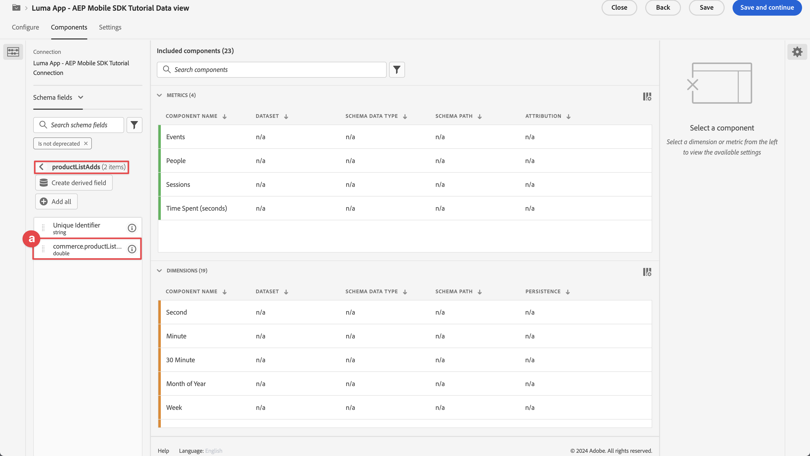
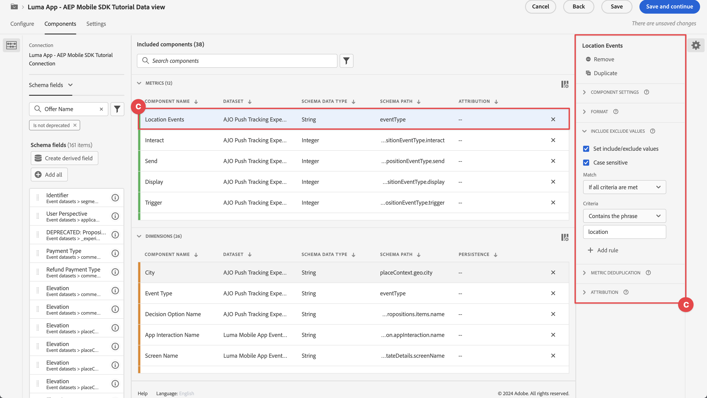
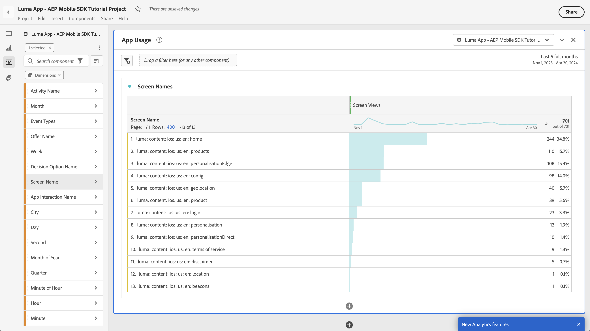
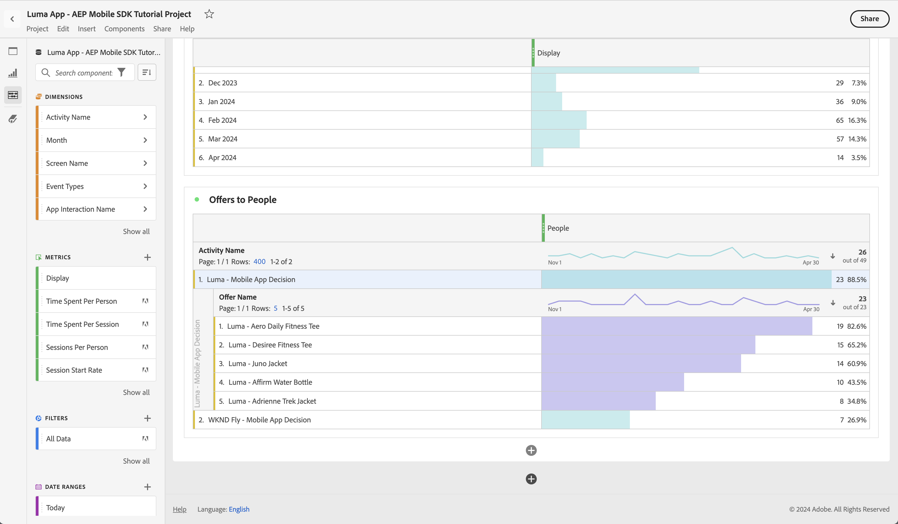

# Relatar e analisar usando o Customer Journey Analytics

Saiba como relatar e analisar as interações do aplicativo móvel com o Customer Journey Analytics.

Os dados do evento de aplicativo móvel, que você coletou e enviou para o Platform Edge Network em lições anteriores, são encaminhados para os serviços configurados no fluxo de dados. Se você seguiu o [Enviar dados para o Experience Platform](platform.md) lição, esses dados agora são armazenados no data lake do Experience Platform como conjuntos de dados. E esses dados ficam disponíveis para o Customer Journey Analytics usar em relatórios e análises.

Ao contrário do Adobe Analytics, o Customer Journey Analytics é um aplicativo que *usos* dados de conjuntos de dados criados no Experience Platform e para os quais seu aplicativo está enviando dados. Ao usar o SDK do Adobe Experience Platform Mobile, você não envia dados para o Customer Journey Analytics diretamente. Em vez disso, o Customer Journey Analytics usa os dados dos conjuntos de dados no Experience Platform.

Esta lição no tutorial foca em relatórios e analisar os dados capturados do aplicativo tutorial do Luma. Um dos recursos exclusivos do Customer Journey Analytics é combinar dados de várias fontes (CRM, ponto de venda, aplicativo de fidelidade, call center) e canais (Web, móvel, offline) para fornecer insights profundos sobre as jornadas do cliente. Esse recurso está fora do escopo desta lição. Consulte [visão geral do Customer Journey Analytics](https://experienceleague.adobe.com/en/docs/analytics-platform/using/cja-overview/cja-overview) para obter mais informações.

## Pré-requisitos

Sua organização deve ser provisionada e a permissão concedida para o Customer Journey Analytics. Você deve ter acesso administrativo ao Customer Journey Analytics.

## Objetivos de aprendizagem

Nesta lição, você vai:

- Crie uma conexão para definir os conjuntos de dados do Experience Platform que você deseja usar no Customer Journey Analytics.
- Criar uma visualização de dados para preparar os dados dos conjuntos de dados para seus relatórios e análises
- Crie um projeto para criar relatórios e visualizações e analisar os dados do seu aplicativo móvel.

Esta ordem está de propósito. No Customer Journey Analytics, um relatório no Analysis Workspace depende de uma visualização de dados. E uma visualização de dados depende de uma conexão.

## Criar uma conexão

Uma conexão no Customer Journey Analytics define os conjuntos de dados (e os dados dentro desses conjuntos de dados) do Experience Platform que você deseja usar para relatórios e análises.

1. Navegue até a interface do Customer Journey Analytics usando os Aplicativos  no canto superior direito.

1. Selecionar **[!UICONTROL Conexões]** na barra de menu superior.

1. Selecione o **[!UICONTROL Lista]** na interface Conexões. Você verá uma lista de conexões existentes.

1. Selecionar **[!UICONTROL Criar nova conexão]**.

1. No **[!UICONTROL Conexões]** > **[!UICONTROL Conexão sem título]** tela, em **[!UICONTROL Configurações de conexão]**

   1. Insira um **[!UICONTROL Nome da conexão]**, por exemplo `Luma App - AEP Mobile SDK Tutorial Connection`.
   2. Insira um **[!UICONTROL Descrição da conexão]**, por exemplo `Connection for the Luma app used in the AEP Mobile SDK tutorial`.

      Entrada **[!UICONTROL Configurações de dados]**:

   3. Selecione a sandbox usada para coletar os dados do aplicativo móvel, por exemplo **[!UICONTROL Cursos do SDK móvel e da Web]**.
   4. Selecionar **[!UICONTROL menos de 1 milhão]** do **[!UICONTROL Número médio de eventos diários]**.

   5. Selecionar **[!UICONTROL Adicionar conjuntos de dados]** para selecionar os conjuntos de dados do Experience Platform que deseja usar no Customer Journey Analytics.

      

   6. No **[!UICONTROL Adicionar conjuntos de dados]** assistente, **[!UICONTROL Selecionar conjuntos de dados]** etapa,

      1. selecione os seguintes conjuntos de dados:

         - **[!UICONTROL Conjunto de dados de evento do aplicativo móvel Luma]**, o conjunto de dados que você criou como parte da [Criar um conjunto de dados](platform.md#create-a-dataset) seção na lição Experience Platform.
         - **[!UICONTROL Eventos de decisão ODE - *nome da sandbox*] decisão**
         - **[!UICONTROL Conjuntos de dados do evento de rastreamento de push do AJO]**

      1. Selecionar **[!UICONTROL Próxima]**.

         

   7. No **[!UICONTROL Adicionar conjuntos de dados]** assistente, **[!UICONTROL Configurações de conjuntos de dados]** , é necessário definir os detalhes de cada um dos conjuntos de dados do evento.
      1. Consulte as tabelas a seguir para obter a configuração correta:

         | Conjunto de dados | ID de pessoa ① | Carimbo de data e hora ② | Tipo de fonte de dados ③ | Importar todos os novos ④ de dados | Preencher retroativamente todos os dados ⑤ |
         |---|---|---|---|---|---|
         | Conjunto de dados de evento do aplicativo móvel Luma | identityMap | carimbo de data e hora | Dados do aplicativo móvel | habilitar | habilitar |
         | Eventos de decisão ODE - *nome da sandbox* decisão | identityMap | carimbo de data e hora | Dados do aplicativo móvel | habilitar | habilitar |
         | Conjunto de dados do evento de experiência de rastreamento de push do AJO | identityMap | carimbo de data e hora | Dados do aplicativo móvel | habilitar | habilitar |

         

      1. Selecionar **[!UICONTROL Adicionar conjuntos de dados]**.

1. De volta ao **[!UICONTROL Conexões]** > **[!UICONTROL Aplicativo Luma - Conexão do tutorial do SDK móvel da AEP]**, selecione **[!UICONTROL Salvar]** para salvar sua conexão.

   

Agora você definiu sua conexão e o Customer Journey Analytics adiciona os dados dos conjuntos de dados ao seu próprio banco de dados interno. Essa coleta de dados pode levar algum tempo, dependendo da quantidade de dados. Para seu aplicativo tutorial, antecipe algumas horas para que os dados apareçam no Customer Journey Analytics.

Para exibir o status da sua conexão:

1. Selecionar **[!UICONTROL Conexões]** na interface principal do Customer Journey Analytics.
1. Selecione o nome da sua conexão, por exemplo **[!UICONTROL Aplicativo Luma - Conexão do tutorial do SDK móvel da AEP]**.

No **[!UICONTROL Conexões]** > **[!UICONTROL Aplicativo Luma - Conexão do tutorial do SDK móvel da AEP]**, você verá:

1. Informações sobre o total de registros adicionados, registros ignorados e registros excluídos. Selecione **[!UICONTROL Todos os conjuntos de dados]** e selecione um período de tempo apropriado para ver os detalhes da sua conexão. Você pode usar  para abrir uma caixa de diálogo e selecionar o período.
1. Informações de conjuntos de dados individuais em registros adicionados, registros ignorados, registros excluídos e muito mais.

   

## Criar uma visualização de dados

Depois que os registros forem adicionados dos conjuntos de dados para o Customer Journey Analytics, você poderá criar uma visualização de dados para definir em quais componentes dos dados deseja criar relatórios.

Uma visualização de dados é um container específico do Customer Journey Analytics que permite determinar como interpretar dados de uma conexão. Você pode configurar campos padrão e de esquema a partir de qualquer conjunto de dados definido em sua conexão como componentes (dimensões, métricas) no Analysis Workspace.

Uma visualização de dados no Customer Journey Analytics oferece enorme flexibilidade na configuração e definição corretas dos dados de sua conexão. Neste tutorial, você usa somente a funcionalidade necessária para seus relatórios e análises. Consulte [Visualizações de dados](https://experienceleague.adobe.com/en/docs/analytics-platform/using/cja-dataviews/data-views) para obter mais informações.

Para criar a visualização de dados:

1. Navegue até a interface do Customer Journey Analytics usando os Aplicativos  no canto superior direito.

1. Selecionar **[!UICONTROL Visualizações de dados]** na barra de menu superior.
1. Selecionar **[!UICONTROL Criar nova visualização de dados]**.
1. Entrada **[!UICONTROL Visualizações de dados >]**, assegurar que a **[!UICONTROL Configurar]** for selecionada.

   1. Selecione sua conexão na lista suspensa Conexão de configurações, por exemplo **[!UICONTROL Aplicativo Luma - Conexão do tutorial do SDK móvel da AEP]**.
   1. Insira um Nome para a visualização de dados, por exemplo: `Luma App - AEP Mobile SDK Tutorial Data view`.
   1. Selecionar **[!UICONTROL Salvar e continuar]**.

      

1. No **[!UICONTROL Componentes]** guia do **[!UICONTROL Aplicativo Luma - Visualização de dados do tutorial do SDK móvel da AEP]**, você pode definir as métricas e a dimensão que deseja usar ao criar relatórios no aplicativo móvel. Por padrão, várias métricas e dimensões padrão (conjuntamente chamadas de componentes) já estão configuradas para a visualização de dados. Mas sua visualização de dados requer mais componentes.  Para adicionar um campo de esquema, a partir do esquema definido anteriormente ou esquemas prontos para uso (consulte [Criar um esquema](create-schema.md) lição), como um componente (dimensão ou métrica):

   1. Localize o campo de esquema:

      - procure o componente usando o  ***[!UICONTROL Pesquisar campos de esquema]*** pesquisa. Por exemplo, `productListAdd`ou

        

      - passe para o campo de esquema dentro de  **[!UICONTROL Conjuntos de dados de evento]** .  Por exemplo,  **[!UICONTROL Conjuntos de dados de evento]**   **[!UICONTROL comércio]**   **[!UICONTROL productListAdds]** 

        

   1. Arraste o campo de esquema específico do painel Campos de esquema e solte-o no **[!UICONTROL MÉTRICAS]** ou **[!UICONTROL DIMENSION]** na lista [!UICONTROL Componentes incluídos] painel.

      

   1. É possível definir as configurações de um componente. Selecione o componente e defina as configurações no painel direito.  Por exemplo, é possível renomear **[!UICONTROL commerce.productListAdds]** para `Product Add To Lists` usando o **[!UICONTROL CONFIGURAÇÕES DO COMPONENTE]** > **[!UICONTROL Nome do componente]** no painel direito.

      

      Ou configurar **[!UICONTROL INCLUIR/EXCLUIR VALORES]**.

      

   1. Agora que você entende como adicionar campos à sua visualização de dados e configurar o componente resultante, use as tabelas abaixo para obter uma lista de campos de esquema a serem adicionados como métrica ou dimensão. Use o **Caminho do esquema** valor da coluna da tabela abaixo para procurar ou percorrer o campo de esquema específico. Depois de arrastado e solto, marque a opção **Configurações do componente** valor da coluna na tabela se configurações específicas são necessárias para um componente, como modificar seu **[!UICONTROL Nome do componente]** ou definindo **[!UICONTROL INCLUIR/EXCLUIR VALORES]**.

      

      **MÉTRICAS**

      | Nome do componente | Conjunto de dados | Tipo de dados do esquema | Caminho do esquema | Configurações do componente |
      |---|---|---|---|---|
      | Descartar | Conjunto de dados do evento de experiência de rastreamento de push do AJO, Conjunto de dados do evento de aplicativo móvel da Luma | Número inteiro | _experiência.decisão. propositionEventType.dismiss | Nome do componente: `Dismiss` |
      | Cancelar inscrição | Conjunto de dados do evento de experiência de rastreamento de push do AJO, Conjunto de dados do evento de aplicativo móvel da Luma | Número inteiro | _experiência.decisão. propositionEventType.unsubscribe | Nome do componente: `Unsubscribe` |
      | Acionador | Conjunto de dados do evento de experiência de rastreamento de push do AJO, Conjunto de dados do evento de aplicativo móvel da Luma | Número inteiro | _experiência.decisão. propositionEventType.trigger | Nome do componente: `Trigger` |
      | Exibir | Conjunto de dados do evento de experiência de rastreamento de push do AJO, Conjunto de dados do evento de aplicativo móvel da Luma | Número inteiro | _experiência.decisão. propositionEventType.display | Nome do componente: `Display` |
      | Enviar | Conjunto de dados do evento de experiência de rastreamento de push do AJO, Conjunto de dados do evento de aplicativo móvel da Luma | Número inteiro | _experiência.decisão. propositionEventType.send | Nome do componente: `Send` |
      | Interagir | Conjunto de dados do evento de experiência de rastreamento de push do AJO, Conjunto de dados do evento de aplicativo móvel da Luma | Número inteiro | _experiência.decisão. propositionEventType.interact | Nome do componente: `Interact` |
      | Eventos de localização | Conjunto de dados de evento de experiência de rastreamento de push do AJO, Conjunto de dados de evento do aplicativo móvel Luma, Decisioning do ODE - mobile-and-web-sdk-courses decisioning | String | Tipo de evento | Nome do componente: `Location Events`   |
      | Visualizações de produto | Conjunto de dados de evento do aplicativo móvel Luma | Duplo | commerce.productViews.value | Nome do componente: `Product Views` |
      | Adicionar produto a listas | Conjunto de dados de evento do aplicativo móvel Luma | Duplo | commerce.productListAdds.value | Nome do componente: `Product Add To Lists` |
      | Compras | Conjunto de dados de evento do aplicativo móvel Luma | Duplo | commerce.purchases.value | Nome do componente: `Purchases` |
      | Salvos para mais tarde | Conjunto de dados de evento do aplicativo móvel Luma | Duplo | commerce.saveForLaters.value | Nome do componente: `Save For Laters` |
      | Interações do aplicativo | Conjunto de dados de evento do aplicativo móvel Luma | Duplo | _techmarketingdemos.appInformation. appInteraction.appAction.value | Nome do componente: `App Interactions` |
      | Visualizações de tela | Conjunto de dados de evento do aplicativo móvel Luma | Duplo | _techmarketingdemos.appInformation. appStateDetails.screenView.value | Nome do componente: `Screen Views` |

      {style="table-layout:auto"}

      Observe como o campo de esquema da métrica Eventos de localização está usando **[!UICONTROL INCLUIR/EXCLUIR VALORES]** para contar tipos de evento que contêm `location`.

      Depois de ter adicionado todos os campos de esquema da tabela acima como um componente de métrica, sua configuração de visualização de dados para **[!UICONTROL MÉTRICAS]** deve ser semelhante a:

      

      **DIMENSION**

      | Nome do componente | Conjunto de dados | Tipo de dados do esquema | Caminho do esquema | Configurações do componente |
      |---|---|---|---|---|
      | Cidade | Conjunto de dados do evento de experiência de rastreamento de push do AJO, Conjunto de dados do evento de aplicativo móvel da Luma | String | placeContext.geo.city | Nome do componente: `City` |
      | Tipos de evento | Conjunto de dados de evento de experiência de rastreamento de push do AJO, Conjunto de dados de evento do aplicativo móvel Luma, Decisioning do ODE - mobile-and-web-sdk-courses decisioning | String | eventType | Nome do componente: `Event Types` |
      | Nome da opção de decisão | Conjunto de dados de evento de experiência de rastreamento de push do AJO, Conjunto de dados de evento do aplicativo móvel Luma, Decisioning do ODE - mobile-and-web-sdk-courses decisioning | String | _experiência.decisão. propositions.items.name | Nome do componente: `Decision Option Name` |
      | Nome da interação do aplicativo | Conjunto de dados de evento do aplicativo móvel Luma | String | _techmarketingdemos.appInformation. appInteraction.name | Nome do componente: `App Interaction Name` |
      | Nome da tela | Conjunto de dados de evento do aplicativo móvel Luma | String | _techmarketingdemos.appInformation. appStateDetails.screenName | Nome do componente: `Screen Name` |
      | Nome da atividade | ODE DecisionEvents - decisão sobre os cursos de sdk para dispositivos móveis e Web | String | _experiência.decisão. propositionDetails.activity.name | Nome do componente: `Activity Name` |
      | Nome da oferta | ODE DecisionEvents - decisão sobre os cursos de sdk para dispositivos móveis e Web | String | _experiência.decisão. propositionDetails.selections.name | Nome do componente: `Offer Name` |

      {style="table-layout:auto"}

      Depois de ter adicionado todos os campos de esquema da tabela acima como um componente de dimensão, sua configuração de visualização de dados para **[!UICONTROL DIMENSION]** deve ser semelhante a:

      

   1. Selecionar **[!UICONTROL Salvar e continuar]**.

1. A variável **[!UICONTROL Configurações]** guia do **[!UICONTROL Aplicativo Luma - Visualização de dados do tutorial do SDK móvel da AEP]** permite definir filtros e configurações de sessão. Para este tutorial, nenhuma configuração adicional é necessária.

   - Selecionar **[!UICONTROL Salvar e concluir]**.

Você definiu a visualização de dados e tudo está pronto para começar a criar relatórios e visualizações.

## Criar um projeto

Você usa projetos do Espaço de trabalho no Customer Journey Analytics para criar relatórios e visualizações. Há muitas possibilidades para criar relatórios abrangentes e visualizações envolventes, mas todas essas possibilidades estão fora do escopo deste tutorial. Consulte [Visão geral do Workspace](https://experienceleague.adobe.com/en/docs/customer-journey-analytics-learn/tutorials/analysis-workspace/workspace-projects/analysis-workspace-overview) e [Criar um novo projeto](https://experienceleague.adobe.com/en/docs/customer-journey-analytics-learn/tutorials/analysis-workspace/workspace-projects/build-a-new-project) para obter mais informações.

Nesta seção da lição, você cria um projeto que mostra relatórios e visualizações sobre:

- Uso do aplicativo: uso das informações na tela e nas interações do aplicativo.
- Commerce: usar os eventos de comércio, como exibição de produto, adicionar ao carrinho e comprar.
- Ofertas: uso dos eventos exibidos nas ofertas do aplicativo.
- Visitas à loja: usar os eventos de geofence (simulados) do aplicativo.

Para criar seu projeto:

1. Navegue até a interface do Customer Journey Analytics usando os Aplicativos  no canto superior direito.

1. Selecionar **[!UICONTROL Workspace]** na barra de menu superior.

1. Selecionar **[!UICONTROL Criar projeto]**.

   1. Selecionar **[!UICONTROL Projeto em branco do Workspace]** da caixa de diálogo pop-up.

      

   1. Selecione **[!UICONTROL Criar]**.

1. Você receberá a mensagem **[!UICONTROL Novo projeto]** interface. Nessa interface, você cria relatórios e visualizações.

1. Selecione o nome do projeto (**[!UICONTROL Novo projeto]**) e forneça seu próprio nome para o projeto. Por exemplo, `Luma App - AEP Mobile SDK Tutorial Project`.
   

1. Para salvar o projeto, selecione **[!UICONTROL Projeto]** > **[!UICONTROL Salvar]**.
   

1. No **[!UICONTROL Salvar]** , ignore todos os outros campos e selecione **[!UICONTROL Salvar]**.
   

>[!IMPORTANT]
>
>   Lembre-se de salvar o projeto regularmente; caso contrário, as alterações serão perdidas. Você pode salvar rapidamente seu projeto usando **[!UICONTROL ctrl+s]** (Windows) ou **[!UICONTROL ⌘ (cmd) + s]** (macOS)

Agora você configurou o projeto. Você já tem um painel de Forma livre na tela principal, contendo uma tabela de Forma livre. Você adicionará componentes a essa tabela em breve, mas primeiro deve garantir que o painel de Forma livre esteja usando a visualização de dados e o período de tempo corretos.

1. Selecione sua visualização de dados na lista suspensa. Por exemplo, **[!UICONTROL Aplicativo Luma - Visualização de dados do tutorial do SDK móvel da AEP]**. Se não conseguir ver sua visualização de dados na lista, selecione **[!UICONTROL Mostrar tudo]** na parte inferior da lista suspensa.
   

1. Para definir o período de tempo apropriado para o painel, selecione o padrão **[!UICONTROL Este mês]** e, no painel pop-up, defina as datas de início e término. Ou use um **[!UICONTROL Predefinição]**, como **[!UICONTROL Últimos 6 meses completos]** e selecione **[!UICONTROL Aplicar]**.
   

### Uso do aplicativo

Você deseja relatar como o aplicativo é usado. Você adicionou o código necessário no aplicativo para registrar as interações e quais telas são usadas no aplicativo (consulte [Rastrear eventos](events.md) lição) e agora deseja criar relatórios sobre esses dados.

#### Nomes de tela

Primeiro, você quer relatar em quais telas foram exibidas no aplicativo.

1. Renomeie seu **[!UICONTROL Forma livre]** painel para `App Usage`.

1. Renomeie seu **[!UICONTROL Tabela de forma livre]** para `Screen Names`.

1. Selecionar **[!UICONTROL Mostrar tudo]** abaixo do **[!UICONTROL MÉTRICAS]** lista.

1. Arraste e solte a **[!UICONTROL Visualizações de tela]** componente ativado [!UICONTROL _Soltar um **métrica**aqui (ou qualquer outro componente)_)].
   
Sua tabela de forma livre agora mostra exibições de tela para os dias do período selecionado. No entanto, você deseja mostrar exibições de tela para as diferentes telas usadas no aplicativo.

1. Para mostrar a **[!UICONTROL DIMENSION]** lista de componentes, selecione  para remover o  **[!UICONTROL Métricas]** do painel de componentes.
   

1. Selecionar **[!UICONTROL Mostrar tudo]** abaixo do **[!UICONTROL DIMENSION]** lista.

1. Arraste e solte a **[!UICONTROL Nome da tela]** componente na **[!UICONTROL Dia]** cabeçalho. A operação mostra  **[!UICONTROL Substituir]** para indicar a substituição da dimensão.
   

Seu primeiro relatório está pronto, mostrando exibições de tela para os vários nomes de tela que você definiu no aplicativo.

Não se esqueça de salvar seu projeto!

#### Interações do aplicativo

Você também quer relatar como os usuários interagiram com o aplicativo.

1. Selecionar  e do pop-up  para adicionar uma nova Tabela de forma livre.
   

1. Renomear **[!UICONTROL Tabela de forma livre (2)]** para `App Interactions`.

1. Arraste e solte a **[!UICONTROL Interações do aplicativo]** métrica ativada [!UICONTROL _Soltar um **métrica**aqui (ou qualquer outro componente)_)].

1. Arraste e solte a **[!UICONTROL Nome da interação do aplicativo]** dimensão na **[!UICONTROL Dia]** para substituir essa dimensão.

Seu segundo relatório agora está pronto, mostrando as interações do aplicativo.

As informações são limitadas principalmente porque você implementou o `MobileSDK.shared.sendAppInteractionEvent(actionName: "<actionName>")` Chamadas de API somente na tela de logon. Se você adicionar essa chamada de API em mais telas do aplicativo, esse relatório se tornará mais informativo.

Não se esqueça de salvar seu projeto!

### Commerce

Agora você deseja relatar, em um painel separado, os eventos comerciais que ocorrem no aplicativo.

#### Eventos da Commerce

1. Selecionar  fora da atual [!UICONTROL Uso do aplicativo] para criar um novo painel.
   

1. Certifique-se de selecionar o período apropriado.

1. Selecionar  **[!UICONTROL Tabela de forma livre]** para criar uma nova Tabela de forma livre.
   

1. Renomear **[!UICONTROL Painel]** para `Commerce`.

1. Renomear **[!UICONTROL Tabela de forma livre]** para `Commerce Events`.

1. Arrastar e soltar **[!UICONTROL Exibições do produto]** métrica em para [!UICONTROL _Soltar um **métrica**aqui (ou qualquer outro componente)_)].

1. Arraste e solte a **[!UICONTROL Adicionar produto a listas]** à direita da variável **[!UICONTROL Exibições do produto]** coluna para inserir esta coluna na tabela de forma livre. Assegurar **[!UICONTROL + Adicionar]** (em azul) é exibido ao inserir a coluna.
   

1. Repita a etapa anterior para adicionar a variável **[!UICONTROL Salvar para mais tarde]** e a variável **[!UICONTROL Compras]** para a tabela de forma livre.

1. Arraste e solte a **[!UICONTROL Month]** na parte superior da **[!UICONTROL Dia]** dimension para alterar o relatório de diário para mensal.

Seu **[!UICONTROL Eventos da Commerce]** O relatório do está pronto, mostrando como os usuários visualizaram produtos, adicionaram produtos à lista de desejos, salvaram produtos para depois ou até compraram seus produtos.

Não se esqueça de salvar seu projeto!

#### Fallout

Com base no relatório anterior, é desejável visualizar o fallout no funil de comércio: quantos usuários que visualizaram produtos também adicionaram produtos aos carrinhos. E quantos usuários adicionaram produtos aos carrinhos também salvaram esses produtos para depois. E assim por diante.

1. Selecionar  no prazo de **[!UICONTROL Commerce]** e, no menu pop-up, selecione  (representando a visualização Fallout ).

1. Selecionar **[!UICONTROL Exibições do produto]** do [!UICONTROL *Adicionar ponto de contato*] lista suspensa.
   
Como alternativa, você pode arrastar e soltar a variável **[!UICONTROL Visualização de produtos]** dimensão abaixo do **[!UICONTROL Todas as pessoas]** dimensão no **[!UICONTROL Fallout]** visualização.

1. Repita a etapa acima para **[!UICONTROL Adicionar produto a listas]** e **[!UICONTROL Compras]** dimensões. Seu **[!UICONTROL Fallout]** a visualização agora mostra uma representação visual do funil de conversão de seus produtos.
   

Não se esqueça de salvar seu projeto!

### Ofertas

Você deseja relatar quantas ofertas e quais ofertas são exibidas para os usuários do seu aplicativo.

#### Visão geral mensal

1. Selecionar  fora do painel atual do Commerce, para criar um novo painel.

1. Renomeie o **[!UICONTROL Painel]** para `Offers`.

1. Certifique-se de selecionar o período apropriado.

1. Selecionar  Tabela de forma livre para criar uma nova.

1. Renomeie o **[!UICONTROL Tabela de forma livre]** para `Monthly Overview`.

1. Arraste e solte a **[!UICONTROL Exibir]** métrica em para [!UICONTROL _Soltar um **métrica**aqui (ou qualquer outro componente)_)].

1. Arraste e solte a **[!UICONTROL Month]** dimensão na **[!UICONTROL Dia]** para substituir a dimensão.

Agora você tem um relatório que mostra as ofertas mensais exibidas para os usuários no aplicativo.

Não se esqueça de salvar seu projeto!

#### Ofertas para pessoas

Você também quer ter um relatório que mostra quais ofertas foram mostradas em quais números para os usuários do aplicativo.

1. Selecionar  no prazo de **[!UICONTROL Ofertas]** painel e no pop-up para adicionar uma nova Tabela de forma livre.

1. Renomear **[!UICONTROL Tabela de forma livre (2)]** para `People`.

1. Arraste e solte a **[!UICONTROL Pessoas]** métrica em para [!UICONTROL _Soltar um **métrica**aqui (ou qualquer outro componente)_)].

1. Arraste e solte a **[!UICONTROL Nome da atividade]** no **[!UICONTROL Dia]** para substituir a dimensão.

1. Clique com o botão direito do mouse na linha, identificando uma ou mais decisões de oferta definidas no [Criar e exibir ofertas com o Gerenciamento de decisão](journey-optimizer-offers.md) lição. Por exemplo, **[!UICONTROL Luma - Decisão de aplicativo móvel]**.

1. No menu de contexto, selecione **[!UICONTROL Detalhamento]** > **[!UICONTROL Dimension]** > **[!UICONTROL Nome da oferta]**. Essa seleção detalhará a dimensão Nome da atividade em Nomes de ofertas.
   

Agora você tem um relatório que mostra as ofertas individuais exibidas para esta decisão de oferta para o período selecionado para usuários do seu aplicativo.

Não se esqueça de salvar seu projeto!

### Visitas da loja

Por fim, você deseja criar relatórios sobre visitas à loja.

1. Selecionar  fora do painel Ofertas atual, para criar um novo painel.

1. Renomeie o **[!UICONTROL Painel]** para `Store Visits`.

1. Certifique-se de selecionar o período apropriado.

1. Selecionar  Tabela de forma livre para criar uma nova.

1. Renomear **[!UICONTROL Tabela de forma livre]** para `Store Entries / Exits Across Cities`.

1. Arraste e solte a **[!UICONTROL Eventos de localização]** métrica em para [!UICONTROL _Soltar um **métrica**aqui (ou qualquer outro componente)_)]. O relatório agora mostra uma visão geral diária de todos os eventos de localização que ocorreram no aplicativo. Lembre-se de como você configurou especificamente essa dimensão como parte de sua [visualização de dados](#create-a-data-view).

1. Arraste e solte a **[!UICONTROL Cidade]** dimensão na **[!UICONTROL Dia]** cabeçalho de coluna para substituir a dimensão. O relatório agora mostra as cidades para os eventos de localização.

1. Para remover eventos de geolocalização sem cidades associadas, selecione e do **[!UICONTROL Pesquisar]** pop-up, desativar **[!UICONTROL Incluir &quot;Nenhum valor&quot;]** e selecione **[!UICONTROL Aplicar]**.

   

   Essa ação remove a variável **[!UICONTROL Nenhum valor]** linha do relatório.

1. Selecione todas as linhas na tabela, clique com o botão direito do mouse e, no menu de contexto, selecione Detalhamento > Dimension > Tipos de evento.

Agora há um relatório mostrando os usuários que estão dentro e fora das proximidades dos locais de loja (conforme você definiu esses locais na variável [Places](places.md) lição).

Observe que se você realmente deseja relatar sobre as pessoas que visitam fisicamente sua loja, você pode usar os sinais. Mas espero que você tenha capturado o conceito de relatórios sobre dados de geolocalização.

## Próximas etapas

Agora você precisa ter uma compreensão básica de como criar relatórios e visualizar o uso, as interações e muito mais do seu aplicativo móvel usando o Customer Journey Analytics.

>[!SUCCESS]
>
>
>Obrigado por investir seu tempo aprendendo sobre o Adobe Experience Platform Mobile SDK. Se você tiver dúvidas, quiser compartilhar comentários gerais ou tiver sugestões sobre conteúdo futuro, compartilhe-as nesta [Publicação de discussão da comunidade do Experience League](https://experienceleaguecommunities.adobe.com/t5/adobe-experience-platform-data/tutorial-discussion-implement-adobe-experience-cloud-in-mobile/td-p/443796).

Próximo: **[Conclusão e próximas etapas](conclusion.md)**
