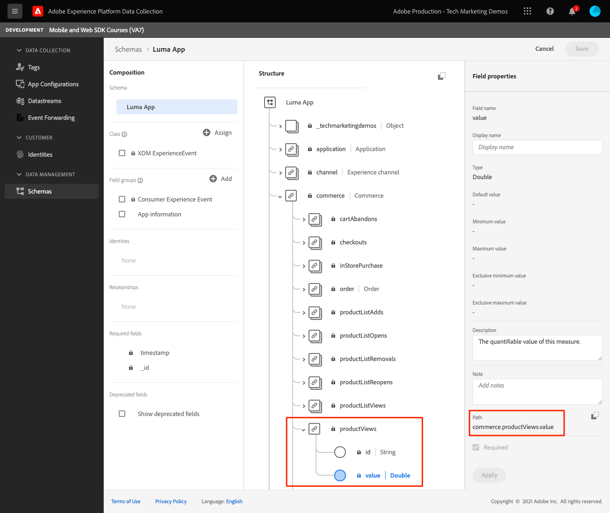
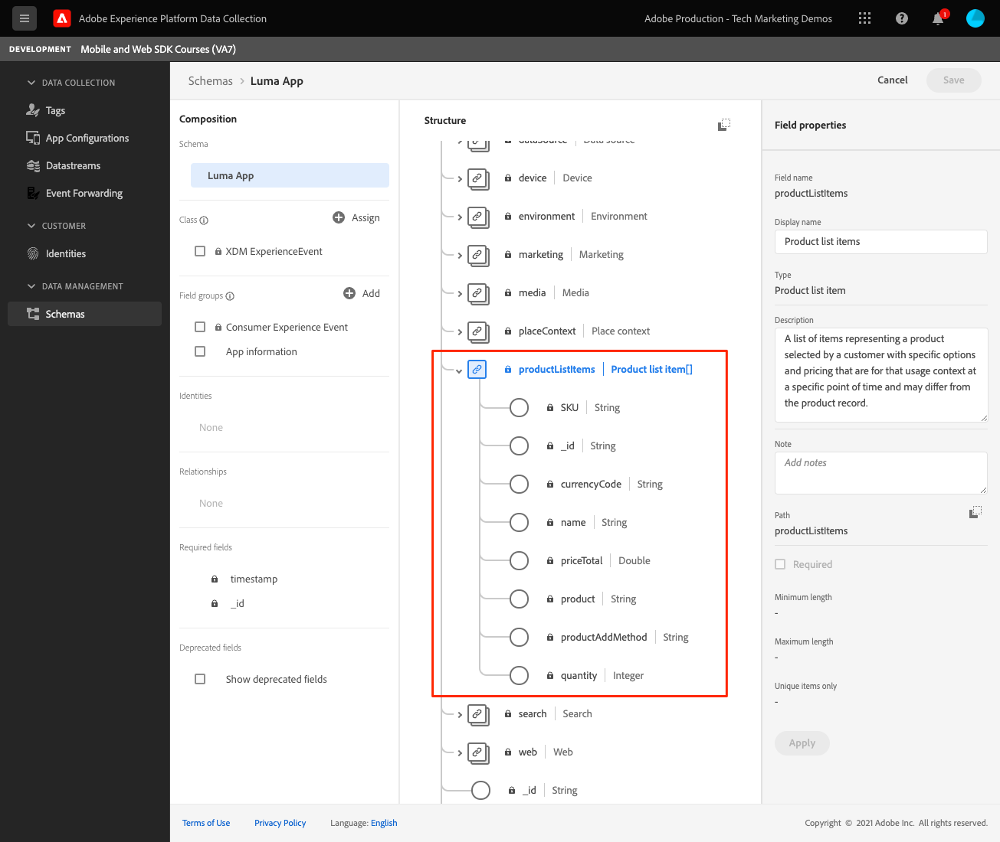

# Eventos

Saiba como rastrear eventos em um aplicativo móvel.

>[!INFO]
>
> Este tutorial será substituído por um novo tutorial usando um novo aplicativo móvel de amostra no final de novembro de 2023

A extensão Edge Network fornece uma API para enviar eventos de experiência para a Platform Edge Network. Um Evento de experiência é um objeto que contém dados em conformidade com a definição do esquema XDM ExperienceEvent. De maneira mais simples, eles capturam o que as pessoas fazem no seu aplicativo móvel. Depois que os dados forem recebidos pela Platform Edge Network, poderão ser encaminhados para aplicativos e serviços configurados no fluxo de dados, como Adobe Analytics e Experience Platform. Saiba mais sobre o [Eventos de experiência](https://developer.adobe.com/client-sdks/documentation/getting-started/track-events/) na documentação do produto.

## Pré-requisitos

* Atualização do PodFile com os SDKs necessários.
* Extensões registradas no AppDelegate.
* MobileCore configurado para usar sua AppId de desenvolvimento.
* SDKs importados.
* O aplicativo foi criado e executado com sucesso com as alterações acima.

## Objetivos de aprendizagem

Nesta lição, você vai:

* Entenda como estruturar dados XDM com base em um esquema.
* Enviar um evento XDM com base em um grupo de campos padrão.
* Enviar um evento XDM com base em um grupo de campos personalizado.
* Envie um evento de compra XDM.
* Validar com garantia.

## Construção de um evento de experiência

A extensão de borda do Adobe Experience Platform pode enviar eventos que seguem um esquema XDM definido anteriormente para a Rede de borda da Adobe Experience Platform.

O processo é assim...

1. Identifique a interação do aplicativo móvel que você está tentando rastrear.

1. Revise seu esquema e identifique o evento apropriado.

1. Revise seu esquema e identifique campos adicionais que devem ser usados para descrever o evento.

1. Construir e preencher o objeto de dados.

1. Criar e enviar evento.

1. Validar.

Vejamos alguns exemplos.

### Exemplo #1 - grupos de campos padrão

Analise o exemplo a seguir sem tentar implementá-lo no aplicativo de amostra:

1. No esquema, identifique o evento que você está tentando coletar. Neste exemplo, estamos rastreando uma exibição de produto.
   

1. Comece a construir seu objeto:

   ```swift
   var xdmData: [String: Any] = [
       "eventType": "commerce.productViews",
       "commerce": [
           "productViews": [
           "value": 1
           ]
       ]
   ]
   ```

   * eventType: descreve o evento que ocorreu, use um [valor conhecido](https://github.com/adobe/xdm/blob/master/docs/reference/classes/experienceevent.schema.md#xdmeventtype-known-values) quando possível.
   * commerce.productViews.value: forneça o valor numérico do evento. Se for um Booleano (ou &quot;Contador&quot; no Adobe Analytics), o valor sempre será 1. Se for um evento numérico ou de moeda, o valor poderá ser > 1.

1. No esquema, identifique quaisquer dados adicionais associados ao evento. Neste exemplo, inclua `productListItems` que é um conjunto padrão de campos usados com eventos relacionados ao comércio:
   
   * Observe que `productListItems` O é um array para que vários produtos possam ser fornecidos.

1. Expanda o objeto xdmData para incluir dados suplementares:

   ```swift
   var xdmData: [String: Any] = [
       "eventType": "commerce.productViews",
           "commerce": [
           "productViews": [
               "value": 1
           ]
       ],
       "productListItems": [
           [
               "name":  productName,
               "SKU": sku,
               "priceTotal": priceString,
               "quantity": 1
           ]
       ]
   ]
   ```

1. Use a estrutura de dados para criar um `ExperienceEvent`:

   ```swift
   let productViewEvent = ExperienceEvent(xdm: xdmData)
   ```

1. Envie o evento e os dados para a Rede de borda da Platform:

   ```swift
   Edge.sendEvent(experienceEvent: productViewEvent)
   ```

### Exemplo #2 - grupos de campos personalizados

Analise o exemplo a seguir sem tentar implementá-lo no aplicativo de amostra:

1. No esquema, identifique o evento que está tentando coletar. Neste exemplo, rastreie uma &quot;Interação do aplicativo&quot; que consiste em um evento e um nome de Ação do aplicativo.
   

1. Comece a construir seu objeto.

   >[!NOTE]
   >
   >  Os grupos de campos padrão sempre começam na raiz do objeto.
   >
   >  Os grupos de campos personalizados sempre começam em um objeto exclusivo da sua organização Experience Cloud, &quot;_techmarketingdemos&quot; neste exemplo.

   ```swift
   var xdmData: [String: Any] = [
   "_techmarketingdemos": [
       "appInformation": [
           "appInteraction": [
               "name": actionName,
               "appAction": [
                   "value": 1
                   ]
               ]
           ]
       ]
   ]
   ```

   Ou, como alternativa...

   ```swift
   var xdmData: [String: Any] = [:]
   xdmData["_techmarketingdemos"] = [
       "appInformation": [
           "appInteraction": [
               "name": actionName,
               "appAction": [
                   "value": 1
               ]
           ]
       ]
   ]
   ```

1. Use a estrutura de dados para criar um `ExperienceEvent`.

   ```swift
   let appInteractionEvent = ExperienceEvent(xdm: xdmData)
   ```

1. Envie o evento e os dados para a Rede de borda da Platform.

   ```swift
   Edge.sendEvent(experienceEvent: appInteractionEvent)
   ```

### Adicionar rastreamento de exibição de tela ao aplicativo Luma

Os exemplos acima explicaram o processo de pensamento ao construir um objeto de dados XDM. Em seguida, adicionaremos o rastreamento de exibição de tela no aplicativo Luma.

1. Navegue até `Home.swift`.
1. Adicione o código a seguir a `viewDidAppear(...)`.

   ```swift
           let stateName = "luma: content: ios: us: en: home"
           var xdmData: [String: Any] = [:]
           //Page View
           xdmData["_techmarketingdemos"] = [
               "appInformation": [
                   "appStateDetails": [
                       "screenType": "App",
                       "screenName": stateName,
                       "screenView": [
                           "value": 1
                       ]
                   ]
               ]
           ]
           let experienceEvent = ExperienceEvent(xdm: xdmData)
           Edge.sendEvent(experienceEvent: experienceEvent)
   ```

1. Repita para cada tela no aplicativo, atualizando `stateName` como você vai.


### Validação

1. Revise o [instruções de configuração](assurance.md) e conecte seu simulador ou dispositivo ao Assurance.
1. Execute a ação e procure a variável `hitReceived` evento do `com.adobe.edge.konductor` fornecedor.
1. Selecione o evento e revise os dados XDM na `messages` objeto.
   

### Exemplo #3 - compra

Neste exemplo, considere que o usuário fez a seguinte compra com êxito:

* Produto #1 - Esteira de Yoga.
   * $ 49,99 x 1
   * SKU: 5829
* Produto #2 - Garrafa de água.
   * $ 10,00 x3
   * SKU: 9841
* Total do pedido: US$ 79,99
* Identificador Exclusivo Do Pedido: 298234720
* Tipo de pagamento: cartão de crédito Visa
* Id Exclusivo Da Transação De Pagamento: 847361

#### Esquema

Estes são os campos de esquema relacionados a serem usados:

* eventType: &quot;commerce.purchases&quot;
* commerce.purchases
* commerce.order
* productsListItems
* _techmarketingdemos.appStateDetails (personalizado)

>[!TIP]
>
>Os grupos de campos personalizados são sempre colocados em seu identificador de Experience Cloud Org.
>
>&quot;_techmarketingdemos&quot; é substituído pelo valor exclusivo de sua organização.


#### Código

Veja como criar e enviar o objeto XDM no aplicativo.

```swift
let stateName = "luma: content: ios: us: en: orderconfirmation"
let currencyCode = "USD"
let orderTotal = "79.99"
let paymentType = "Visa Credit Card"
let orderId = "298234720"
let paymentTransactionId = "847361"
var xdmData: [String: Any] = [
  "eventType": "commerce.purchases",
  "commerce": [
    "purchases": [
      "value": 1
    ],
    "order": [
      "currencyCode": currencyCode,
      "priceTotal": orderTotal,
      "purchaseID": orderId,
      "purchaseOrderNumber": orderId,
      "payments": [ //Assuming only 1 payment type is used
        [
          "currencyCode": currencyCode,
          "paymentAmount": orderTotal,
          "paymentType": paymentType,
          "transactionID": paymentTransactionId
        ]
      ]
    ]
  ],
  "productListItems": [
      [
          "name":  "Yoga Mat",
          "SKU": "5829",
          "priceTotal": "49.99",
          "quantity": 1
      ],
      [
        "name":  "Water Bottle",
        "SKU": "9841",
        "priceTotal": "30.00",
        "quantity": 3
      ]
  ]
]

//Custom field group
xdmData["_techmarketingdemos"] = [
  "appInformation": [
    "appStateDetails": [
      "screenType": "App",
      "screenName": stateName,
      "screenView": [
        "value": 1
      ]
    ]
  ]
]
let experienceEvent = ExperienceEvent(xdm: xdmData)
Edge.sendEvent(experienceEvent: experienceEvent)
```

>[!NOTE]
>
>Para maior clareza, todos os valores são codificados. Em uma situação real, os valores seriam preenchidos dinamicamente.


### Implementar no aplicativo Luma

Você deve ter todas as ferramentas para começar a adicionar a coleção de dados ao aplicativo de amostra Luma. Abaixo está uma lista de requisitos de rastreamento hipotéticos que você pode seguir.

* Rastreie cada visualização de tela.
   * Campos de esquema: screenType, screenName, screenView
* Rastrear ações não comerciais.
   * Campos de esquema: appInteraction.name, appAction
* Ações de comércio:
   * Página do produto: productViews
   * Adicionar ao carrinho: productListAdds
   * Remover do carrinho: productListRemovals
   * Iniciar check-out: check-outs
   * Exibir carrinho: productListViews
   * Adicionar à lista de desejos: saveForLaters
   * Compra: compras, pedido

>[!TIP]
>
>Revise o [aplicativo totalmente implementado](https://github.com/Adobe-Marketing-Cloud/Luma-iOS-Mobile-App) para obter mais exemplos.

### Validação

1. Revise o [instruções de configuração](assurance.md) e conecte seu simulador ou dispositivo ao Assurance.

1. Execute a ação e procure a variável `hitReceived` evento do `com.adobe.edge.konductor` fornecedor.

1. Selecione o evento e revise os dados XDM na `messages` objeto.
   

## Enviar eventos para o Analytics e a Platform

Agora que você coletou os eventos e os enviou para a Rede de borda da Platform, eles serão enviados para os aplicativos e serviços configurados em seu [sequência de dados](create-datastream.md). Em lições posteriores, você mapeará esses dados para [Adobe Analytics](analytics.md) e [Adobe Experience Platform](platform.md).

Próximo: **[WebViews](web-views.md)**

>[!NOTE]
>
>Obrigado por investir seu tempo aprendendo sobre o Adobe Experience Platform Mobile SDK. Se você tiver dúvidas, quiser compartilhar comentários gerais ou tiver sugestões sobre conteúdo futuro, compartilhe-as nesta [Publicação de discussão da comunidade do Experience League](https://experienceleaguecommunities.adobe.com/t5/adobe-experience-platform-data/tutorial-discussion-implement-adobe-experience-cloud-in-mobile/td-p/443796)