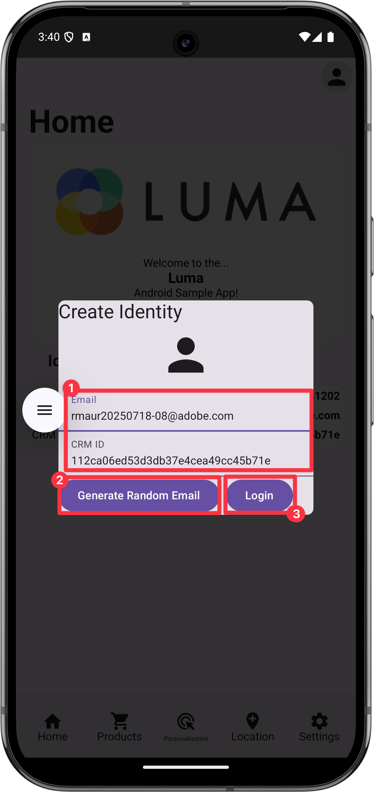

# Coletar dados de identidade

Saiba como coletar dados de identidade em um aplicativo móvel.

O Serviço de identidade da Adobe Experience Platform ajuda você a obter uma melhor visualização dos clientes e de seus comportamentos. Os serviços unem identidades em dispositivos e sistemas e permitem que você ofereça experiências digitais pessoais e impactantes em tempo real. Campos de identidade e namespaces são a cola que une diferentes fontes de dados para criar o perfil do cliente em tempo real de 360 graus.

Saiba mais sobre a [Extensão da identidade](https://developer.adobe.com/client-sdks/documentation/identity-for-edge-network/) e o [serviço de identidade](https://experienceleague.adobe.com/en/docs/experience-platform/identity/home) na documentação.

## Pré-requisitos

* O aplicativo com SDKs instalados e configurados foi criado e executado com sucesso.

## Objetivos de aprendizagem

Nesta lição, você vai:

* Configurar um namespace de identidade personalizado.
* Atualizar identidades.
* Valide o gráfico de identidade.
* Obtenha a ECID e outras identidades.


## Configurar um namespace de identidade personalizado

Os namespaces de identidade são componentes do [Serviço de Identidade](https://experienceleague.adobe.com/en/docs/experience-platform/identity/home) que servem como indicadores do contexto ao qual uma identidade está relacionada. Por exemplo, eles distinguem um valor de `name@email.com` como um endereço de email ou `443522` como uma ID de CRM numérica.

>[!NOTE]
>
>O Mobile SDK gera uma identidade exclusiva em seu próprio namespace, chamada Experience Cloud ID (ECID) quando o aplicativo é instalado. Essa ECID é armazenada na memória persistente no dispositivo móvel e é enviada com cada ocorrência. A ECID é removida quando o usuário desinstala o aplicativo ou define o status de privacidade global do Mobile SDK como recusa. No aplicativo Luma de amostra, você deve remover e reinstalar o aplicativo para criar um novo perfil com sua própria ECID exclusiva.


Para criar um novo namespace de identidade:

1. Na interface da Coleção de dados, selecione **[!UICONTROL Identidades]** na navegação do painel esquerdo.
1. Selecione **[!UICONTROL Criar namespace de identidade]**.
1. Forneça um **[!UICONTROL Nome de exibição]** de `Luma CRM ID` e um **[!UICONTROL Símbolo de identidade]** valor de `lumaCRMId`.
1. Selecione **[!UICONTROL ID entre dispositivos]**.
1. Selecione **[!UICONTROL Criar]**.

   {zoomable="yes"}


## Atualizar identidades

Você deseja atualizar a identidade padrão (email) e a identidade personalizada (ID do CRM da Luma) quando o usuário fizer logon no aplicativo.

>[!BEGINTABS]

>[!TAB iOS]

1. Navegue até **[!DNL Luma]** > **[!DNL Luma]** > **[!DNL Utils]** > **[!UICONTROL MobileSDK]** no navegador do Projeto Xcode e localize a implementação da função `func updateIdentities(emailAddress: String, crmId: String)`. Adicione o código a seguir à função.

   ```swift
   // Set up identity map, add identities to map and update identities
   let identityMap: IdentityMap = IdentityMap()
   
   let emailIdentity = IdentityItem(id: emailAddress, authenticatedState: AuthenticatedState.authenticated)
   let crmIdentity = IdentityItem(id: crmId, authenticatedState: AuthenticatedState.authenticated)
   identityMap.add(item:emailIdentity, withNamespace: "Email")
   identityMap.add(item: crmIdentity, withNamespace: "lumaCRMId")
   
   Identity.updateIdentities(with: identityMap)
   ```

   Este código:

   1. Cria um objeto `IdentityMap` vazio.

      ```swift
      let identityMap: IdentityMap = IdentityMap()
      ```

   1. Configura objetos `IdentityItem` para email e ID do CRM.

      ```swift
      let emailIdentity = IdentityItem(id: emailAddress, authenticatedState: AuthenticatedState.authenticated)
      let crmIdentity = IdentityItem(id: crmId, authenticatedState: AuthenticatedState.authenticated)
      ```

   1. Adiciona estes objetos `IdentityItem` ao objeto `IdentityMap`.

      ```swift
      identityMap.add(item:emailIdentity, withNamespace: "Email")
      identityMap.add(item: crmIdentity, withNamespace: "lumaCRMId")
      ```

   1. Envia o objeto `IdentityItem` como parte da chamada de API `Identity.updateIdentities` para a Edge Network.

      ```swift
      Identity.updateIdentities(with: identityMap) 
      ```

1. Navegue até **[!DNL Luma]** > **[!DNL Luma]** > **[!DNL Views]** > **[!DNL General]** > **[!UICONTROL LoginSheet]** no navegador do Projeto Xcode e localize o código a ser executado ao selecionar o botão **[!UICONTROL Logon]**. Adicione o seguinte código:

   ```swift
   // Update identities
   MobileSDK.shared.updateIdentities(emailAddress: currentEmailId, crmId: currentCRMId)                             
   ```


>[!TAB Android]

1. Navegue até **[!UICONTROL Android]**  > **[!DNL app]** > **[!DNL kotlin+java]** > **[!DNL com.adobe.luma.tutorial.android]** > **[!UICONTROL templates]** > **[!UICONTROL MobileSDK]** no navegador do Android Studio e localize a implementação da função `fun updateIdentities(emailAddress: String, crmId: String) `. Adicione o código a seguir à função.

   ```kotlin
   // Set up identity map, add identities to map and update identities
   val identityMap = IdentityMap()
   
   val emailIdentity = IdentityItem(emailAddress, AuthenticatedState.AUTHENTICATED, true)
   val crmIdentity = IdentityItem(crmId, AuthenticatedState.AUTHENTICATED, true)
   identityMap.addItem(emailIdentity, "Email")
   identityMap.addItem(crmIdentity, "lumaCRMId")
   
   Identity.updateIdentities(identityMap)
   ```

   Este código:

   1. Cria um objeto `IdentityMap` vazio.

      ```kotlin
      val identityMap = IdentityMap()
      ```

   1. Configura objetos `IdentityItem` para email e ID do CRM.

      ```kotlin
      val emailIdentity = IdentityItem(emailAddress, AuthenticatedState.AUTHENTICATED, true)
      val crmIdentity = IdentityItem(crmId, AuthenticatedState.AUTHENTICATED, true)
      ```

   1. Adiciona estes objetos `IdentityItem` ao objeto `IdentityMap`.

      ```kotlin
      identityMap.addItem(emailIdentity, "Email")
      identityMap.addItem(crmIdentity, "lumaCRMId")
      ```

   1. Envia o objeto `IdentityItem` como parte da chamada de API `Identity.updateIdentities` para a Edge Network.

      ```kotlin
      Identity.updateIdentities(identityMap)
      ```

1. Navegue até **[!UICONTROL Android]**  > **[!DNL app]** > **[!DNL kotlin+java]** > **[!DNL com.adobe.luma.tutorial.android]** > **[!UICONTROL modos de exibição]** > **[!UICONTROL LoginSheet.kt]** no navegador Android Studio e localize o código a ser executado ao selecionar o botão **[!UICONTROL Logon]**. Adicione o seguinte código:

   ```kotlin
   // Update identities
   MobileSDK.shared.updateIdentities(
      MobileSDK.shared.currentEmailId.value,
      MobileSDK.shared.currentCRMId.value
   )                             
   ```


>[!ENDTABS]


>[!NOTE]
>
>Você pode enviar várias identidades em uma única chamada `updateIdentities`. Você também pode modificar identidades enviadas anteriormente.


## Remover uma identidade

Você pode usar a API [`Identity.removeIdentity`](https://developer.adobe.com/client-sdks/documentation/identity-for-edge-network/api-reference/#removeidentity) para remover a identidade do mapa de identidade armazenado do lado do cliente. A extensão Identity interrompe o envio do identificador para a Edge Network. O uso dessa API não remove o identificador do gráfico de identidade do lado do servidor. Consulte [Exibir gráficos de identidade](https://experienceleague.adobe.com/en/docs/platform-learn/tutorials/identities/view-identity-graphs) para obter mais informações sobre gráficos de identidade.


>[!BEGINTABS]

>[!TAB iOS]

1. Navegue até **[!DNL Luma]** > **[!DNL Luma]** > **[!DNL Utils]** > **[!UICONTROL MobileSDK]** no navegador do Projeto Xcode e adicione o seguinte código à função `func removeIdentities(emailAddress: String, crmId: String)`:

   ```swift
   // Remove identities and reset email and CRM Id to their defaults
   Identity.removeIdentity(item: IdentityItem(id: emailAddress), withNamespace: "Email")
   Identity.removeIdentity(item: IdentityItem(id: crmId), withNamespace: "lumaCRMId")
   currentEmailId = "testUser@gmail.com"
   currentCRMId = "b642b4217b34b1e8d3bd915fc65c4452"
   ```

1. Navegue até **[!DNL Luma]** > **[!DNL Luma]** > **[!DNL Views]** > **[!DNL General]** > **[!UICONTROL LoginSheet]** no navegador do Projeto Xcode e localize o código a ser executado ao selecionar o botão **[!UICONTROL Logout]**. Adicione o seguinte código:

   ```swift
   // Remove identities
   MobileSDK.shared.removeIdentities(emailAddress: currentEmailId, crmId: currentCRMId)                  
   ```

>[!TAB Android]

1. Navegue até **[!UICONTROL Android]**  > **[!DNL app]** > **[!DNL kotlin+java]** > **[!DNL com.adobe.luma.tutorial.android]** > **[!UICONTROL templates]** > **[!UICONTROL MobileSDK]** no navegador do Android Studio e adicione o seguinte código à função `fun removeIdentities(emailAddress: String, crmId: String)`:

   ```kotlin
   // Remove identities and reset email and CRM Id to their defaults
   Identity.removeIdentity(IdentityItem(emailAddress), "Email")
   Identity.removeIdentity(IdentityItem(crmId), "lumaCRMId")
   currentEmailId.value = "testUser@gmail.com"
   currentCRMId.value = "112ca06ed53d3db37e4cea49cc45b71e"
   ```

1.Navegue até **[!DNL app]** > **[!DNL kotlin+java]** > **[!DNL com.adobe.luma.tutorial.android]** > **[!UICONTROL modos de exibição]** > **[!UICONTROL LoginSheet.kt]** no navegador Android Studio e localize o código a ser executado ao selecionar o botão **[!UICONTROL Logout]**. Adicione o seguinte código:

```kotlin
// Remove identities
MobileSDK.shared.removeIdentities(
   MobileSDK.shared.currentEmailId.value,
   MobileSDK.shared.currentCRMId.value
)              
```


>[!ENDTABS]

## Validar com o Assurance

1. Revise a seção [instruções de instalação](assurance.md#connecting-to-a-session) para conectar seu simulador ou dispositivo ao Assurance.
1. No aplicativo Luma
   1. Selecione a guia **[!UICONTROL Início]** e mova o ícone do Assurance para a esquerda.
   1. Selecione o Ícone  na parte superior direita.

>[!BEGINTABS]

>[!TAB iOS]


>[!TAB Android]


>[!ENDTABS]

1. Forneça um endereço de email e uma ID de CRM ou
1. Selecionar  (iOS) ou **[!UICONTROL Gerar Email Aleatório]** (Android) para gerar um **[!UICONTROL Email]** e uma **[!UICONTROL ID do CRM]** aleatoriamente.
1. Selecione **[!UICONTROL Logon]**.

>[!BEGINTABS]

>[!TAB iOS]


>[!TAB Android]




>[!ENDTABS]

De volta ao Assurance:

1. Inspecione a interface da Web do Assurance para o evento **[!UICONTROL Identidades de Atualização de Identidade do Edge]** do fornecedor **[!UICONTROL com.adobe.griffon.mobile]**.
1. Selecione o evento e examine os dados no objeto **[!UICONTROL ACPExtensionEventData]**. Você deve ver as identidades atualizadas.
   {zoomable="yes"}

## Validar com gráfico de identidade

Depois de concluir as etapas da [lição do Experience Platform](platform.md), você poderá confirmar a captura de identidade no visualizador de gráficos de identidade da Experience Platform:

1. Selecione **[!UICONTROL Identidades]** na interface da Coleção de Dados.
1. Selecione **[!UICONTROL Gráfico de identidade]** na barra superior.
1. Insira `Luma CRM ID` como o **[!UICONTROL Namespace de identidade]** e sua ID do CRM (por exemplo `24e620e255734d8489820e74f357b5c8`) como o **[!UICONTROL Valor de identidade]**.
1. Você vê as **[!UICONTROL Identidades]** listadas.

   {zoomable="yes"}

>[!INFO]
>
>Não há código no aplicativo para redefinir a ECID. Você só pode redefinir a ECID (e efetivamente criar um novo perfil com uma nova ECID) por meio de uma desinstalação e uma reinstalação do aplicativo. Para implementar a redefinição de identificadores, consulte as chamadas de API [`Identity.resetIdentities`](https://developer.adobe.com/client-sdks/documentation/mobile-core/identity/api-reference/#resetidentities) e [`MobileCore.resetIdentities`](https://developer.adobe.com/client-sdks/documentation/mobile-core/api-reference/#resetidentities). Observe que, quando você usa um identificador de notificação por push (consulte [Envio de notificações por push](journey-optimizer-push.md)), esse identificador se torna outro identificador de perfil &quot;fixo&quot; no dispositivo.


>[!SUCCESS]
>
>Agora você configurou o aplicativo para atualizar identidades na Edge Network e (quando configurado) com o Adobe Experience Platform.
>
>Obrigado por investir seu tempo aprendendo sobre o Adobe Experience Platform Mobile SDK. Se tiver dúvidas, quiser compartilhar comentários gerais ou tiver sugestões sobre conteúdo futuro, compartilhe-os nesta [postagem de discussão da Comunidade Experience League](https://experienceleaguecommunities.adobe.com/t5/adobe-experience-platform-data/tutorial-discussion-implement-adobe-experience-cloud-in-mobile/td-p/443796)

Próximo: **[Coletar dados de perfil](profile.md)**
